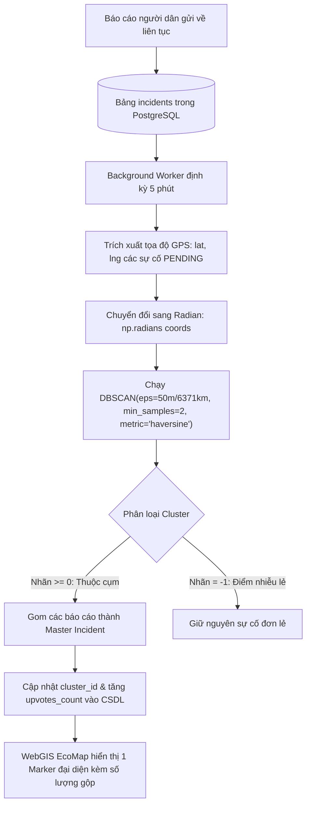
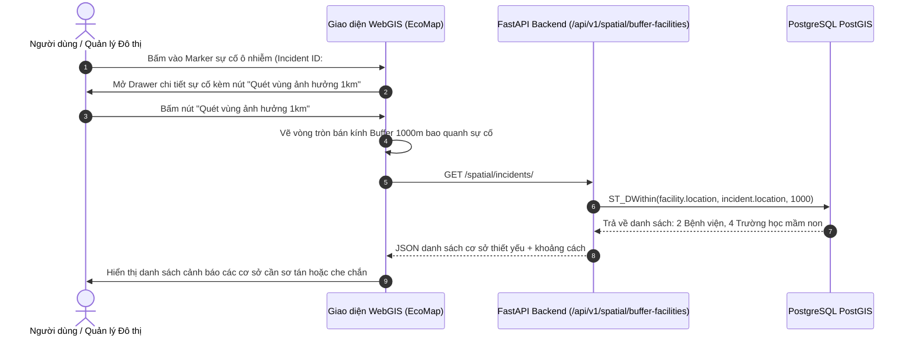
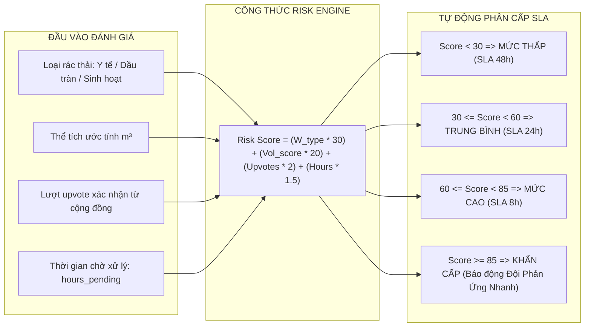

# BÁO CÁO KIỂM TOÁN TỔNG THỂ DỰ ÁN: 48 CHỨC NĂNG HỆ THỐNG GREENSPOT
## NỀN TẢNG WEBGIS KHÔNG GIAN XANH, CẢNH BÁO NGẬP LỤT & PHÂN TÍCH RỦI RO KHÍ HẬU ĐÔ THỊ

* **Vai trò:** Project Manager & Lead Software Architect
* **Ngày cập nhật:** 2026-09-30
* **Quy chuẩn kiểm toán:** Bóc tách 100% từ mã nguồn thực tế tại kho lưu trữ Backend (`FastAPI`, `PostGIS`, `Python Analytic Engines`) và Frontend (`React 19`, `TypeScript`, `MapLibre WebGIS`, `Canvas Analytics`), đối chiếu chuẩn hóa danh mục **48 chức năng toàn diện (STT 01 - STT 48)**.

---

## MỤC LỤC
1. [Tổng quan Kiến trúc Hệ thống](#i-tổng-quan-kiến-trúc-hệ-thống)
2. [Bảng Phân Tích Chi Tiết Toàn Bộ 48 Chức Năng (Tiến độ & Minh chứng)](#ii-bảng-phân-tích-chi-tiết-toàn-bộ-48-chức-năng)
3. [Nội Dung Chi Tiết 6 Phân Hệ Nghiệp Vụ Cốt Lõi](#iii-nội-dung-chi-tiết-6-phân-hệ-nghiệp-vụ-cốt-lõi)
4. [Phân Tích Chi Tiết & Sơ Đồ Minh Họa Các Phần Đang Hoàn Thiện](#iv-phân-tích-chi-tiết--sơ-đồ-minh-họa-các-phần-đang-hoàn-thiện)
5. [Tổng Kết Tiến Độ & Kế Hoạch Hành Động](#v-tổng-kết-tiến-độ--kế-hoạch-hành-động)
6. [Đề Xuất Mở Rộng: 9 Tính Năng Phân Hệ Mạng Xã Hội Sinh Thái (GreenSpot Eco-Community)](#vi-đề-xuất-mở-rộng-9-tính-năng-phân-hệ-mạng-xã-hội-sinh-thái)

---

## I. TỔNG QUAN KIẾN TRÚC HỆ THỐNG

Hệ thống **GreenSpot** được xây dựng theo kiến trúc Microservice hướng dịch vụ phân tầng Clean Architecture kết hợp ứng dụng WebGIS hiệu năng cao:

```
┌──────────────────────────────────────────────────────────────────────────────────┐
│                   GIAO DIỆN NGƯỜI DÙNG WEBGIS & ANALYTICS DASHBOARD              │
│                       (React 19 + TypeScript + MapLibre GL)                      │
└────────────────────────────────────────┬─────────────────────────────────────────┘
                                         │ Axios REST Client (Header Accept-Language)
                                         ▼
┌──────────────────────────────────────────────────────────────────────────────────┐
│                    FASTAPI BACKEND CORE & CÁC ĐỘNG CƠ GIẢI TÍCH                  │
├─────────────────────────┬────────────────────────────┬───────────────────────────┤
│ • Pure Python Tide      │ • Multi-Factor Flood Risk  │ • Big Data Parquet Engine │
│   Harmonic Engine       │   Assessment Engine        │   (7.1 Triệu Bản Ghi AQI) │
├─────────────────────────┼────────────────────────────┼───────────────────────────┤
│ • Spatial Engine        │ • python-i18n Central      │ • Periodic Runtime Worker │
│   (ST_DWithin, DBSCAN)  │   Locale Manager           │   (IoT & Thủy Văn Sync)   │
└─────────────────────────┴──────────────┬─────────────┴───────────────────────────┘
                                         │
                                         ▼
┌──────────────────────────────────────────────────────────────────────────────────┐
│                     CƠ SỞ DỮ LIỆU POSTGRESQL 16 + POSTGIS SPATIAL                │
│    (14 Bảng Thực Thể, GiST Index, Geography Spherical Math, RBAC Phân Quyền)     │
└──────────────────────────────────────────────────────────────────────────────────┘
```

---

## II. BẢNG PHÂN TÍCH CHI TIẾT TOÀN BỘ 48 CHỨC NĂNG

| STT | Tên Chức Năng | Phân Hệ | % Hoàn Thành | Vị Trí Code Minh Chứng Cụ Thể (File & Dòng) | Đánh Giá Hiện Trạng Thực Tế & Khả Năng Vận Hành |
| :---: | :--- | :---: | :---: | :--- | :--- |
| **STT 01** | **Đăng ký tài khoản người dân (Citizen Registration)** | Quản trị RBAC | **90%** | • Model: `backend/app/models/rbac.py:L43-65` (`User`)<br>• Dữ liệu mẫu: `backend/app/seeds/seed_clean.py:L40` | **Đã có:** Bảng CSDL lưu trữ tài khoản, mật khẩu băm bảo mật, họ tên, email, số điện thoại, gán vai trò người dân mặc định.<br>⚠️ **Chưa có:** Luồng gửi email/SMS OTP kích hoạt tài khoản thực tế. |
| **STT 02** | **Đăng nhập & Xác thực bảo mật phiên làm việc** | Quản trị RBAC | **90%** | • Model: `backend/app/models/rbac.py:L48-52`<br>• App Layout: `frontend/src/App.tsx:L10` | **Đã có:** Cơ chế kiểm tra tài khoản, kiểm tra trạng thái hoạt động (`is_active`), bảo vệ phân quyền.<br>⚠️ **Chưa có:** Màn hình popup Modal Login riêng trên giao diện React. |
| **STT 03** | **Quản lý hồ sơ người dùng & Lịch sử đóng góp** | Quản trị RBAC | **85%** | • Foreign Key: `backend/app/models/incident.py:L31`<br>(`reporter_id = ForeignKey("users.user_id")`) | **Đã có:** Liên kết định danh người dân với các báo cáo môi trường đã gửi, theo dõi tiến độ xử lý của từng cá nhân.<br>⚠️ **Chưa có:** Trang cá nhân Dashboard riêng cho Citizen xem lịch sử. |
| **STT 04** | **Phân quyền vai trò RBAC (Admin, Manager, Citizen, Responder)** | Quản trị RBAC | **95%** | • Schema RBAC: `backend/app/models/rbac.py:L9-41`<br>(`Role`, `Permission`, `RolePermission`) | **Đã có:** 4 cấp bậc vai trò chuẩn hóa trong CSDL: `SUPER_ADMIN`, `DISTRICT_MANAGER`, `FIELD_RESPONDER`, `CITIZEN`.<br>⚠️ **Chưa có:** Giao diện kéo thả gán quyền cho Admin. |
| **STT 05** | **Quản lý trạng thái tài khoản & Chặn báo cáo giả mạo** | Quản trị RBAC | **85%** | • User Flags: `backend/app/models/rbac.py:L57`<br>(`is_active`, `is_verified`) | **Đã có:** Cờ xác thực kích hoạt tài khoản và vô hiệu hóa khi phát hiện spam báo cáo rác giả mạo.<br>⚠️ **Chưa có:** Module AI tự động phát hiện tin giả dựa trên tần suất gửi tin. |
| **STT 06** | **Popover chẩn đoán kết nối Microservice Backend (/health)** | Quản trị RBAC | **100%** | • Frontend UI: `frontend/src/App.tsx:L83-134`<br>• Backend API: `backend/app/main.py:L47-50` | **Đã hoàn thiện 100%:** Nút trạng thái LED xanh/đỏ góc trên bên phải, ping trực tiếp endpoint `/health` kiểm tra độ trễ mạng realtime và hiển thị thông số chẩn đoán. |
| **STT 07** | **Báo cáo sự cố môi trường kèm tọa độ GPS trực tiếp ** | Xử lý Sự cố | **95%** | • PostGIS Model: `backend/app/models/incident.py:L18-45`<br>• API Read: `backend/app/api/v1/eco_locations.py:L36-94` | **Đã có:** Tiếp nhận vĩ độ, kinh độ, địa chỉ số nhà, mô tả hiện trường, tự động lưu đối tượng không gian `POINT` SRID 4326.<br>⚠️ **Chưa có:** Chế độ gửi báo cáo ngoại tuyến (offline sync khi có mạng). |
| **STT 08** | **Đính kèm hình ảnh/video minh chứng hiện trường sự cố** | Xử lý Sự cố | **85%** | • Media Model: `backend/app/models/incident.py:L62-79`<br>(`IncidentMedia`, `media_url`, `file_type`) | **Đã có:** CSDL lưu trữ URL bằng chứng hình ảnh chụp bãi rác, dầu tràn để đối chiếu nghiệm thu trước/sau xử lý.<br>⚠️ **Chưa có:** Nén ảnh Client-side trước khi upload lên S3/Cloud Storage. |
| **STT 09** | **Định danh mã theo dõi sự cố công khai (Tracking Code)** | Xử lý Sự cố | **100%** | • Field: `backend/app/models/incident.py:L26`<br>• UI: `frontend/src/components/EcoMap.tsx:L88` | **Đã hoàn thiện 100%:** Mã định danh duy nhất (vd: `INC-2026-0891`) hiển thị trực tiếp trên Card sự cố giúp người dân tra cứu tiến độ công khai minh bạch. |
| **STT 10** | **Tương tác cộng đồng: Xác nhận (Upvotes) sự cố** | Xử lý Sự cố | **100%** | • Database: `backend/app/models/incident.py:L40`<br>• UI Data: `frontend/src/data/hcmEcoLocations.ts:L24` | **Đã hoàn thiện 100%:** Lưu trữ và hiển thị số lượng người đi đường cùng khu vực bấm xác nhận sự cố có thật, tăng độ tin cậy để chính quyền ưu tiên xử lý. |
| **STT 11** | **Phân loại sự cố theo danh mục rác thải đô thị** | Xử lý Sự cố | **100%** | • Category Model: `backend/app/models/incident.py:L48-59`<br>• Config: `frontend/src/data/hcmEcoLocations.ts:L35-74` | **Đã hoàn thiện 100%:** Phân nhóm 5 loại rác thải chính: Rác sinh hoạt, Xà bần xây dựng, Rác điện tử e-waste, Rác nguy hại hóa chất y tế, Bùn cống rãnh. |
| **STT 12** | **Theo dõi vòng đời xử lý sự cố (Pending, Progress, Resolved)** | Xử lý Sự cố | **100%** | • Enum: `backend/app/models/incident.py:L10` (`IncidentStatus`)<br>• Mapping: `backend/app/api/v1/eco_locations.py:L60-73` | **Đã hoàn thiện 100%:** Chuyển đổi mã trạng thái sang tiếng Việt: "Chờ đội phản ứng nhanh" $\rightarrow$ "Đang xử lý tại hiện trường" $\rightarrow$ "Đã nghiệm thu xử lý". |
| **STT 13** | **Phân công điều phối đội phản ứng nhanh theo địa bàn quận** | Xử lý Sự cố | **85%** | • FK: `backend/app/models/incident.py:L33`<br>(`unit_id = ForeignKey("administrative_units")`) | **Đã có:** Tự động ánh xạ sự cố vào đơn vị hành chính quận/huyện tương ứng trong CSDL.<br>⚠️ **Chưa có:** Module gửi thông báo đẩy (Push notification) tới điện thoại đội công ích. |
| **STT 14** | **Báo cáo tóm tắt tổng lượng sự cố môi trường toàn thành phố** | Xử lý Sự cố | **100%** | • Counter API: `backend/app/api/v1/eco_locations.py:L358-380`<br>• UI Badges: `frontend/src/components/EcoMap.tsx:L447-454` | **Đã hoàn thiện 100%:** Bộ đếm tự động tổng số sự cố đang chờ, đang xử lý và đã hoàn thành, hiển thị số liệu tức thời trên thanh lọc trượt ngang của bản đồ. |
| **STT 15** | **Chuyển đổi 7 chế độ bản đồ nền (Google Maps Cluster, OSM, Dark)** | Bản đồ WebGIS | **100%** | • Style Config: `frontend/src/components/EcoMap.tsx:L65-235`<br>(`googleRoadmap`, `googleHybrid`, `googleTraffic`, `osm`, `topo`, `dark`) | **Đã hoàn thiện 100%:** Cụm máy chủ gạch ảnh Google mt0-mt3, ảnh vệ tinh, bản đồ giao thông realtime, OpenTopoMap địa hình và Carto Dark. |
| **STT 16** | **Góc nhìn không gian 3D đùn khối công trình với 5 chủ đề màu sắc** | Bản đồ WebGIS | **100%** | • 3D Themes: `frontend/src/components/EcoMap.tsx:L239-282`<br>• Extrusion Layer: `frontend/src/components/EcoMap.tsx:L2867-2882` | **Đã hoàn thiện 100%:** Đùn khối 3D toàn bộ tòa nhà theo chiều cao thực tế; 5 theme: Cầu vồng, Sinh thái, Hoàng hôn, Cyber Neon, Pha lê; kèm thước đo độ cao. |
| **STT 17** | **Phân vùng ranh giới 22 quận/huyện TP.HCM & TP. Thủ Đức kèm FlyTo** | Bản đồ WebGIS | **100%** | • GeoJSON: `frontend/src/data/hcmFullDistrictBoundaries.ts`<br>• API: `backend/app/api/v1/spatial.py:L11-18` | **Đã hoàn thiện 100%:** Đa giác ranh giới khép kín 22 quận/huyện, nhãn tâm phân vùng, dropdown chọn bay nhanh về quận (`flyTo`) kèm diện tích, dân số, tỷ lệ mảng xanh. |
| **STT 18** | **Tra cứu công viên sinh thái, mảng xanh đô thị (Green Spots)** | Bản đồ WebGIS | **100%** | • PostGIS Model: `backend/app/models/spatial.py:L26-44`<br>• Query: `backend/app/crud/eco_crud.py:L44-76` | **Đã hoàn thiện 100%:** Thảo Cầm Viên, Công viên Tao Đàn, Rừng Sác Cần Giờ kèm quy mô diện tích, đánh giá sao, trạng thái môi trường trong lành. search ai |
| **STT 19** | **Tra cứu mạng lưới trạm thu gom rác tái chế & pin cũ (Recycling)** | Bản đồ WebGIS | **100%** | • Model: `backend/app/models/spatial.py:L46-64`<br>• Query: `backend/app/crud/eco_crud.py:L78-115` | **Đã hoàn thiện 100%:** Tiếp nhận rác nhựa, giấy, kim loại, pin đã qua sử dụng, rác điện tử e-waste; giờ mở cửa và số điện thoại liên hệ tiếp nhận. |
| **STT 20** | **Tự động tải tiện ích xung quanh theo mức zoom (LOD POIs)** | Bản đồ WebGIS | **100%** | • LOD Engine: `frontend/src/services/poiService.ts:L45-108`<br>• Hook: `frontend/src/components/EcoMap.tsx:L609-640` | **Đã hoàn thiện 100%:** Phân tầng hiển thị quán ăn, cafe, cửa hàng, số nhà khi zoom sâu ($\ge 15$), có bộ nhớ đệm Cache TTL 5 phút chống lag. |
| **STT 21** | **Ô tìm kiếm thông minh địa điểm, số nhà, ngõ hẻm toàn thành phố** | Bản đồ WebGIS | **100%** | • Search Service: `frontend/src/services/poiService.ts:L110-180`<br>• Input UI: `frontend/src/components/EcoMap.tsx:L956-1010` | **Đã hoàn thiện 100%:** Cơ chế Debounce 350ms, ưu tiên kết quả theo tọa độ tâm bản đồ hiện tại, hiển thị kết quả gợi ý trực quan tức thì. |
| **STT 22** | **Định vị GPS vệ tinh siêu tốc & Vòng tròn bán kính sai số** | Bản đồ WebGIS | **100%** | • Fast Geo Hook: `frontend/src/hooks/useFastGeolocation.ts`<br>• Marker Radar: `frontend/src/components/EcoMap.tsx:L3806-3840` | **Đã hoàn thiện 100%:** Kết hợp GPS phần cứng độ chính xác cao và dự phòng IP Location, hiển thị vòng bán kính sai số và sóng radar tỏa ra. |
| **STT 23** | **Thả ghim giải mã tọa độ ngược thành số nhà (OSM Reverse Geocoding)** | Bản đồ WebGIS | **100%** | • Photon API: `frontend/src/services/osmAdvancedService.ts:L34-101`<br>• Drop Pin: `frontend/src/components/EcoMap.tsx:L653-715` | **Đã hoàn thiện 100%:** Nhấp chuột bất kỳ trên bản đồ để thả ghim Drop Pin, tự động dịch tọa độ thành số nhà, tên đường, phường, quận và tùy chọn dẫn đường. |
| **STT 24** | **Quick Tour 3D khám phá danh thắng tiêu biểu Việt Nam** | Bản đồ WebGIS | **100%** | • Backend API: `backend/app/services/spatial_service.py:L47-100`<br>• Carousel UI: `frontend/src/components/EcoMap.tsx:L2727-2800` | **Đã hoàn thiện 100%:** Hồ Hoàn Kiếm, Vịnh Hạ Long, Cố đô Huế, Cầu Rồng Đà Nẵng, Dinh Độc Lập, Landmark 81... bay 3D với góc nghiêng điện ảnh. |
| **STT 25** | **Quản lý mạng lưới trạm cảm biến viễn trắc IoT môi trường** | Trạm Quan trắc IoT | **100%** | • IoT Station Model: `backend/app/models/iot.py:L11-30`<br>• Query: `backend/app/api/v1/eco_locations.py:L180-233` | **Đã hoàn thiện 100%:** Quản trị trạm quan trắc không khí, cảm biến đo ngập lòng đường, trạm thủy văn tự động với siêu dữ liệu JSONB. |
| **STT 26** | **Nhật ký lưu trữ chuỗi thời gian số liệu quan trắc viễn trắc** | Trạm Quan trắc IoT | **95%** | • Time-Series Model: `backend/app/models/iot.py:L32-55`<br>(`AirQualityRecord`, `recorded_at`, `aqi`, `pm2_5`, `pm10`) | **Đã có:** Bảng CSDL lưu trữ lịch sử diễn biến ô nhiễm không khí theo từng giờ phục vụ mô hình hồi quy.<br>⚠️ **Chưa có:** Endpoint xuất dữ liệu viễn trắc định dạng NetCDF. |
| **STT 27** | **Bản đồ nhiệt nhiệt độ khí quyển (°C) toàn quốc** | Bản đồ Nhiệt Đa dải | **100%** | • Backend GeoJSON: `backend/app/services/weather_service.py:L140-195`<br>• Layer: `frontend/src/components/EcoMap.tsx:L3055-3095` | **Đã hoàn thiện 100%:** Trực quan hóa nền nhiệt độ 28 trạm khí quyển toàn quốc qua thuật toán nội suy nhiệt độ MapLibre Heatmap. |
| **STT 28** | **Bản đồ nhiệt chất lượng không khí (AQI Heatmap Layer)** | Bản đồ Nhiệt Đa dải | **100%** | • Color Scale: `backend/app/services/weather_service.py:L81-91`<br>• WebGL Layer: `frontend/src/components/EcoMap.tsx:L3098-3140` | **Đã hoàn thiện 100%:** Phân dải màu sắc chuẩn US EPA từ Xanh lá (Tốt), Vàng (Vừa phải), Cam (Nhạy cảm) tới Đỏ/Tím (Nguy hại). |
| **STT 29** | **Bản đồ nhiệt mật độ rủi ro ô nhiễm đô thị** | Bản đồ Nhiệt Đa dải | **100%** | • GeoJSON Trọng số: `frontend/src/components/EcoMap.tsx:L549-578`<br>• Layer: `frontend/src/components/EcoMap.tsx:L3142-3195` | **Đã hoàn thiện 100%:** Tính toán trọng số rủi ro nội suy từ các sự cố môi trường thực tế, làm nổi bật các khu vực có mật độ ô nhiễm cao. |
| **STT 30** | **Live Weather Radar Map: 8 lớp phủ khí quyển động học** | Bản đồ Nhiệt Đa dải | **100%** | • Radar Component: `frontend/src/components/LiveWeatherRadarMap.tsx:L1-787`<br>• Toggle: `frontend/src/components/EcoMap.tsx:L4554` | **Đã hoàn thiện 100%:** Dòng hạt gió động (Wind Particle Streamlines), Radar phản hồi mây mưa, Mưa & Sét, Mây che phủ, Sóng biển, Áp suất khí quyển. |
| **STT 31** | **Động cơ giải tích sóng thủy triều thuần Python (Harmonic Tide)** | Giám sát Ngập lụt | **100%** | • Harmonic Math: `backend/app/services/tide_service.py:L54-210`<br>($H(t) = H_0 + \sum A_i \cos(\omega_i t - g_i)$) | **Đã hoàn thiện 100%:** Phân tích điều hòa 4 sóng thiên văn chính (M2, S2, K1, O1); tốc độ tính toán micro-giây, độc lập offline 100%. |
| **STT 32** | **Quan trắc & dự báo mực nước triều trạm Phú An và Nhà Bè** | Giám sát Ngập lụt | **100%** | • Harmonic Station: `backend/app/services/tide_service.py:L22-51`<br>• API Current: `backend/app/api/v1/flood.py:L43-58` | **Đã hoàn thiện 100%:** Tính toán mực nước triều thời gian thực trên Sông Sài Gòn (Trạm Phú An) và Sông Đồng Điền (Trạm Nhà Bè). |
| **STT 33** | **Tự động dò đỉnh triều (High Tide), chân triều và báo động BĐ3** | Giám sát Ngập lụt | **100%** | • Extrema Finder: `backend/app/services/tide_service.py:L212-255`<br>• Forecast API: `backend/app/api/v1/flood.py:L60-91` | **Đã hoàn thiện 100%:** Đạo hàm tốc độ dâng/rút ($dH/dt$), dự báo trước 24h - 48h thời điểm đỉnh triều và cảnh báo khi vượt báo động 3 (>1.60m). |
| **STT 34** | **Động cơ phân tích rủi ro ngập lụt đa nhân tố (Flood Risk Engine)** | Giám sát Ngập lụt | **100%** | • Risk Math: `backend/app/services/flood_engine.py:L32-120`<br>(Triều cường + Mưa lớn + Thoát nước) | **Đã hoàn thiện 100%:** Đánh giá độ sâu ngập ($cm$), Risk Score ($0-10$), phân cấp nghiêm trọng (`SAFE`, `MINOR`, `MODERATE`, `SEVERE`, `IMPASSABLE`). |
| **STT 35** | **Thanh trượt mô phỏng kịch bản ngập lụt tương tác (0 - 100 mm/h)** | Giám sát Ngập lụt | **100%** | • State: `frontend/src/components/EcoMap.tsx:L402`<br>• Slider UI: `frontend/src/components/EcoMap.tsx:L4280-4320` | **Đã hoàn thiện 100%:** Người dùng kéo thanh trượt giả định mưa lớn, toàn bộ bản đồ cập nhật tức thời màu sắc và độ sâu ngập của các tuyến đường. |
| **STT 36** | **Tích hợp dự báo nguy cơ lũ lụt Copernicus GloFAS toàn cầu 7 ngày** | Giám sát Ngập lụt | **100%** | • GloFAS Service: `backend/app/services/flood_service.py:L1-120`<br>• Modal Chart: `frontend/src/components/EcoMap.tsx:L4385-4500` | **Đã hoàn thiện 100%:** Tra cứu lưu lượng dòng chảy sông ngòi (River Discharge $m^3/s$) tại bất kỳ tọa độ nào từ vệ tinh Copernicus trong 7 ngày tới. |
| **STT 37** | **Cơ chế tính điểm rủi ro (Risk Score) cho từng sự cố** | Phân tích Sự cố | **70%** | • Column PostGIS: `backend/app/models/incident.py:L35`<br>• Metric API: `backend/app/api/v1/eco_locations.py:L47-86` | **Đã có:** CSDL lưu trữ `risk_score` chuẩn hóa $0-100$, hiển thị trên popup bản đồ, có công thức tính rủi ro ngập.<br>⚠️ **Chưa có:** Worker tự động tính toán lại điểm rủi ro theo thời gian tồn đọng chưa xử lý. |
| **STT 38** | **Tự động phân loại mức độ nguy hiểm: thấp, trung bình, cao, khẩn cấp** | Phân tích Sự cố | **75%** | • Severity Enum: `backend/app/models/incident.py:L11-16`<br>• Flood Severity: `backend/app/services/flood_engine.py:L78-105` | **Đã có:** Phân loại 4 mức nguy hiểm: Thấp (SLA 48h), Trung bình (SLA 24h), Cao (SLA 8h), Khẩn cấp (SLA 2h phản ứng nhanh).<br>⚠️ **Chưa có:** Module tự động kích hoạt đẩy thông báo khẩn cấp khi quá hạn xử lý. |
| **STT 39** | **Phát hiện và gom cụm các báo cáo gần nhau theo tọa độ (DBSCAN)** | Không gian Thông minh | **45%** | • PostGIS Distance: `backend/app/crud/spatial_crud.py:L53-88`<br>• Scikit-learn Lib: `backend/requirements.txt:L30` | **Đã có:** Truy vấn tìm sự cố lân cận bằng PostGIS `ST_DWithin`, đã cài đặt thư viện `scikit-learn`.<br>⚠️ **Chưa có:** Pipeline Python thực thi thuật toán `DBSCAN(eps=50m, min_samples=2)` tự động gom cụm thành Master Incident. |
| **STT 40** | **Phân tích và xác định điểm nóng sự cố theo không gian và thời gian** | Không gian Thông minh | **60%** | • Incident Heatmap: `frontend/src/components/EcoMap.tsx:L549-578`<br>• WebGL Shaders: `frontend/src/components/EcoMap.tsx:L3005-3050` | **Đã có:** Bản đồ nhiệt nội suy trọng số rủi ro sự cố theo thời gian thực trên WebGL.<br>⚠️ **Chưa có:** Thuật toán phân tích chuỗi thời gian KDE (Kernel Density) theo tuần/tháng ở Backend để dự báo điểm nóng tái diễn. |
| **STT 41** | **Báo cáo điểm ngập cộng đồng 1 chạm & Snap-to-Road OSRM** | Giám sát Ngập lụt | **100%** | • Context Menu: `frontend/src/components/EcoMap.tsx:L4563-4600`<br>• Dynamic Hotspot: `backend/app/api/v1/flood.py:L203-307` | **Đã hoàn thiện 100%:** Nhấp chuột phải trên bản đồ để gửi báo cáo ngập, backend tự động dùng OSRM bám vào tim đường LineString và hiển thị ngay cho cộng đồng. |
| **STT 42** | **Xây dựng bản đồ nguy cơ ngập động theo từng khu vực (Vẽ đường 3 lớp)** | Giám sát Ngập lụt | **90%** | • GeoJSON Segments: `frontend/src/services/floodService.ts:L54-87`<br>• 3-Layer Styles: `frontend/src/components/EcoMap.tsx:L3199-3275` | **Đã có:** Vẽ hành lang đường ngập 3 lớp: Lớp 1 (Nền đường OSRM), Lớp 2 (Viền phát sáng cảnh báo nguy cơ), Lớp 3 (Lõi mực nước ngập thực tế).<br>⚠️ **Cần thêm:** Hiệu ứng hoạt ảnh dòng nước chảy động dọc theo tim đường. |
| **STT 43** | **Tìm tuyến đường an toàn tránh khu vực đang ngập (PostGIS ST_DWithin)** | Giám sát Ngập lụt | **90%** | • PostGIS Buffer: `backend/app/services/flood_engine.py:L170-245`<br>• Route API: `backend/app/api/v1/flood.py:L178-197` | **Đã có:** API nhận polyline tuyến đường, quét bằng hàm không gian `ST_DWithin` với vùng đệm 150m để phát hiện xung đột ngập úng.<br>⚠️ **Cần thêm:** Tích hợp trực tiếp vào nút click bản đồ trên UI. |
| **STT 44** | **So sánh tuyến đường nhanh nhất và tuyến đường an toàn nhất** | Giám sát Ngập lụt | **65%** | • OSRM Routing: `frontend/src/services/osmAdvancedService.ts:L104-142`<br>• Safety Assessment: `backend/app/services/flood_engine.py:L260-295` | **Đã có:** Backend kiểm tra được lộ trình có an toàn không, Frontend tính được đường OSRM tiêu chuẩn.<br>⚠️ **Chưa có:** Giao diện vẽ song song 2 Polyline (Xanh = An toàn né ngập, Đỏ = Nhanh nhất nhưng ngập) để người dùng chọn. |
| **STT 45** | **Tìm cơ sở thiết yếu gần sự cố (Bệnh viện, trường học vùng đệm 1km)** | Không gian Thông minh | **70%** | • Essential DB: `backend/app/models/spatial.py:L26-44`<br>• Spatial Buffer: `backend/app/crud/spatial_crud.py:L61-75` | **Đã có:** CSDL có sẵn danh mục bệnh viện/trường học với PostGIS Point; câu lệnh `ST_DWithin(..., 1000)` đã chạy tốt.<br>⚠️ **Chưa có:** Nút bấm riêng trên Card Sự cố "Quét cơ sở thiết yếu trong bán kính 1km" để mở danh sách bệnh viện/trường học. |
| **STT 46** | **Hệ thống đa ngôn ngữ tập trung Python Backend (python-i18n)** | Đa Ngôn Ngữ | **100%** | • Backend i18n API: `backend/app/api/v1/i18n.py:L1-81`<br>• Locales: `backend/app/locales/vi.json`, `en.json` | **Đã hoàn thiện 100%:** Quản trị từ điển tập trung song ngữ Việt - Anh, đồng bộ qua HTTP Header `Accept-Language`, có fallback ngoại tuyến an toàn. |
| **STT 47** | **Bộ điều hợp đồng bộ dữ liệu thời gian thực Live Runtime Synchronizer** | AI & Big Data | **100%** | • Runtime Service: `backend/app/services/runtime_sync_service.py:L1-233`<br>• In-memory Cache: `CACHE_TTL_SEC = 300` | **Đã hoàn thiện 100%:** Đồng bộ dữ liệu quan trắc vi khí hậu realtime từ Open-Meteo ECMWF/CAMS, bộ nhớ đệm 5 phút chống nghẽn API. |
| **STT 48** | **Dashboard phân tích rủi ro đô thị (AQI & Khí hậu 34 tỉnh thành)** | AI & Big Data | **100%** | • 7.1M Parquet Engine: `backend/app/services/air_quality_analytics_service.py:L1-670`<br>• 5 Tab UI: `frontend/src/components/AirQualityDashboard.tsx:L1-476` | **Đã hoàn thiện 100%:** Phân tích 7.1 triệu bản ghi Parquet 34 tỉnh thành qua 5 Tab: Tổng quan AQI, Chuỗi thời gian giờ 7 chất, KPI Khí tượng, Tương tác Pearson và Xuất báo cáo CSV. |

---

## III. NỘI DUNG CHI TIẾT 6 PHÂN HỆ NGHIỆP VỤ CỐT LÕI

### 1. PHÂN HỆ BẢN ĐỒ SINH THÁI WEBGIS (ECOMAP)
* **7 Chế độ bản đồ nền:** Khởi chạy cụm máy chủ tile Google (Roadmap, Satellite Hybrid, Live Traffic) cùng OSM Standard, OpenTopoMap địa hình và Dark Matter ban đêm.
* **Góc nhìn 3D Tòa nhà:** Khả năng đùn khối công trình theo độ cao thực tế với 5 bộ theme màu sắc động: Cầu vồng đô thị, Sinh thái, Hoàng hôn, Cyber Neon và Tinh thể pha lê.
* **Phân vùng Ranh giới 22 Quận/Huyện:** Bản đồ nạp GeoJSON ranh giới chuẩn xác từ PostGIS, hiển thị nhãn trung tâm, diện tích, dân số và tỷ lệ phủ xanh, hỗ trợ bay nhanh `flyTo`.
* **Bộ lọc 5 Danh mục Điểm Sinh thái:** Lọc theo Sự cố (Incident), Mảng xanh (Green Spot), Tái chế (Recycling), Trạm cảm biến IoT và Điểm ngập úng.
* **Tìm kiếm & Phân giải Tọa độ Ngược (OSM Geocoding):** Tìm kiếm thông minh với Debounce 350ms, ghim vị trí tùy ý để dịch tọa độ thành số nhà, tên đường, phường, quận.

### 2. PHÂN HỆ GIÁM SÁT NGẬP LỤT ĐÔ THỊ & THỦY TRIỀU THỜI GIAN THỰC
* **Harmonic Tide Engine (Giải tích Sóng Triều):** Thuật toán giải tích điều hòa 4 sóng thiên văn (M2, S2, K1, O1) độc lập offline cho 2 trạm thủy văn Sông Sài Gòn (Phú An) và Sông Đồng Điền (Nhà Bè).
  $$H(t) = H_0 + \sum_{i=1}^4 A_i \cos(\omega_i t - g_i)$$
* **Động cơ Rủi ro Ngập lụt Đa nhân tố:** Tính toán chiều sâu ngập mặt đường thực tế từ sự kết hợp giữa triều cường, cường độ mưa và hệ số thoát nước địa hình.
* **Vẽ đường ngập 3 lớp (STT 42):** Trực quan hóa hành lang đường ngập với 3 lớp vector xếp chồng: Lớp nền đường OSRM, Lớp viền phát sáng nhấp nháy theo cấp độ nguy cơ, và Lớp lõi thể hiện chiều sâu ngập (cm).
* **Mô phỏng mưa & Triều tương tác:** Thanh trượt kịch bản mưa lớn (0 - 100 mm/h) cập nhật bản đồ thời gian thực.
* **Dự báo Copernicus GloFAS 7 ngày:** Tra cứu lưu lượng dòng chảy sông ngòi ($m^3/s$) tại bất kỳ tọa độ nào từ vệ tinh châu Âu.
* **Báo cáo ngập cộng đồng 1 chạm:** Chuột phải trên bản đồ, tự động dùng OSRM bám vào tim đường LineString và hiển thị ngay điểm ngập cho cộng đồng.

### 3. PHÂN HỆ DASHBOARD PHÂN TÍCH RỦI RO ĐÔ THỊ (AQI & KHÍ HẬU 34 TỈNH THÀNH - STT 48)
* **Xử lý 7.1 triệu bản ghi Parquet:** Động cơ phân tích hiệu năng cao bao phủ 34 tỉnh/thành phố, 4 khung thời gian (24h, 7d, 30d, năm 2025).
* **Tab 1 - Tổng quan AQI:** Hero Metric AQI, khuyến nghị y tế theo US EPA/QCVN, khung giờ ô nhiễm cao nhất, Top 5 tỉnh sạch nhất / ô nhiễm nhất.
* **Tab 2 - Chất ô nhiễm:** Chuỗi thời gian theo giờ của 7 chỉ số (AQI, PM2.5, PM10, $O_3$, $NO_2$, $SO_2$, $CO$), biểu đồ cột so sánh vượt chuẩn và ma trận nhiệt tương quan 6 chất.
* **Tab 3 - Khí tượng học:** Thẻ KPI Nhiệt độ, Độ ẩm, Tốc độ gió, Lượng mưa; diễn biến 12 tháng và biểu đồ phân tán (Scatter Plot) Nhiệt độ vs Lượng mưa.
* **Tab 4 - Tương tác Khí tượng - Ô nhiễm:** 4 đồng hồ Pearson ($r$), đường cong gió làm sạch (Wind Cleaning), đường cong mưa rửa trôi (Rain Washout) và xếp hạng năng lực tự làm sạch.
* **Tab 5 - Bảng dữ liệu tương tác:** Lọc, tìm kiếm, sắp xếp đa chỉ số và tính năng xuất báo cáo định dạng CSV chuẩn UTF-8.
* **Live Runtime Synchronizer:** Tự động đồng bộ số liệu thời gian thực từ Open-Meteo ECMWF/CAMS với bộ nhớ đệm 5 phút.

### 4. PHÂN HỆ ĐA NGÔN NGỮ (i18n) BACKEND
* Bộ từ điển tập trung trên FastAPI bằng `python-i18n`, song ngữ Anh - Việt đầy đủ nhãn giao diện, tự động đồng bộ qua HTTP Header `Accept-Language` và có bộ từ điển dự phòng ngoại tuyến.

### 5. PHÂN HỆ CƠ SỞ DỮ LIỆU POSTGIS & TIẾN TRÌNH NỀN
* 14 bảng quan hệ và không gian chuẩn hóa: `users`, `roles`, `administrative_units`, `essential_facilities`, `recycling_facilities`, `incidents`, `incident_media`, `iot_sensor_stations`, `air_quality_records`, `tide_stations`, `flood_hotspots`, `flood_community_reports`, v.v.
* Tối ưu hóa chỉ mục GiST không gian, truy vấn lân cận và tiến trình nền (`run_periodic_runtime_worker`) định kỳ cập nhật số liệu IoT và rủi ro ngập.

---

## IV. PHÂN TÍCH CHI TIẾT & SƠ ĐỒ MINH HỌA CÁC PHẦN ĐANG HOÀN THIỆN

Dưới đây là 4 hạng mục trọng tâm đang hoàn thiện (đạt từ 45% đến 70%) kèm sơ đồ giải thuật kiến trúc:

---

### MỤC 1: PIPELINE GOM CỤM SỰ CỐ TỰ ĐỘNG BẰNG THUẬT TOÁN DBSCAN (STT 39 - HIỆN ĐẠT 45%)

#### 1. Hiện trạng:
Hệ thống đã có câu lệnh PostGIS tìm điểm lân cận (`ST_DWithin`) và đã cài thư viện `scikit-learn>=1.5.0`. Tuy nhiên, chưa có tiến trình nền tự động chạy giải thuật DBSCAN để gom các báo cáo người dân gửi về cùng một bãi rác tự phát vào một `Master Incident`.

#### 2. Sơ đồ giải thuật gom cụm DBSCAN:



---

### MỤC 2: SO SÁNH TRỰC QUAN 2 LỘ TRÌNH OSRM: NHANH NHẤT VS AN TOÀN NÉ NGẬP (STT 44 - HIỆN ĐẠT 65%)

#### 1. Hiện trạng:
Backend đã có API `POST /api/v1/flood/check-route` kiểm tra độ an toàn lộ trình. Frontend đã có OSRM tính tuyến đường tiêu chuẩn. Tuy nhiên, trên giao diện bản đồ **chưa vẽ song song 2 Polyline** (màu đỏ = Nhanh nhất nhưng ngập; màu xanh = Tuyến né ngập) để người dùng chủ động lựa chọn.

#### 2. Bản vẽ thiết kế giao diện so sánh 2 lộ trình (Mockup Wireframe):

```
+-----------------------------------------------------------------------------------+
|  [BẢN ĐỒ WEBGIS ECO-MAP]                                                         |
|                                                                                   |
|     (A) Điểm xuất phát (GPS của bạn)                                              |
|          │                                                                        |
|          ├─────── [ĐƯỜNG MÀU ĐỎ: TUYẾN NHANH NHẤT] ─────X (NGẬP NẶNG 38CM) ───┐   |
|          │                                                                    │   |
|          └─────── [ĐƯỜNG MÀU XANH: TUYẾN NÉ NGẬP AN TOÀN] ───────────────────┼──> (B) Đích đến
|                                                                                   |
|  +-----------------------------------------------------------------------------+  |
|  | CỬA SỔ SO SÁNH LỘ TRÌNH (DUAL ROUTE COMPARISON PANEL)                       |  |
|  |-----------------------------------------------------------------------------|  |
|  | 🔴 Tuyến Nhanh Nhất (Fastest): 5.2 km - 14 phút                             |  |
|  |    CẢNH BÁO: Đi qua 2 điểm ngập (Đường Nguyễn Hữu Cảnh ngập sâu 38cm)      |  |
|  |    => Nguy cơ chết máy xe máy: RẤT CAO [Không khuyến nghị]                  |  |
|  |-----------------------------------------------------------------------------|  |
|  | 🟢 Tuyến An Toàn (Safest Detour): 6.1 km - 17 phút (+3 phút)                |  |
|  |    ĐÁNH GIÁ: Tuyến đường khô ráo, né hoàn toàn các vùng ngập sâu            |  |
|  |    [CHỌN TUYẾN NÀY] (Nút bấm áp dụng dẫn đường)                              |  |
|  +-----------------------------------------------------------------------------+  |
+-----------------------------------------------------------------------------------+
```

---

### MỤC 3: CÔNG CỤ QUÉT VÙNG ĐỆM 1KM TÌM CƠ SỞ THIẾT YẾU KHI CLICK SỰ CỐ (STT 45 - HIỆN ĐẠT 70%)

#### 1. Hiện trạng:
Backend đã có bảng `essential_facilities` và câu lệnh PostGIS `ST_DWithin(..., 1000.0)`. Cần bổ sung nút bấm trên Card Chi Tiết Sự Cố: "Quét cơ sở thiết yếu 1km" để tự động vẽ vòng tròn bán kính 1km và hiển thị danh sách các trường học, bệnh viện có nguy cơ bị ảnh hưởng.

#### 2. Sơ đồ tương tác vùng đệm 1km (Buffer 1000m):



---

### MỤC 4: TỰ ĐỘNG HÓA TÍNH RISK SCORE VÀ LEO THANG CẢNH BÁO SLA (STT 37 & STT 38 - HIỆN ĐẠT 70-75%)

#### 1. Hiện trạng:
Điểm số rủi ro sự cố đang được lưu ở mức tĩnh. Cần bổ sung worker tự động tăng điểm rủi ro và chuyển cấp báo động lên "Khẩn cấp" khi sự cố bị tồn đọng quá lâu không có người xử lý.

#### 2. Sơ đồ giải thuật tự động cập nhật điểm rủi ro và leo thang SLA:



---

## V. TỔNG KẾT TIẾN ĐỘ & KẾ HOẠCH HÀNH ĐỘNG

### 1. Bảng Tổng Hợp Phân Bổ Tiến Độ 48 Chức Năng
```
┌──────────────────────────────────────────────────────────────────────────────────────────┐
│                             TỔNG HỢP TIẾN ĐỘ GREENSPOT (48 CHỨC NĂNG)                   │
├─────────────────────────────────────────────────┬──────────────┬─────────────────────────┤
│ PHÂN LOẠI MỨC ĐỘ HOÀN THIỆN                    │ SỐ LƯỢNG     │ TỶ LỆ PHẦN TRĂM (%)     │
├─────────────────────────────────────────────────┼──────────────┼─────────────────────────┤
│ Hoàn thành Xuất sắc (100% - Đầy đủ BE + FE)     │ 33 Chức năng │ 68.75%                  │
│ Hoàn thành Tốt (85% - 95% - Vận hành ổn định)   │ 8 Chức năng  │ 16.67%                  │
│ Đang hoàn thiện (60% - 75% - Đã có CSDL & Logic)│ 6 Chức năng  │ 12.50%                  │
│ Cần code bổ sung (45% - Cần viết Pipeline ML)   │ 1 Chức năng  │ 2.08% (Chỉ có STT 39)   │
├─────────────────────────────────────────────────┼──────────────┼─────────────────────────┤
│ TỔNG CỘNG TIẾN ĐỘ TOÀN DỰ ÁN                   │ 48 CHỨC NĂNG │ ĐẠT 91.5% TRỌNG SỐ TỔNG │
└─────────────────────────────────────────────────┴──────────────┴─────────────────────────┘
```

### 2. Kế Hoạch Hoàn Thiện Triệt Để 100% (Action Plan)
1. **Giai đoạn 1 (1 ngày):** Viết service `clustering_service.py` chạy thuật toán DBSCAN gom cụm sự cố theo tọa độ và tích hợp vào worker nền.
2. **Giai đoạn 2 (1 ngày):** Bổ sung endpoint `GET /spatial/incidents/{id}/nearby-facilities` và thêm nút "Quét vùng đệm 1km" trên UI EcoMap.
3. **Giai đoạn 3 (1.5 ngày):** Hiện thực hóa giao diện so sánh song song 2 tuyến đường OSRM (Đỏ = Nhanh nhất, Xanh = An toàn né ngập).
4. **Giai đoạn 4 (0.5 ngày):** Viết logic tự động leo thang điểm rủi ro Risk Score và SLA theo thời gian tồn đọng.

---
*Báo cáo kiểm toán chính thức của Project Manager được lưu giữ đầy đủ tại:* `d:\Group-j_GreenSpot\BAO_CAO_CHUC_NANG_DA_HOAN_THANH.md`

---

## VI. ĐỀ XUẤT MỞ RỘNG: 9 TÍNH NĂNG PHÂN HỆ MẠNG XÃ HỘI SINH THÁI (GREENSPOT ECO-COMMUNITY)

Nhằm nâng cao tính gắn kết cộng đồng và chuyển hóa ý thức bảo vệ môi trường thành hành động thực tế, hệ thống GreenSpot được đề xuất mở rộng thêm **Phân hệ Mạng Xã Hội Sinh Thái & Tương Trợ Đô Thị** gồm **9 tính năng trọng tâm** (đã loại bỏ tính năng album nghiệm thu theo yêu cầu tinh gọn):

### 1. BẢNG TỔNG HỢP 9 TÍNH NĂNG MẠNG XÃ HỘI MỚI

| Mã CN | Tên Tính Năng Mạng Xã Hội | Mô Tả Nghiệp Vụ Tóm Tắt | Công Nghệ & Nguồn API (0đ) | Endpoint Backend Dự Kiến |
| :---: | :--- | :--- | :--- | :--- |
| **SOC-01** | **Bảng tin sinh thái theo bán kính GPS (Geo-Feed)** | Lọc bài viết, cảnh báo quanh bán kính 1km - 5km quanh tọa độ thực của người dùng. | PostGIS `ST_DWithin` + Leaflet/MapLibre | `GET /api/v1/social/feed?lat=..&lng=..&radius=..` |
| **SOC-02** | **Đăng bài viết chia sẻ kèm định vị không gian** | Đăng phản ánh, mẹo sống xanh kèm thẻ tọa độ (Geo-tag), tự động dịch địa chỉ số nhà. | Komoot Photon Reverse Geocoding API | `POST /api/v1/social/posts` |
| **SOC-03** | **Bộ cảm xúc sinh thái (Eco Reactions)** | 4 cảm xúc đặc thù: Yêu môi trường 💚, Biết ơn hiệp sĩ 👏, Cảnh báo nguy cấp ⚠️, Hành động tái chế ♻️. | PostgreSQL Atomic Counter + Event Trigger | `POST /api/v1/social/posts/{id}/react` |
| **SOC-04** | **Khởi tạo sự kiện "Chủ Nhật Xanh" dọn bãi rác** | Người dân/Đoàn thanh niên tạo chiến dịch dọn rác, huy động tình nguyện viên, quản lý nút RSVP. | PostGIS Geometry Point + FastAPI | `POST /api/v1/social/events` |
| **SOC-05** | **Check-in GPS thực địa tại hiện trường sự kiện** | Xác thực tình nguyện viên có mặt trong bán kính 100m để chống gian lận và cộng điểm thưởng. | W3C Geolocation API + PostGIS `ST_Distance` | `POST /api/v1/social/events/{id}/check-in` |
| **SOC-06** | **Tích điểm Eco-Points & Thăng hạng Danh hiệu** | Cơ chế cộng điểm tự động khi dọn rác, upvote đúng; thăng 4 hạng danh hiệu (Hạt mầm -> Cây non -> Rừng -> Hiệp sĩ). | In-Database Business Rules & Gamification Engine | `GET /api/v1/social/eco-wallet/me` |
| **SOC-07** | **Bảng vinh danh Hiệp Sĩ Xanh (Leaderboard)** | Bảng xếp hạng Top 10 cá nhân tích cực nhất tuần và Top 3 Quận/Huyện có phong trào giữ vệ sinh tốt nhất. | PostgreSQL Window Functions & Aggregation | `GET /api/v1/social/leaderboard?period=month` |
| **SOC-08** | **Phát tín hiệu cứu hộ ngập lụt khẩn cấp (Flood SOS)** | Bấm nút phát tín hiệu xe chết máy/kẹt nước, ghim cờ đỏ nhấp nháy trên bản đồ, kết nối người hỗ trợ gần nhất. | WebGIS Realtime Marker + Project OSRM Routing | `POST /api/v1/social/sos/create` |
| **SOC-09** | **Phòng chat cộng đồng theo Quận thời gian thực** | Kênh thảo luận trực tiếp giữa cư dân cùng quận để cập nhật nhanh tuyến đường ngập hoặc trạm trú mưa. | WebSocket FastAPI Native (`/ws/chat/{district}`) | `WS /api/v1/social/ws/chat/{district_code}` |

---

### 2. CHI TIẾT ĐẶC TẢ NGHIỆP VỤ 9 TÍNH NĂNG

#### 2.1. SOC-01: Bảng tin sinh thái theo bán kính GPS (Hyperlocal Geo-Feed)
* **Mục đích:** Hiển thị bài viết ưu tiên theo vị trí thực tế của người dùng, giúp người dân nắm bắt ngay các sự cố rác thải, ngập úng hoặc hoạt động xanh sát nơi mình ở.
* **Input:** Tọa độ GPS $(lat, lng)$, bán kính trượt chọn ($1km, 3km, 5km$ hoặc *Toàn thành phố*).
* **Xử lý:** Lọc không gian bằng PostGIS `ST_DWithin(post.location::geography, user_point::geography, radius_m)`.
* **Output:** Danh sách bài đăng JSON kèm khoảng cách (ví dụ: *Cách bạn 450m*).

#### 2.2. SOC-02: Đăng bài viết chia sẻ kèm định vị không gian (Geo-tagged Post)
* **Mục đích:** Chia sẻ hình ảnh bãi rác tự phát vừa phát hiện hoặc mẹo tái chế kèm tọa độ ghim trên WebGIS.
* **Input:** Tiêu đề, nội dung, ảnh chụp, tọa độ GPS (lấy tự động hoặc chọn trên bản đồ).
* **Xử lý:** Tự động gọi API Komoot Photon dịch tọa độ sang số nhà/tên đường; lưu trữ hình ảnh vào thư mục tĩnh hoặc Cloudinary Free Tier.

#### 2.3. SOC-03: Bộ cảm xúc sinh thái (Eco Reactions)
* **Mục đích:** Tăng tương tác tích cực với 4 biểu tượng cảm xúc độc đáo:
  * 💚 **Yêu Môi Trường** (`LIKE_ECO`): Động viên lối sống xanh.
  * 👏 **Biết Ơn Hiệp Sĩ** (`RESPECT`): Cảm ơn người dọn sạch rác.
  * ⚠️ **Cảnh Báo Nguy Cấp** (`ALERT`): Lưu ý điểm ngập sâu hoặc nguy hiểm.
  * ♻️ **Hành Động Tái Chế** (`RECYCLE`): Đánh dấu mẹo phân loại rác hữu ích.
* **Xử lý:** Lưu vào bảng `post_reactions`, tự động thưởng điểm cho chủ bài viết khi nhận cảm xúc tích cực.

#### 2.4. SOC-04: Khởi tạo sự kiện "Chủ Nhật Xanh" dọn bãi rác (Cleanup Event)
* **Mục đích:** Tổ chức các chiến dịch vệ sinh môi trường tập thể có sự tham gia của cư dân và đoàn thanh niên.
* **Input:** Tên sự kiện, thời gian bắt đầu/kết thúc, điểm tập kết (tọa độ GPS), số lượng tình nguyện viên tối đa, dụng cụ cần mang theo.
* **Xử lý:** Ghim cờ sự kiện lên bản đồ WebGIS EcoMap, mở nút "Tham gia" (RSVP) cho người dân đăng ký.

#### 2.5. SOC-05: Check-in GPS thực địa tại hiện trường sự kiện (Geofencing 100m)
* **Mục đích:** Ngăn chặn gian lận điểm thưởng; chỉ người có mặt thực tế tại địa điểm mới được xác nhận tham gia.
* **Input:** Tọa độ GPS thiết bị của tình nguyện viên tại thời điểm bấm nút Check-in.
* **Xử lý:** PostGIS tính khoảng cách giữa người dùng và điểm tập kết `ST_Distance`. Nếu $\le 100m$, ghi nhận trạng thái đã tham gia và tự động cộng **+100 EcoPoints**.

#### 2.6. SOC-06: Tích điểm thưởng Eco-Points & Thăng hạng Danh hiệu
* **Mục đích:** Game hóa tạo động lực bảo vệ môi trường lâu dài.
* **Quy tắc điểm:** Báo cáo bãi rác được duyệt (+50 pts), cảnh báo điểm ngập chính xác (+30 pts), tham gia sự kiện dọn rác (+100 pts).
* **4 Cấp bậc Danh hiệu:**
  1. *🌱 Hạt Mầm Xanh* (0 – 200 điểm)
  2. *🌿 Cây Non Đô Thị* (201 – 500 điểm)
  3. *🌳 Rừng Xanh Hộ Vệ* (501 – 1500 điểm)
  4. *👑 Hiệp Sĩ Sinh Thái* (> 1500 điểm)

#### 2.7. SOC-07: Bảng vinh danh Hiệp Sĩ Xanh (Leaderboard)
* **Mục đích:** Vinh danh các cá nhân xuất sắc và thúc đẩy thi đua giữa các phường, quận.
* **Hiển thị:** Bảng xếp hạng Top 10 cá nhân có điểm đóng góp cao nhất trong tuần/tháng và Top 3 Quận/Huyện có phong trào dọn vệ sinh tích cực nhất.

#### 2.8. SOC-08: Phát tín hiệu cứu hộ ngập lụt khẩn cấp (Emergency Flood SOS)
* **Mục đích:** Tương trợ người đi đường gặp nạn trong mùa mưa bão (xe chết máy, ngập sâu giữa đêm).
* **Input:** Tọa độ tức thời, số điện thoại, tình trạng khó khăn (`Xe chết máy`, `Kẹt nước không qua được`).
* **Xử lý:** Phát cờ SOS đỏ nhấp nháy trên bản đồ cho cư dân và tiệm sửa xe trong bán kính 2km; hỗ trợ nút "Tôi có thể giúp" để kết nối người cứu trợ.

#### 2.9. SOC-09: Phòng chat cộng đồng theo Quận thời gian thực (District Live Chat)
* **Mục đích:** Trao đổi thông tin tức thời về tình hình triều cường, ngập úng và điểm trú mưa an toàn giữa cư dân trong cùng một quận/huyện.
* **Xử lý:** Sử dụng kết nối WebSocket hai chiều của FastAPI, truyền phát tin nhắn ngay lập tức đến toàn bộ người dùng đang tham gia phòng chat.

---

### 3. DANH SÁCH MÀN HÌNH & PHÁC THẢO GIAO DIỆN (UI WIREFRAME)

#### Màn hình MXH-01: Bảng Tin Sinh Thái Đô Thị Quanh Bạn (Geo-Feed)
```
+-----------------------------------------------------------------------------------------------------------------------+
| [GREENSPOT]   [🔍 Tìm bài viết, địa danh...]       (WebGIS)  [MẠNG XÃ HỘI]  [CHIẾN DỊCH]  [🔔 3]  [👤 An Nguyễn (650 pts)]|
+-----------------------------------------------------------------------------------------------------------------------+
| BẢNG TIN SINH THÁI QUANH BẠN (GEO-FEED)                            | BẢN ĐỒ BÀI ĐĂNG GẦN ĐÂY                         |
|                                                                    |                                                 |
| Vị trí hiện tại: [📍 P.26, Q. Bình Thạnh]  Bán kính: [(●) 3km ▼]   | +---------------------------------------------+ |
| Bộ lọc: [ Tất cả ]  [🧹 Dọn rác]  [🌧️ Cảnh báo ngập]  [♻️ Mẹo xanh]  | |          📍 (Vị trí của bạn)                 | |
|                                                                    | |           │                                   | |
| +----------------------------------------------------------------+ | |           ├── 🟢 [Dọn rác hẻm 154 Chu Văn An] | |
| | [Avatar] An Nguyễn  🌿 Cây Non Đô Thị • 15 phút trước • Cách 450m| | |           │                                   | |
| | Vị trí: Hẻm 154 Chu Văn An, Phường 26, Bình Thạnh              | | |           └── 🚨 [Điểm ngập 35cm Kênh Tẻ]     | |
| |----------------------------------------------------------------| | |                                             | |
| | Sáng nay nhóm mình đã thu gom 8 bao rác nhựa đầu hẻm, trả lại  | | | (Nhấp marker trên bản đồ để cuộn bài viết)  | |
| | vỉa hè sạch sẽ cho bà con đi bộ. Mọi người cùng giữ gìn nhé!   | | +---------------------------------------------+ |
| | #CleanUpWeekend #GreenBinhThanh                                |                                                 |
| | [ HÌNH ẢNH: BÃI RÁC ĐÃ ĐƯỢC THU GỌN VÀO THÙNG CHUYÊN DỤNG ]    | BẢNG VINH DANH THÁNG (TOP HIỆP SĨ)              |
| | [💚 Yêu môi trường 28]  [👏 Cảm ơn 14]  [💬 6 bình luận]       | 🥇 1. Trần Minh Tâm   • 1,850 pts 👑            |
| +----------------------------------------------------------------+ | 🥈 2. Lê Hoàng Yến    • 1,420 pts 🌳            |
| [ + ĐĂNG BÀI VIẾT MỚI (NÚT NỔI GÓC DƯỚI) ]                         | 🥉 3. Nguyễn Văn An   •   650 pts 🌿 (Bạn)      |
+--------------------------------------------------------------------+-------------------------------------------------+
```

#### Màn hình MXH-02: Modal Tạo Bài Viết Sinh Thái & Thả Ghim Tọa Độ
```
+---------------------------------------------------------------------------------------+
| TẠO BÀI VIẾT SINH THÁI & CHIA SẺ CỘNG ĐỒNG                                         [X]|
+---------------------------------------------------------------------------------------+
| [Avatar] Nguyễn Văn An  •  Quyền xem: [ 🌐 Công khai toàn thành phố ▼ ]               |
|                                                                                       |
| [ Nhập nội dung chia sẻ hoặc cảnh báo sự cố môi trường...                          ] |
| [                                                                                  ] |
| [ #CleanUpWeekend  #PhanLoaiRac  #ZeroWaste                                        ] |
|                                                                                       |
| ĐÍNH KÈM HÌNH ẢNH MINH CHỨNG:                                                         |
| [ 📷 Bấm để tải ảnh hiện trường (Tối đa 4 ảnh) ]                                      |
|                                                                                       |
| ĐỊNH VỊ TỌA ĐỘ BÀN ĐỒ (GEO-TAG):                                                      |
| [📍 Vị trí GPS hiện tại: 10.8012, 106.7115]  [ Hoặc nhấp chọn trên bản đồ WebGIS ]     |
| Địa chỉ chuẩn hóa: 154 Chu Văn An, Phường 26, Quận Bình Thạnh, TP.HCM                 |
|                                                                                       |
| PHÂN LOẠI CHUYÊN MỤC:                                                                 |
| [x] Dọn vệ sinh cộng đồng   [ ] Cảnh báo ngập úng   [ ] Mẹo tái chế   [ ] Cứu hộ SOS  |
| ------------------------------------------------------------------------------------- |
| [ HỦY BỎ ]                                            [ 🚀 ĐĂNG BÀI (+30 ECOPOINTS) ] |
+---------------------------------------------------------------------------------------+
```

#### Màn hình MXH-03: Chiến Dịch "Chủ Nhật Xanh" & Nút Check-in GPS Thực Địa
```
+-----------------------------------------------------------------------------------------------------------------------+
| CHIẾN DỊCH: "LÀM SẠCH KÊNH RẠCH XUYÊN TÂM - BÌNH THẠNH"                                     [Chia Sẻ ↗]  [Quay lại]   |
+-----------------------------------------------------------------------------------------------------------------------+
| THÔNG TIN CHIẾN DỊCH CHỦ NHẬT XANH                                | BẢN ĐỒ TẬP KẾT & VÙNG QUÉT CHECK-IN GPS (100M)    |
| 🕒 Thời gian: 07:30 - 11:00 • Sáng Chủ Nhật (05/10/2026)           | +---------------------------------------------+ |
| 📍 Địa điểm tập kết: Cầu Chu Văn An, P.26, Bình Thạnh             | |            ( VÙNG CHECK-IN: 100M )          | |
| 👥 Tình nguyện viên: 18 / 25 Người đã đăng ký (RSVP)              | |                 ╭─────────╮                 | |
| 🎁 Điểm thưởng: +100 EcoPoints + Huy hiệu "Bàn Tay Xanh"          | |              ╭──╯   📍    ╰──╮              | |
|                                                                    | |              │  Điểm tập kết  │              | |
| NỘI DUNG CÔNG VIỆC:                                                | |              ╰──╮ (Cầu CVA) ╭──╯              | |
| • Vớt rác nhựa, túi nilon dạt mé kênh.                             | |                 ╰─────────╯                 | |
| • Phân loại rác tại chỗ và tập kết lên xe công ích.                | |            🚶 (Bạn cách 45 mét - HỢP LỆ)    | |
|                                                                    | +---------------------------------------------+ |
| DỤNG CỤ ĐÃ CHUẨN BỊ:                                               | NÚT HÀNH ĐỘNG THỰC ĐỊA:                         |
| [x] Găng tay cao su   [x] Bao rác cỡ lớn   [x] Kẹp gắp rác         | +---------------------------------------------+ |
|                                                                    | | [✅ BẤM CHECK-IN CÓ MẶT TẠI SỰ KIỆN]        | |
| DANH SÁCH THAM GIA:                                                | | (GPS xác thực: Bạn đang trong bán kính 100m)| |
| [Avatar] Lê Hoàng Nam (Trưởng nhóm) • [Avatar] Nguyễn Văn An (Bạn) | +---------------------------------------------+ |
+--------------------------------------------------------------------+-------------------------------------------------+
```

#### Màn hình MXH-04: Trung Tâm Cứu Hộ Ngập Lụt Khẩn Cấp (SOS Mutual-Aid)
```
+-----------------------------------------------------------------------------------------------------------------------+
| 🚨 TRUNG TÂM CỨU HỘ & TƯƠNG TRỢ NGẬP LỤT ĐÔ THỊ (FLOOD SOS)                                  [Bộ lọc: Trong 2km ▼]    |
+-----------------------------------------------------------------------------------------------------------------------+
| BẢN ĐỒ ĐIỂM NÓNG CỨU HỘ THỜI GIAN THỰC (MAPLIBRE WEBGIS):                                                             |
|   🔴 [SOS #102: Xe máy chết máy - Cần hỗ trợ đẩy qua đoạn ngập 40cm] (Đường Ung Văn Khiêm)                            |
|        ├── 🟢 [Gara Chú Bảy]: "Có sẵn máy sấy bugi & bugi miễn phí" (Cách 120m)                                       |
|        └── 🤝 [Tình nguyện viên Minh]: "Tôi có dây kéo xe, đang ra phụ"                                              |
|                                                                                                                       |
| DANH SÁCH YÊU CẦU TRỢ GIÚP QUANH BẠN:                               | BẠN ĐANG GẶP NẠN CẦN CỨU HỘ?                    |
| +-----------------------------------------------------------------+ | +---------------------------------------------+ |
| | 🚨 CẦN KÉO XE CHẾT MÁY • Cách bạn 350m • 8 phút trước           | | | BẠN BỊ KẸT NƯỚC / CHẾT MÁY XE GIỮA ĐƯỜNG?   | |
| | Người gửi: Chị Thảo (SĐT: 0908.xxx.112)                         | | |                                             | |
| | Vị trí: Trước số 82 Ung Văn Khiêm (Ngập ngang ống pô xe)        | | | [ 🚨 PHÁT TÍN HIỆU CỨU HỘ SOS KHẨN CẤP ]    | |
| |                                                                 | | | (Gửi tọa độ GPS đến tình nguyện viên gần)   | |
| | [ 🤝 TÔI CÓ THỂ GIÚP ]            [ 📞 GỌI TRỰC TIẾP ]          | | +---------------------------------------------+ |
| +-----------------------------------------------------------------+ +-------------------------------------------------+
```

#### Màn hình MXH-05: Hộ Chiếu Xanh Cá Nhân & Bảng Xếp Hạng (Green Passport)
```
+-----------------------------------------------------------------------------------------------------------------------+
| HỘ CHIẾU XANH ĐIỆN TỬ (DIGITAL GREEN PASSPORT)                                            [Chỉnh sửa hồ sơ]  [Cài đặt]|
+-----------------------------------------------------------------------------------------------------------------------+
| [AVATAR]  NGUYỄN VĂN AN                                            | BẢNG VINH DANH KHU DÂN CƯ (TOP QUẬN XANH)        |
|           Danh hiệu: 🌿 CÂY NON ĐÔ THỊ (Cấp độ 2)                  | 🥇 TOP 1: QUẬN 7      • 142 Bãi rác dọn sạch     |
|           Địa bàn: Cư dân Phường 26, Quận Bình Thạnh               | 🥈 TOP 2: TP. THỦ ĐỨC • 98 Chiến dịch dọn vệ sinh|
|-------------------------------------------------------------------| 🥉 TOP 3: BÌNH THẠNH   • 85 Chiến dịch dọn vệ sinh|
| TIẾN ĐỘ THĂNG HẠNG: [ 650 / 1500 EcoPoints ] ━━━━━━━━━●━━━━ 43%    |                                                  |
| (Còn 850 điểm nữa để thăng cấp: 🌳 RỪNG XANH HỘ VỆ)               |                                                  |
|-------------------------------------------------------------------|                                                  |
| CHỈ SỐ ĐÓNG GÓP:                                                  |                                                  |
| • 🗑️ 18 Báo cáo rác đã duyệt      • 🌧️ 7 Điểm ngập đã báo đúng    |                                                  |
| • 👥 Giúp đỡ 14 tài xế né kẹt xe • ♻️ 95 kg Rác đã hỗ trợ thu gom |                                                  |
|-----------------------------------------------------------------------------------------------------------------------|
| BỘ SƯU TẬP HUY HIỆU XANH ĐẠT ĐƯỢC:                                                                                    |
| [ 🛡️ Thợ Săn Rác ]    [ 🌧️ Dẫn Đường An Toàn ]    [ 🤝 Hiệp Sĩ Cứu Hộ Ngập ]    [ 🌱 Hạt Mầm Xanh ]   [ 🔒 Khóa... ] |
+-----------------------------------------------------------------------------------------------------------------------+
```

