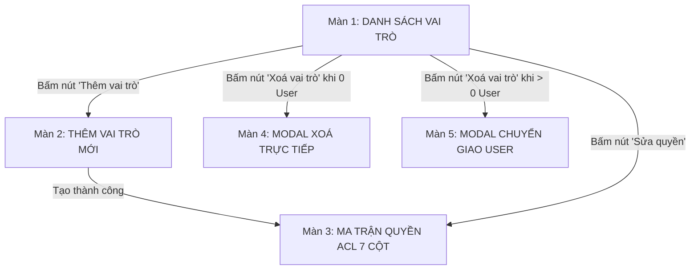

# TÀI LIỆU KỊCH BẢN KIỂM THỬ THỦ CÔNG (MANUAL TEST CASES)
## HỆ THỐNG PHÂN QUYỀN VAI TRÒ RBAC & MA TRẬN ACL 7 CỘT - GREENSPOT

> **Tài liệu dành cho:** Quản trị viên / Tester / Developer tự kiểm thử trực tiếp trên trình duyệt.  
> **Phiên bản:** 2.0 (Chuẩn Ma trận ACL 7 cột theo ảnh mẫu & Backend Engine)  
> **Thời gian cập nhật:** Tháng 10/2026

---

## 1. THÔNG TIN MÔI TRƯỜNG & TÀI KHOẢN KIỂM THỬ

| Thông tin | Giá trị |
| :--- | :--- |
| **URL Ứng dụng Frontend** | `http://localhost:5173` hoặc trực tiếp: `http://localhost:5173/#rbac` |
| **URL Backend API** | `http://localhost:8000/api/v1` |
| **Tài khoản Quản trị viên (Admin)** | **Email:** `ddatmguyen2023+test@gmail.com` **Mật khẩu:** `Dat123123,` |
| **Tài khoản Công dân thường (Citizen)** | Có thể đăng ký tài khoản mới trên giao diện Đăng ký hoặc tài khoản mẫu |

---

## 2. TỔNG QUAN 5 MÀN HÌNH KIỂM THỬ

---

## 3. DANH SÁCH CÁC CA KIỂM THỬ CHI TIẾT (TEST CASES)

### TC-01: Truy cập khi chưa đăng nhập (Admin Access Gate)
* **Mục tiêu:** Đảm bảo trang quản trị phân quyền được bảo vệ an toàn, hiển thị hướng dẫn khi chưa đăng nhập.
* **Các bước thực hiện:**
  1. Mở trình duyệt ở chế độ ẩn danh (Incognito) hoặc chưa đăng nhập.
  2. Truy cập: `http://localhost:5173/#rbac` (hoặc bấm nút **"🛡️ Phân quyền vai trò"** trên thanh Header).
* **Kết quả mong đợi:**
  - [ ] Hiển thị thẻ thông báo **"Khu vực Quản trị Phân quyền (RBAC)"**.
  - [ ] Hiển thị thông tin tài khoản Admin mẫu để thử nghiệm.
  - [ ] Có nút **"🔐 Đăng nhập Quản trị viên"** và **"🗺️ Về Bản đồ WebGIS"**.
  - [ ] Không bị lỗi trắng trang hay văng lỗi console.

---

### TC-02: Đăng nhập Quản trị viên & Vào Màn 1 (Danh sách vai trò)
* **Mục tiêu:** Đăng nhập thành công và truy cập toàn bộ giao diện quản trị phân quyền.
* **Các bước thực hiện:**
  1. Nhấp nút **"🔐 Đăng nhập Quản trị viên"** (hoặc tab **"Đăng ký / Đăng nhập"**).
  2. Nhập Email: `ddatmguyen2023+test@gmail.com`
  3. Nhập Mật khẩu: `Dat123123,`
  4. Bấm **"Đăng nhập"**.
  5. Sau khi đăng nhập, nhấp vào tab **"🛡️ Phân quyền vai trò"** trên Header.
* **Kết quả mong đợi:**
  - [ ] Đăng nhập thành công, Header hiển thị Avatar cùng tên **Nguyễn Thành Đạt (ADMIN)**.
  - [ ] Màn hình phân quyền hiển thị với 3 tab điều hướng: **`📋 Danh sách vai trò`**, **`➕ Thêm vai trò`**, **`📊 Ma trận quyền`**.
  - [ ] Khung trái hiển thị danh sách vai trò với đúng 4 vai trò hệ thống đầu tiên:
    1. **Admin** (Hệ thống, Toàn thành phố, nút *Sửa quyền* và *Xoá* bị vô hiệu hóa có tooltip bảo vệ).
    2. **District Manager** (Hệ thống, Quận, có nút *Sửa quyền*).
    3. **Responder** (Hệ thống, Quận, có nút *Sửa quyền*).
    4. **Citizen** (Hệ thống, Toàn thành phố, có nút *Sửa quyền*).
  - [ ] Khung phải hiển thị card **"Thao tác vai trò"** (nút *Thêm vai trò*), card **"Chỉ số phân quyền"** (thanh tiến độ dung lượng `X / 20`), và card **"Cơ chế bảo vệ dữ liệu"**.

---

### TC-03: Thêm vai trò mới & Kiểm tra Validation (Màn 2)
* **Mục tiêu:** Kiểm tra form khởi tạo vai trò mới với các quy tắc ràng buộc chặt chẽ.
* **Các bước thực hiện:**
  1. Từ Màn 1, bấm nút **"➕ Thêm vai trò"** ở khung phải hoặc trên Header.
  2. **Thử nghiệm nhập sai:**
     - Để trống tên vai trò ➔ Bấm "Lưu vai trò" ➔ Kiểm tra báo lỗi.
     - Nhập 1 ký tự: `A` ➔ Kiểm tra báo lỗi tối thiểu 2 ký tự.
     - Nhập ký tự đặc biệt: `Role @ Admin #1` ➔ Kiểm tra báo lỗi ký tự không hợp lệ.
     - Nhập trùng tên: `Admin` (hoặc `admin`) ➔ Bấm lưu ➔ Kiểm tra Backend trả về thông báo tên đã tồn tại.
  3. **Thử nghiệm nhập đúng:**
     - Tên vai trò: `  Cán bộ   Môi trường Phường 1  ` (cố tình nhập thừa khoảng trắng).
     - Mô tả: `Phụ trách giám sát và xử lý rác thải sinh hoạt cấp phường.`
     - Phạm vi: Chọn radio **"Cấp Quận / Phường"**.
     - Bấm nút **"Lưu vai trò"** (hoặc nhấn phím `Enter`).
* **Kết quả mong đợi:**
  - [ ] Hệ thống tự động gộp khoảng trắng thừa thành `Cán bộ Môi trường Phường 1`.
  - [ ] Hiển thị Toast thông báo màu xanh: **"Đã tạo vai trò thành công"**.
  - [ ] Tự động chuyển thẳng sang **Màn 3 (Ma trận quyền)** với vai trò vừa tạo được chọn sẵn trong Capsule.

---

### TC-04: Kiểm tra Giao diện Ma trận ACL 7 cột theo ảnh mẫu (Màn 3)
* **Mục tiêu:** Kiểm tra bố cục và 7 cột phân quyền chi tiết khớp 100% với ảnh mẫu thiết kế.
* **Các bước thực hiện:**
  1. Nhấp tab **"📊 Ma trận quyền"** trên thanh Header phân quyền.
  2. Quan sát cấu trúc giao diện:
* **Kết quả mong đợi:**
  - [ ] Dòng mô tả phụ dưới tiêu đề: *"Tất cả thành viên thuộc vai trò / nhóm sẽ nhận quyền này."*
  - [ ] Góc trên bên phải có **Capsule chọn vai trò** (pill hình viên thuốc bo tròn có chấm tròn màu xanh đại diện avatar vai trò) cho phép chuyển đổi nhanh giữa các vai trò.
  - [ ] Nút **"Lưu"** hình bầu dục (disabled màu xám nhạt khi chưa có thay đổi, sáng xanh khi có ô checkbox thay đổi).
  - [ ] Bảng kiểm soát truy cập gồm **7 cột thao tác chuẩn**:
    1. **TRUY CẬP** (`ACCESS`)
    2. **XEM** (`VIEW`)
    3. **THÊM** (`CREATE`)
    4. **CẬP NHẬT** (`UPDATE`)
    5. **XOÁ** (`DELETE`)
    6. **IMPORT** (`IMPORT`)
    7. **EXPORT** (`EXPORT`)
  - [ ] Đủ **15 Modules** chức năng hệ thống:
    - Bản đồ số WebGIS, Báo cáo sự cố môi trường, Điểm xanh & Công viên sinh thái, Trạm thu gom & Điểm tái chế, Trạm quan trắc IoT & Cảm biến, Cảnh báo ngập lụt & Triều cường, Chỉ số chất lượng không khí AQI, Khí tượng & Dự báo thời tiết, Phân công & Điều phối hiện trường, Phản ánh & Đóng góp ý kiến, Chiến dịch môi trường & Điểm xanh, Quản lý người dùng & Tài khoản, Phân quyền vai trò, Thống kê & Báo cáo tổng hợp, Nhật ký kiểm toán hệ thống.

---

### TC-05: Kiểm tra Quy tắc liên động tự động (Interlocking Rules)
* **Mục tiêu:** Kiểm tra logic bảo toàn quyền hạn (không thể Xoá/Sửa nếu không có quyền Xem/Truy cập).
* **Các bước thực hiện:**
  1. Chọn vai trò vừa tạo (hoặc vai trò *District Manager* / *Responder*).
  2. Tại hàng **"Báo cáo sự cố môi trường"**, hiện tại chưa tích ô nào:
     - Nhấp chọn ô **"XOÁ"** ➔ Quan sát ô **"XEM"** và **"TRUY CẬP"** có tự động sáng theo không.
     - Nhấp chọn ô **"EXPORT"** ➔ Quan sát ô **"XEM"** và **"TRUY CẬP"** có tự động được duy trì không.
     - Nhấp tắt ô **"XEM"** ➔ Quan sát các ô **THÊM**, **CẬP NHẬT**, **XOÁ**, **IMPORT**, **EXPORT** có tự động tắt theo không.
     - Nhấp tắt ô **"TRUY CẬP"** ➔ Quan sát toàn bộ hàng có tự động bị huỷ chọn không.
  3. Nhấp trực tiếp vào tên chức năng (ví dụ dòng chữ *"Bản đồ số WebGIS"*) ➔ Kiểm tra tính năng bật/tắt nhanh toàn bộ hàng.
* **Kết quả mong đợi:**
  - [ ] Bật quyền con tự động kích hoạt **TRUY CẬP** và **XEM**.
  - [ ] Tắt **TRUY CẬP** thì tắt sạch cả hàng.
  - [ ] Nút **"Lưu"** chuyển sang trạng thái sáng rõ (Dirty State hoạt động chính xác).

---

### TC-06: Lưu Ma trận quyền & Kiểm soát xung đột OCC (409 Conflict)
* **Mục tiêu:** Lưu quyền hạn xuống cơ sở dữ liệu Backend và kiểm tra khóa lạc quan OCC.
* **Các bước thực hiện:**
  1. Sau khi chỉnh sửa các ô checkbox ở TC-05, bấm nút **"Lưu"**.
  2. Quan sát phản hồi:
     - [ ] Hiển thị thông báo Toast thành công: **"Đã lưu ma trận quyền thành công"**.
     - [ ] Nút "Lưu" tự động mờ đi (không còn dirty).
  3. **Kiểm tra F5:** Tải lại trang (`F5`) ➔ Các ô checkbox vừa lưu vẫn giữ nguyên vị trí đã tích.
  4. **Kiểm tra tính bất khả xâm phạm của Admin:**
     - Trong Capsule góc phải, chọn vai trò **"Admin"**.
     - [ ] Tất cả 105 ô checkbox đều được tích sáng và ở trạng thái **vô hiệu hóa (disabled)** không cho phép bỏ quyền Admin.
     - [ ] Nút "Lưu" bị ẩn hoặc vô hiệu hóa.

---

### TC-07: Xóa vai trò tùy chỉnh chưa có người dùng (Màn 4)
* **Mục tiêu:** Xóa an toàn vai trò tùy chỉnh rỗng.
* **Các bước thực hiện:**
  1. Quay lại tab **"📋 Danh sách vai trò"** (Màn 1).
  2. Tìm vai trò vừa tạo (số người dùng = 0).
  3. Nhấp nút **"🗑️ Xoá vai trò"**.
* **Kết quả mong đợi:**
  - [ ] Hiển thị Modal Màn 4: **"Xác nhận xoá vai trò"**.
  - [ ] Hiển thị cảnh báo màu cam nhạt: *"Hành động này không thể hoàn tác. Vai trò này sẽ bị xoá vĩnh viễn khỏi hệ thống."*
  - [ ] Bấm **"Huỷ bỏ"** ➔ Modal đóng, vai trò vẫn còn.
  - [ ] Bấm **"Xoá vai trò"** ➔ Modal đóng, thông báo *"Đã xoá vai trò thành công"*, danh sách cập nhật ngay lập tức.
  - [ ] Các vai trò hệ thống (*Admin, District Manager, Responder, Citizen*) nút "Xoá vai trò" bị disabled kèm tooltip giải thích.

---

### TC-08: Chuyển giao người dùng và Xóa vai trò (Màn 5)
* **Mục tiêu:** Ngăn chặn mồ côi tài khoản người dùng khi xóa vai trò đang có người dùng.
* **Các bước thực hiện:**
  1. Tạo 2 vai trò mới:
     - Vai trò A: `Cán bộ Tạm 1`
     - Vai trò B: `Cán bộ Tiếp Nhận`
  2. Gán 1 người dùng vào `Cán bộ Tạm 1` (hoặc kiểm tra vai trò có `user_count > 0`).
  3. Nhấp nút **"🗑️ Xoá vai trò"** tại vai trò `Cán bộ Tạm 1`.
* **Kết quả mong đợi:**
  - [ ] Hệ thống tự động nhận diện `user_count > 0` và mở **Modal Màn 5 (Chuyển giao người dùng)**.
  - [ ] Hiển thị số lượng tài khoản cần chuyển giao: *"Vai trò này hiện đang có X người dùng..."*.
  - [ ] Có ô chọn dropdown **"Vai trò tiếp nhận"** (danh sách loại trừ chính vai trò đang cần xoá).
  - [ ] Chọn vai trò `Cán bộ Tiếp Nhận` và bấm **"Chuyển giao & Xoá vai trò"**.
  - [ ] Hệ thống chuyển toàn bộ người dùng sang vai trò mới và xoá vai trò cũ thành công.

---

## 4. BẢNG CHECKLIST TỔNG HỢP KIỂM THỬ THỦ CÔNG

| STT | Mã Test Case | Nội dung kiểm tra | Kết quả đạt | Ghi chú |
| :---: | :--- | :--- | :---: | :--- |
| 1 | `TC-01` | Admin Access Gate khi chưa đăng nhập | `[ ]` | Có nút chuyển sang đăng nhập Admin |
| 2 | `TC-02` | Đăng nhập Admin & Hiển thị 4 vai trò hệ thống | `[ ]` | Đúng thứ tự Admin, District Manager, Responder, Citizen |
| 3 | `TC-03` | Tạo vai trò mới, validate tiếng Việt, gộp khoảng trắng | `[ ]` | Giới hạn 2-30 ký tự, tự động gộp cách |
| 4 | `TC-04` | Bố cục Ma trận 7 cột ACL theo đúng ảnh mẫu | `[ ]` | Đủ 7 cột: ACCESS, VIEW, CREATE, UPDATE, DELETE, IMPORT, EXPORT |
| 5 | `TC-05` | Quy tắc liên động Interlocking tự động kích hoạt | `[ ]` | Chọn Xoá -> tự bật Xem & Truy cập |
| 6 | `TC-06` | Lưu ma trận quyền & Chặn sửa quyền Admin | `[ ]` | Admin immutable, lưu thành công |
| 7 | `TC-07` | Xoá vai trò 0 người dùng (Màn 4) | `[ ]` | Chặn xoá vai trò hệ thống |
| 8 | `TC-08` | Chuyển giao người dùng trước khi xoá (Màn 5) | `[ ]` | Người dùng được chuyển sang vai trò tiếp nhận |

---

> 🎉 **Chúc bạn kiểm thử thành công!** Nếu phát hiện bất kỳ điểm nào chưa ưng ý về giao diện hoặc thao tác, bạn chỉ cần phản hồi để được tinh chỉnh ngay lập tức!
