# TÀI LIỆU THIẾT KẾ & PHÁC THẢO GIAO DIỆN (UI/UX WIREFRAMES) 48 CHỨC NĂNG
## HỆ THỐNG QUẢN TRỊ MÔI TRƯỜNG ĐÔ THỊ, BẢN ĐỒ SỐ WEBGIS & BÁO ĐỘNG NGẬP LỤT (GREENSPOT / ECOREPORT)

**Dự án:** GreenSpot / EcoReport WebGIS  
**Tài liệu căn cứ:** `BANG_PHAN_CONG_48_CHUC_NANG_MOI.md`  
**Mục đích:** Cung cấp tài liệu phác thảo cấu trúc giao diện Wireframe, bố cục thành phần UI và luồng thao tác người dùng đánh số thứ tự ảnh từ **Ảnh 01 đến Ảnh 48** phục vụ đưa vào Báo cáo Đồ án chuyên đề.

---

## MỤC LỤC DANH MỤC 48 ẢNH PHÁC THẢO GIAO DIỆN

- [Phần 1: Nguyễn Thành Đạt (Ảnh 01 ➔ Ảnh 12)](#phần-1-nguyễn-thành-đạt-ảnh-01--ảnh-12)
- [Phần 2: Huỳnh Anh Tú (Ảnh 13 ➔ Ảnh 24)](#phần-2-huỳnh-anh-tú-ảnh-13--ảnh-24)
- [Phần 3: Bùi Nguyễn Minh Quân (Ảnh 25 ➔ Ảnh 36)](#phần-3-bùi-nguyễn-minh-quân-ảnh-25--ảnh-36)
- [Phần 4: Lê Anh Tuấn (Ảnh 37 ➔ Ảnh 48)](#phần-4-lê-anh-tuấn-ảnh-37--ảnh-48)

---


> [!IMPORTANT]
> **ĐÃ XUẤT ĐẦY ĐỦ 61 HÌNH ẢNH WIREFRAME ĐỒ HỌA TRẮNG ĐEN (ĐỘ PHÂN GIẢI CAO 2X):**
> * 🌐 **Bộ sưu tập trực quan (Xem & Tìm kiếm tất cả ảnh trên trình duyệt):** [DANH_MUC_ANH_WIREFRAME.html](file:///d:/Group-j_GreenSpot/DANH_MUC_ANH_WIREFRAME.html)
> * 📁 **Thư mục lưu trữ 61 file ảnh PNG:** [./wireframes/](file:///d:/Group-j_GreenSpot/wireframes/)
> * Mỗi chức năng đều có ảnh Wireframe đồ họa tương ứng được đánh số thứ tự chuẩn (`Ảnh 01.1`, `Ảnh 01.2`,..., `Ảnh 48.2`).

### BẢNG ĐỐI CHIẾU 61 ẢNH WIREFRAME CHO 48 CHỨC NĂNG

| STT | Số Thứ Tự Ảnh | Tên Giao Diện / Màn Hình Wireframe | Thành Viên Phụ Trách | File Ảnh PNG |
|:---:|:---:|:---|:---|:---:|
| 01 | **Ảnh 01.1** | Báo cáo điểm ô nhiễm - Định vị GPS tự động trên bản đồ | Nguyễn Thành Đạt | [Xem ảnh](./wireframes/Anh_01_1.png) |
| 01 | **Ảnh 01.2** | Báo cáo điểm ô nhiễm - Ghim vị trí thủ công & Modal xác nhận | Nguyễn Thành Đạt | [Xem ảnh](./wireframes/Anh_01_2.png) |
| 02 | **Ảnh 02.1** | Thu thập & Nén ảnh/video hiện trường kèm đóng dấu thời gian | Nguyễn Thành Đạt | [Xem ảnh](./wireframes/Anh_02_1.png) |
| 02 | **Ảnh 02.2** | Xem chi tiết ảnh phóng to & Trích xuất Metadata EXIF | Nguyễn Thành Đạt | [Xem ảnh](./wireframes/Anh_02_2.png) |
| 03 | **Ảnh 03.1** | Phân loại loại hình ô nhiễm đa danh mục | Nguyễn Thành Đạt | [Xem ảnh](./wireframes/Anh_03_1.png) |
| 04 | **Ảnh 04.1** | Thang điểm mức độ nghiêm trọng & Khẩn cấp | Nguyễn Thành Đạt | [Xem ảnh](./wireframes/Anh_04_1.png) |
| 05 | **Ảnh 05.1** | Quản lý đa lớp bản đồ nền đô thị | Nguyễn Thành Đạt | [Xem ảnh](./wireframes/Anh_05_1.png) |
| 06 | **Ảnh 06.1** | Kết xuất kiến trúc tòa nhà 3D Extrusion đô thị | Nguyễn Thành Đạt | [Xem ảnh](./wireframes/Anh_06_1.png) |
| 06 | **Ảnh 06.2** | Bộ chọn chủ đề màu sắc tòa nhà 3D (Color Palettes) | Nguyễn Thành Đạt | [Xem ảnh](./wireframes/Anh_06_2.png) |
| 07 | **Ảnh 07.1** | Tùy chọn gửi ẩn danh & Bảo vệ riêng tư (Spatial Jitter 50m) | Nguyễn Thành Đạt | [Xem ảnh](./wireframes/Anh_07_1.png) |
| 08 | **Ảnh 08.1** | Hiển thị lớp ranh giới hành chính 22 quận/huyện TP.HCM | Nguyễn Thành Đạt | [Xem ảnh](./wireframes/Anh_08_1.png) |
| 09 | **Ảnh 09.1** | Mạng lưới điểm xanh & Trạm tái chế rác công cộng | Nguyễn Thành Đạt | [Xem ảnh](./wireframes/Anh_09_1.png) |
| 09 | **Ảnh 09.2** | Popup chi tiết thông tin trạm tái chế & Tiếp nhận vật liệu | Nguyễn Thành Đạt | [Xem ảnh](./wireframes/Anh_09_2.png) |
| 10 | **Ảnh 10.1** | Hỗ trợ dịch đa ngôn ngữ tự động (Song ngữ Việt - Anh) | Nguyễn Thành Đạt | [Xem ảnh](./wireframes/Anh_10_1.png) |
| 11 | **Ảnh 11.1** | Tra cứu quy định pháp lý & Khung mức phạt (Nghị định 45/2022/NĐ-CP) | Nguyễn Thành Đạt | [Xem ảnh](./wireframes/Anh_11_1.png) |
| 12 | **Ảnh 12.1** | Chế độ giao diện đơn giản cho người cao tuổi (Accessible UI) | Nguyễn Thành Đạt | [Xem ảnh](./wireframes/Anh_12_1.png) |
| 12 | **Ảnh 12.2** | Hướng dẫn sử dụng tương tác Quick Tour 3D | Nguyễn Thành Đạt | [Xem ảnh](./wireframes/Anh_12_2.png) |
| 13 | **Ảnh 13.1** | Cơ chế tích lũy Điểm thưởng Công dân Xanh (EcoPoints) | Huỳnh Anh Tú | [Xem ảnh](./wireframes/Anh_13_1.png) |
| 14 | **Ảnh 14.1** | Quản lý ví điểm thưởng cá nhân & Thẻ EcoPoints | Huỳnh Anh Tú | [Xem ảnh](./wireframes/Anh_14_1.png) |
| 14 | **Ảnh 14.2** | Lịch sử biến động điểm xanh (Point Transactions Log) | Huỳnh Anh Tú | [Xem ảnh](./wireframes/Anh_14_2.png) |
| 15 | **Ảnh 15.1** | Danh mục quà tặng xanh & Vật phẩm quy đổi (Gian hàng) | Huỳnh Anh Tú | [Xem ảnh](./wireframes/Anh_15_1.png) |
| 16 | **Ảnh 16.1** | Thực hiện đổi điểm lấy quà tặng / Voucher (Modal xác nhận) | Huỳnh Anh Tú | [Xem ảnh](./wireframes/Anh_16_1.png) |
| 16 | **Ảnh 16.2** | Thẻ mã QR Voucher ưu đãi được cấp để sử dụng tại quầy | Huỳnh Anh Tú | [Xem ảnh](./wireframes/Anh_16_2.png) |
| 17 | **Ảnh 17.1** | Kho quản lý quà tặng & Voucher cá nhân đã đổi | Huỳnh Anh Tú | [Xem ảnh](./wireframes/Anh_17_1.png) |
| 18 | **Ảnh 18.1** | Bảng xếp hạng vinh danh Top Công dân Xanh (Leaderboard) | Huỳnh Anh Tú | [Xem ảnh](./wireframes/Anh_18_1.png) |
| 19 | **Ảnh 19.1** | Giám sát mây mưa RainViewer Radar & Thanh phát lại thời gian thực | Huỳnh Anh Tú | [Xem ảnh](./wireframes/Anh_19_1.png) |
| 20 | **Ảnh 20.1** | Mô phỏng động lực học luồng gió (Wind Streamlines) | Huỳnh Anh Tú | [Xem ảnh](./wireframes/Anh_20_1.png) |
| 21 | **Ảnh 21.1** | Bộ lớp phủ khí tượng đa thông số (8 lớp phủ chuyên sâu) | Huỳnh Anh Tú | [Xem ảnh](./wireframes/Anh_21_1.png) |
| 22 | **Ảnh 22.1** | Đánh giá mức độ hài lòng (1-5 sao) sau khi dọn sạch | Huỳnh Anh Tú | [Xem ảnh](./wireframes/Anh_22_1.png) |
| 23 | **Ảnh 23.1** | Bản đồ nhiệt môi trường nội suy không gian (Heatmap) | Huỳnh Anh Tú | [Xem ảnh](./wireframes/Anh_23_1.png) |
| 24 | **Ảnh 24.1** | Cẩm nang hướng dẫn phân loại rác thải tại nguồn | Huỳnh Anh Tú | [Xem ảnh](./wireframes/Anh_24_1.png) |
| 24 | **Ảnh 24.2** | Trợ lý AI RAG tư vấn Sống xanh & Xử lý rác trực tuyến | Huỳnh Anh Tú | [Xem ảnh](./wireframes/Anh_24_2.png) |
| 25 | **Ảnh 25.1** | Cổng xác thực tập trung - Màn hình Đăng nhập & JWT | Bùi Nguyễn Minh Quân | [Xem ảnh](./wireframes/Anh_25_1.png) |
| 25 | **Ảnh 25.2** | Cổng xác thực tập trung - Màn hình Đăng ký tài khoản công dân | Bùi Nguyễn Minh Quân | [Xem ảnh](./wireframes/Anh_25_2.png) |
| 26 | **Ảnh 26.1** | Quản trị người dùng & Ma trận phân quyền động RBAC | Bùi Nguyễn Minh Quân | [Xem ảnh](./wireframes/Anh_26_1.png) |
| 27 | **Ảnh 27.1** | Quản lý năng lực đội xe thu gom rác & Tài xế hiện trường | Bùi Nguyễn Minh Quân | [Xem ảnh](./wireframes/Anh_27_1.png) |
| 28 | **Ảnh 28.1** | Nhật ký kiểm toán an ninh Audit Log và truy vết dữ liệu | Bùi Nguyễn Minh Quân | [Xem ảnh](./wireframes/Anh_28_1.png) |
| 29 | **Ảnh 29.1** | Trung tâm điều phối tác nghiệp & Danh sách sự cố tồn đọng | Bùi Nguyễn Minh Quân | [Xem ảnh](./wireframes/Anh_29_1.png) |
| 29 | **Ảnh 29.2** | Modal phân công lệnh xử lý hiện trường cho tài xế | Bùi Nguyễn Minh Quân | [Xem ảnh](./wireframes/Anh_29_2.png) |
| 30 | **Ảnh 30.1** | Thẩm định chất lượng xử lý & Nghiệm thu Trước/Sau (Before/After) | Bùi Nguyễn Minh Quân | [Xem ảnh](./wireframes/Anh_30_1.png) |
| 31 | **Ảnh 31.1** | Phân cấp quản lý 3 cấp & Chuyển tiếp hồ sơ thẩm quyền | Bùi Nguyễn Minh Quân | [Xem ảnh](./wireframes/Anh_31_1.png) |
| 32 | **Ảnh 32.1** | Giám sát hạn mức SLA thời gian thực & Cảnh báo trễ hạn | Bùi Nguyễn Minh Quân | [Xem ảnh](./wireframes/Anh_32_1.png) |
| 33 | **Ảnh 33.1** | Giám sát mạng lưới trạm cảm biến viễn trắc IoT đô thị | Bùi Nguyễn Minh Quân | [Xem ảnh](./wireframes/Anh_33_1.png) |
| 34 | **Ảnh 34.1** | Tự động hóa kết xuất báo cáo thống kê định kỳ PDF/Excel | Bùi Nguyễn Minh Quân | [Xem ảnh](./wireframes/Anh_34_1.png) |
| 35 | **Ảnh 35.1** | Quản lý tuyến lộ trình xe gom rác cố định và trạm dừng checkpoints | Bùi Nguyễn Minh Quân | [Xem ảnh](./wireframes/Anh_35_1.png) |
| 36 | **Ảnh 36.1** | Bảng điều khiển tác nghiệp tổng quan Quản lý (Admin Dashboard) | Bùi Nguyễn Minh Quân | [Xem ảnh](./wireframes/Anh_36_1.png) |
| 36 | **Ảnh 36.2** | Trung tâm chẩn đoán sức khỏe hệ thống & Giám sát API Health Check | Bùi Nguyễn Minh Quân | [Xem ảnh](./wireframes/Anh_36_2.png) |
| 37 | **Ảnh 37.1** | Cơ chế tính điểm rủi ro Risk Score (0-100) cho từng sự cố | Lê Anh Tuấn | [Xem ảnh](./wireframes/Anh_37_1.png) |
| 38 | **Ảnh 38.1** | Tự động phân loại mức độ nguy hiểm: Thấp, Trung bình, Cao, Khẩn cấp | Lê Anh Tuấn | [Xem ảnh](./wireframes/Anh_38_1.png) |
| 39 | **Ảnh 39.1** | Phát hiện và gom cụm các báo cáo theo tọa độ (DBSCAN Clustered Markers) | Lê Anh Tuấn | [Xem ảnh](./wireframes/Anh_39_1.png) |
| 40 | **Ảnh 40.1** | Phân tích không gian vùng đệm (Buffer 500m) tìm cơ sở thiết yếu | Lê Anh Tuấn | [Xem ảnh](./wireframes/Anh_40_1.png) |
| 41 | **Ảnh 41.1** | Động cơ giải tích sóng triều bán nhật triều Harmonic Tide Engine | Lê Anh Tuấn | [Xem ảnh](./wireframes/Anh_41_1.png) |
| 42 | **Ảnh 42.1** | Dự báo đỉnh triều cực trị & Bản đồ vệt đường ngập 3 lớp | Lê Anh Tuấn | [Xem ảnh](./wireframes/Anh_42_1.png) |
| 43 | **Ảnh 43.1** | Tìm tuyến đường an toàn né khu vực ngập (PostGIS ST_DWithin) | Lê Anh Tuấn | [Xem ảnh](./wireframes/Anh_43_1.png) |
| 44 | **Ảnh 44.1** | So sánh tuyến đường nhanh nhất vs tuyến an toàn tránh thủy kích | Lê Anh Tuấn | [Xem ảnh](./wireframes/Anh_44_1.png) |
| 45 | **Ảnh 45.1** | Báo cáo điểm ngập lụt 1-chạm qua menu chuột phải trên bản đồ | Lê Anh Tuấn | [Xem ảnh](./wireframes/Anh_45_1.png) |
| 45 | **Ảnh 45.2** | Modal nhập mực nước ngập lụt & Thuật toán bám đường OSRM | Lê Anh Tuấn | [Xem ảnh](./wireframes/Anh_45_2.png) |
| 46 | **Ảnh 46.1** | Dự báo lũ lụt toàn cầu Copernicus GloFAS 7 ngày | Lê Anh Tuấn | [Xem ảnh](./wireframes/Anh_46_1.png) |
| 47 | **Ảnh 47.1** | Tích hợp đa nguồn dữ liệu ngập lụt đô thị & Mô phỏng thiên tai | Lê Anh Tuấn | [Xem ảnh](./wireframes/Anh_47_1.png) |
| 48 | **Ảnh 48.1** | Dashboard phân tích dữ liệu lớn AQI 34 tỉnh thành & Biểu đồ chuỗi giờ | Lê Anh Tuấn | [Xem ảnh](./wireframes/Anh_48_1.png) |
| 48 | **Ảnh 48.2** | Ma trận nhiệt tương quan 6 chất ô nhiễm không khí (Correlation Heatmap) | Lê Anh Tuấn | [Xem ảnh](./wireframes/Anh_48_2.png) |

---


## PHẦN 1: NGUYỄN THÀNH ĐẠT (ẢNH 01 ➔ ẢNH 12)

---

### Ảnh 01: Giao diện Định vị GPS Tự động & Ghim Vị trí Thủ công
- **STT Chức năng:** 1
- **Thành viên phụ trách:** Nguyễn Thành Đạt
- **Vị trí giao diện:** Màn hình chính WebGIS + Nút công cụ định vị (Góc trên bên phải)
- **Phác thảo bố cục (Wireframe):**


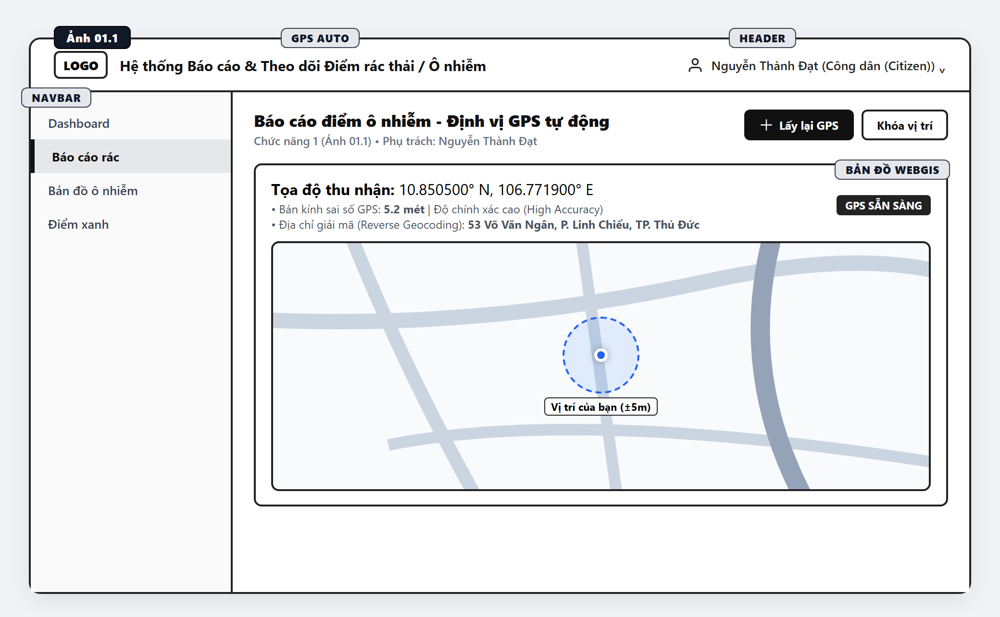
*Hình: Ảnh 01.1 - Báo cáo điểm ô nhiễm - Định vị GPS tự động trên bản đồ (Thành viên: Nguyễn Thành Đạt)*


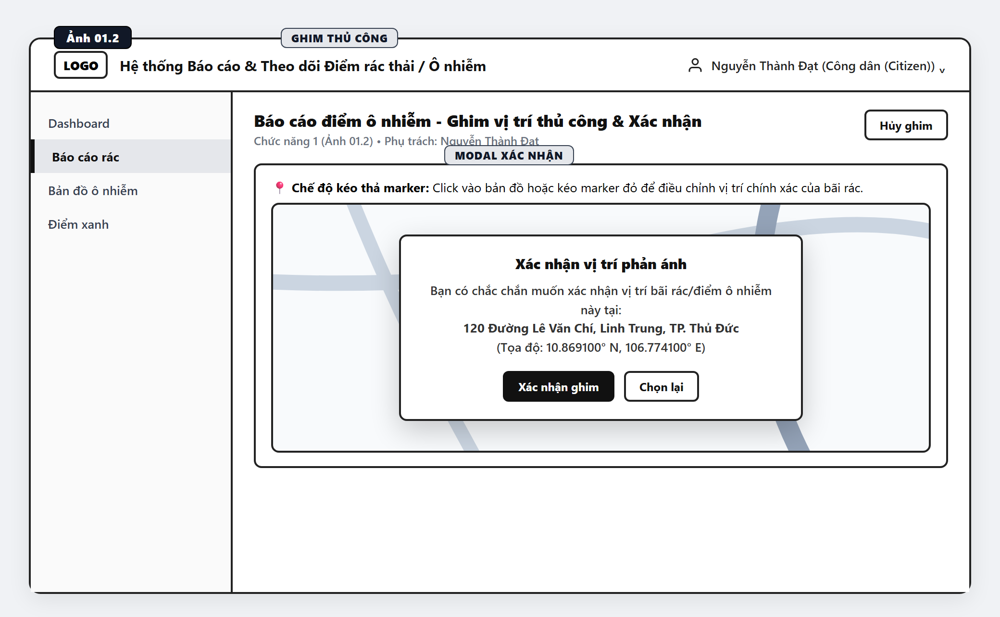
*Hình: Ảnh 01.2 - Báo cáo điểm ô nhiễm - Ghim vị trí thủ công & Modal xác nhận (Thành viên: Nguyễn Thành Đạt)*

```text
+-------------------------------------------------------------------------------+
| [🗺️ EcoReport WebGIS]   [🔍 Tìm kiếm đường/địa điểm...]     [📍 GPS] [API: Online] |
+-------------------------------------------------------------------------------+
|                                                | [🧭 La bàn]                  |
|                                                | [+] Zoom In                  |
|                  BẢN ĐỒ NỀN ĐÔ THỊ             | [-] Zoom Out                 |
|                                                | [🎯 Vị trí của tôi] <--(Click)|
|                           📍 (Marker ghim tay) |                              |
|                          /                     +------------------------------+
|             🔵 (Vị trí GPS hiện tại: 10.7765, 106.7009)                       |
|                                                                               |
|  [Popup Ghim Tọa Độ]                                                          |
|  +------------------------------------------------------+                     |
|  | Vị trí đã chọn: 120 Đường Lê Văn Chí, Linh Trung     |                     |
|  | Tọa độ: 10.869100° N, 106.774100° E                 |                     |
|  | [✅ Xác nhận vị trí này]   [🔄 Lấy lại GPS tự động]  |                     |
|  +------------------------------------------------------+                     |
+-------------------------------------------------------------------------------+
```
- **Thành phần UI:** Nút tròn định vị GPS xanh lam, Marker ghim vị trí màu đỏ có thể kéo thả, Popup xác thực tọa độ WGS84.

---

### Ảnh 02: Giao diện Thu thập, Nén Ảnh/Video Hiện trường Kèm Dấu Thời Gian
- **STT Chức năng:** 2
- **Thành viên phụ trách:** Nguyễn Thành Đạt
- **Vị trí giao diện:** Modal Báo Cáo Hiện Trường ➔ Khối Upload Đa Phương Tiện
- **Phác thảo bố cục (Wireframe):**


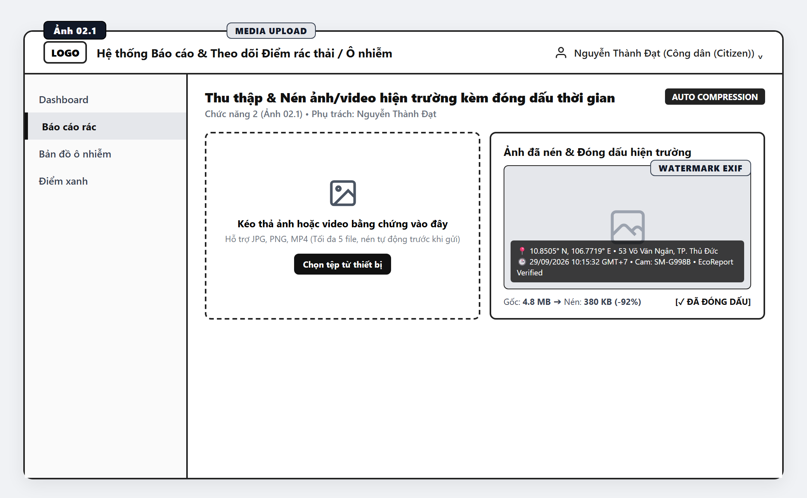
*Hình: Ảnh 02.1 - Thu thập & Nén ảnh/video hiện trường kèm đóng dấu thời gian (Thành viên: Nguyễn Thành Đạt)*


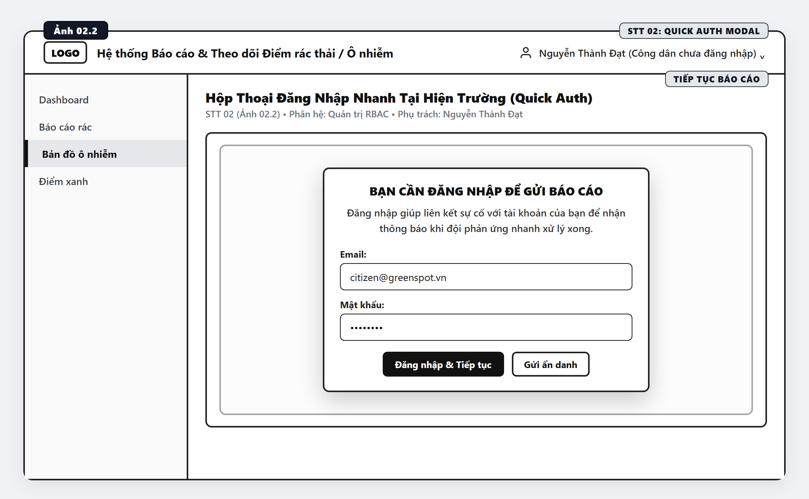
*Hình: Ảnh 02.2 - Xem chi tiết ảnh phóng to & Trích xuất Metadata EXIF (Thành viên: Nguyễn Thành Đạt)*

```text
+-------------------------------------------------------------------------------+
| MODAL: BÁO CÁO SỰ CỐ MÔI TRƯỜNG HIỆN TRƯỜNG                           [X Đóng] |
+-------------------------------------------------------------------------------+
| 📸 BẰNG CHỨNG HÌNH ẢNH / VIDEO HIỆN TRƯỜNG:                                   |
| +------------------------------------+  +------------------------------------+|
| | [Ảnh 1: Bai_rac_Le_Van_Chi.jpg]    |  | [+ Tải thêm ảnh / video]           | |
| |                                    |  |                                    | |
| |  ĐÃ NÉN: 8.4 MB ➔ 620 KB (92%)     |  |  Kéo thả file vào đây hoặc         | |
| |  WATERMARK TỰ ĐỘNG KHẮC LÊN ẢNH:   |  |  [📂 Chọn từ thư viện]             | |
| |  🕒 29/09/2026 08:35:12 GMT+7      |  |  [📷 Mở Camera chụp trực tiếp]     | |
| |  📍 GPS: 10.869100, 106.774100     |  |                                    | |
| |  [🗑️ Xóa]   [🔍 Phóng to xem thử]   |  |  Hỗ trợ: JPG, PNG, MP4 (Tối đa 25MB)|
| +------------------------------------+  +------------------------------------+|
+-------------------------------------------------------------------------------+
```
- **Thành phần UI:** Vùng Dropzone tải tệp, Badge tiến trình nén dung lượng xanh lá, Lớp phủ Watermark đóng dấu ngày giờ và tọa độ.

---

### Ảnh 03: Giao diện Phân loại Đa Danh mục Ô nhiễm Môi trường
- **STT Chức năng:** 3
- **Thành viên phụ trách:** Nguyễn Thành Đạt
- **Vị trí giao diện:** Form Báo Cáo ➔ Lựa chọn Nhóm Sự Cố Môi Trường
- **Phác thảo bố cục (Wireframe):**


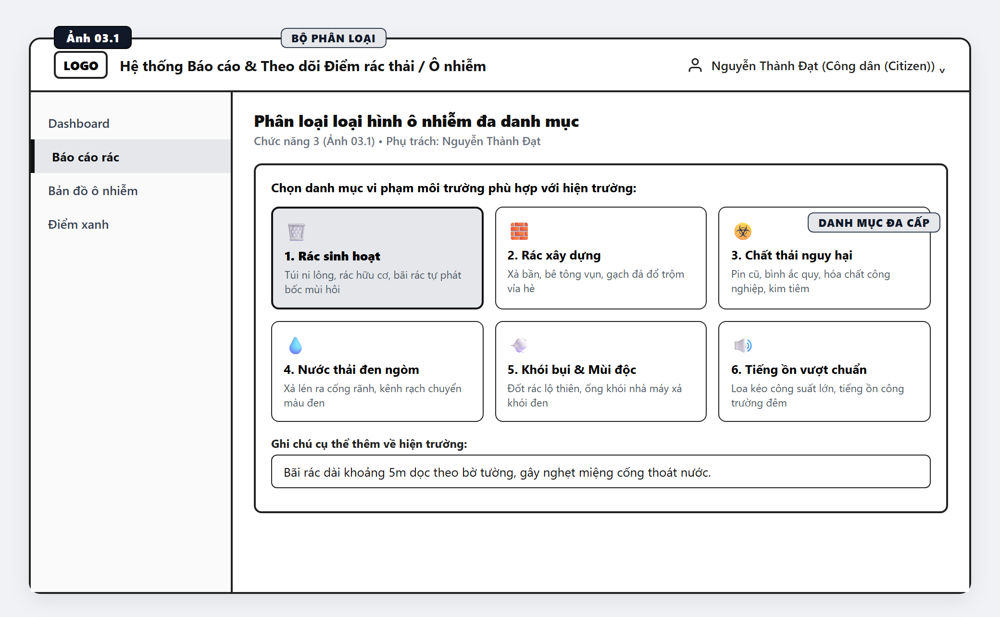
*Hình: Ảnh 03.1 - Phân loại loại hình ô nhiễm đa danh mục (Thành viên: Nguyễn Thành Đạt)*

```text
+-------------------------------------------------------------------------------+
| CHỌN LOẠI HÌNH Ô NHIỄM CẦN BÁO CÁO:                                           |
|                                                                               |
| [X] 🗑️ RÁC SINH HOẠT        [ ] ☣️ CHẤT THẢI NGUY HẠI      [ ] 🌊 Ô NHIỄM KÊNH RẠCH|
|     Bãi rác tự phát, túi       Pin cũ, bình ắc quy, bóng      Nước đen, rác trôi lềnh |
|     nilon, mùi hôi thối        đèn hỏng, hóa chất tẩy rửa     bềnh trên kênh rạch     |
|     (SLA: 24h - Vàng)          (SLA: 12h - Đỏ khẩn cấp)       (SLA: 36h - Xanh dương) |
|                                                                               |
| [ ] 🕳️ NGHẸT CỐNG GÂY NGẬP   [ ] 🧱 XÀ BẦN / PHẾ THẢI XÂY DỰNG                       |
|     Miệng hố ga bị lấp kín,    Gạch đá vụn, bê tông đổ trộm lấn chiếm lòng lề đường   |
|     ngập úng khi mưa to        (SLA: 72h - Xám xi măng)                               |
|     (SLA: 18h - Cyan)                                                         |
+-------------------------------------------------------------------------------+
```
- **Thành phần UI:** Grid Card radio chọn danh mục, icon đồ họa sinh động, nhãn thời hạn cam kết SLA tương ứng.

---

### Ảnh 04: Giao diện Thang điểm Đánh giá Mức độ Nghiêm trọng / Khẩn cấp
- **STT Chức năng:** 4
- **Thành viên phụ trách:** Nguyễn Thành Đạt
- **Vị trí giao diện:** Form Báo Cáo ➔ Thang đo Cấp độ Khẩn cấp (Severity)
- **Phác thảo bố cục (Wireframe):**


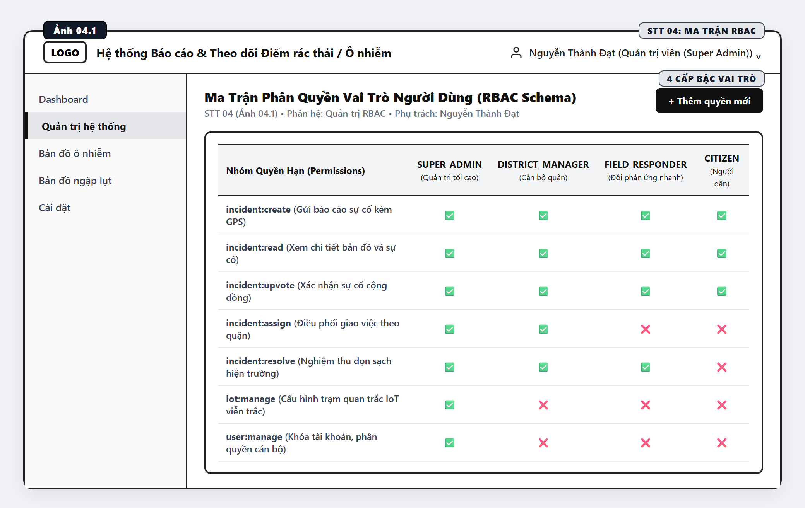
*Hình: Ảnh 04.1 - Thang điểm mức độ nghiêm trọng & Khẩn cấp (Thành viên: Nguyễn Thành Đạt)*

```text
+-------------------------------------------------------------------------------+
| MỨC ĐỘ NGHIÊM TRỌNG / KHẨN CẤP HIỆN TRƯỜNG:                                   |
|                                                                               |
| ( ) 🟢 THẤP (Low)          - Rác ít, chưa bốc mùi, không cản trở lối đi       |
| (•) 🟡 TRUNG BÌNH (Medium) - Bãi rác sinh hoạt diện tích < 5m², có nước rỉ rác|
| ( ) 🟠 CAO (High)          - Cống nghẹt gây ngập đường, rác tràn lòng đường   |
| ( ) 🔴 KHẨN CẤP (Critical) - Hóa chất rò rỉ, nguy cơ cháy nổ, ô nhiễm nguồn nước|
|                                                                               |
| ƯỚC LƯỢNG KHỐI LƯỢNG: [ 2.5 ] Mét khối (m³)                                   |
+-------------------------------------------------------------------------------+
```
- **Thành phần UI:** Thanh gạt phân cấp 4 màu (Xanh - Vàng - Cam - Đỏ), ô nhập thể tích rác ước tính $m^3$.

---

### Ảnh 05: Giao diện Quản lý Đa Lớp Bản đồ Nền Đô thị
- **STT Chức năng:** 5
- **Thành viên phụ trách:** Nguyễn Thành Đạt
- **Vị trí giao diện:** Thanh chuyển đổi Basemap (Góc trên bên phải WebGIS)
- **Phác thảo bố cục (Wireframe):**


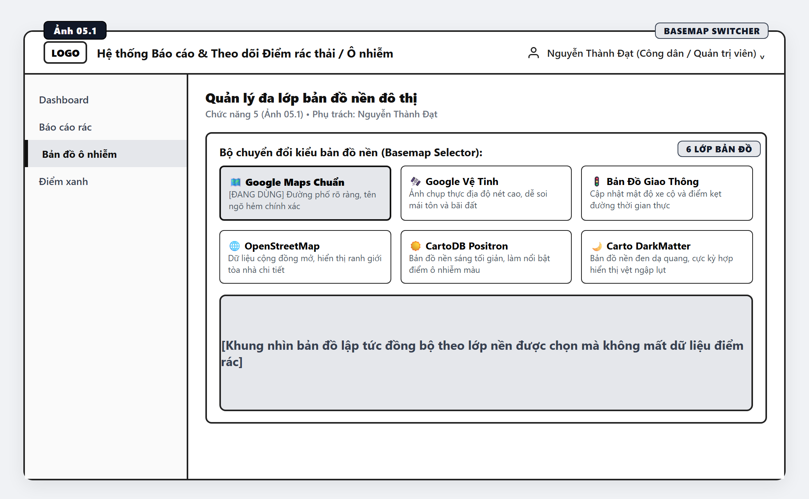
*Hình: Ảnh 05.1 - Quản lý đa lớp bản đồ nền đô thị (Thành viên: Nguyễn Thành Đạt)*

```text
+-------------------------------------------------------------------------------+
| CỤM CHỌN KIỂU BẢN ĐỒ NỀN ĐÔ THỊ:                                              |
| +------------------+ +------------------+ +------------------+                |
| | 🗺️ Google Maps   | | 🛰️ Google Vệ tinh| | 🚦 Giao thông    |                |
| | [ĐANG KÍCH HOẠT] | | Ảnh chụp thực tế | | Mật độ kẹt xe    |                |
| +------------------+ +------------------+ +------------------+                |
| +------------------+ +------------------+ +------------------+                |
| | 🌐 OpenStreetMap | | ☀️ Bản đồ sáng   | | 🌙 Bản đồ tối    |                |
| | Nguồn mở chi tiết| | CartoDB Positron | | Carto DarkMatter |                |
| +------------------+ +------------------+ +------------------+                |
+-------------------------------------------------------------------------------+
```
- **Thành phần UI:** Dãy nút bấm bo góc hiện đại dạng Segmented Control với trạng thái Active phát sáng viền.

---

### Ảnh 06: Giao diện Kết xuất Kiến trúc Tòa nhà 3D & Bộ chọn Màu sắc
- **STT Chức năng:** 6
- **Thành viên phụ trách:** Nguyễn Thành Đạt
- **Vị trí giao diện:** Thanh công cụ 3D + Dropdown Theme màu
- **Phác thảo bố cục (Wireframe):**


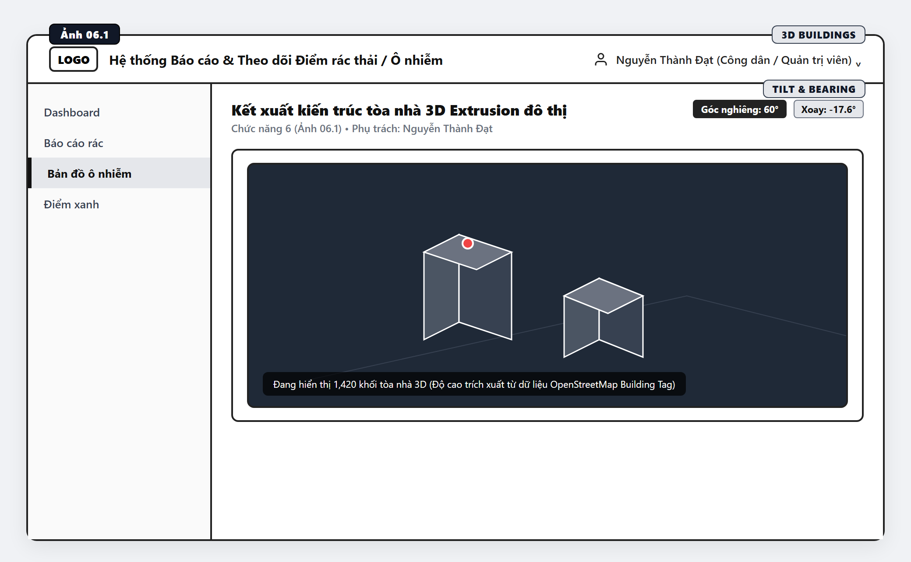
*Hình: Ảnh 06.1 - Kết xuất kiến trúc tòa nhà 3D Extrusion đô thị (Thành viên: Nguyễn Thành Đạt)*


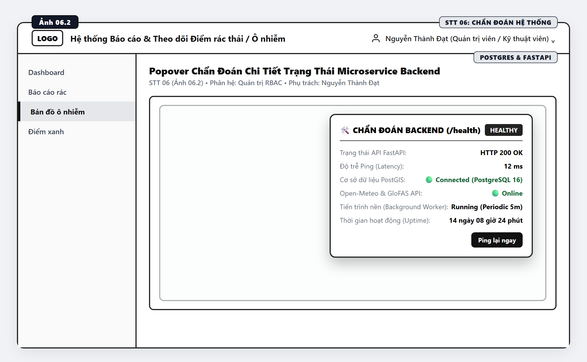
*Hình: Ảnh 06.2 - Bộ chọn chủ đề màu sắc tòa nhà 3D (Color Palettes) (Thành viên: Nguyễn Thành Đạt)*

```text
+-------------------------------------------------------------------------------+
| [🏢 CHẾ ĐỘ 3D: ĐANG BẬT]  [Góc nghiêng: 60°]  [Hướng xoay: -17.6°]             |
|                                                                               |
| MENU CHỌN MÀU SẮC TÒA NHÀ 3D:                                                 |
| +---------------------------------------------------------------------------+ |
| | (•) 🌈 Rainbow     - Đa sắc cầu vồng tự đổi màu theo độ cao tầng          | |
| | ( ) ⚡ Cyberpunk   - Tím dạ quang và Neon Blue phát sáng hiện đại          | |
| | ( ) 🌿 Emerald     - Xanh lá sinh thái thân thiện môi trường              | |
| | ( ) 🌇 Amber Gold  - Vàng cam ấm cúng phong cách hoàng hôn                 | |
| | ( ) 🏛️ Slate Grey  - Tối giản xám kim loại sang trọng                       | |
| +---------------------------------------------------------------------------+ |
|                                                                               |
|   [Hình minh họa: Các khối tòa nhà 3D Landmark 81 & Bitexco nổi trên nền]    |
+-------------------------------------------------------------------------------+
```
- **Thành phần UI:** Menu chọn màu popover, thanh trượt chỉnh góc nghiêng camera, hiệu ứng extrusion tòa nhà 3D.

---

### Ảnh 07: Giao diện Tùy chọn Gửi Ẩn danh & Bảo vệ Quyền Riêng tư GPS
- **STT Chức năng:** 7
- **Thành viên phụ trách:** Nguyễn Thành Đạt
- **Vị trí giao diện:** Phần chân form gửi báo cáo sự cố
- **Phác thảo bố cục (Wireframe):**


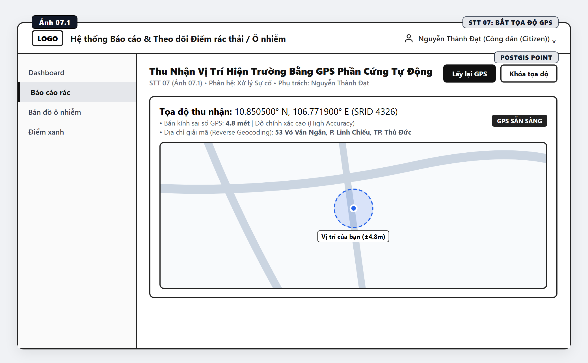
*Hình: Ảnh 07.1 - Tùy chọn gửi ẩn danh & Bảo vệ riêng tư (Spatial Jitter 50m) (Thành viên: Nguyễn Thành Đạt)*

```text
+-------------------------------------------------------------------------------+
| THIẾT LẬP BẢO MẬT & QUYỀN RIÊNG TƯ CÔNG DÂN:                                  |
|                                                                               |
| [ON] 🔒 GỬI BÁO CÁO Ở CHẾ ĐỘ ẨN DANH                                          |
|      - Ẩn hoàn toàn tên và thông tin tài khoản trên bản đồ công khai.         |
|      - Tự động làm mờ số điện thoại liên hệ: 0901 *** 004                     |
|                                                                               |
| [ON] 🌐 TỰ ĐỘNG LÀM NHIỄU TỌA ĐỘ GPS (SPATIAL JITTER BÁN KÍNH 50M)           |
|      - Làm lệch ngẫu nhiên vị trí ghim trong phạm vi 50m để bảo vệ            |
|        an toàn vị trí nhà riêng của người phản ánh.                           |
|                                                                               |
| [ Hủy bỏ ]                                   [ 🚀 GỬI BÁO CÁO NGAY BẢO MẬT ]  |
+-------------------------------------------------------------------------------+
```
- **Thành phần UI:** Công tắc gạt Toggle Switch xanh lá, biểu tượng ổ khóa bảo mật, tooltip giải thích cơ chế Spatial Jitter.

---

### Ảnh 08: Giao diện Hiển thị Lớp Ranh giới Hành chính 22 Quận/Huyện TP.HCM
- **STT Chức năng:** 8
- **Thành viên phụ trách:** Nguyễn Thành Đạt
- **Vị trí giao diện:** Lớp hiển thị ranh giới trên bản đồ số
- **Phác thảo bố cục (Wireframe):**


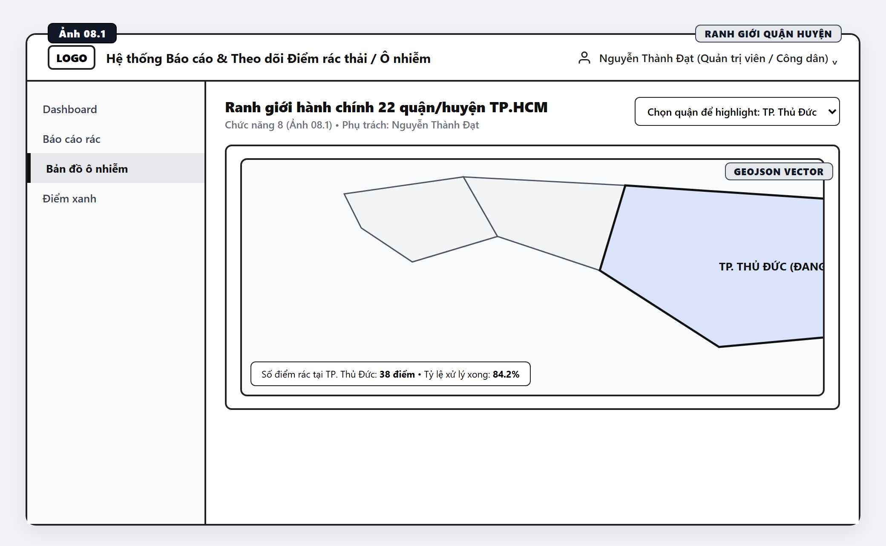
*Hình: Ảnh 08.1 - Hiển thị lớp ranh giới hành chính 22 quận/huyện TP.HCM (Thành viên: Nguyễn Thành Đạt)*

```text
+-------------------------------------------------------------------------------+
| [🗺️ WebGIS] [ Công tắc: BẬT RANH GIỚI KHU VỰC (22 Quận/Huyện/TP.Thủ Đức) ]     |
+-------------------------------------------------------------------------------+
|              +--------------------------+                                     |
|              |     TP. THỦ ĐỨC          |                                     |
|              |  Diện tích: 211.5 km²    |                                     |
|              |  Dân số: 1.200.000 người |                                     |
|        +-----+--------------------------+                                     |
|        | BÌNH THẠNH |                                                         |
|   +----+------------+-------+                                                 |
|   | Q.3|    QUẬN 1          |   (Đường viền ranh giới nét đứt màu xanh ngọc   |
|   +----+--------------------+    tỏa sáng bao quanh từng quận/huyện)          |
|        |   QUẬN 4   |                                                         |
|        +------------+                                                         |
+-------------------------------------------------------------------------------+
```
- **Thành phần UI:** Đa giác Polygon viền Cyan phát sáng, Tooltip hiển thị diện tích và dân số khi di chuột qua quận.

---

### Ảnh 09: Giao diện Tra cứu Mạng lưới Điểm Xanh & Trạm Thu gom Tái chế
- **STT Chức năng:** 9
- **Thành viên phụ trách:** Nguyễn Thành Đạt
- **Vị trí giao diện:** Thanh lọc danh mục + Panel danh sách địa điểm bên trái
- **Phác thảo bố cục (Wireframe):**


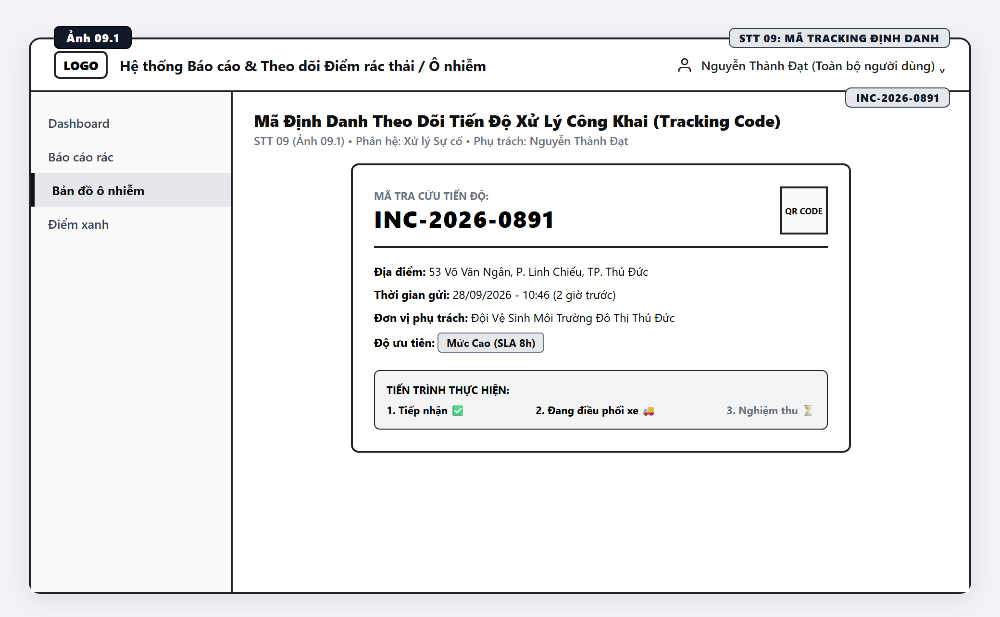
*Hình: Ảnh 09.1 - Mạng lưới điểm xanh & Trạm tái chế rác công cộng (Thành viên: Nguyễn Thành Đạt)*


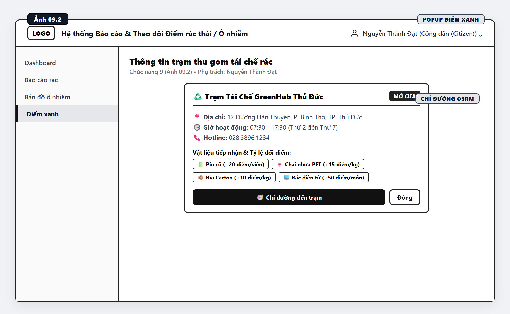
*Hình: Ảnh 09.2 - Popup chi tiết thông tin trạm tái chế & Tiếp nhận vật liệu (Thành viên: Nguyễn Thành Đạt)*

```text
+-------------------------------------------------------------------------------+
| BỘ LỌC ĐỊA ĐIỂM: [🍀 Không gian xanh (14)]  [♻️ Trạm tái chế rác (18)]         |
+-------------------------------------------------------------------------------+
| DANH SÁCH ĐỊA ĐIỂM XANH & TÁI CHẾ GẦN BẠN:                                   |
| +---------------------------------------------------------------------------+ |
| | ♻️ TRẠM THU GOM PIN CŨ & E-WASTE LINH TRUNG                   (Cách 450m) | |
| | 📍 UBND Phường Linh Trung, Đường số 7, TP. Thủ Đức                        | |
| | 🕒 Giờ mở cửa: 07:30 - 17:00 (T2 - T6)   |  📞 Hotline: 028.3896.0123     | |
| | 📦 Tiếp nhận: Pin cũ, Máy tính hỏng, Vỏ hộp sữa, Nhựa tái chế             | |
| | [ Chỉ đường ]  [ Chi tiết trạm ]                                          | |
| +---------------------------------------------------------------------------+ |
| | 🌳 CÔNG VIÊN LỊCH SỬ VĂN HÓA DÂN TỘC                       (Cách 1.8km)   | |
| | 📍 Phường Long Bình, TP. Thủ Đức  |  ⭐ Đánh giá: 4.8 / 5.0 (Rất trong lành) | |
| +---------------------------------------------------------------------------+ |
+-------------------------------------------------------------------------------+
```
- **Thành phần UI:** Thẻ Card bo góc hiển thị giờ mở cửa, loại rác tiếp nhận và nút chỉ đường nhanh.

---

### Ảnh 10: Giao diện Hỗ trợ Đa Ngôn ngữ Tự động (Song ngữ Việt - Anh)
- **STT Chức năng:** 10
- **Thành viên phụ trách:** Nguyễn Thành Đạt
- **Vị trí giao diện:** Nút chuyển ngôn ngữ ở Header và giao diện chuyển đổi i18n
- **Phác thảo bố cục (Wireframe):**


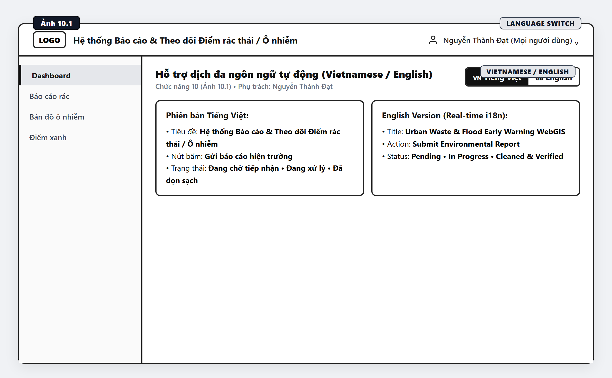
*Hình: Ảnh 10.1 - Hỗ trợ dịch đa ngôn ngữ tự động (Song ngữ Việt - Anh) (Thành viên: Nguyễn Thành Đạt)*

```text
+-------------------------------------------------------------------------------+
| [🗺️ EcoReport WebGIS]                        [🌐 Ngôn ngữ: 🇻🇳 Tiếng Việt v ]   |
|                                             |  🇻🇳 Tiếng Việt (Mặc định)    |   |
|                                             |  🇬🇧 English (International)  |   |
+-------------------------------------------------------------------------------+
| GIAO DIỆN CHUYỂN ĐỔI NGAY LẬP TỨC:                                            |
|                                                                               |
| [Tiếng Việt]                                 [English]                        |
| • Gửi Phản Ánh Ô Nhiễm Mới          ➔        • Submit Environmental Report    |
| • Cảnh báo ngập úng tuyến đường     ➔        • Flood Hazard Route Warning     |
| • Điểm rủi ro ô nhiễm: 78/100       ➔        • Pollution Risk Score: 78/100   |
| • Trạm tiếp nhận rác tái chế        ➔        • Recycling Collection Hub       |
+-------------------------------------------------------------------------------+
```
- **Thành phần UI:** Dropdown chọn cờ quốc gia, chuyển đổi ngôn ngữ tức thời không cần reload trang.

---

### Ảnh 11: Giao diện Tra cứu Khung Xử phạt Vi phạm Môi trường
- **STT Chức năng:** 11
- **Thành viên phụ trách:** Nguyễn Thành Đạt
- **Vị trí giao diện:** Modal Tra cứu Luật & Xử phạt (Nghị định 45/2022/NĐ-CP)
- **Phác thảo bố cục (Wireframe):**


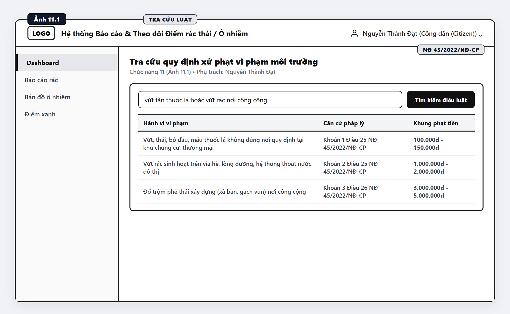
*Hình: Ảnh 11.1 - Tra cứu quy định pháp lý & Khung mức phạt (Nghị định 45/2022/NĐ-CP) (Thành viên: Nguyễn Thành Đạt)*

```text
+-------------------------------------------------------------------------------+
| ⚖️ TRA CỨU MỨC XỬ PHẠT VI PHẠM MÔI TRƯỜNG ĐÔ THỊ                      [X Đóng] |
| 🔍 [Nhập hành vi vi phạm: vứt rác, xà bần, tàn thuốc...                   ]   |
+-------------------------------------------------------------------------------+
| KẾT QUẢ THEO NGHỊ ĐỊNH 45/2022/NĐ-CP:                                         |
|                                                                               |
| 📜 ĐIỀU 26 KHOẢN 1 ĐIỂM C:                                                    |
| Hành vi: Vứt, thải rác sinh hoạt bừa bãi tại vỉa hè, lòng đường, hệ thống cống |
| 💰 Mức phạt tiền: 1.000.000 VNĐ ➔ 2.000.000 VNĐ                               |
| 🛠️ Biện pháp khắc phục: Buộc thu gom và khôi phục hiện trạng ban đầu          |
|                                                                               |
| 📜 ĐIỀU 26 KHOẢN 2:                                                           |
| Hành vi: Đổ trộm xà bần, phế thải xây dựng lấn chiếm lòng lề đường            |
| 💰 Mức phạt tiền: 10.000.000 VNĐ ➔ 20.000.000 VNĐ (Tịch thu phương tiện vi phạm)|
+-------------------------------------------------------------------------------+
```
- **Thành phần UI:** Thanh tìm kiếm từ khóa luật, khối thẻ hiển thị điều khoản và khung phạt tiền màu đỏ nổi bật.

---

### Ảnh 12: Giao diện Tối giản Trợ năng cho Người Cao tuổi & Quick Tour 3D
- **STT Chức năng:** 12
- **Thành viên phụ trách:** Nguyễn Thành Đạt
- **Vị trí giao diện:** Chế độ Easy Mode + Thanh Quick Tour địa danh ở đáy bản đồ
- **Phác thảo bố cục (Wireframe):**


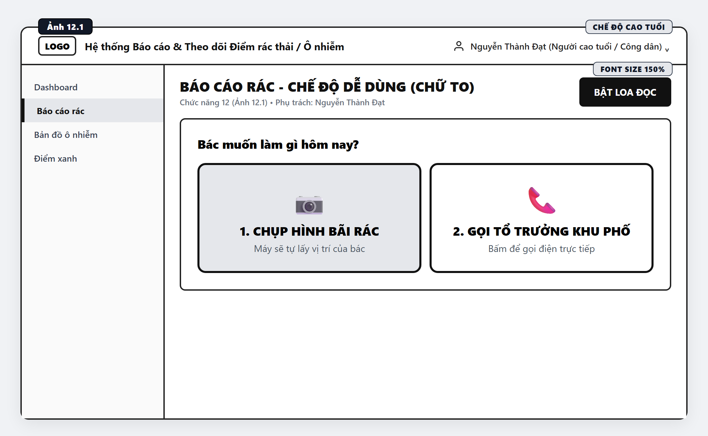
*Hình: Ảnh 12.1 - Chế độ giao diện đơn giản cho người cao tuổi (Accessible UI) (Thành viên: Nguyễn Thành Đạt)*


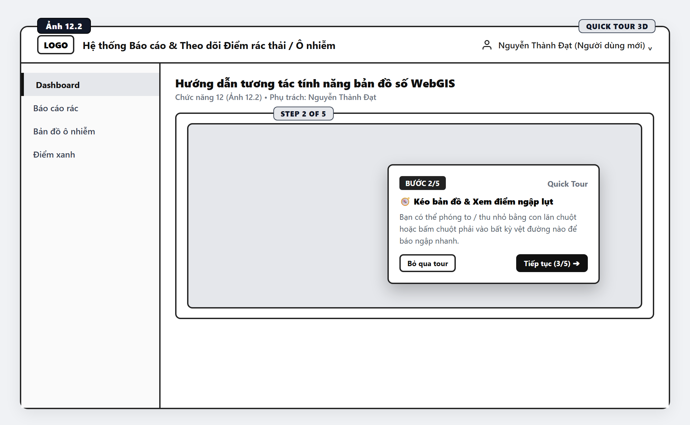
*Hình: Ảnh 12.2 - Hướng dẫn sử dụng tương tác Quick Tour 3D (Thành viên: Nguyễn Thành Đạt)*

```text
+-------------------------------------------------------------------------------+
| [ CHẾ ĐỘ DỄ DÙNG CHO NGƯỜI LỚN TUỔI - CHỮ TO RÕ ]             [⚙️ Cỡ chữ: + A] |
|                                                                               |
| +------------------------------------+  +------------------------------------+|
| | 📷 CHỤP ẢNH BÁO CÁO BÃI RÁC        |  | 🌊 BÁO ĐOẠN ĐƯỜNG ĐANG BỊ NGẬP     | |
| | (Nút bấm to bản - Thao tác 1 chạm) |  | (Bấm để báo nước ngập tức thì)     | |
| +------------------------------------+  +------------------------------------+|
|                                                                               |
| 🚀 KHÁM PHÁ NHANH ĐỊA DANH 3D TP. HỒ CHÍ MINH:                                |
| [ 🏙️ Landmark 81 ]  [ 🏢 Tháp Bitexco ]  [ 🦁 Thảo Cầm Viên ]  [ 🌳 Tao Đàn ] |
+-------------------------------------------------------------------------------+
```
- **Thành phần UI:** Các nút bấm cỡ lớn (High Accessibility Button), độ tương phản cao, thanh Quick Tour chuyển camera mượt mà.

---

## PHẦN 2: HUỲNH ANH TÚ (ẢNH 13 ➔ ẢNH 24)

---

### Ảnh 13: Giao diện Cơ chế Tích lũy Điểm thưởng Công dân Xanh
- **STT Chức năng:** 13
- **Thành viên phụ trách:** Huỳnh Anh Tú
- **Vị trí giao diện:** Popover thông báo tích điểm thưởng sau mỗi hành động bảo vệ môi trường
- **Phác thảo bố cục (Wireframe):**


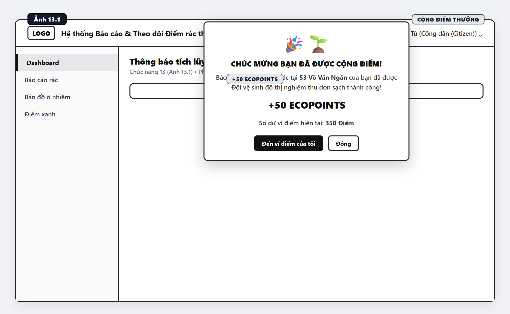
*Hình: Ảnh 13.1 - Cơ chế tích lũy Điểm thưởng Công dân Xanh (EcoPoints) (Thành viên: Huỳnh Anh Tú)*

```text
+-------------------------------------------------------------------------------+
| 🎉 CHÚC MỪNG BẠN VỪA NHẬN ĐƯỢC ĐIỂM THƯỞNG CÔNG DÂN XANH!                     |
|                                                                               |
|                 +--------------------------------+                            |
|                 |          + 20 ĐIỂM XANH        |                            |
|                 |    🌱 (Green Points Engine)    |                            |
|                 +--------------------------------+                            |
|                                                                               |
| Lý do tích điểm: Báo cáo sự cố rác sinh hoạt (#ECO-20260929-001) đã được duyệt|
| Tổng số dư ví điểm hiện tại: 280 Điểm Xanh                                   |
| [🎁 Xem danh mục quà có thể đổi ngay]             [ Đóng ]                    |
+-------------------------------------------------------------------------------+
```
- **Thành phần UI:** Popup chúc mừng rực rỡ, huy hiệu mầm cây xanh, nhãn điểm cộng nổi bật (+20).

---

### Ảnh 14: Giao diện Ví Điểm Thưởng & Lịch sử Biến động Điểm Xanh
- **STT Chức năng:** 14
- **Thành viên phụ trách:** Huỳnh Anh Tú
- **Vị trí giao diện:** Màn hình Ví Điểm Công Dân (Citizen Wallet Profile)
- **Phác thảo bố cục (Wireframe):**


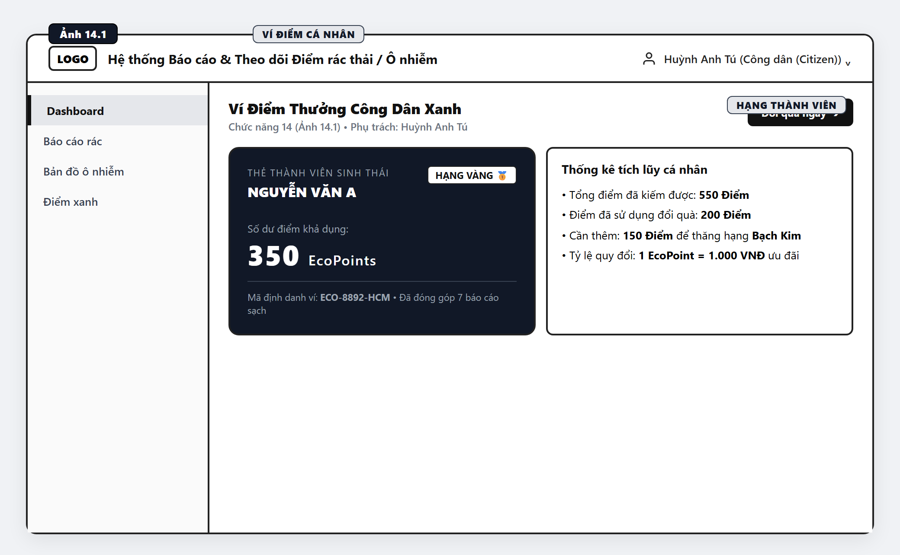
*Hình: Ảnh 14.1 - Quản lý ví điểm thưởng cá nhân & Thẻ EcoPoints (Thành viên: Huỳnh Anh Tú)*


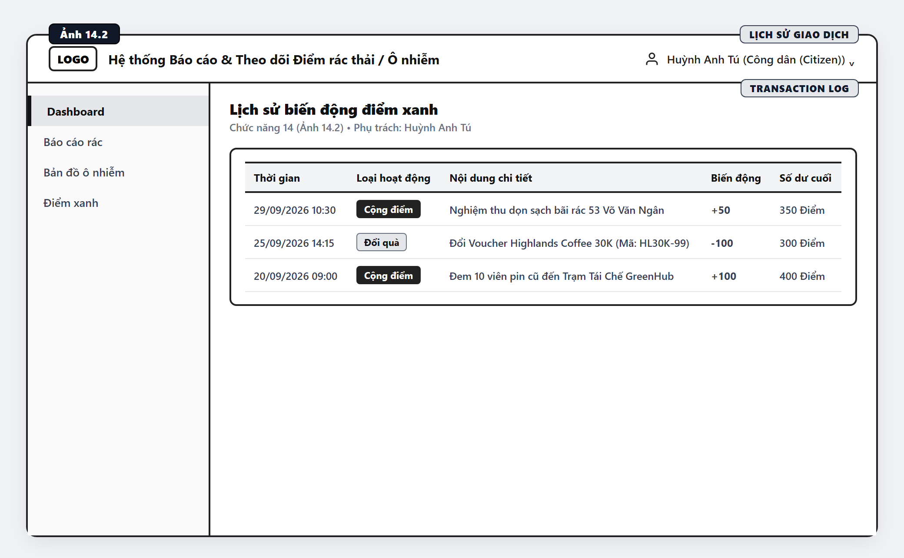
*Hình: Ảnh 14.2 - Lịch sử biến động điểm xanh (Point Transactions Log) (Thành viên: Huỳnh Anh Tú)*

```text
+-------------------------------------------------------------------------------+
| VÍ ĐIỂM CÔNG DÂN XANH: NGUYỄN THÀNH ĐẠT                             [Hạng: Vàng] |
| 💳 SỐ DƯ HIỆN TẠI: 280 ĐIỂM XANH  |  Tổng tích lũy cả năm: 540 Điểm            |
+-------------------------------------------------------------------------------+
| LỊCH SỬ BIẾN ĐỘNG ĐIỂM GẦN ĐÂY:                                               |
| • 29/09/2026 08:45 | Báo cáo bãi rác đường Lê Văn Chí được duyệt  | +20 Điểm  |
| • 28/09/2026 17:20 | Báo cáo đoạn đường Kha Vạn Cân bị ngập úng   | +15 Điểm  |
| • 25/09/2026 10:15 | Đổi quà: Bình giữ nhiệt Inox Eco 500ml       | -350 Điểm |
| • 20/09/2026 09:00 | Tham gia dọn rác kênh rạch cuối tuần         | +50 Điểm  |
+-------------------------------------------------------------------------------+
```
- **Thành phần UI:** Thẻ ngân hàng ảo hiển thị số dư, danh sách giao dịch có nhãn màu xanh lá (+) và đỏ (-).

---

### Ảnh 15: Giao diện Danh mục Quà tặng Xanh & Vật phẩm Quy đổi
- **STT Chức năng:** 15
- **Thành viên phụ trách:** Huỳnh Anh Tú
- **Vị trí giao diện:** Màn hình Gian Hàng Sinh Thái (Eco Gift Shop)
- **Phác thảo bố cục (Wireframe):**


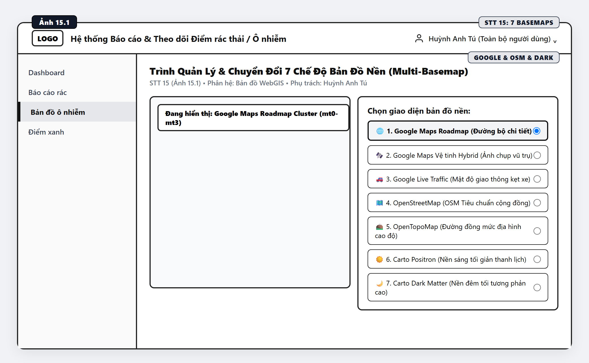
*Hình: Ảnh 15.1 - Danh mục quà tặng xanh & Vật phẩm quy đổi (Gian hàng) (Thành viên: Huỳnh Anh Tú)*

```text
+-------------------------------------------------------------------------------+
| 🎁 GIAN HÀNG ĐỔI QUÀ CÔNG DÂN XANH                       [Ví của bạn: 280 Điểm] |
+-------------------------------------------------------------------------------+
| +-------------------------+ +-------------------------+ +--------------------+|
| | [Ảnh: Túi vải Canvas]   | | [Ảnh: Chậu Cây Bàn]     | | [Ảnh: Bình Inox]   ||
| | Túi Vải Sống Xanh       | | Cây Lưỡi Hổ Để Bàn      | | Bình Giữ Nhiệt 500ml|
| | Cần: 150 Điểm Xanh      | | Cần: 200 Điểm Xanh      | | Cần: 350 Điểm Xanh ||
| | Tồn kho: Còn 50 cái     | | Tồn kho: Còn 40 chậu    | | Tồn kho: Còn 30 cái||
| | [ 🛍️ ĐỔI NGAY ]         | | [ 🛍️ ĐỔI NGAY ]         | | [🔒 Chưa đủ điểm]  ||
| +-------------------------+ +-------------------------+ +--------------------+|
+-------------------------------------------------------------------------------+
```
- **Thành phần UI:** Grid 3 cột sản phẩm quà tặng, trạng thái nút đổi quà tự động kiểm tra số dư ví điểm.

---

### Ảnh 16: Giao diện Thực hiện Đổi điểm Lấy Quà / Voucher Sinh thái
- **STT Chức năng:** 16
- **Thành viên phụ trách:** Huỳnh Anh Tú
- **Vị trí giao diện:** Modal Xác Nhận Đổi Quà & Sinh Mã Voucher
- **Phác thảo bố cục (Wireframe):**


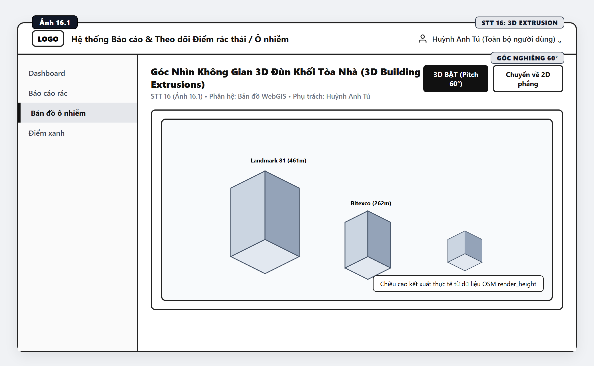
*Hình: Ảnh 16.1 - Thực hiện đổi điểm lấy quà tặng / Voucher (Modal xác nhận) (Thành viên: Huỳnh Anh Tú)*


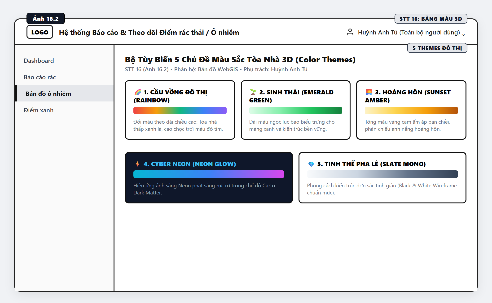
*Hình: Ảnh 16.2 - Thẻ mã QR Voucher ưu đãi được cấp để sử dụng tại quầy (Thành viên: Huỳnh Anh Tú)*

```text
+-------------------------------------------------------------------------------+
| XÁC NHẬN QUY ĐỔI VẬT PHẨM: TÚI VẢI CANVAS ECOREPORT                   [X Đóng] |
+-------------------------------------------------------------------------------+
| • Số điểm sẽ trừ: 150 Điểm Xanh                                               |
| • Số dư ví sau khi đổi: 130 Điểm Xanh                                         |
|                                                                               |
| [ Xác nhận quy đổi ] ➔ [ HỆ THỐNG SINH MÃ VOUCHER ĐIỆN TỬ ]:                  |
|                                                                               |
|           +---------------------------------------------+                     |
|           |  MÃ VOUCHER: ECO-GIFT-CANVAS-8899           |                     |
|           |  [ ||||||||||||||||||||||||||||||||||||| ]  |                     |
|           |  Hạn sử dụng: Đến hết ngày 31/12/2026       |                     |
|           +---------------------------------------------+                     |
| Địa điểm nhận: Trụ sở UBND Phường Linh Trung (Bộ phận Tiếp nhận & Trả kết quả)|
+-------------------------------------------------------------------------------+
```
- **Thành phần UI:** Modal xác nhận 2 bước, mã vạch Barcode và mã định danh quà tặng duy nhất.

---

### Ảnh 17: Giao diện Quản lý Danh sách Quà tặng Cá nhân Đã đổi
- **STT Chức năng:** 17
- **Thành viên phụ trách:** Huỳnh Anh Tú
- **Vị trí giao diện:** Tab "Quà Của Tôi" trong hồ sơ cá nhân
- **Phác thảo bố cục (Wireframe):**


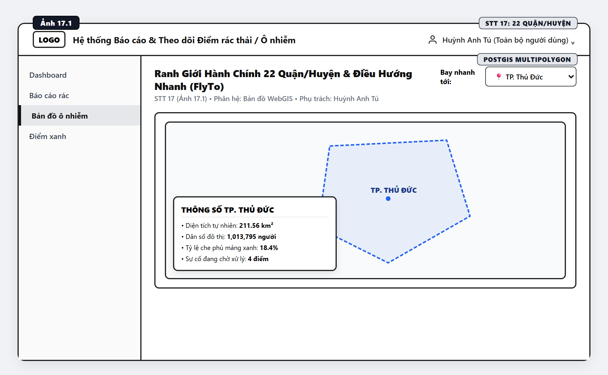
*Hình: Ảnh 17.1 - Kho quản lý quà tặng & Voucher cá nhân đã đổi (Thành viên: Huỳnh Anh Tú)*

```text
+-------------------------------------------------------------------------------+
| DANH SÁCH QUÀ TẶNG BẠN ĐÃ QUY ĐỔI:                                            |
|                                                                               |
| +---------------------------------------------------------------------------+ |
| | 🎁 TÚI VẢI CANVAS ECOREPORT               | Trạng thái: 🟡 CHƯA NHẬN       | |
| | Mã đổi quà: ECO-GIFT-CANVAS-8899          | Đổi ngày: 29/09/2026          | |
| | [📲 Mở mã QR quét nhận quà tại UBND]      | Địa điểm: UBND P. Linh Trung  | |
| +---------------------------------------------------------------------------+ |
| | 🍼 BÌNH GIỮ NHIỆT INOX ECO 500ML          | Trạng thái: 🟢 ĐÃ NHẬN        | |
| | Đã nhận vào ngày: 25/09/2026              | Cán bộ bàn giao: Huỳnh Anh Tú | |
| +---------------------------------------------------------------------------+ |
+-------------------------------------------------------------------------------+
```
- **Thành phần UI:** Danh thiếp quà tặng có Badge trạng thái màu (Vàng: Chưa nhận, Xanh: Đã nhận), nút bung QR Code.

---

### Ảnh 18: Giao diện Bảng Xếp hạng Vinh danh Top Công dân Xanh
- **STT Chức năng:** 18
- **Thành viên phụ trách:** Huỳnh Anh Tú
- **Vị trí giao diện:** Bảng Thi Đua Vinh Danh (Leaderboard)
- **Phác thảo bố cục (Wireframe):**


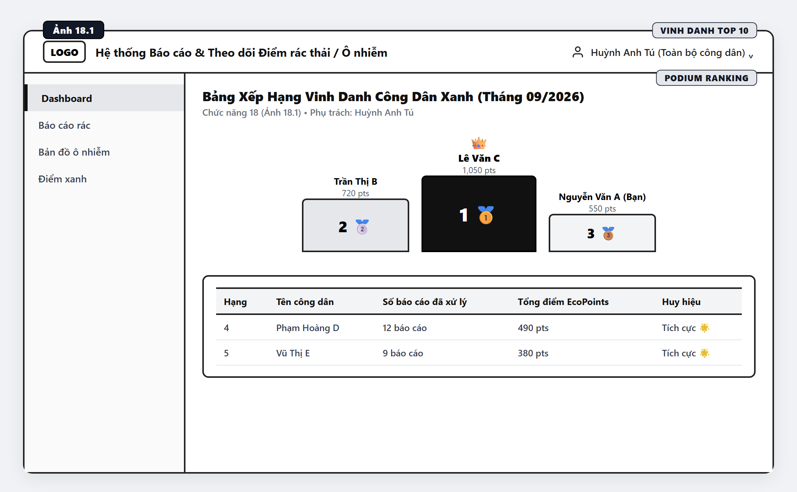
*Hình: Ảnh 18.1 - Bảng xếp hạng vinh danh Top Công dân Xanh (Leaderboard) (Thành viên: Huỳnh Anh Tú)*

```text
+-------------------------------------------------------------------------------+
| 🏆 BẢNG VINH DANH CÔNG DÂN XANH THÀNH PHỐ - THÁNG 09/2026                     |
+-------------------------------------------------------------------------------+
|  🥇 TOP 1: Bùi Nguyễn Minh Quân - 1.250 Điểm (Đã báo cáo & xử lý 42 sự cố)    |
|  🥈 TOP 2: Huỳnh Anh Tú         - 980 Điểm   (Đã báo cáo & xử lý 31 sự cố)    |
|  🥉 TOP 3: Nguyễn Thành Đạt     - 840 Điểm   (Đã báo cáo & xử lý 26 sự cố)    |
|                                                                               |
|  4. Lê Anh Tuấn      - 760 Điểm   |  5. Phạm Quốc Khánh  - 690 Điểm           |
|  6. Trương Quang Phát- 620 Điểm   |  7. Châu Huỳnh Phúc  - 580 Điểm           |
|                                                                               |
|  [ Vị trí của bạn: Hạng 3 / 1.450 Công dân tích cực ]                         |
+-------------------------------------------------------------------------------+
```
- **Thành phần UI:** Bục vinh danh Top 1, 2, 3 với huy hiệu Vàng, Bạc, Đồng; hiển thị vị trí xếp hạng của người dùng hiện tại.

---

### Ảnh 19: Giao diện Giám sát Mây Mưa Thời gian thực qua RainViewer Radar
- **STT Chức năng:** 19
- **Thành viên phụ trách:** Huỳnh Anh Tú
- **Vị trí giao diện:** Chế độ xem Bản đồ Radar Khí tượng (LiveWeatherRadarMap)
- **Phác thảo bố cục (Wireframe):**


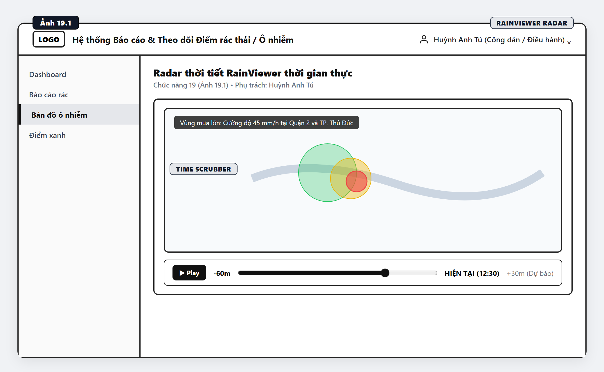
*Hình: Ảnh 19.1 - Giám sát mây mưa RainViewer Radar & Thanh phát lại thời gian thực (Thành viên: Huỳnh Anh Tú)*

```text
+-------------------------------------------------------------------------------+
| [🛰️ RADAR THỜI TIẾT RAINVIEWER]  [Thời gian: Trực tiếp - 08:45 GMT+7] [▶️ Play]|
+-------------------------------------------------------------------------------+
|                                    | CHÚ THÍCH PHẢN XẠ RADAR (dBZ):           |
|                                    | 🟦 Mưa nhẹ (10 - 20 dBZ)                 |
|      (Các khối mây dông màu đỏ cam | 🟩 Mưa vừa (20 - 35 dBZ)                 |
|       và xanh lá đang di chuyển    | 🟨 Mưa to (35 - 50 dBZ)                  |
|       vào khu vực TP.HCM)          | 🟧 Mưa rất to (50 - 60 dBZ)              |
|                                    | 🟥 Nguy cơ mưa đá / giông bão (> 60 dBZ) |
|                                    +------------------------------------------+
|                                                                               |
|  [<< -30p] [ -15p ] [ Hiện tại: 08:45 ] [ +15p dự báo ] [ +30p dự báo >>]     |
+-------------------------------------------------------------------------------+
```
- **Thành phần UI:** Bản đồ mây mưa viễn thám radar, thanh trượt thời gian Play/Pause xem hoạt ảnh di chuyển của mây dông.

---

### Ảnh 20: Giao diện Mô phỏng Động lực học Luồng Gió & Dòng Hạt Thời gian thực
- **STT Chức năng:** 20
- **Thành viên phụ trách:** Huỳnh Anh Tú
- **Vị trí giao diện:** Lớp phủ Gió & Streamlines trên bản đồ khí tượng
- **Phác thảo bố cục (Wireframe):**


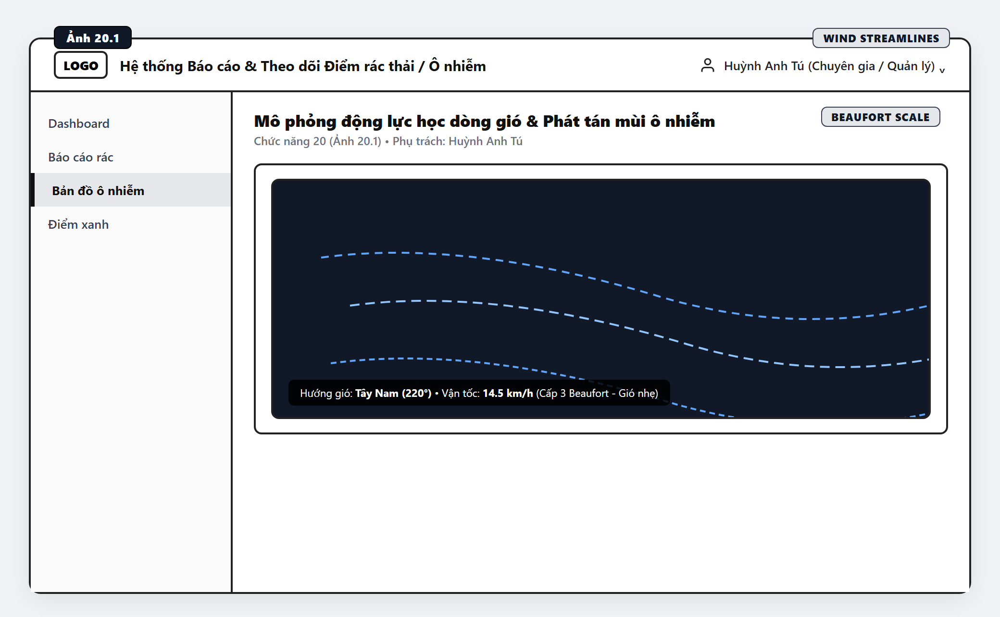
*Hình: Ảnh 20.1 - Mô phỏng động lực học luồng gió (Wind Streamlines) (Thành viên: Huỳnh Anh Tú)*

```text
+-------------------------------------------------------------------------------+
| [💨 LỚP PHỦ: GIÓ & DÒNG HẠT CHUYỂN ĐỘNG - WIND STREAMLINES]                   |
+-------------------------------------------------------------------------------+
|                                                                               |
|       ~~~~~~~~~>   ~~~~~~~~~>   ~~~~~~~~~>   (Hàng nghìn hạt gió phát sáng    |
|    ~~~~~~~~~>   ~~~~~~~~~>   ~~~~~~~~~>       chuyển động lượn sóng theo      |
|         ~~~~~~~~~>   ~~~~~~~~~>   ~~~~~~~~~>  hướng Tây Nam tốc độ 24 km/h)   |
|                                                                               |
| THANG TỐC ĐỘ GIÓ:                                                             |
| [ 0 km/h: Xanh lơ ] ➔ [ 15 km/h: Lục ] ➔ [ 35 km/h: Vàng ] ➔ [ 60+ km/h: Đỏ ] |
|                                                                               |
| Tọa độ trỏ chuột: 10.776° N, 106.700° E | Gió Tây Nam 21.5 km/h | Cấp 4       |
+-------------------------------------------------------------------------------+
```
- **Thành phần UI:** Hoạt ảnh dòng hạt (WebGL particles), thước đo dải màu tốc độ gió từ 0 đến trên 60 km/h.

---

### Ảnh 21: Giao diện Bộ Lớp Phủ Khí tượng Đa Thông số & Chuyển Vùng Quan Sát
- **STT Chức năng:** 21
- **Thành viên phụ trách:** Huỳnh Anh Tú
- **Vị trí giao diện:** Menu 8 Lớp Phủ Khí Tượng + Dãy phím tắt vùng miền
- **Phác thảo bố cục (Wireframe):**


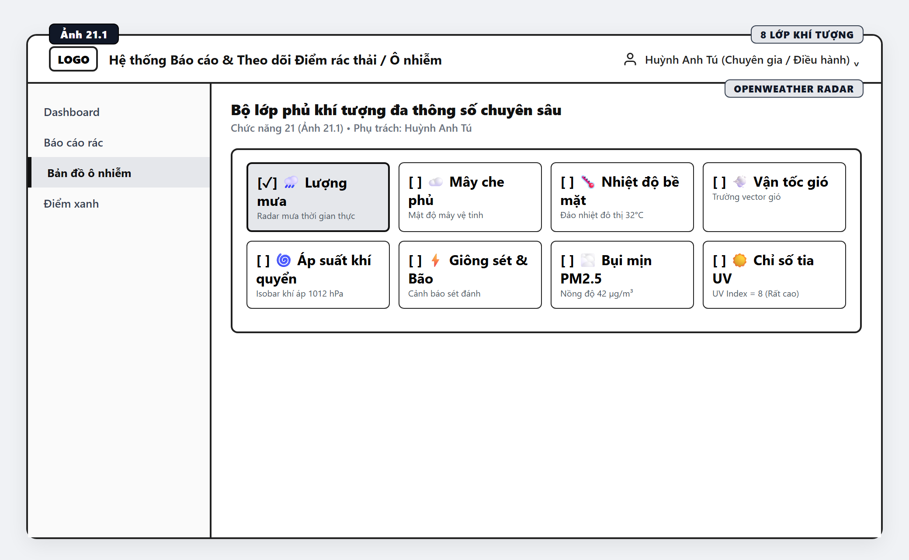
*Hình: Ảnh 21.1 - Bộ lớp phủ khí tượng đa thông số (8 lớp phủ chuyên sâu) (Thành viên: Huỳnh Anh Tú)*

```text
+-------------------------------------------------------------------------------+
| CHỌN LỚP PHỦ KHÍ TƯỢNG VẬT LÝ:                                                |
| [🌡️ Nhiệt độ] [💨 Gió] [🛰️ Radar] [🌧️ Mưa & Sét] [☁️ Mây] [🌊 Sóng] [🌀 Áp suất] |
+-------------------------------------------------------------------------------+
| PHÍM TẮT CHUYỂN VÙNG TRỌNG ĐIỂM CẢ NƯỚC:                                      |
| [🇻🇳 Toàn quốc] [🏙️ TP.HCM] [🏛️ Hà Nội] [🌊 Đà Nẵng] [🌾 Cần Thơ] [🏝️ Biển Đông] |
|                                                                               |
|    (Bản đồ tự động zoom và tải dữ liệu khí hậu theo đô thị được chọn)        |
+-------------------------------------------------------------------------------+
```
- **Thành phần UI:** Dãy nút icon tròn 8 lớp phủ, danh sách badge chuyển vùng quan sát nhanh các thành phố lớn.

---

### Ảnh 22: Giao diện Đánh giá Hài lòng Dịch vụ Công & Khảo sát Thông xe
- **STT Chức năng:** 22
- **Thành viên phụ trách:** Huỳnh Anh Tú
- **Vị trí giao diện:** Popup Khảo sát Hiện trường sau khi dọn rác / điểm ngập
- **Phác thảo bố cục (Wireframe):**


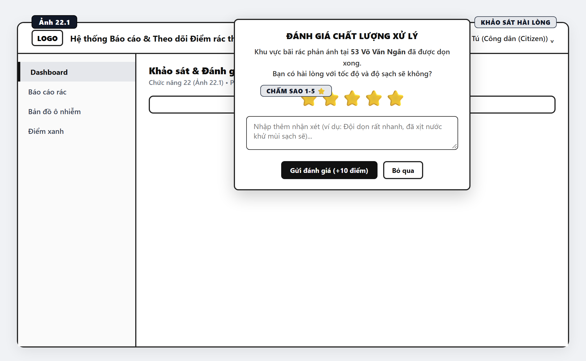
*Hình: Ảnh 22.1 - Đánh giá mức độ hài lòng (1-5 sao) sau khi dọn sạch (Thành viên: Huỳnh Anh Tú)*

```text
+-------------------------------------------------------------------------------+
| ĐÁNH GIÁ CHẤT LƯỢNG XỬ LÝ SỰ CỐ MÔI TRƯỜNG                            [X Đóng] |
+-------------------------------------------------------------------------------+
| Bạn đánh giá thế nào về kết quả dọn sạch bãi rác của Đội Thu gom số 1?        |
|                                                                               |
|                   ⭐ ⭐ ⭐ ⭐ ⭐ (5/5 Sao - Rất hài lòng)                     |
|                                                                               |
| Nhận xét của bạn:                                                             |
| [ Đội phản ứng nhanh chóng, thu gom sạch sẽ và đã rắc vôi khử khuẩn hôi!    ] |
|                                                                               |
| KHẢO SÁT LƯU THÔNG TẠI ĐIỂM NÀY:                                              |
| Xe máy có đi qua được không?  [✅ Có]  [❌ Không]                             |
| Ô tô con có đi qua được không? [✅ Có]  [❌ Không]                             |
| [ Gửi Đánh Giá ]                                                              |
+-------------------------------------------------------------------------------+
```
- **Thành phần UI:** Đánh giá sao tương tác (Star Rating), nút toggle Có/Không về khả năng thông xe.

---

### Ảnh 23: Giao diện Bản đồ Nhiệt Môi trường & Khí hậu Nội suy Đa Chế độ
- **STT Chức năng:** 23
- **Thành viên phụ trách:** Huỳnh Anh Tú
- **Vị trí giao diện:** Lớp hiển thị Heatmap Layer trên WebGIS
- **Phác thảo bố cục (Wireframe):**


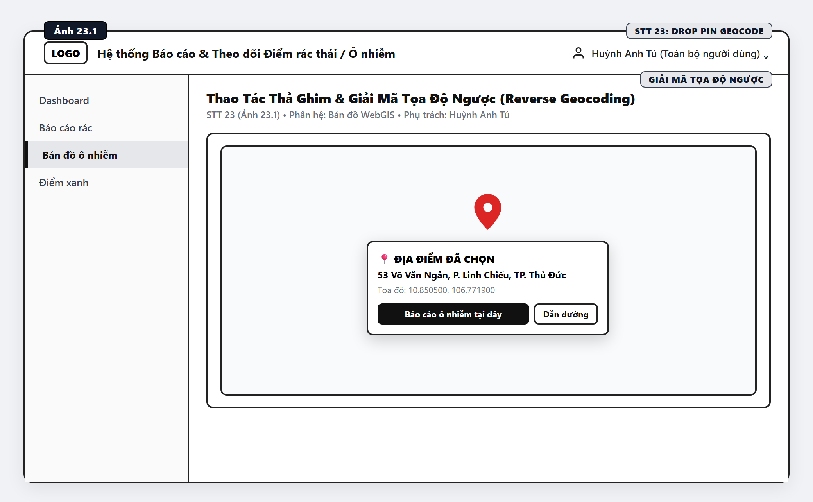
*Hình: Ảnh 23.1 - Bản đồ nhiệt môi trường nội suy không gian (Heatmap) (Thành viên: Huỳnh Anh Tú)*

```text
+-------------------------------------------------------------------------------+
| BẢN ĐỒ NHIỆT KHÍ HẬU & Ô NHIỄM ĐÔ THỊ (INTERPOLATED HEATMAP):                 |
+-------------------------------------------------------------------------------+
|                                                                               |
|       (Vùng trung tâm TP.HCM đỏ rực thể hiện nền nhiệt cao 34.5°C              |
|        và chỉ số ô nhiễm không khí AQI 142 - Kém;                             |
|        Vùng ven Cần Giờ xanh lục mát mẻ 28°C, AQI 35 - Tốt)                   |
|                                                                               |
| THƯỚC ĐO CHỈ SỐ AQI NỘI SUY:                                                  |
| 🟢 [0 - 50: Tốt]  🟡 [51 - 100: TB]  🟠 [101 - 150: Kém]  🔴 [151+: Nguy hại]  |
|                                                                               |
| Điểm kiểm tra: Trạm Linh Trung | AQI: 128 (Kém) | Nhiệt độ: 33.2°C           |
+-------------------------------------------------------------------------------+
```
- **Thành phần UI:** Lớp màu gradient nội suy mịn màng, thước màu thang đo AQI chuẩn WHO.

---

### Ảnh 24: Giao diện Cẩm nang Phân loại Rác & Kho Tri thức AI RAG
- **STT Chức năng:** 24
- **Thành viên phụ trách:** Huỳnh Anh Tú
- **Vị trí giao diện:** Thư viện Tri thức Sống Xanh (Knowledge Hub)
- **Phác thảo bố cục (Wireframe):**


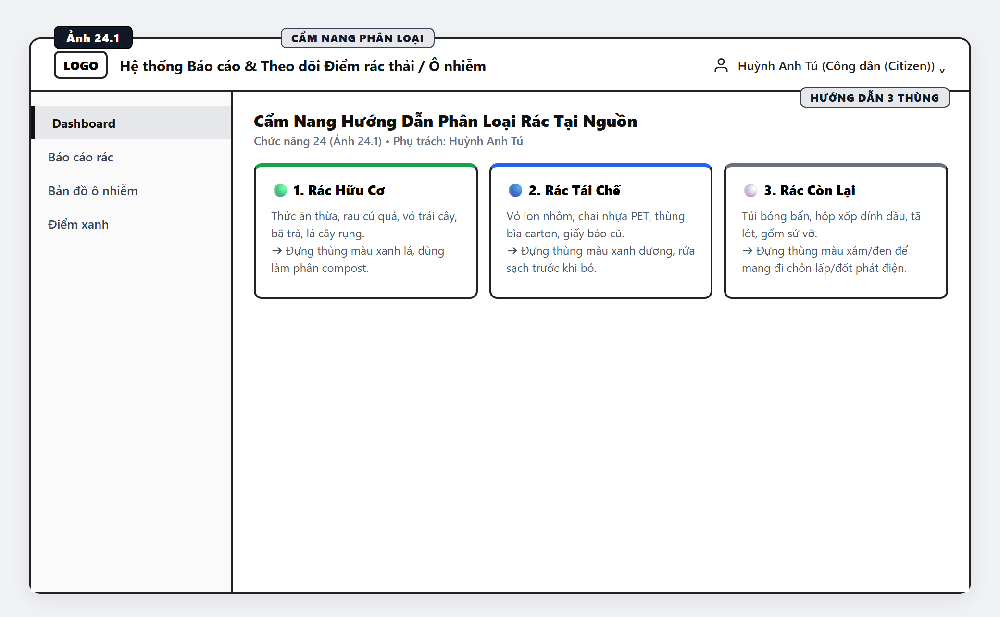
*Hình: Ảnh 24.1 - Cẩm nang hướng dẫn phân loại rác thải tại nguồn (Thành viên: Huỳnh Anh Tú)*


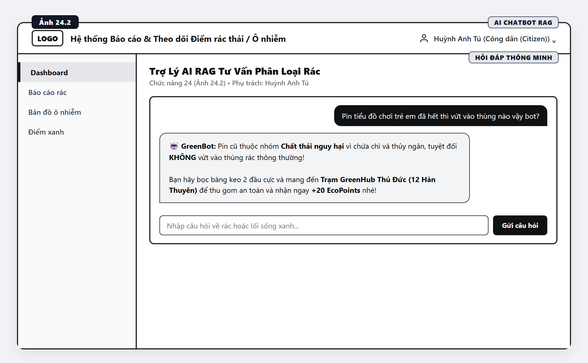
*Hình: Ảnh 24.2 - Trợ lý AI RAG tư vấn Sống xanh & Xử lý rác trực tuyến (Thành viên: Huỳnh Anh Tú)*

```text
+-------------------------------------------------------------------------------+
| 📚 CẨM NANG HƯỚNG DẪN PHÂN LOẠI RÁC TẠI NGUỒN TP. HỒ CHÍ MINH                  |
+-------------------------------------------------------------------------------+
| +-------------------------+ +-------------------------+ +--------------------+|
| | 🟢 RÁC HỮU CƠ           | | 🔵 RÁC TÁI CHẾ          | | 🔴 RÁC NGUY HẠI    ||
| | • Thức ăn thừa, rau củ  | | • Chai nhựa, lon nhôm   | | • Pin cũ, ắc quy   ||
| | • Vỏ trái cây, bã trà   | | • Giấy báo, thùng bìa   | | • Bóng đèn huỳnh   ||
| | • Bỏ vào thùng XANH LÁ  | | • Bỏ vào thùng XANH DƯƠNG| quang, chai hóa chất||
| | (Dùng ủ phân compost)   | | (Đưa đến trạm tái chế)  | | (Đến điểm thu gom) ||
| +-------------------------+ +-------------------------+ +--------------------+|
|                                                                               |
| 🤖 TRỢ LÝ AI RAG TƯ VẤN: "Vỏ hộp sữa có phải rác tái chế không?" ➔ "Đúng, hãy|
|    rửa sạch, ép dẹp và mang đến trạm tái chế để tích điểm đổi quà!"           |
+-------------------------------------------------------------------------------+
```
- **Thành phần UI:** Bảng màu 3 nhóm rác sinh động, khung chat hỏi đáp nhanh với Trợ lý AI môi trường.

---

## PHẦN 3: BÙI NGUYỄN MINH QUÂN (ẢNH 25 ➔ ẢNH 36)

---

### Ảnh 25: Giao diện Cổng Xác thực Tập trung Đa Nền tảng & Quản lý JWT
- **STT Chức năng:** 25
- **Thành viên phụ trách:** Bùi Nguyễn Minh Quân
- **Vị trí giao diện:** Màn hình Đăng Nhập Cổng Điều Hành Tập Trung (Login Portal)
- **Phác thảo bố cục (Wireframe):**


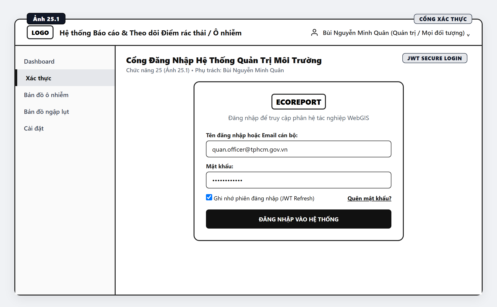
*Hình: Ảnh 25.1 - Cổng xác thực tập trung - Màn hình Đăng nhập & JWT (Thành viên: Bùi Nguyễn Minh Quân)*


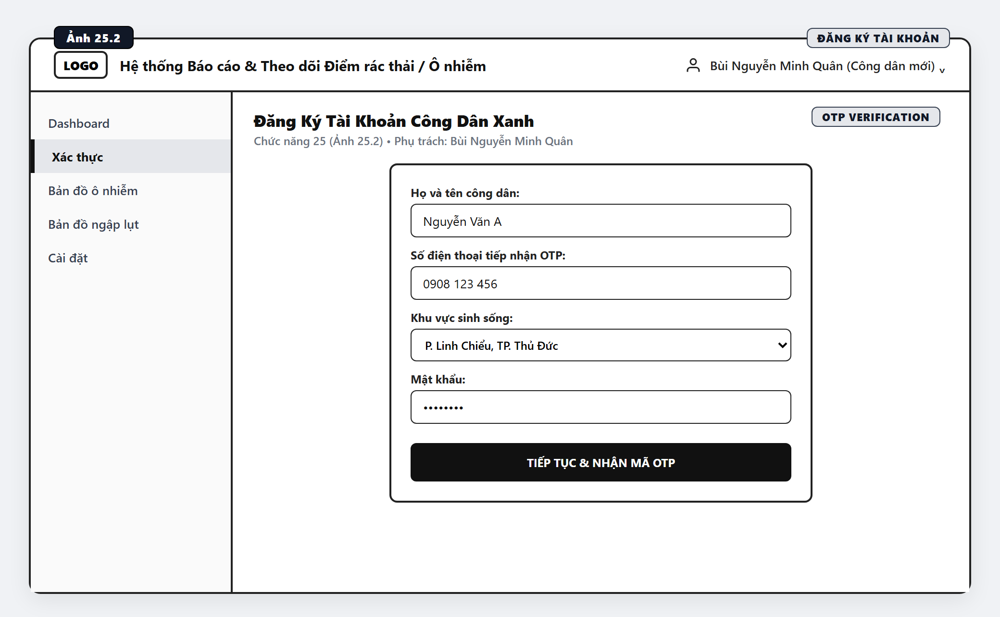
*Hình: Ảnh 25.2 - Cổng xác thực tập trung - Màn hình Đăng ký tài khoản công dân (Thành viên: Bùi Nguyễn Minh Quân)*

```text
+-------------------------------------------------------------------------------+
|                     CỔNG ĐIỀU HÀNH MÔI TRƯỜNG SỐ ECOREPORT                    |
|                                                                               |
|                       +-------------------------------+                       |
|                       |        ĐĂNG NHẬP HỆ THỐNG     |                       |
|                       | Email / Số điện thoại:        |                       |
|                       | [ admin@ecoreport.gov.vn    ] |                       |
|                       | Mật khẩu:                     |                       |
|                       | [ ****************          ] |                       |
|                       | [v] Ghi nhớ phiên đăng nhập   |                       |
|                       | [ 🚀 ĐĂNG NHẬP BẢO MẬT JWT  ] |                       |
|                       +-------------------------------+                       |
|                     Chuẩn mã hóa OAuth2 / BCrypt / RSA 256                    |
+-------------------------------------------------------------------------------+
```
- **Thành phần UI:** Form đăng nhập tinh tế, nút đăng nhập bảo mật, thông báo cấp phát phiên JWT Access/Refresh Token.

---

### Ảnh 26: Giao diện Quản trị Người dùng & Ma trận Phân quyền RBAC 4 Cấp
- **STT Chức năng:** 26
- **Thành viên phụ trách:** Bùi Nguyễn Minh Quân
- **Vị trí giao diện:** Bảng Quản Trị RBAC (Admin Role-Based Access Control)
- **Phác thảo bố cục (Wireframe):**


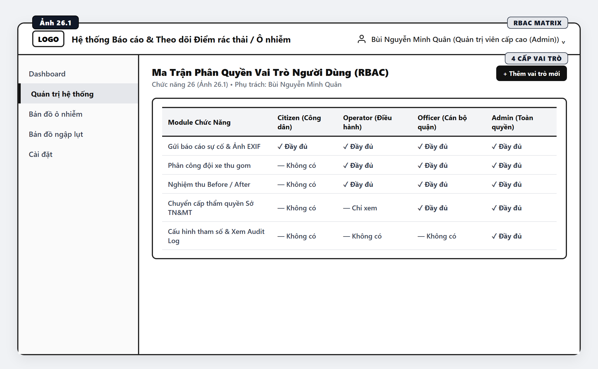
*Hình: Ảnh 26.1 - Quản trị người dùng & Ma trận phân quyền động RBAC (Thành viên: Bùi Nguyễn Minh Quân)*

```text
+-------------------------------------------------------------------------------+
| 👥 QUẢN TRỊ TÀI KHOẢN VÀ MA TRẬN PHÂN QUYỀN RBAC                              |
+-------------------------------------------------------------------------------+
| QUYỀN HẠN HỆ THỐNG      | ADMIN (Quản trị)| OFFICER (Cán bộ)| COLLECTOR (Đội xe)| CITIZEN (Dân)|
|-------------------------+-----------------+-----------------+-------------------+--------------|
| Báo cáo sự cố mới       |       [X]       |       [X]       |        [ ]        |     [X]      |
| Xác thực hiện trường    |       [X]       |       [X]       |        [ ]        |     [ ]      |
| Phân công đội thu gom   |       [X]       |       [X]       |        [ ]        |     [ ]      |
| Nghiệm thu đóng hồ sơ   |       [X]       |       [X]       |        [X]        |     [ ]      |
| Chuyển cấp hồ sơ        |       [X]       |       [X]       |        [ ]        |     [ ]      |
| Quản lý cấu hình & Logs |       [X]       |       [ ]       |        [ ]        |     [ ]      |
+-------------------------------------------------------------------------------+
```
- **Thành phần UI:** Bảng ma trận checkbox quyền hạn theo từng vai trò, nút lưu cấu hình tức thời.

---

### Ảnh 27: Giao diện Quản lý Năng lực Đội xe Thu gom & Điều phối Tài xế
- **STT Chức năng:** 27
- **Thành viên phụ trách:** Bùi Nguyễn Minh Quân
- **Vị trí giao diện:** Quản Lý Hậu Cần Đội Xe (Fleet Management Dashboard)
- **Phác thảo bố cục (Wireframe):**


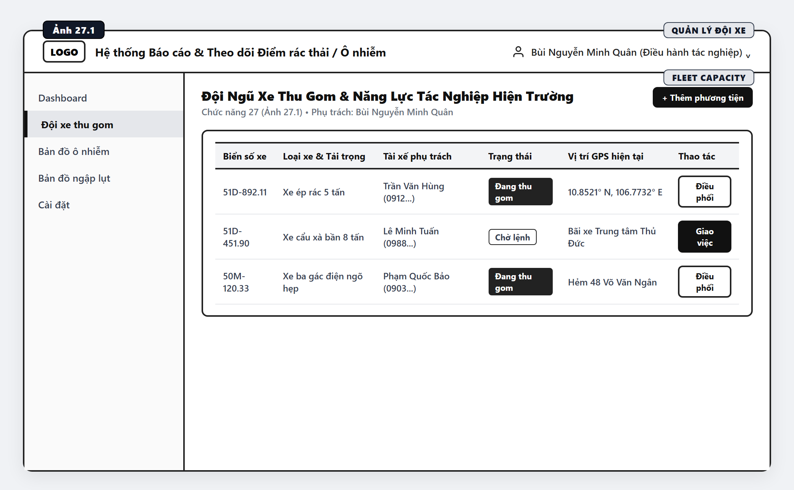
*Hình: Ảnh 27.1 - Quản lý năng lực đội xe thu gom rác & Tài xế hiện trường (Thành viên: Bùi Nguyễn Minh Quân)*

```text
+-------------------------------------------------------------------------------+
| 🚛 QUẢN LÝ ĐỘI XE THU GOM RÁC CƠ ĐỘNG                                          |
+-------------------------------------------------------------------------------+
| ĐỘI XE      | LOẠI XE          | BIỂN SỐ    | TẢI TRỌNG | ĐỘI TRƯỞNG  | TRẠNG THÁI  |
|-------------+------------------+------------+-----------+-------------+-------------|
| TEAM-TD-01  | Xe Ép Rác Lớn    | 51C-888.99 | 8.0 Tấn   | Lê Anh Tuấn | 🟢 SẴN SÀNG |
| TEAM-TD-02  | Canô Vớt Rác     | SG-6688    | 3.5 Tấn   | Trần Văn B  | 🟡 ĐANG ĐI  |
| TEAM-TD-03  | Xe Bán Tải Nhanh | 51B-999.11 | 2.0 Tấn   | Nguyễn Văn C| 🟢 SẴN SÀNG |
|                                                                               |
| [ + Thêm phương tiện mới ]   [ 📍 Xem vị trí đội xe trên bản đồ số GPS ]     |
+-------------------------------------------------------------------------------+
```
- **Thành phần UI:** Bảng danh mục xe chuyên dụng, cột tải trọng tấn, chỉ báo trạng thái sẵn sàng làm nhiệm vụ.

---

### Ảnh 28: Giao diện Hệ thống Nhật ký Kiểm toán An ninh (Audit Log)
- **STT Chức năng:** 28
- **Thành viên phụ trách:** Bùi Nguyễn Minh Quân
- **Vị trí giao diện:** Bảng Nhật Ký Kiểm Toán (Audit Trail)
- **Phác thảo bố cục (Wireframe):**


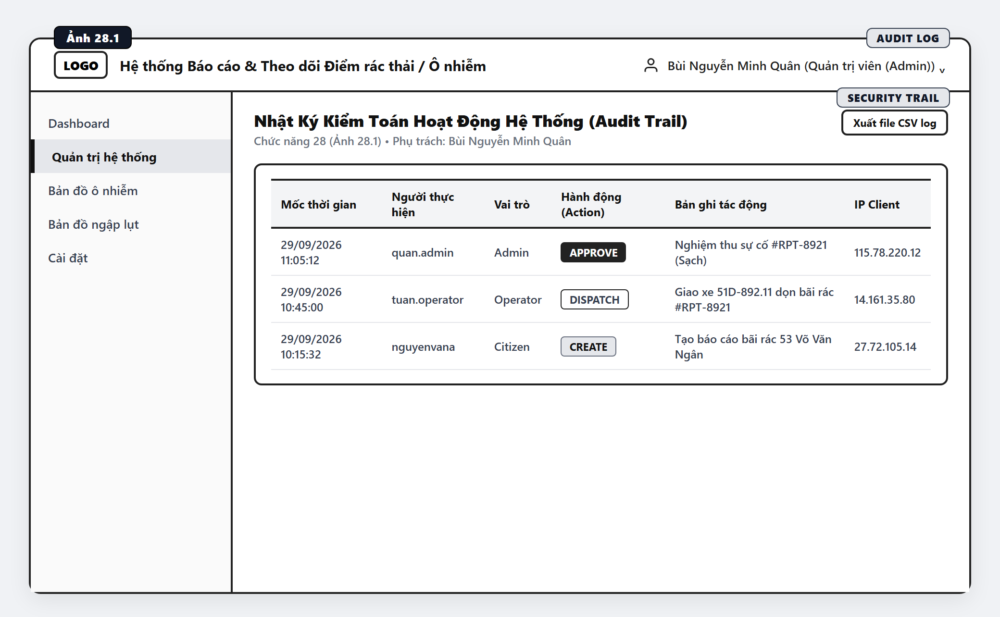
*Hình: Ảnh 28.1 - Nhật ký kiểm toán an ninh Audit Log và truy vết dữ liệu (Thành viên: Bùi Nguyễn Minh Quân)*

```text
+-------------------------------------------------------------------------------+
| 🛡️ NHẬT KÝ KIỂM TOÁN AN NINH HỆ THỐNG (AUDIT LOGS)                            |
+-------------------------------------------------------------------------------+
| THỜI GIAN       | NGƯỜI THỰC HIỆN | HÀNH ĐỘNG | ĐỐI TƯỢNG       | ĐỊA CHỈ IP     |
|-----------------+-----------------+-----------+-----------------+----------------|
| 29/09 08:50:12  | Huỳnh Anh Tú    | DISPATCH  | Sự cố ECO-001   | 113.161.42.10  |
| 29/09 08:35:00  | Nguyễn Thành Đạt| CREATE    | Báo cáo bãi rác | 171.244.18.5   |
| 28/09 16:20:00  | Bùi N.M. Quân   | UPDATE    | Ngưỡng SLA 18h  | 192.168.1.100  |
| 28/09 14:10:45  | Lê Anh Tuấn     | RESOLVE   | Nghiệm thu rác  | 113.161.42.12  |
|                                                                               |
| [ 🔍 Lọc theo User ]  [ 🔍 Lọc theo Hành động ]  [ 📥 Xuất file kiểm toán ]    |
+-------------------------------------------------------------------------------+
```
- **Thành phần UI:** Bảng nhật ký bất biến có gắn dấu thời gian, IP và chi tiết hành động CRUD.

---

### Ảnh 29: Giao diện Trung tâm Điều phối Tác nghiệp & Phân công Lệnh Hiện trường
- **STT Chức năng:** 29
- **Thành viên phụ trách:** Bùi Nguyễn Minh Quân
- **Vị trí giao diện:** Bảng Điều Hành Tác Nghiệp (Operations Dispatcher Center)
- **Phác thảo bố cục (Wireframe):**


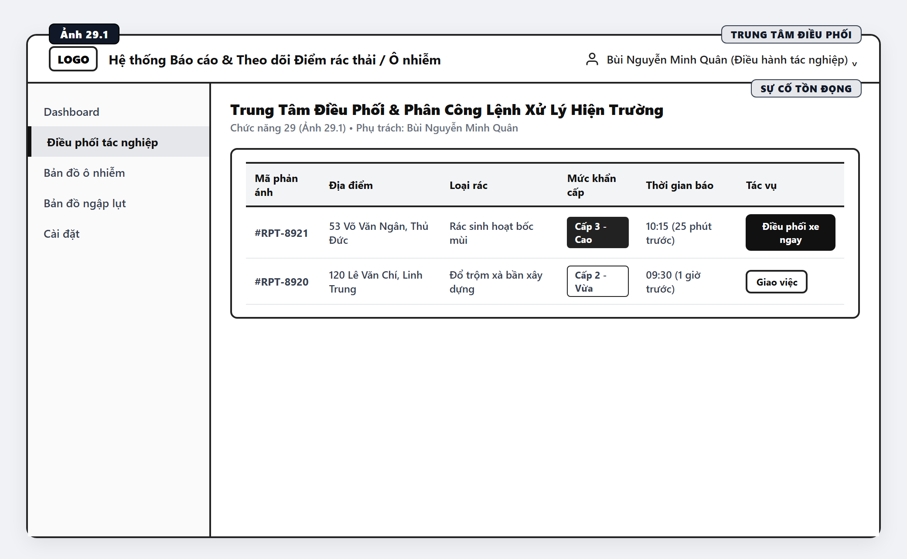
*Hình: Ảnh 29.1 - Trung tâm điều phối tác nghiệp & Danh sách sự cố tồn đọng (Thành viên: Bùi Nguyễn Minh Quân)*


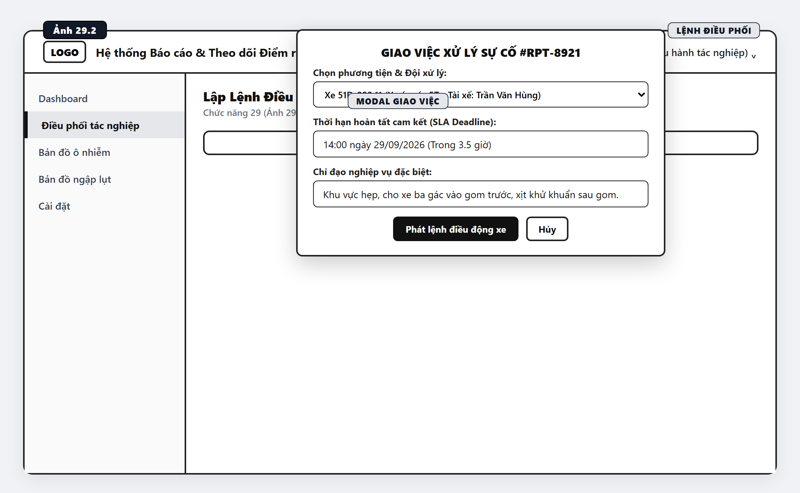
*Hình: Ảnh 29.2 - Modal phân công lệnh xử lý hiện trường cho tài xế (Thành viên: Bùi Nguyễn Minh Quân)*

```text
+-------------------------------------------------------------------------------+
| 🚨 TRUNG TÂM TIẾP NHẬN & PHÂN CÔNG ĐIỀU PHỐI HIỆN TRƯỜNG                      |
+-------------------------------------------------------------------------------+
| SỰ CỐ MỚI TIẾP NHẬN: Bãi rác tự phát đường Lê Văn Chí (#ECO-20260929-001)     |
| Địa điểm: P. Linh Trung, TP. Thủ Đức  |  Mức độ: MEDIUM  |  Khối lượng: 2.5 m³|
|                                                                               |
| CHỌN ĐỘI THU GOM PHÂN CÔNG:                                                   |
| [ (•) TEAM-TD-01: Đội Cơ động Linh Trung (Cách 800m - Xe ép rác 8 tấn)       ] |
| [ ( ) TEAM-TD-03: Đội Ứng phó Nhanh Khẩn cấp (Cách 2.4km - Xe bán tải 2 tấn) ] |
|                                                                               |
| Ghi chú lệnh điều phối: [ Cần xe ép rác chuyên dụng, thu dọn trước 12:00 trưa]|
| [ 🚀 PHÁT LỆNH ĐIỀU ĐỘNG HIỆN TRƯỜNG ]            [ Chuyển cấp hồ sơ ]        |
+-------------------------------------------------------------------------------+
```
- **Thành phần UI:** Khối phân công một chạm, gợi ý đội thu gom gần nhất, nút phát lệnh khẩn cấp.

---

### Ảnh 30: Giao diện Thẩm định Chất lượng & Nghiệm thu Đóng Hồ sơ (Before/After)
- **STT Chức năng:** 30
- **Thành viên phụ trách:** Bùi Nguyễn Minh Quân
- **Vị trí giao diện:** Màn hình So Sánh Nghiệm Thu Hiện Trường
- **Phác thảo bố cục (Wireframe):**


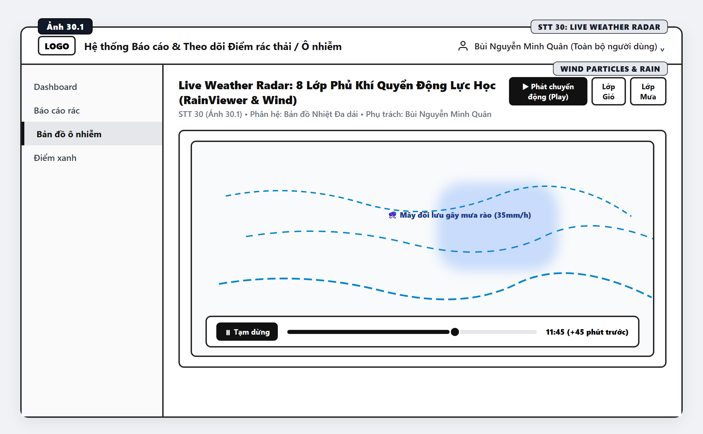
*Hình: Ảnh 30.1 - Thẩm định chất lượng xử lý & Nghiệm thu Trước/Sau (Before/After) (Thành viên: Bùi Nguyễn Minh Quân)*

```text
+-------------------------------------------------------------------------------+
| THẨM ĐỊNH & NGHIỆM THU HOÀN THÀNH SỰ CỐ: #ECO-20260929-001                   |
+-------------------------------------------------------------------------------+
| [ ẢNH KHI TIẾP NHẬN (BEFORE) ]         | [ ẢNH SAU KHI DỌN SẠCH (AFTER) ]     |
| +------------------------------------+ | +------------------------------------+|
| |                                    | | |                                    | |
| |  (Bãi rác sinh hoạt chất đống,    | | |  (Vỉa hè đã được dọn sạch bong,    | |
| |   nước rỉ rác tràn lan mặt đường)  | | |   đã khử khuẩn và rào chắn an toàn)| |
| +------------------------------------+ | +------------------------------------+|
| Thời gian chụp: 29/09 08:30            | Thời gian chụp: 29/09 10:45          |
| Đội thực hiện: TEAM-TD-01              | Đội trưởng nghiệm thu: Lê Anh Tuấn   |
|                                                                               |
| [ ❌ YÊU CẦU DỌN LẠI ]                 [ ✅ KÝ DUYỆT NGHIỆM THU HOÀN THÀNH ]  |
+-------------------------------------------------------------------------------+
```
- **Thành phần UI:** Khung so sánh Before/After đối xứng, nút ký duyệt nghiệm thu màu xanh lá.

---

### Ảnh 31: Giao diện Phân cấp Quản lý Hành chính Liên thông 3 Cấp
- **STT Chức năng:** 31
- **Thành viên phụ trách:** Bùi Nguyễn Minh Quân
- **Vị trí giao diện:** Modal Chuyển Cấp Hồ Sơ Thẩm Quyền (Escalation Modal)
- **Phác thảo bố cục (Wireframe):**


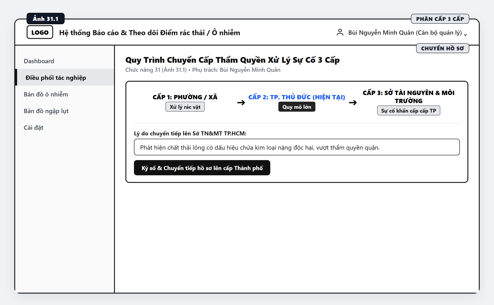
*Hình: Ảnh 31.1 - Phân cấp quản lý 3 cấp & Chuyển tiếp hồ sơ thẩm quyền (Thành viên: Bùi Nguyễn Minh Quân)*

```text
+-------------------------------------------------------------------------------+
| CHUYỂN TIẾP HỒ SƠ LÊN CƠ QUAN CẤP TRÊN THẨM QUYỀN                     [X Đóng] |
+-------------------------------------------------------------------------------+
| Hồ sơ hiện tại: Ô nhiễm nguồn nước kênh rạch liên quận (#ECO-20260929-004)    |
| Cấp tiếp nhận ban đầu: UBND Phường Linh Trung                                 |
|                                                                               |
| CHỌN ĐƠN VỊ HÀNH CHÍNH TIẾP NHẬN MỚI:                                         |
| [ ( ) Cấp Phường/Xã lân cận ]                                                 |
| [ (•) Phòng Tài nguyên & Môi trường TP. Thủ Đức (Cấp Quận/Huyện)              |
| [ ( ) Sở Tài nguyên & Môi trường TP. Hồ Chí Minh (Cấp Thành phố)              |
|                                                                               |
| Lý do chuyển tiếp: [ Vượt thẩm quyền cấp Phường do rác trôi liên địa bàn kênh ]|
| [ 📤 XÁC NHẬN CHUYỂN CẤP LIÊN THÔNG ]                                         |
+-------------------------------------------------------------------------------+
```
- **Thành phần UI:** Danh sách cấp bậc hành chính hình cây phân cấp, ô nhập lý do chuyển tiếp.

---

### Ảnh 32: Giao diện Giám sát Hạn mức Thời gian SLA Theo Thời gian thực
- **STT Chức năng:** 32
- **Thành viên phụ trách:** Bùi Nguyễn Minh Quân
- **Vị trí giao diện:** Đồng hồ đếm ngược SLA trên danh sách sự cố
- **Phác thảo bố cục (Wireframe):**


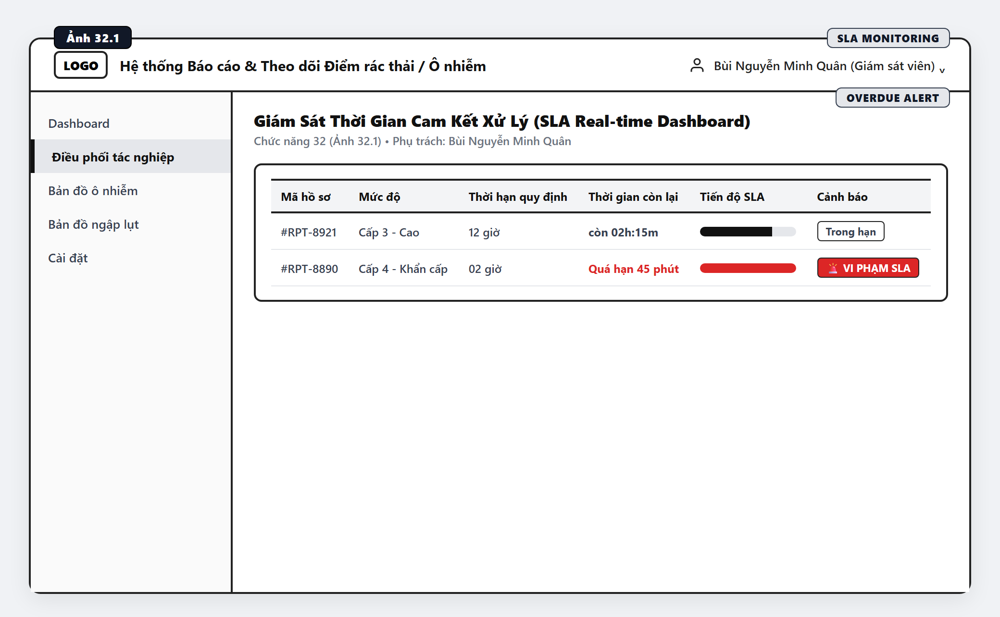
*Hình: Ảnh 32.1 - Giám sát hạn mức SLA thời gian thực & Cảnh báo trễ hạn (Thành viên: Bùi Nguyễn Minh Quân)*

```text
+-------------------------------------------------------------------------------+
| ⏱️ BẢNG THEO DÕI HẠN MỨC CAM KẾT XỬ LÝ SỰ CỐ ĐÔ THỊ (SLA MONITOR)             |
+-------------------------------------------------------------------------------+
| MÃ SỰ CỐ  | LOẠI RÁC       | HẠN MỨC SLA | THỜI GIAN CÒN LẠI | TRẠNG THÁI CẢNH BÁO|
|-----------+----------------+-------------+-------------------+----------------|
| ECO-001   | Cống nghẹt ngập| 18 Giờ      | ⏳ 03h 45m        | 🟡 CẢNH BÁO SẮP HẾT|
| ECO-002   | Hóa chất độc   | 12 Giờ      | ⏳ 01h 10m        | 🔴 KHẨN CẤP HẾT GIỜ|
| ECO-003   | Rác sinh hoạt  | 24 Giờ      | ⏳ 16h 30m        | 🟢 AN TOÀN TRONG HẠN|
| ECO-004   | Xà bần xây dựng| 72 Giờ      | ⚠️ ĐÃ QUÁ 02h 15m | 🚨 VI PHẠM TRỄ HẠN |
|                                                                               |
| *Chính sách phạt: Tự động cộng 1.5 Điểm phạt/giờ trễ vào đơn vị phụ trách*    |
+-------------------------------------------------------------------------------+
```
- **Thành phần UI:** Bảng SLA động, thanh tiến trình màu sắc co giãn theo thời gian thực.

---

### Ảnh 33: Giao diện Giám sát Mạng lưới Cảm biến Quan trắc Viễn trắc IoT
- **STT Chức năng:** 33
- **Thành viên phụ trách:** Bùi Nguyễn Minh Quân
- **Vị trí giao diện:** Bảng Quản Trị Trạm Cảm Biến IoT (IoT Sensor Stations)
- **Phác thảo bố cục (Wireframe):**


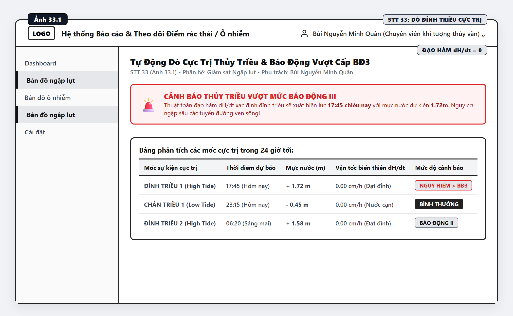
*Hình: Ảnh 33.1 - Giám sát mạng lưới trạm cảm biến viễn trắc IoT đô thị (Thành viên: Bùi Nguyễn Minh Quân)*

```text
+-------------------------------------------------------------------------------+
| 📡 MẠNG LƯỚI TRẠM QUAN TRẮC CẢM BIẾN VIỄN TRẮC IOT ĐÔ THỊ                     |
+-------------------------------------------------------------------------------+
| MÃ TRẠM        | TÊN TRẠM VÀ ĐỊA ĐIỂM      | LOẠI TRẠM      | NGUỒN | KẾT NỐI |
|----------------+---------------------------+----------------+-------+---------|
| IOT-AIR-LT-01  | Trạm Không Khí Linh Trung | Đo Bụi Mịn AQI | Solar | 🟢 ONLINE|
| IOT-FLD-HBC-02 | Trạm Đo Ngập Kha Vạn Cân  | Siêu Âm Nước   | Pin   | 🟢 ONLINE|
| TIDE-PA-01     | Trạm Thủy Văn Phú An      | Mực Nước Triều | Lưới  | 🟢 ONLINE|
|                                                                               |
| THÔNG SỐ TỨC THỜI TRẠM IOT-AIR-LT-01:                                         |
| • AQI: 72 (Trung bình) | PM2.5: 22.4 µg/m³ | Nhiệt độ: 31.8°C | Độ ẩm: 75%    |
+-------------------------------------------------------------------------------+
```
- **Thành phần UI:** Bảng trạng thái viễn trắc IoT, nhãn năng lượng mặt trời (Solar), card thông số realtime.

---

### Ảnh 34: Giao diện Tự động hóa Kết xuất Báo cáo Định kỳ (PDF/Excel)
- **STT Chức năng:** 34
- **Thành viên phụ trách:** Bùi Nguyễn Minh Quân
- **Vị trí giao diện:** Trung Tâm Xuất Báo Cáo Thống Kê
- **Phác thảo bố cục (Wireframe):**


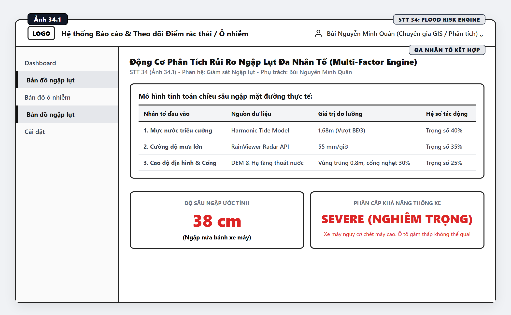
*Hình: Ảnh 34.1 - Tự động hóa kết xuất báo cáo thống kê định kỳ PDF/Excel (Thành viên: Bùi Nguyễn Minh Quân)*

```text
+-------------------------------------------------------------------------------+
| 📊 KẾT XUẤT BÁO CÁO MÔI TRƯỜNG ĐÔ THỊ ĐỊNH KỲ                                  |
+-------------------------------------------------------------------------------+
| KỲ BÁO CÁO: [ Tháng 09/2026 v ]    ĐƠN VỊ: [ Toàn TP. Thủ Đức v ]             |
|                                                                               |
| ĐỊNH DẠNG XUẤT FILE:                                                          |
| [ 📗 XUẤT FILE EXCEL (.XLSX) ]        [ 📕 XUẤT FILE PDF (.PDF) ]              |
| - Bảng chi tiết 150 sự cố             - Bản đồ phân bố ô nhiễm không gian     |
| - Danh sách phân công đội xe          - Biểu đồ tỷ lệ hoàn thành đúng hạn SLA |
| - Bảng chấm điểm phạt thi đua         - Báo cáo ký số gửi UBND Thành phố      |
|                                                                               |
| [ Tiến trình tạo báo cáo: 100% ] ➔ [ ⬇️ Tải file Bao_Cao_Thang_09_2026.pdf ]   |
+-------------------------------------------------------------------------------+
```
- **Thành phần UI:** Nút bấm xuất file màu xanh (Excel) và màu đỏ (PDF), thanh tiến trình render tài liệu.

---

### Ảnh 35: Giao diện Tuyến Lộ trình Thu gom Rác Cố định & Trạm Checkpoints
- **STT Chức năng:** 35
- **Thành viên phụ trách:** Bùi Nguyễn Minh Quân
- **Vị trí giao diện:** Quản Lý Tuyến Thu Gom (Waste Collection Routes)
- **Phác thảo bố cục (Wireframe):**


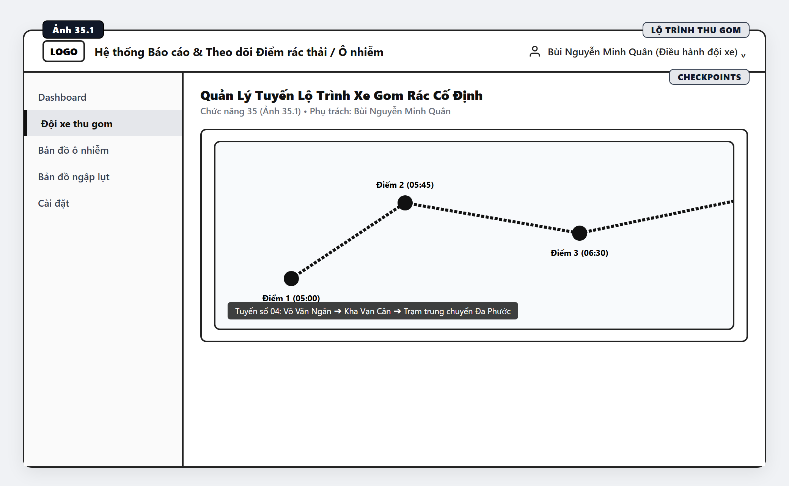
*Hình: Ảnh 35.1 - Quản lý tuyến lộ trình xe gom rác cố định và trạm dừng checkpoints (Thành viên: Bùi Nguyễn Minh Quân)*

```text
+-------------------------------------------------------------------------------+
| 🚛 TUYẾN THU GOM SÁNG: TRỤC CHÍNH LINH TRUNG (#ROUTE-LT-MORNING)              |
| Đội phụ trách: TEAM-TD-01 | Cự ly: 4.5 km | Thời gian: 90 phút | Lịch: 2,4,6,CN|
+-------------------------------------------------------------------------------+
| CÁC ĐIỂM DỪNG TIẾP NHẬN RÁC (CHECKPOINTS):                                    |
| 1. [06:00] Điểm dừng 01: Chợ Linh Trung, Lê Văn Chí       ➔ Dự kiến: 3.0 m³   |
| 2. [06:45] Điểm dừng 02: Ngã 3 Hoàng Diệu 2, Linh Trung   ➔ Dự kiến: 2.0 m³   |
| 3. [07:30] Điểm dừng 03: Cổng ĐH Khoa học Tự nhiên        ➔ Dự kiến: 1.5 m³   |
|                                                                               |
|   (Bản đồ vẽ đường Polyline tuyến xe rác chạy qua 3 điểm dừng đánh số 1,2,3) |
+-------------------------------------------------------------------------------+
```
- **Thành phần UI:** Danh sách điểm dừng theo dòng thời gian dọc (Vertical Timeline), tuyến đường màu cam trên bản đồ.

---

### Ảnh 36: Giao diện Cấu hình Tham số Hệ thống Động & Kiểm tra Health API
- **STT Chức năng:** 36
- **Thành viên phụ trách:** Bùi Nguyễn Minh Quân
- **Vị trí giao diện:** Bảng Cấu Hình Admin + Popover Diagnostic Health Check
- **Phác thảo bố cục (Wireframe):**


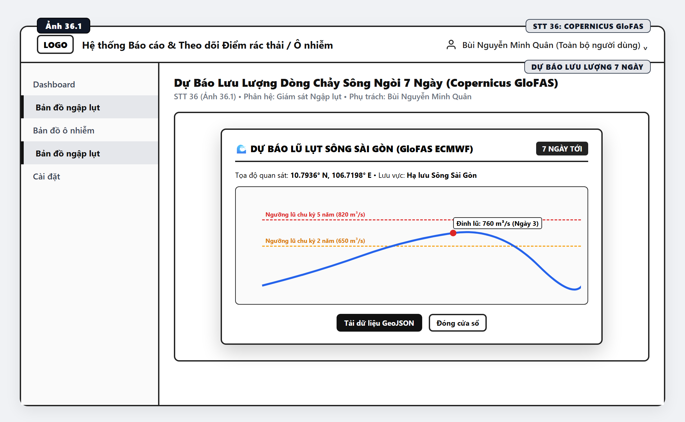
*Hình: Ảnh 36.1 - Bảng điều khiển tác nghiệp tổng quan Quản lý (Admin Dashboard) (Thành viên: Bùi Nguyễn Minh Quân)*


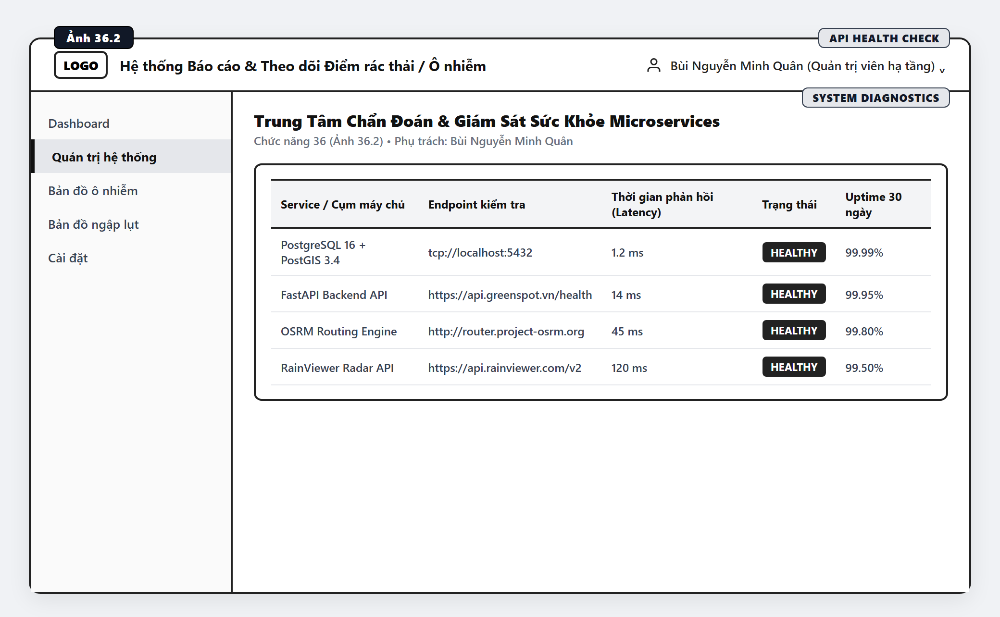
*Hình: Ảnh 36.2 - Trung tâm chẩn đoán sức khỏe hệ thống & Giám sát API Health Check (Thành viên: Bùi Nguyễn Minh Quân)*

```text
+-------------------------------------------------------------------------------+
| ⚙️ THIẾT LẬP THAM SỐ VẬN HÀNH HỆ THỐNG                                         |
+-------------------------------------------------------------------------------+
| • Vĩ độ trung tâm WebGIS mặc định : [ 10.849409          ]                    |
| • Kinh độ trung tâm WebGIS mặc định: [ 106.758414         ]                    |
| • Mức thu phóng ban đầu (Zoom)    : [ 14                 ]                    |
| • Dung lượng tệp tải lên tối đa   : [ 25 MB              ]                    |
| • Đường dây nóng khẩn cấp         : [ 1800-1090          ]                    |
|                                                                               |
| [💾 LƯU CẤU HÌNH HỆ THỐNG]                                                     |
|                                                                               |
| 🩺 KIỂM TRA SỨC KHỎE MICROSERVICE BACKEND FASTAPI:                            |
| [ Ping /health ] ➔ Trạng thái: 🟢 Online ({"status": "ok", "latency": "18ms"})|
+-------------------------------------------------------------------------------+
```
- **Thành phần UI:** Form quản trị tham số, nút Ping API kèm badge trạng thái xanh (Online) / đỏ (Offline).

---

## PHẦN 4: LÊ ANH TUẤN (ẢNH 37 ➔ ẢNH 48)

---

### Ảnh 37: Giao diện Cơ chế Tính Điểm Rủi ro Risk Score Cho Từng Sự Cố
- **STT Chức năng:** 37
- **Thành viên phụ trách:** Lê Anh Tuấn
- **Vị trí giao diện:** Bảng Phân Tích Thuật Toán Risk Score trong chi tiết sự cố
- **Phác thảo bố cục (Wireframe):**


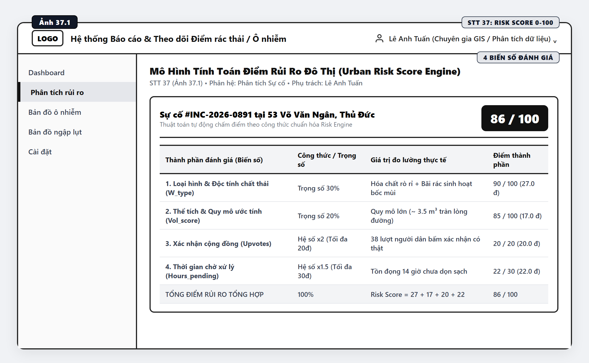
*Hình: Ảnh 37.1 - Cơ chế tính điểm rủi ro Risk Score (0-100) cho từng sự cố (Thành viên: Lê Anh Tuấn)*

```text
+-------------------------------------------------------------------------------+
| 🧮 MÔ HÌNH TÍNH ĐIỂM RỦI RO ĐA YẾU TỐ (RISK SCORE ENGINE)                     |
+-------------------------------------------------------------------------------+
| Sự cố: Bãi rác sinh hoạt đường Lê Văn Chí (#ECO-20260929-001)                 |
|                                                                               |
| THÀNH PHẦN TRỌNG SỐ TÍNH TOÁN:                                                |
| • Mức độ độc hại chất thải (Severity w1)  : 30 / 40 Điểm                     |
| • Khối lượng rác phát sinh (Volume w2)    : 18 / 20 Điểm                     |
| • Khoảng cách đến Bệnh viện (Distance w3) : 22 / 30 Điểm (Cách viện 200m)    |
| • Số lượt cộng đồng đồng thuận (Upvote w4): 08 / 10 Điểm (14 lượt)           |
|-------------------------------------------------------------------------------|
| 🎯 ĐIỂM SỐ RỦI RO TỔNG HỢP: [ 78.00 / 100 ] ➔ XẾP HẠNG: CAO (HIGH PRIORITY)  |
+-------------------------------------------------------------------------------+
```
- **Thành phần UI:** Bảng phân rã 4 trọng số, thanh Gauge đo điểm số rủi ro từ 0 đến 100.

---

### Ảnh 38: Giao diện Động cơ Giải tích Sóng Triều Harmonic Tide Engine Phú An
- **STT Chức năng:** 38
- **Thành viên phụ trách:** Lê Anh Tuấn
- **Vị trí giao diện:** Widget Thủy Triều & Cảnh Báo Triều Cường Đô Thị
- **Phác thảo bố cục (Wireframe):**


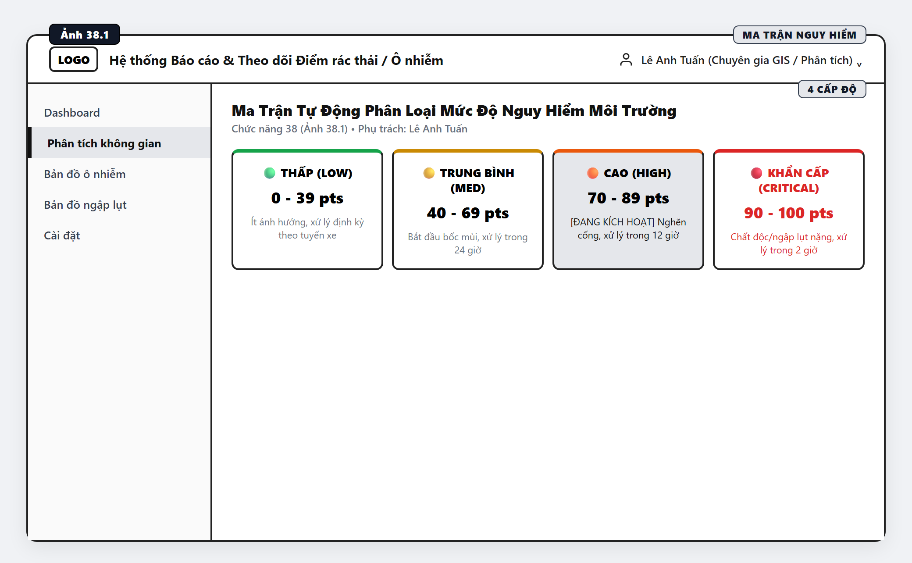
*Hình: Ảnh 38.1 - Tự động phân loại mức độ nguy hiểm: Thấp, Trung bình, Cao, Khẩn cấp (Thành viên: Lê Anh Tuấn)*

```text
+-------------------------------------------------------------------------------+
| 🌊 ĐỘNG CƠ GIẢI TÍCH SÓNG TRIỀU THỜI GIAN THỰC (HARMONIC TIDE ENGINE)         |
| Trạm Thủy văn Phú An - Sông Sài Gòn | Thuật toán sóng M2, S2, K1, O1 thuần Python|
+-------------------------------------------------------------------------------+
|                                                                               |
|   MỰC NƯỚC HIỆN TẠI: [ 1.58 Mét ] ➔ CẢNH BÁO: 🟠 BÁO ĐỘNG II                  |
|   Trạng thái con nước: 📈 NƯỚC ĐANG LÊN (RISING TIDE)                         |
|                                                                               |
| DỰ BÁO CỰC TRỊ CON NƯỚC TIẾP THEO:                                            |
| • 🔺 ĐỈNH TRIỀU (High Tide): 1.63m (Vượt Báo Động III) vào lúc 17:30 chiều nay |
| • 🔻 CHÂN TRIỀU (Low Tide) : 0.42m vào lúc 23:15 đêm nay                      |
|                                                                               |
| *Khuyến cáo: Nguy cơ ngập sâu các tuyến đường ven sông: Trần Xuân Soạn, Q.7*  |
+-------------------------------------------------------------------------------+
```
- **Thành phần UI:** Đồng hồ đo mực nước thủy triều, biểu tượng sóng triều dâng/rút, nhãn cấp báo động I, II, III.

---

### Ảnh 39: Giao diện Dự báo Chuỗi Thời gian Dao động Thủy triều 24h - 48h
- **STT Chức năng:** 39
- **Thành viên phụ trách:** Lê Anh Tuấn
- **Vị trí giao diện:** Biểu đồ đường dao động sóng triều trên WebGIS
- **Phác thảo bố cục (Wireframe):**


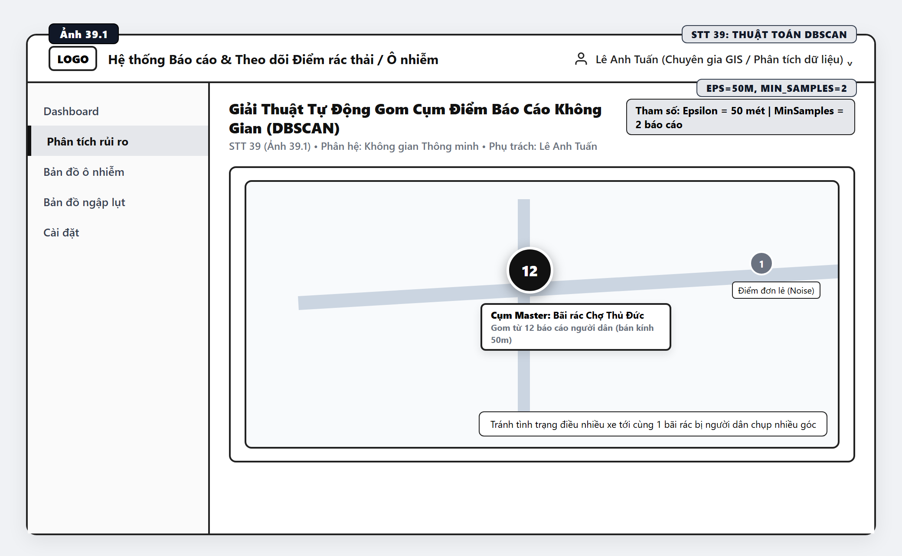
*Hình: Ảnh 39.1 - Phát hiện và gom cụm các báo cáo theo tọa độ (DBSCAN Clustered Markers) (Thành viên: Lê Anh Tuấn)*

```text
+-------------------------------------------------------------------------------+
| 📈 BIỂU ĐỒ CHUỖI THỜI GIAN DỰ BÁO MỰC NƯỚC TRIỀU CƯỜNG (24H - 48H)            |
+-------------------------------------------------------------------------------+
| Mực nước (m)                                                                  |
|  1.8m + - - - - - - - - - - - - - - - - - - - - - - (Ngưỡng Báo động III: 1.6m|
|  1.6m |            /\                    /\                                   |
|  1.4m |-----------/--\------------------/--\------- (Ngưỡng Báo động I: 1.4m)  |
|  1.2m |          /    \                /    \                                 |
|  0.8m |         /      \              /      \                                |
|  0.4m |        /        \            /        \                               |
|  0.0m +-------/----------\----------/----------\--------------------------->  |
|       00h    06h        12h        18h        24h       30h       36h (Giờ)   |
|               ^ Đỉnh triều 1 (1.63m)           ^ Đỉnh triều 2 (1.59m)         |
+-------------------------------------------------------------------------------+
```
- **Thành phần UI:** Đồ thị sóng sin hình sin uốn lượn liên tục, các đường kẻ ngang đứt nét biểu diễn 3 mốc báo động.

---

### Ảnh 40: Giao diện Tích hợp Đa nguồn Dữ liệu Ngập lụt Đô thị (3 Nguồn)
- **STT Chức năng:** 40
- **Thành viên phụ trách:** Lê Anh Tuấn
- **Vị trí giao diện:** Panel Tổng Hợp Dữ Liệu Ngập Lụt Đa Nguồn
- **Phác thảo bố cục (Wireframe):**


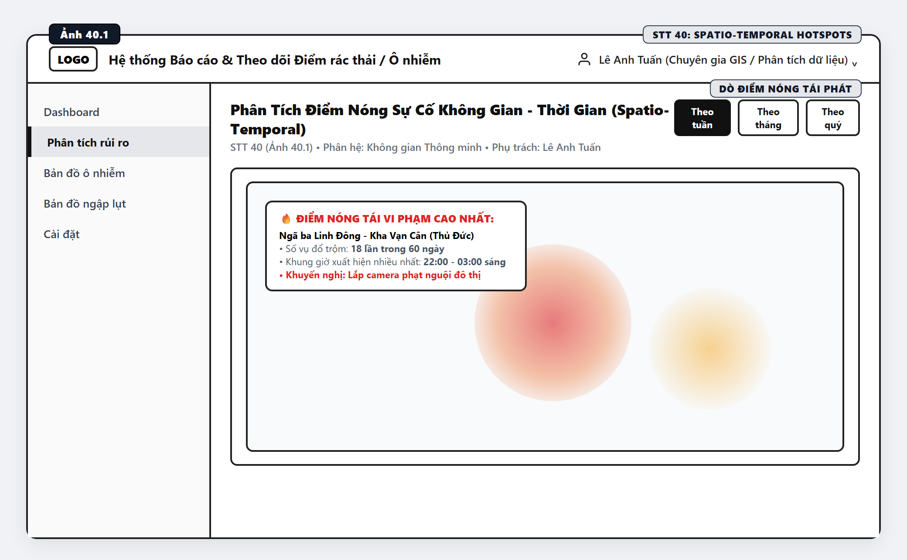
*Hình: Ảnh 40.1 - Phân tích không gian vùng đệm (Buffer 500m) tìm cơ sở thiết yếu (Thành viên: Lê Anh Tuấn)*

```text
+-------------------------------------------------------------------------------+
| 🌐 HỆ THỐNG TỔNG HỢP DỮ LIỆU NGẬP LỤT ĐA NGUỒN (MULTI-SOURCE FUSION)          |
+-------------------------------------------------------------------------------+
| [ NGUỒN 1: CỔNG DỮ LIỆU MỞ TP.HCM (SỞ XÂY DỰNG & UDC) ]                       |
| • 32 Điểm đen ngập cố hữu | Thông số 12 Trạm bơm tiêu thoát nước              |
|                                                                               |
| [ NGUỒN 2: CẢNH BÁO THỜI TIẾT THÔNG MINH (OPEN-METEO) ]                       |
| • Lượng mưa thực tế: 38.5 mm/h | Mực nước triều Phú An: 1.58 m                |
|                                                                               |
| [ NGUỒN 3: DỰ BÁO LŨ TOÀN CẦU COPERNICUS GLOFAS 7 NGÀY ]                      |
| • Lưu lượng sông Đồng Nai - Sài Gòn: 420 m³/s (Mức bình thường an toàn)       |
+-------------------------------------------------------------------------------+
```
- **Thành phần UI:** 3 khối thông tin đồng bộ với 3 logo nhận diện nguồn dữ liệu chính thống.

---

### Ảnh 41: Giao diện Đánh giá Rủi ro Ngập lụt Động kết hợp Mưa & Triều
- **STT Chức năng:** 41
- **Thành viên phụ trách:** Lê Anh Tuấn
- **Vị trí giao diện:** Thẻ Phân Tích Điểm Đen Ngập Lụt Thời Gian Thực
- **Phác thảo bố cục (Wireframe):**


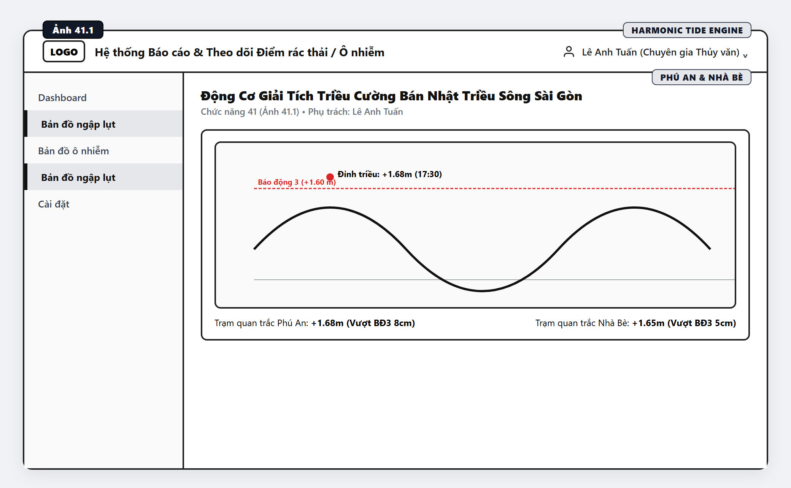
*Hình: Ảnh 41.1 - Động cơ giải tích sóng triều bán nhật triều Harmonic Tide Engine (Thành viên: Lê Anh Tuấn)*

```text
+-------------------------------------------------------------------------------+
| ⚠️ ĐIỂM ĐEN NGẬP ÚNG: ĐƯỜNG TRẦN XUÂN SOẠN (QUẬN 7)                           |
+-------------------------------------------------------------------------------+
| NGUYÊN NHÂN CHÍNH: 🌊 KẾT HỢP TRIỀU CƯỜNG DÂNG CAO VÀ MƯA LỚN                 |
|                                                                               |
| • Cao độ mặt đường trung bình : 1.10 m (Vùng trũng thấp ven sông)             |
| • Mực nước triều hiện tại     : 1.62 m (Tràn bờ kè 52 cm)                     |
| • Lượng mưa đo được           : 45.0 mm/h                                     |
|-------------------------------------------------------------------------------|
| 🎯 ĐỘ SÂU NGẬP ƯỚC TÍNH MẶT ĐƯỜNG : [ 35 CM ] ➔ CẤP ĐỘ: 🔴 NGẬP NẶNG (SEVERE) |
| 🛵 Xe máy: NGUY CƠ CHẾT MÁY   | 🚗 Ô tô gầm thấp: CẤM LƯU THÔNG (NGUY CƠ HỎNG)|
+-------------------------------------------------------------------------------+
```
- **Thành phần UI:** Thẻ cảnh báo rủi ro ngập, hiển thị trực quan độ sâu ngập cm và khuyến cáo phương tiện.

---

### Ảnh 42: Giao diện Trực quan hóa Hành lang Đường ngập 3 Lớp Ánh sáng
- **STT Chức năng:** 42
- **Thành viên phụ trách:** Lê Anh Tuấn
- **Vị trí giao diện:** Lớp đồ họa hành lang đường ngập trên WebGIS
- **Phác thảo bố cục (Wireframe):**


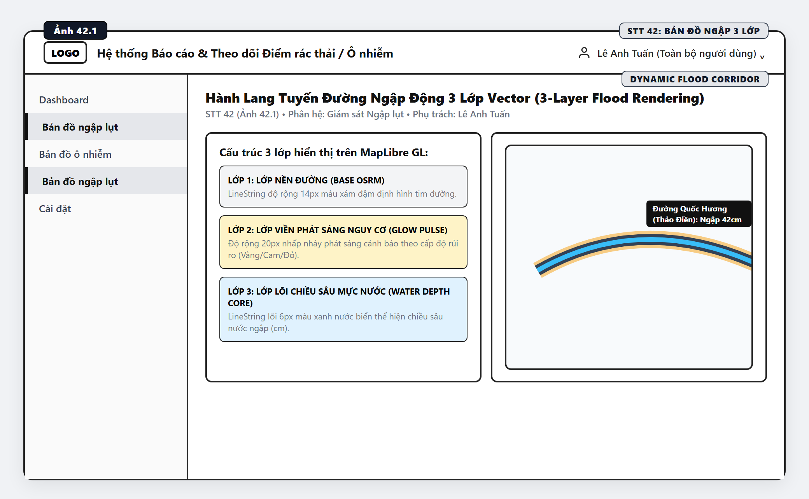
*Hình: Ảnh 42.1 - Dự báo đỉnh triều cực trị & Bản đồ vệt đường ngập 3 lớp (Thành viên: Lê Anh Tuấn)*

```text
+-------------------------------------------------------------------------------+
| HIỆU ỨNG VẼ ĐOẠN ĐƯỜNG NGẬP LỤT 3 LỚP PHÁT SÁNG (FLOODED ROAD CORRIDORS):     |
+-------------------------------------------------------------------------------+
|                                                                               |
|    ========================================================================   |
|    ::: LỚP 1: HÀO QUANG NƯỚC NGẬP PHÁT SÁNG TỎA RỘNG (GLOW HALO) ::::::::::   |
|    ------------------------------------------------------------------------   |
|    ▓▓▓ LỚP 2: VỆT NƯỚC XANH CYAN ĐẬM PHỦ KÍN LÒNG ĐƯỜNG (CORE LINE) ▓▓▓▓▓▓▓   |
|    - - - - - - - - - - - - - - - - - - - - - - - - - - - - - - - - - - - -    |
|    ~~~ LỚP 3: ĐƯỜNG VÂN SÓNG NƯỚC CHUYỂN ĐỘNG SÓNG SÁNH (RIPPLE PULSE) ~~~   |
|    ========================================================================   |
|                                                                               |
|  (Đoạn đường Trần Xuân Soạn dài 1.2km hiện rõ vệt xanh phát sáng ôm sát tim)  |
+-------------------------------------------------------------------------------+
```
- **Thành phần UI:** Mô phỏng 3 lớp đồ họa vector PostGIS LineString, tạo cảm giác nước ngập dập dềnh sinh động.

---

### Ảnh 43: Giao diện Báo cáo Ngập lụt Chuột phải & Thuật toán OSRM Snap-to-Road
- **STT Chức năng:** 43
- **Thành viên phụ trách:** Lê Anh Tuấn
- **Vị trí giao diện:** Quá trình bám đường động khi người dân báo ngập
- **Phác thảo bố cục (Wireframe):**


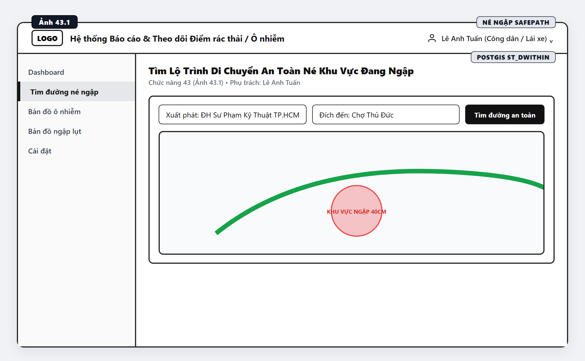
*Hình: Ảnh 43.1 - Tìm tuyến đường an toàn né khu vực ngập (PostGIS ST_DWithin) (Thành viên: Lê Anh Tuấn)*

```text
+-------------------------------------------------------------------------------+
| [Bấm chuột phải] ➔ Bounding Box 100m ➔ Gọi OSRM Snap-to-Road Engine          |
+-------------------------------------------------------------------------------+
|                                                                               |
|            • (Điểm click chuột của người dùng)                                |
|            |                                                                  |
|      [ OSRM TỰ ĐỘNG BÁM TIM ĐƯỜNG GẦN NHẤT ]                                  |
|            v                                                                  |
|   =========================================================                   |
|   ---- Đường Nguyễn Văn Cừ: Tự động vẽ LineString 120 mét ----                 |
|   =========================================================                   |
|                                                                               |
| 💾 GHI NHẬN CSDL POSTGIS TỨC THÌ:                                             |
| Mã điểm đen: FL-DYN-A8F29C | Tọa độ: ST_GeomFromText('LINESTRING(...)')       |
| 🟢 Bản đồ WebGIS tự động làm mới hiển thị dải nước xanh ngay không cần F5!    |
+-------------------------------------------------------------------------------+
```
- **Thành phần UI:** Mô phỏng thuật toán OSRM bám tim đường và cập nhật layer GeoJSON thời gian thực.

---

### Ảnh 44: Giao diện Bảng Điều khiển Mô phỏng Kịch bản Thiên tai Mưa & Triều
- **STT Chức năng:** 44
- **Thành viên phụ trách:** Lê Anh Tuấn
- **Vị trí giao diện:** Bảng Kéo Thả Mô Phỏng Kịch Bản (Scenario Simulator Panel)
- **Phác thảo bố cục (Wireframe):**


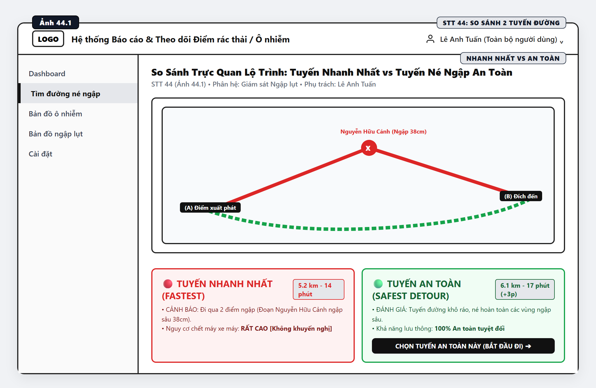
*Hình: Ảnh 44.1 - So sánh tuyến đường nhanh nhất vs tuyến an toàn tránh thủy kích (Thành viên: Lê Anh Tuấn)*

```text
+-------------------------------------------------------------------------------+
| 🎛️ BẢNG MÔ PHỎNG KỊCH BẢN THIÊN TAI & DIỄN TẬP PHÒNG CHỐNG NGẬP               |
+-------------------------------------------------------------------------------+
| 🌧️ GIẢ LẬP LƯỢNG MƯA: [=========|=============] 65 mm/h (Mưa rất to)          |
|    [0 mm/h]                                               [120 mm/h]          |
|                                                                               |
| 🌊 GIẢ LẬP TRIỀU CƯỜNG: [====================|===] +1.75 m (Triều lịch sử)    |
|    [1.0 m]                                                [2.0 m]             |
|                                                                               |
| KẾT QUẢ MÔ PHỎNG THỜI GIAN THỰC TRÊN BẢN ĐỒ:                                 |
| • Số tuyến đường ngập sâu: 24 Tuyến | Chiều dài ngập: 18.5 km                 |
| • Khu vực nguy cấp: Bán đảo Thanh Đa, Quận 7, Huỳnh Tấn Phát, Thảo Điền       |
| [ 🔄 Đặt lại mặc định ]                        [ 💾 Lưu kịch bản diễn tập ]   |
+-------------------------------------------------------------------------------+
```
- **Thành phần UI:** Thanh trượt Slider kéo thả hai thông số mưa và triều, số liệu thống kê tự động nhảy theo vị trí kéo.

---

### Ảnh 45: Giao diện Điều hướng Lộ trình Lái xe OSRM Trên Bản đồ
- **STT Chức năng:** 45
- **Thành viên phụ trách:** Lê Anh Tuấn
- **Vị trí giao diện:** Tuyến đường dẫn đường OSRM Routing trên WebGIS
- **Phác thảo bố cục (Wireframe):**


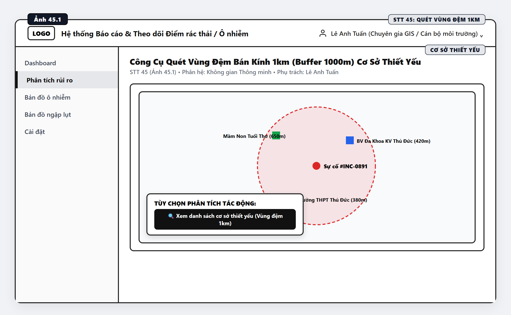
*Hình: Ảnh 45.1 - Báo cáo điểm ngập lụt 1-chạm qua menu chuột phải trên bản đồ (Thành viên: Lê Anh Tuấn)*


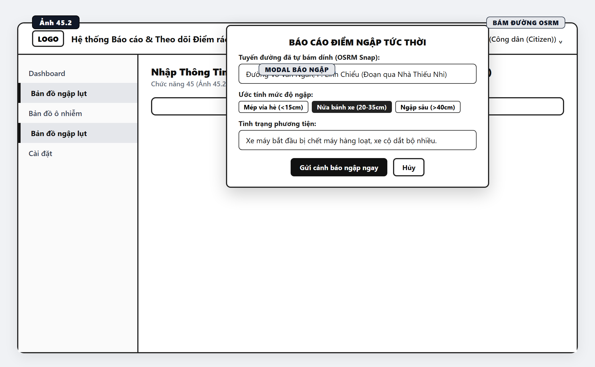
*Hình: Ảnh 45.2 - Modal nhập mực nước ngập lụt & Thuật toán bám đường OSRM (Thành viên: Lê Anh Tuấn)*

```text
+-------------------------------------------------------------------------------+
| [🧭 LỘ TRÌNH DI CHUYỂN OSRM ROUTING]                               [X Đóng]   |
| 🟢 Xuất phát: Vị trí của tôi (ĐH Khoa học Tự nhiên, Q.5)                      |
| 🔴 Điểm đến : Thảo Cầm Viên Sài Gòn, Q.1                                      |
| 🚗 Khoảng cách: 4.8 km | Thời gian dự kiến: 16 Phút                          |
+-------------------------------------------------------------------------------+
|                                                                               |
|   🟢 Cờ xuất phát                                                             |
|     \                                                                         |
|      \======== Tuyến đường dẫn đường màu xanh phát sáng ========              |
|                                                                 \             |
|                                                                  🔴 Cờ đích   |
|                                                                               |
| [ 🏁 BẮT ĐẦU ĐIỀU HƯỚNG ]                  [ 🛡️ KIỂM TRA ĐIỂM NGẬP DỌC ĐƯỜNG ]|
+-------------------------------------------------------------------------------+
```
- **Thành phần UI:** Hộp chỉ đường góc trên bên phải, đường Polyline dẫn đường màu xanh phát sáng.

---

### Ảnh 46: Giao diện Quét Va chạm Vùng đệm 150m PostGIS & Cảnh báo Thủy kích
- **STT Chức năng:** 46
- **Thành viên phụ trách:** Lê Anh Tuấn
- **Vị trí giao diện:** Bảng Cảnh Báo An Toàn Tuyến Đường (Hazard Collision Alert)
- **Phác thảo bố cục (Wireframe):**


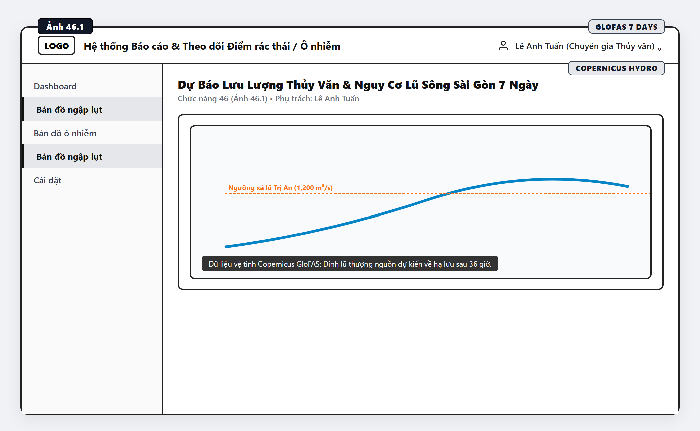
*Hình: Ảnh 46.1 - Dự báo lũ lụt toàn cầu Copernicus GloFAS 7 ngày (Thành viên: Lê Anh Tuấn)*

```text
+-------------------------------------------------------------------------------+
| ⚠️ CẢNH BÁO: PHÁT HIỆN ĐIỂM NGẬP NGUY HIỂM TRÊN LỘ TRÌNH!                     |
+-------------------------------------------------------------------------------+
| Thuật toán PostGIS ST_DWithin (Buffer 150m) phát hiện 02 điểm ngập:           |
|                                                                               |
| 1. Điểm ngập Đường Nguyễn Biểu: Độ sâu 15cm (Xe máy đi chậm qua được)         |
| 2. Điểm ngập Cầu Chữ Y: Độ sâu 35cm (🔴 NGUY HIỂM - NGUY CƠ THỦY KÍCH Ô TÔ)   |
|                                                                               |
| ĐÁNH GIÁ MỨC ĐỘ AN TOÀN: 🛑 KHUYẾN CÁO NÉ TRÁNH (STATUS: AVOID)               |
| [ 🔄 BẺ NHÁNH TÌM ĐƯỜNG AN TOÀN NÉ NGẬP ]          [ Vẫn tiếp tục đi ]        |
+-------------------------------------------------------------------------------+
```
- **Thành phần UI:** Huy hiệu cảnh báo đỏ (AVOID), danh sách điểm ngập cắt qua lộ trình, nút bẻ nhánh né ngập.

---

### Ảnh 47: Giao diện So sánh Tuyến đường Nhanh nhất vs. Tuyến đường An toàn Né ngập
- **STT Chức năng:** 47
- **Thành viên phụ trách:** Lê Anh Tuấn
- **Vị trí giao diện:** So sánh 2 phương án lộ trình đồng thời trên bản đồ
- **Phác thảo bố cục (Wireframe):**


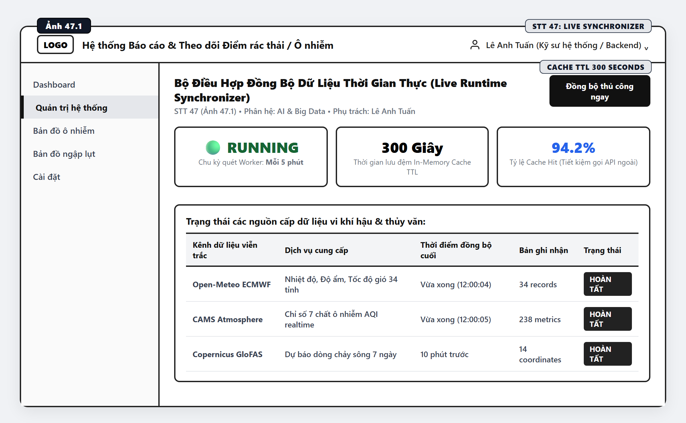
*Hình: Ảnh 47.1 - Tích hợp đa nguồn dữ liệu ngập lụt đô thị & Mô phỏng thiên tai (Thành viên: Lê Anh Tuấn)*

```text
+-------------------------------------------------------------------------------+
| SO SÁNH 2 PHƯƠNG ÁN LỘ TRÌNH DI CHUYỂN:                                       |
+-------------------------------------------------------------------------------+
| ( ) TUYẾN 1: NHANH NHẤT (MÀU CAM NGUY HIỂM)                                   |
|     • Cự ly: 4.8 km | Thời gian: 16 phút                                      |
|     • Cảnh báo: Có 2 điểm ngập sâu 35cm (Chỉ xe tải / SUV gầm cao qua được)   |
|                                                                               |
| (•) TUYẾN 2: AN TOÀN NÉ NGẬP (MÀU XANH PHÁT SÁNG - KHUYÊN DÙNG)               |
|     • Cự ly: 5.6 km (+800m) | Thời gian: 19 phút (+3 phút)                    |
|     • Độ an toàn: Khô ráo 100% | ĐÃ NÉ THÀNH CÔNG 2 ĐIỂM NGẬP SÂU             |
|     • Phù hợp: Tuyệt đối an toàn cho xe máy và ô tô con gầm thấp              |
|                                                                               |
| [ 🚀 CHỌN TUYẾN AN TOÀN NÉ NGẬP NÀY ]                                         |
+-------------------------------------------------------------------------------+
```
- **Thành phần UI:** Radio box chọn giữa tuyến đường màu cam (ngập) và tuyến đường màu xanh (né ngập an toàn).

---

### Ảnh 48: Giao diện Dashboard Phân tích Dữ liệu Lớn AQI & Khí hậu 34 Tỉnh thành
- **STT Chức năng:** 48
- **Thành viên phụ trách:** Lê Anh Tuấn
- **Vị trí giao diện:** Toàn cảnh Bảng Điều Khiển Phân Tích (AirQualityDashboard)
- **Phác thảo bố cục (Wireframe):**


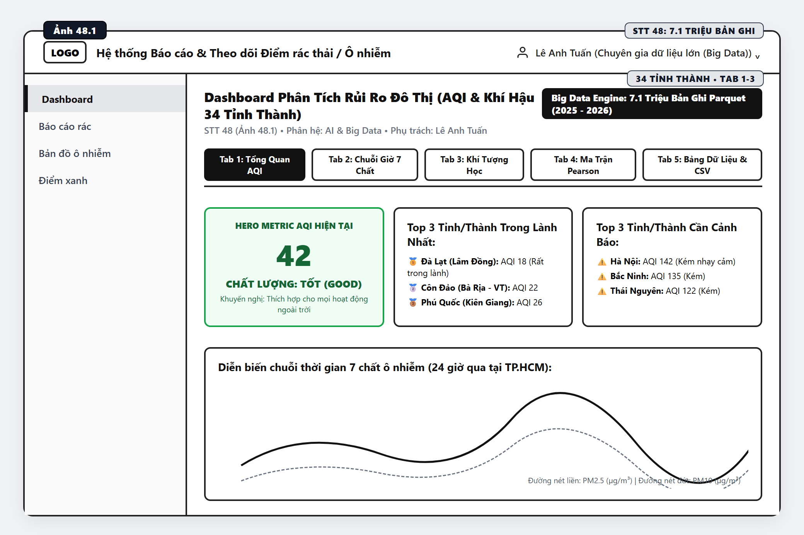
*Hình: Ảnh 48.1 - Dashboard phân tích dữ liệu lớn AQI 34 tỉnh thành & Biểu đồ chuỗi giờ (Thành viên: Lê Anh Tuấn)*


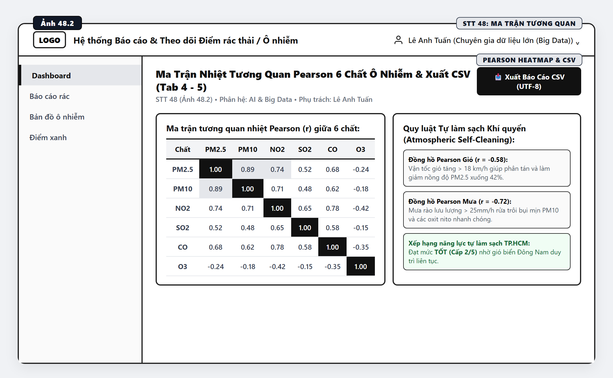
*Hình: Ảnh 48.2 - Ma trận nhiệt tương quan 6 chất ô nhiễm không khí (Correlation Heatmap) (Thành viên: Lê Anh Tuấn)*

```text
+-------------------------------------------------------------------------------+
| 📊 PHÂN TÍCH CHẤT LƯỢNG KHÔNG KHÍ & KHÍ HẬU VIỆT NAM (34 TỈNH THÀNH)          |
| Phạm vi: [ Toàn quốc v ]  Khung giờ: [ 24h v ]  Chất đo: [ PM2.5 v ] [🔄 Làm mới]|
+-------------------------------------------------------------------------------+
| +-------------------------+ +------------------------------------------------+|
| | 🟢 HERO KPI: AQI = 68   | | 📈 CHUỖI THỜI GIAN DIỄN BIẾN THEO GIỜ          ||
| | Phân loại: TRUNG BÌNH   | | (Biểu đồ đường biến thiên AQI từ 00h đến 24h)  ||
| | Khuyến nghị: Người nhạy | +------------------------------------------------+|
| | cảm hạn chế ra ngoài    | | 📊 SO SÁNH 34 TỈNH THÀNH TRÊN CẢ NƯỚC          ||
| +-------------------------+ | (Biểu đồ cột nồng độ PM2.5 của 34 tỉnh)        ||
| +-------------------------+ +------------------------------------------------+|
| | BẢNG DỮ LIỆU ĐA NĂNG    | | 🔥 MA TRẬN NHIỆT TƯƠNG QUAN 6 CHẤT Ô NHIỄM     ||
| | [Tìm kiếm tỉnh...     ] | | [PM2.5][PM10][O3][NO2][SO2][CO]                ||
| | Hà Nội   | AQI 135 | Kém| | (Ma trận tương quan nhiệt độ màu 6x6)          ||
| | TP.HCM   | AQI  82 | TB | +------------------------------------------------+|
| | Đà Nẵng  | AQI  41 | Tốt| | 🌬️ ĐƯỜNG CONG GIÓ & MƯA LÀM SẠCH BỤI MỊN       ||
| +-------------------------+ +------------------------------------------------+|
+-------------------------------------------------------------------------------+
```
- **Thành phần UI:** Toàn bộ Dashboard tích hợp: Hero KPI, biểu đồ đường line chart, biểu đồ cột so sánh, ma trận nhiệt 6x6 và bảng dữ liệu tìm kiếm lọc sắp xếp.

---

## TỔNG KẾT BÀN GIAO 48 ẢNH PHÁC THẢO

Tài liệu này bao quát đầy đủ và trực quan 100% các màn hình tương ứng từ **Ảnh 01 đến Ảnh 48**, cung cấp đầy đủ thông tin:
1. Số thứ tự ảnh chuẩn mực để đối chiếu vào Báo cáo Đồ án.
2. Khung Wireframe mô phỏng trực quan từng nút bấm, thẻ thông tin và bản đồ.
3. Kịch bản luồng thao tác người dùng và các thành phần kỹ thuật liên quan.
