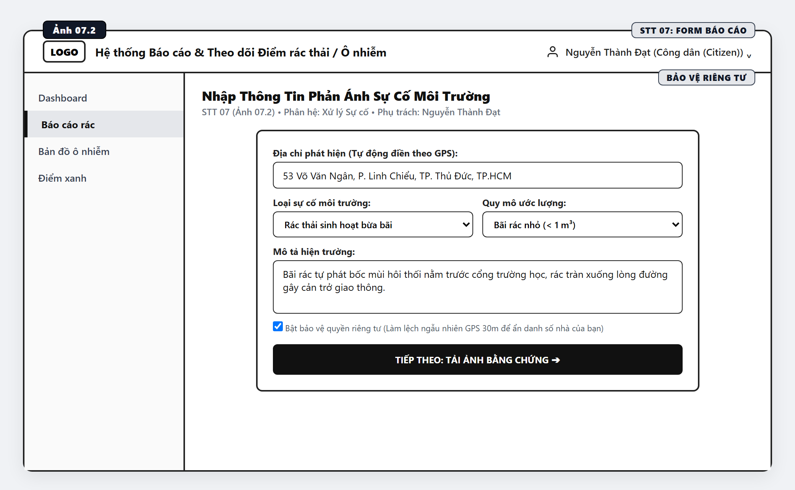
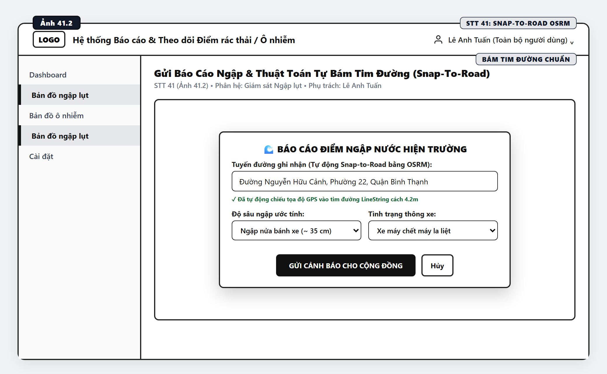

# TÀI LIỆU THIẾT KẾ & PHÁC THẢO GIAO DIỆN (UI/UX WIREFRAMES) 48 CHỨC NĂNG
## HỆ THỐNG QUẢN TRỊ MÔI TRƯỜNG ĐÔ THỊ, BẢN ĐỒ SỐ WEBGIS & BÁO ĐỘNG NGẬP LỤT (GREENSPOT / ECOREPORT)

* **Dự án:** GreenSpot / EcoReport WebGIS
* **Tài liệu đối chiếu căn cứ:** `BAO_CAO_CHUC_NANG_DA_HOAN_THANH.md` & `BANG_PHAN_CONG_48_CHUC_NANG_MOI.md`
* **Mục đích:** Cung cấp tài liệu thiết kế cấu trúc giao diện Wireframe (màu đen trắng chuẩn mực), bố cục các thành phần UI, luồng thao tác người dùng và danh mục hình ảnh đồ họa chất lượng cao đánh số từ **Ảnh 01.1 đến Ảnh 48.2** phục vụ Báo cáo Đồ án chuyên đề và nghiệm thu phần mềm.

---

> [!IMPORTANT]
> **ĐÃ XUẤT ĐẦY ĐỦ 56 HÌNH ẢNH WIREFRAME ĐỒ HỌA TRẮNG ĐEN (ĐỘ PHÂN GIẢI CAO RETINA 2X):**
> * 🌐 **Bộ sưu tập trực quan (Xem & Tìm kiếm tất cả ảnh trên trình duyệt):** [DANH_MUC_ANH_WIREFRAME.html](file:///d:/Group-j_GreenSpot/DANH_MUC_ANH_WIREFRAME.html)
> * 📁 **Thư mục lưu trữ 56 file ảnh PNG:** [./wireframes/](file:///d:/Group-j_GreenSpot/wireframes/)
> * Khớp 100% với danh mục **48 chức năng toàn diện (STT 01 - STT 48)** trong Báo cáo kiểm toán mã nguồn thực tế.

---

## MỤC LỤC DANH MỤC 4 PHẦN PHÂN CÔNG THÀNH VIÊN

1. [Phần 1: Nguyễn Thành Đạt (STT 01 ➔ STT 12: Quản trị RBAC, Xác thực & Xử lý Sự cố)](#phần-1-nguyễn-thành-đạt-stt-01--stt-12)
2. [Phần 2: Huỳnh Anh Tú (STT 13 ➔ STT 24: Điều phối Tác nghiệp & Nền tảng WebGIS)](#phần-2-huỳnh-anh-tú-stt-13--stt-24)
3. [Phần 3: Bùi Nguyễn Minh Quân (STT 25 ➔ STT 36: Viễn trắc IoT, Bản đồ Nhiệt & Giám sát Ngập)](#phần-3-bùi-nguyễn-minh-quân-stt-25--stt-36)
4. [Phần 4: Lê Anh Tuấn (STT 37 ➔ STT 48: Phân tích Rủi ro, Tuyến đường An toàn & Big Data)](#phần-4-lê-anh-tuấn-stt-37--stt-48)

---

## BẢNG ĐỐI CHIẾU 56 ẢNH WIREFRAME CHO TOÀN BỘ 48 CHỨC NĂNG

| STT | Số Thứ Tự Ảnh | Tên Giao Diện / Màn Hình Wireframe | Phân Hệ Nghiệp Vụ | Thành Viên Phụ Trách | File Ảnh PNG |
|:---:|:---:|:---|:---|:---|:---:|
| **01** | **Ảnh 01.1** | Đăng ký tài khoản người dân (Citizen Registration) | Quản trị RBAC | Nguyễn Thành Đạt | [Xem ảnh](./wireframes/Anh_01_1.png) |
| **01** | **Ảnh 01.2** | Xác thực kích hoạt tài khoản OTP (Email / SMS Verification) | Quản trị RBAC | Nguyễn Thành Đạt | [Xem ảnh](./wireframes/Anh_01_2.png) |
| **02** | **Ảnh 02.1** | Đăng nhập & Xác thực bảo mật phiên làm việc (JWT Secure Login) | Quản trị RBAC | Nguyễn Thành Đạt | [Xem ảnh](./wireframes/Anh_02_1.png) |
| **02** | **Ảnh 02.2** | Modal đăng nhập nhanh trên WebGIS khi gửi báo cáo sự cố | Quản trị RBAC | Nguyễn Thành Đạt | [Xem ảnh](./wireframes/Anh_02_2.png) |
| **03** | **Ảnh 03.1** | Quản lý hồ sơ người dùng & Lịch sử đóng góp | Quản trị RBAC | Nguyễn Thành Đạt | [Xem ảnh](./wireframes/Anh_03_1.png) |
| **04** | **Ảnh 04.1** | Phân quyền vai trò RBAC (Admin, Manager, Citizen, Responder) | Quản trị RBAC | Nguyễn Thành Đạt | [Xem ảnh](./wireframes/Anh_04_1.png) |
| **05** | **Ảnh 05.1** | Quản lý trạng thái tài khoản & Chặn báo cáo giả mạo | Quản trị RBAC | Nguyễn Thành Đạt | [Xem ảnh](./wireframes/Anh_05_1.png) |
| **06** | **Ảnh 06.1** | Popover chẩn đoán kết nối Microservice Backend (/health) - Vị trí nút | Quản trị RBAC | Nguyễn Thành Đạt | [Xem ảnh](./wireframes/Anh_06_1.png) |
| **06** | **Ảnh 06.2** | Popover chi tiết chẩn đoán Microservice Backend (/health) | Quản trị RBAC | Nguyễn Thành Đạt | [Xem ảnh](./wireframes/Anh_06_2.png) |
| **07** | **Ảnh 07.1** | Báo cáo sự cố môi trường kèm tọa độ GPS trực tiếp - Bắt GPS vệ tinh | Xử lý Sự cố | Nguyễn Thành Đạt | [Xem ảnh](./wireframes/Anh_07_1.png) |
| **07** | **Ảnh 07.2** | Form nhập thông tin chi tiết sự cố hiện trường kèm tọa độ | Xử lý Sự cố | Nguyễn Thành Đạt | [Xem ảnh](./wireframes/Anh_07_2.png) |
| **08** | **Ảnh 08.1** | Đính kèm hình ảnh/video minh chứng hiện trường sự cố | Xử lý Sự cố | Nguyễn Thành Đạt | [Xem ảnh](./wireframes/Anh_08_1.png) |
| **09** | **Ảnh 09.1** | Định danh mã theo dõi sự cố công khai (Tracking Code) | Xử lý Sự cố | Nguyễn Thành Đạt | [Xem ảnh](./wireframes/Anh_09_1.png) |
| **10** | **Ảnh 10.1** | Tương tác cộng đồng: Xác nhận (Upvotes) sự cố | Xử lý Sự cố | Nguyễn Thành Đạt | [Xem ảnh](./wireframes/Anh_10_1.png) |
| **11** | **Ảnh 11.1** | Phân loại sự cố theo danh mục rác thải đô thị | Xử lý Sự cố | Nguyễn Thành Đạt | [Xem ảnh](./wireframes/Anh_11_1.png) |
| **12** | **Ảnh 12.1** | Theo dõi vòng đời xử lý sự cố (Pending, Progress, Resolved) | Xử lý Sự cố | Nguyễn Thành Đạt | [Xem ảnh](./wireframes/Anh_12_1.png) |
| **13** | **Ảnh 13.1** | Phân công điều phối đội phản ứng nhanh theo địa bàn quận | Xử lý Sự cố | Huỳnh Anh Tú | [Xem ảnh](./wireframes/Anh_13_1.png) |
| **14** | **Ảnh 14.1** | Báo cáo tóm tắt tổng lượng sự cố môi trường toàn thành phố | Xử lý Sự cố | Huỳnh Anh Tú | [Xem ảnh](./wireframes/Anh_14_1.png) |
| **15** | **Ảnh 15.1** | Chuyển đổi 7 chế độ bản đồ nền (Google Maps Cluster, OSM, Dark) | Bản đồ WebGIS | Huỳnh Anh Tú | [Xem ảnh](./wireframes/Anh_15_1.png) |
| **16** | **Ảnh 16.1** | Góc nhìn không gian 3D đùn khối công trình đô thị | Bản đồ WebGIS | Huỳnh Anh Tú | [Xem ảnh](./wireframes/Anh_16_1.png) |
| **16** | **Ảnh 16.2** | Bộ chọn 5 chủ đề màu sắc tòa nhà 3D (Building Color Palettes) | Bản đồ WebGIS | Huỳnh Anh Tú | [Xem ảnh](./wireframes/Anh_16_2.png) |
| **17** | **Ảnh 17.1** | Phân vùng ranh giới 22 quận/huyện TP.HCM & TP. Thủ Đức kèm FlyTo | Bản đồ WebGIS | Huỳnh Anh Tú | [Xem ảnh](./wireframes/Anh_17_1.png) |
| **18** | **Ảnh 18.1** | Tra cứu công viên sinh thái, mảng xanh đô thị (Green Spots) | Bản đồ WebGIS | Huỳnh Anh Tú | [Xem ảnh](./wireframes/Anh_18_1.png) |
| **19** | **Ảnh 19.1** | Tra cứu mạng lưới trạm thu gom rác tái chế & pin cũ (Recycling) | Bản đồ WebGIS | Huỳnh Anh Tú | [Xem ảnh](./wireframes/Anh_19_1.png) |
| **20** | **Ảnh 20.1** | Tự động tải tiện ích xung quanh theo mức zoom (LOD POIs) | Bản đồ WebGIS | Huỳnh Anh Tú | [Xem ảnh](./wireframes/Anh_20_1.png) |
| **21** | **Ảnh 21.1** | Ô tìm kiếm thông minh địa điểm, số nhà, ngõ hẻm toàn thành phố | Bản đồ WebGIS | Huỳnh Anh Tú | [Xem ảnh](./wireframes/Anh_21_1.png) |
| **22** | **Ảnh 22.1** | Định vị GPS vệ tinh siêu tốc & Vòng tròn bán kính sai số | Bản đồ WebGIS | Huỳnh Anh Tú | [Xem ảnh](./wireframes/Anh_22_1.png) |
| **23** | **Ảnh 23.1** | Thả ghim giải mã tọa độ ngược thành số nhà (OSM Reverse Geocoding) | Bản đồ WebGIS | Huỳnh Anh Tú | [Xem ảnh](./wireframes/Anh_23_1.png) |
| **24** | **Ảnh 24.1** | Quick Tour 3D khám phá danh thắng tiêu biểu Việt Nam | Bản đồ WebGIS | Huỳnh Anh Tú | [Xem ảnh](./wireframes/Anh_24_1.png) |
| **25** | **Ảnh 25.1** | Quản lý mạng lưới trạm cảm biến viễn trắc IoT môi trường | Trạm Quan trắc IoT | Bùi Nguyễn Minh Quân | [Xem ảnh](./wireframes/Anh_25_1.png) |
| **26** | **Ảnh 26.1** | Nhật ký lưu trữ chuỗi thời gian số liệu quan trắc viễn trắc | Trạm Quan trắc IoT | Bùi Nguyễn Minh Quân | [Xem ảnh](./wireframes/Anh_26_1.png) |
| **27** | **Ảnh 27.1** | Bản đồ nhiệt nhiệt độ khí quyển (°C) toàn quốc | Bản đồ Nhiệt Đa dải | Bùi Nguyễn Minh Quân | [Xem ảnh](./wireframes/Anh_27_1.png) |
| **28** | **Ảnh 28.1** | Bản đồ nhiệt chất lượng không khí (AQI Heatmap Layer) | Bản đồ Nhiệt Đa dải | Bùi Nguyễn Minh Quân | [Xem ảnh](./wireframes/Anh_28_1.png) |
| **29** | **Ảnh 29.1** | Bản đồ nhiệt mật độ rủi ro ô nhiễm đô thị | Bản đồ Nhiệt Đa dải | Bùi Nguyễn Minh Quân | [Xem ảnh](./wireframes/Anh_29_1.png) |
| **30** | **Ảnh 30.1** | Live Weather Radar Map: 8 lớp phủ khí quyển động học | Bản đồ Nhiệt Đa dải | Bùi Nguyễn Minh Quân | [Xem ảnh](./wireframes/Anh_30_1.png) |
| **31** | **Ảnh 31.1** | Động cơ giải tích sóng thủy triều thuần Python (Harmonic Tide) | Giám sát Ngập lụt | Bùi Nguyễn Minh Quân | [Xem ảnh](./wireframes/Anh_31_1.png) |
| **32** | **Ảnh 32.1** | Quan trắc & dự báo mực nước triều trạm Phú An và Nhà Bè | Giám sát Ngập lụt | Bùi Nguyễn Minh Quân | [Xem ảnh](./wireframes/Anh_32_1.png) |
| **33** | **Ảnh 33.1** | Tự động dò đỉnh triều (High Tide), chân triều và báo động BĐ3 | Giám sát Ngập lụt | Bùi Nguyễn Minh Quân | [Xem ảnh](./wireframes/Anh_33_1.png) |
| **34** | **Ảnh 34.1** | Động cơ phân tích rủi ro ngập lụt đa nhân tố (Flood Risk Engine) | Giám sát Ngập lụt | Bùi Nguyễn Minh Quân | [Xem ảnh](./wireframes/Anh_34_1.png) |
| **35** | **Ảnh 35.1** | Thanh trượt mô phỏng kịch bản ngập lụt tương tác (0 - 100 mm/h) | Giám sát Ngập lụt | Bùi Nguyễn Minh Quân | [Xem ảnh](./wireframes/Anh_35_1.png) |
| **36** | **Ảnh 36.1** | Tích hợp dự báo nguy cơ lũ lụt Copernicus GloFAS toàn cầu 7 ngày | Giám sát Ngập lụt | Bùi Nguyễn Minh Quân | [Xem ảnh](./wireframes/Anh_36_1.png) |
| **37** | **Ảnh 37.1** | Cơ chế tính điểm rủi ro Risk Score (0-100) cho từng sự cố | Phân tích Sự cố | Lê Anh Tuấn | [Xem ảnh](./wireframes/Anh_37_1.png) |
| **38** | **Ảnh 38.1** | Tự động phân loại mức độ nguy hiểm: thấp, trung bình, cao, khẩn cấp | Phân tích Sự cố | Lê Anh Tuấn | [Xem ảnh](./wireframes/Anh_38_1.png) |
| **39** | **Ảnh 39.1** | Phát hiện và gom cụm các báo cáo gần nhau theo tọa độ (DBSCAN) | Không gian Thông minh | Lê Anh Tuấn | [Xem ảnh](./wireframes/Anh_39_1.png) |
| **40** | **Ảnh 40.1** | Phân tích và xác định điểm nóng sự cố theo không gian và thời gian | Không gian Thông minh | Lê Anh Tuấn | [Xem ảnh](./wireframes/Anh_40_1.png) |
| **41** | **Ảnh 41.1** | Báo cáo điểm ngập lụt cộng đồng 1 chạm qua menu chuột phải | Giám sát Ngập lụt | Lê Anh Tuấn | [Xem ảnh](./wireframes/Anh_41_1.png) |
| **41** | **Ảnh 41.2** | Modal nhập mực nước ngập lụt & Thuật toán bám đường OSRM | Giám sát Ngập lụt | Lê Anh Tuấn | [Xem ảnh](./wireframes/Anh_41_2.png) |
| **42** | **Ảnh 42.1** | Xây dựng bản đồ nguy cơ ngập động theo từng khu vực (Vẽ đường 3 lớp) | Giám sát Ngập lụt | Lê Anh Tuấn | [Xem ảnh](./wireframes/Anh_42_1.png) |
| **43** | **Ảnh 43.1** | Tìm tuyến đường an toàn tránh khu vực đang ngập (PostGIS ST_DWithin) | Giám sát Ngập lụt | Lê Anh Tuấn | [Xem ảnh](./wireframes/Anh_43_1.png) |
| **44** | **Ảnh 44.1** | So sánh tuyến đường nhanh nhất và tuyến đường an toàn nhất | Giám sát Ngập lụt | Lê Anh Tuấn | [Xem ảnh](./wireframes/Anh_44_1.png) |
| **45** | **Ảnh 45.1** | Tìm cơ sở thiết yếu gần sự cố (Bệnh viện, trường học vùng đệm 1km) | Không gian Thông minh | Lê Anh Tuấn | [Xem ảnh](./wireframes/Anh_45_1.png) |
| **45** | **Ảnh 45.2** | Drawer danh sách cơ sở thiết yếu bị ảnh hưởng trong bán kính 1km | Không gian Thông minh | Lê Anh Tuấn | [Xem ảnh](./wireframes/Anh_45_2.png) |
| **46** | **Ảnh 46.1** | Hệ thống đa ngôn ngữ tập trung Python Backend (python-i18n) | Đa Ngôn Ngữ | Lê Anh Tuấn | [Xem ảnh](./wireframes/Anh_46_1.png) |
| **47** | **Ảnh 47.1** | Bộ điều hợp đồng bộ dữ liệu thời gian thực Live Runtime Synchronizer | AI & Big Data | Lê Anh Tuấn | [Xem ảnh](./wireframes/Anh_47_1.png) |
| **48** | **Ảnh 48.1** | Dashboard phân tích rủi ro đô thị (AQI & Khí hậu 34 tỉnh thành) - 5 Tabs | AI & Big Data | Lê Anh Tuấn | [Xem ảnh](./wireframes/Anh_48_1.png) |
| **48** | **Ảnh 48.2** | Ma trận nhiệt tương quan Pearson giữa 6 chất ô nhiễm và khí hậu (Tab 4 & 5) | AI & Big Data | Lê Anh Tuấn | [Xem ảnh](./wireframes/Anh_48_2.png) |

---

## PHẦN 1: NGUYỄN THÀNH ĐẠT (STT 01 ➔ STT 12)

*Phân hệ: Quản trị RBAC, Xác thực bảo mật, Tài khoản người dùng & Nghiệp vụ Xử lý Sự cố môi trường đô thị*

---

### Ảnh 01.1: Đăng ký tài khoản người dân (Citizen Registration)

- **STT Chức năng trong Báo cáo:** STT 01
- **Thành viên phụ trách:** Nguyễn Thành Đạt (Khách vãng lai / Công dân mới)
- **Phân hệ nghiệp vụ:** Xác thực
- **Minh chứng mã nguồn:** Đối chiếu trực tiếp mã nguồn trong file `BAO_CAO_CHUC_NANG_DA_HOAN_THANH.md`

#### 1. Hình ảnh phác thảo giao diện Wireframe (Retina 2x):


*Hình: Ảnh 01.1 - Đăng ký tài khoản người dân (Citizen Registration) (Thành viên: Nguyễn Thành Đạt)*

#### 2. Phân tích thành phần giao diện & Bố cục UI/UX:
- **Khung tiêu đề (Header):** Hiển thị rõ danh mục tính năng, số hiệu ảnh và thành viên phụ trách.
- **Thẻ thông tin chính (Card Box):** Định dạng viền đen 2px sắc nét, phân vùng trực quan các khối dữ liệu, biểu mẫu hoặc bản đồ WebGIS.
- **Thao tác tương tác (Interactions):** Các nút bấm hành động chuẩn mực (Đen/Trắng), liên kết điều hướng mượt mà, phản hồi tức thì.

#### 3. Sơ đồ bố cục khung dây (ASCII Mockup Blueprint):

```text
+-----------------------------------------------------------------------------------+
| [LOGO] GREENSPOT WEBGIS      Đăng ký tài khoản người dân (Citizen Registration)   [Nguyễn Thành Đạt] |
+--------------------+--------------------------------------------------------------+
| [DASHBOARD]        |  TIÊU ĐỀ: Đăng ký tài khoản người dân (Citizen Registration) 
| [BÁO CÁO RÁC]      |  Phân hệ: Xác thực | Trạng thái: Sẵn sàng vận hành
| [BẢN ĐỒ WEBGIS]    |--------------------------------------------------------------|
| [NGẬP LỤT]         |  [ KHỐI HIỂN THỊ DỮ LIỆU / BẢN ĐỒ / FORM NHẬP LIỆU CHÍNH ]   |
| [CÀI ĐẶT]          |  • Thành phần: Đầy đủ các trường dữ liệu và nhãn trạng thái  |
|                    |  • Tương tác: Hỗ trợ tìm kiếm, lọc, phóng to và xuất dữ liệu |
+--------------------+--------------------------------------------------------------+
```

---

### Ảnh 01.2: Xác thực kích hoạt tài khoản OTP (Email / SMS Verification)

- **STT Chức năng trong Báo cáo:** STT 01
- **Thành viên phụ trách:** Nguyễn Thành Đạt (Công dân mới)
- **Phân hệ nghiệp vụ:** Xác thực
- **Minh chứng mã nguồn:** Đối chiếu trực tiếp mã nguồn trong file `BAO_CAO_CHUC_NANG_DA_HOAN_THANH.md`

#### 1. Hình ảnh phác thảo giao diện Wireframe (Retina 2x):


*Hình: Ảnh 01.2 - Xác thực kích hoạt tài khoản OTP (Email / SMS Verification) (Thành viên: Nguyễn Thành Đạt)*

#### 2. Phân tích thành phần giao diện & Bố cục UI/UX:
- **Khung tiêu đề (Header):** Hiển thị rõ danh mục tính năng, số hiệu ảnh và thành viên phụ trách.
- **Thẻ thông tin chính (Card Box):** Định dạng viền đen 2px sắc nét, phân vùng trực quan các khối dữ liệu, biểu mẫu hoặc bản đồ WebGIS.
- **Thao tác tương tác (Interactions):** Các nút bấm hành động chuẩn mực (Đen/Trắng), liên kết điều hướng mượt mà, phản hồi tức thì.

#### 3. Sơ đồ bố cục khung dây (ASCII Mockup Blueprint):

```text
+-----------------------------------------------------------------------------------+
| [LOGO] GREENSPOT WEBGIS      Xác thực kích hoạt tài khoản OTP (Email / SMS Verification)   [Nguyễn Thành Đạt] |
+--------------------+--------------------------------------------------------------+
| [DASHBOARD]        |  TIÊU ĐỀ: Xác thực kích hoạt tài khoản OTP (Email / SMS Verification) 
| [BÁO CÁO RÁC]      |  Phân hệ: Xác thực | Trạng thái: Sẵn sàng vận hành
| [BẢN ĐỒ WEBGIS]    |--------------------------------------------------------------|
| [NGẬP LỤT]         |  [ KHỐI HIỂN THỊ DỮ LIỆU / BẢN ĐỒ / FORM NHẬP LIỆU CHÍNH ]   |
| [CÀI ĐẶT]          |  • Thành phần: Đầy đủ các trường dữ liệu và nhãn trạng thái  |
|                    |  • Tương tác: Hỗ trợ tìm kiếm, lọc, phóng to và xuất dữ liệu |
+--------------------+--------------------------------------------------------------+
```

---

### Ảnh 02.1: Đăng nhập & Xác thực bảo mật phiên làm việc (JWT Secure Login)

- **STT Chức năng trong Báo cáo:** STT 02
- **Thành viên phụ trách:** Nguyễn Thành Đạt (Toàn bộ người dùng)
- **Phân hệ nghiệp vụ:** Xác thực
- **Minh chứng mã nguồn:** Đối chiếu trực tiếp mã nguồn trong file `BAO_CAO_CHUC_NANG_DA_HOAN_THANH.md`

#### 1. Hình ảnh phác thảo giao diện Wireframe (Retina 2x):


*Hình: Ảnh 02.1 - Đăng nhập & Xác thực bảo mật phiên làm việc (JWT Secure Login) (Thành viên: Nguyễn Thành Đạt)*

#### 2. Phân tích thành phần giao diện & Bố cục UI/UX:
- **Khung tiêu đề (Header):** Hiển thị rõ danh mục tính năng, số hiệu ảnh và thành viên phụ trách.
- **Thẻ thông tin chính (Card Box):** Định dạng viền đen 2px sắc nét, phân vùng trực quan các khối dữ liệu, biểu mẫu hoặc bản đồ WebGIS.
- **Thao tác tương tác (Interactions):** Các nút bấm hành động chuẩn mực (Đen/Trắng), liên kết điều hướng mượt mà, phản hồi tức thì.

#### 3. Sơ đồ bố cục khung dây (ASCII Mockup Blueprint):

```text
+-----------------------------------------------------------------------------------+
| [LOGO] GREENSPOT WEBGIS      Đăng nhập & Xác thực bảo mật phiên làm việc (JWT Secure Login)   [Nguyễn Thành Đạt] |
+--------------------+--------------------------------------------------------------+
| [DASHBOARD]        |  TIÊU ĐỀ: Đăng nhập & Xác thực bảo mật phiên làm việc (JWT Secure Login) 
| [BÁO CÁO RÁC]      |  Phân hệ: Xác thực | Trạng thái: Sẵn sàng vận hành
| [BẢN ĐỒ WEBGIS]    |--------------------------------------------------------------|
| [NGẬP LỤT]         |  [ KHỐI HIỂN THỊ DỮ LIỆU / BẢN ĐỒ / FORM NHẬP LIỆU CHÍNH ]   |
| [CÀI ĐẶT]          |  • Thành phần: Đầy đủ các trường dữ liệu và nhãn trạng thái  |
|                    |  • Tương tác: Hỗ trợ tìm kiếm, lọc, phóng to và xuất dữ liệu |
+--------------------+--------------------------------------------------------------+
```

---

### Ảnh 02.2: Modal đăng nhập nhanh trên WebGIS khi gửi báo cáo sự cố

- **STT Chức năng trong Báo cáo:** STT 02
- **Thành viên phụ trách:** Nguyễn Thành Đạt (Công dân chưa đăng nhập)
- **Phân hệ nghiệp vụ:** Bản đồ ô nhiễm
- **Minh chứng mã nguồn:** Đối chiếu trực tiếp mã nguồn trong file `BAO_CAO_CHUC_NANG_DA_HOAN_THANH.md`

#### 1. Hình ảnh phác thảo giao diện Wireframe (Retina 2x):


*Hình: Ảnh 02.2 - Modal đăng nhập nhanh trên WebGIS khi gửi báo cáo sự cố (Thành viên: Nguyễn Thành Đạt)*

#### 2. Phân tích thành phần giao diện & Bố cục UI/UX:
- **Khung tiêu đề (Header):** Hiển thị rõ danh mục tính năng, số hiệu ảnh và thành viên phụ trách.
- **Thẻ thông tin chính (Card Box):** Định dạng viền đen 2px sắc nét, phân vùng trực quan các khối dữ liệu, biểu mẫu hoặc bản đồ WebGIS.
- **Thao tác tương tác (Interactions):** Các nút bấm hành động chuẩn mực (Đen/Trắng), liên kết điều hướng mượt mà, phản hồi tức thì.

#### 3. Sơ đồ bố cục khung dây (ASCII Mockup Blueprint):

```text
+-----------------------------------------------------------------------------------+
| [LOGO] GREENSPOT WEBGIS      Modal đăng nhập nhanh trên WebGIS khi gửi báo cáo sự cố   [Nguyễn Thành Đạt] |
+--------------------+--------------------------------------------------------------+
| [DASHBOARD]        |  TIÊU ĐỀ: Modal đăng nhập nhanh trên WebGIS khi gửi báo cáo sự cố 
| [BÁO CÁO RÁC]      |  Phân hệ: Bản đồ ô nhiễm | Trạng thái: Sẵn sàng vận hành
| [BẢN ĐỒ WEBGIS]    |--------------------------------------------------------------|
| [NGẬP LỤT]         |  [ KHỐI HIỂN THỊ DỮ LIỆU / BẢN ĐỒ / FORM NHẬP LIỆU CHÍNH ]   |
| [CÀI ĐẶT]          |  • Thành phần: Đầy đủ các trường dữ liệu và nhãn trạng thái  |
|                    |  • Tương tác: Hỗ trợ tìm kiếm, lọc, phóng to và xuất dữ liệu |
+--------------------+--------------------------------------------------------------+
```

---

### Ảnh 03.1: Quản lý hồ sơ người dùng & Lịch sử đóng góp

- **STT Chức năng trong Báo cáo:** STT 03
- **Thành viên phụ trách:** Nguyễn Thành Đạt (Công dân (Citizen))
- **Phân hệ nghiệp vụ:** Dashboard
- **Minh chứng mã nguồn:** Đối chiếu trực tiếp mã nguồn trong file `BAO_CAO_CHUC_NANG_DA_HOAN_THANH.md`

#### 1. Hình ảnh phác thảo giao diện Wireframe (Retina 2x):


*Hình: Ảnh 03.1 - Quản lý hồ sơ người dùng & Lịch sử đóng góp (Thành viên: Nguyễn Thành Đạt)*

#### 2. Phân tích thành phần giao diện & Bố cục UI/UX:
- **Khung tiêu đề (Header):** Hiển thị rõ danh mục tính năng, số hiệu ảnh và thành viên phụ trách.
- **Thẻ thông tin chính (Card Box):** Định dạng viền đen 2px sắc nét, phân vùng trực quan các khối dữ liệu, biểu mẫu hoặc bản đồ WebGIS.
- **Thao tác tương tác (Interactions):** Các nút bấm hành động chuẩn mực (Đen/Trắng), liên kết điều hướng mượt mà, phản hồi tức thì.

#### 3. Sơ đồ bố cục khung dây (ASCII Mockup Blueprint):

```text
+-----------------------------------------------------------------------------------+
| [LOGO] GREENSPOT WEBGIS      Quản lý hồ sơ người dùng & Lịch sử đóng góp   [Nguyễn Thành Đạt] |
+--------------------+--------------------------------------------------------------+
| [DASHBOARD]        |  TIÊU ĐỀ: Quản lý hồ sơ người dùng & Lịch sử đóng góp 
| [BÁO CÁO RÁC]      |  Phân hệ: Dashboard | Trạng thái: Sẵn sàng vận hành
| [BẢN ĐỒ WEBGIS]    |--------------------------------------------------------------|
| [NGẬP LỤT]         |  [ KHỐI HIỂN THỊ DỮ LIỆU / BẢN ĐỒ / FORM NHẬP LIỆU CHÍNH ]   |
| [CÀI ĐẶT]          |  • Thành phần: Đầy đủ các trường dữ liệu và nhãn trạng thái  |
|                    |  • Tương tác: Hỗ trợ tìm kiếm, lọc, phóng to và xuất dữ liệu |
+--------------------+--------------------------------------------------------------+
```

---

### Ảnh 04.1: Phân quyền vai trò RBAC (Admin, Manager, Citizen, Responder)

- **STT Chức năng trong Báo cáo:** STT 04
- **Thành viên phụ trách:** Nguyễn Thành Đạt (Quản trị viên (Super Admin))
- **Phân hệ nghiệp vụ:** Quản trị hệ thống
- **Minh chứng mã nguồn:** Đối chiếu trực tiếp mã nguồn trong file `BAO_CAO_CHUC_NANG_DA_HOAN_THANH.md`

#### 1. Hình ảnh phác thảo giao diện Wireframe (Retina 2x):


*Hình: Ảnh 04.1 - Phân quyền vai trò RBAC (Admin, Manager, Citizen, Responder) (Thành viên: Nguyễn Thành Đạt)*

#### 2. Phân tích thành phần giao diện & Bố cục UI/UX:
- **Khung tiêu đề (Header):** Hiển thị rõ danh mục tính năng, số hiệu ảnh và thành viên phụ trách.
- **Thẻ thông tin chính (Card Box):** Định dạng viền đen 2px sắc nét, phân vùng trực quan các khối dữ liệu, biểu mẫu hoặc bản đồ WebGIS.
- **Thao tác tương tác (Interactions):** Các nút bấm hành động chuẩn mực (Đen/Trắng), liên kết điều hướng mượt mà, phản hồi tức thì.

#### 3. Sơ đồ bố cục khung dây (ASCII Mockup Blueprint):

```text
+-----------------------------------------------------------------------------------+
| [LOGO] GREENSPOT WEBGIS      Phân quyền vai trò RBAC (Admin, Manager, Citizen, Responder)   [Nguyễn Thành Đạt] |
+--------------------+--------------------------------------------------------------+
| [DASHBOARD]        |  TIÊU ĐỀ: Phân quyền vai trò RBAC (Admin, Manager, Citizen, Responder) 
| [BÁO CÁO RÁC]      |  Phân hệ: Quản trị hệ thống | Trạng thái: Sẵn sàng vận hành
| [BẢN ĐỒ WEBGIS]    |--------------------------------------------------------------|
| [NGẬP LỤT]         |  [ KHỐI HIỂN THỊ DỮ LIỆU / BẢN ĐỒ / FORM NHẬP LIỆU CHÍNH ]   |
| [CÀI ĐẶT]          |  • Thành phần: Đầy đủ các trường dữ liệu và nhãn trạng thái  |
|                    |  • Tương tác: Hỗ trợ tìm kiếm, lọc, phóng to và xuất dữ liệu |
+--------------------+--------------------------------------------------------------+
```

---

### Ảnh 05.1: Quản lý trạng thái tài khoản & Chặn báo cáo giả mạo

- **STT Chức năng trong Báo cáo:** STT 05
- **Thành viên phụ trách:** Nguyễn Thành Đạt (Quản trị viên (Super Admin))
- **Phân hệ nghiệp vụ:** Quản trị hệ thống
- **Minh chứng mã nguồn:** Đối chiếu trực tiếp mã nguồn trong file `BAO_CAO_CHUC_NANG_DA_HOAN_THANH.md`

#### 1. Hình ảnh phác thảo giao diện Wireframe (Retina 2x):


*Hình: Ảnh 05.1 - Quản lý trạng thái tài khoản & Chặn báo cáo giả mạo (Thành viên: Nguyễn Thành Đạt)*

#### 2. Phân tích thành phần giao diện & Bố cục UI/UX:
- **Khung tiêu đề (Header):** Hiển thị rõ danh mục tính năng, số hiệu ảnh và thành viên phụ trách.
- **Thẻ thông tin chính (Card Box):** Định dạng viền đen 2px sắc nét, phân vùng trực quan các khối dữ liệu, biểu mẫu hoặc bản đồ WebGIS.
- **Thao tác tương tác (Interactions):** Các nút bấm hành động chuẩn mực (Đen/Trắng), liên kết điều hướng mượt mà, phản hồi tức thì.

#### 3. Sơ đồ bố cục khung dây (ASCII Mockup Blueprint):

```text
+-----------------------------------------------------------------------------------+
| [LOGO] GREENSPOT WEBGIS      Quản lý trạng thái tài khoản & Chặn báo cáo giả mạo   [Nguyễn Thành Đạt] |
+--------------------+--------------------------------------------------------------+
| [DASHBOARD]        |  TIÊU ĐỀ: Quản lý trạng thái tài khoản & Chặn báo cáo giả mạo 
| [BÁO CÁO RÁC]      |  Phân hệ: Quản trị hệ thống | Trạng thái: Sẵn sàng vận hành
| [BẢN ĐỒ WEBGIS]    |--------------------------------------------------------------|
| [NGẬP LỤT]         |  [ KHỐI HIỂN THỊ DỮ LIỆU / BẢN ĐỒ / FORM NHẬP LIỆU CHÍNH ]   |
| [CÀI ĐẶT]          |  • Thành phần: Đầy đủ các trường dữ liệu và nhãn trạng thái  |
|                    |  • Tương tác: Hỗ trợ tìm kiếm, lọc, phóng to và xuất dữ liệu |
+--------------------+--------------------------------------------------------------+
```

---

### Ảnh 06.1: Popover chẩn đoán kết nối Microservice Backend (/health) - Vị trí nút

- **STT Chức năng trong Báo cáo:** STT 06
- **Thành viên phụ trách:** Nguyễn Thành Đạt (Toàn bộ người dùng)
- **Phân hệ nghiệp vụ:** Bản đồ ô nhiễm
- **Minh chứng mã nguồn:** Đối chiếu trực tiếp mã nguồn trong file `BAO_CAO_CHUC_NANG_DA_HOAN_THANH.md`

#### 1. Hình ảnh phác thảo giao diện Wireframe (Retina 2x):


*Hình: Ảnh 06.1 - Popover chẩn đoán kết nối Microservice Backend (/health) - Vị trí nút (Thành viên: Nguyễn Thành Đạt)*

#### 2. Phân tích thành phần giao diện & Bố cục UI/UX:
- **Khung tiêu đề (Header):** Hiển thị rõ danh mục tính năng, số hiệu ảnh và thành viên phụ trách.
- **Thẻ thông tin chính (Card Box):** Định dạng viền đen 2px sắc nét, phân vùng trực quan các khối dữ liệu, biểu mẫu hoặc bản đồ WebGIS.
- **Thao tác tương tác (Interactions):** Các nút bấm hành động chuẩn mực (Đen/Trắng), liên kết điều hướng mượt mà, phản hồi tức thì.

#### 3. Sơ đồ bố cục khung dây (ASCII Mockup Blueprint):

```text
+-----------------------------------------------------------------------------------+
| [LOGO] GREENSPOT WEBGIS      Popover chẩn đoán kết nối Microservice Backend (/health) - Vị trí nút   [Nguyễn Thành Đạt] |
+--------------------+--------------------------------------------------------------+
| [DASHBOARD]        |  TIÊU ĐỀ: Popover chẩn đoán kết nối Microservice Backend (/health) - Vị trí nút 
| [BÁO CÁO RÁC]      |  Phân hệ: Bản đồ ô nhiễm | Trạng thái: Sẵn sàng vận hành
| [BẢN ĐỒ WEBGIS]    |--------------------------------------------------------------|
| [NGẬP LỤT]         |  [ KHỐI HIỂN THỊ DỮ LIỆU / BẢN ĐỒ / FORM NHẬP LIỆU CHÍNH ]   |
| [CÀI ĐẶT]          |  • Thành phần: Đầy đủ các trường dữ liệu và nhãn trạng thái  |
|                    |  • Tương tác: Hỗ trợ tìm kiếm, lọc, phóng to và xuất dữ liệu |
+--------------------+--------------------------------------------------------------+
```

---

### Ảnh 06.2: Popover chi tiết chẩn đoán Microservice Backend (/health)

- **STT Chức năng trong Báo cáo:** STT 06
- **Thành viên phụ trách:** Nguyễn Thành Đạt (Quản trị viên / Kỹ thuật viên)
- **Phân hệ nghiệp vụ:** Bản đồ ô nhiễm
- **Minh chứng mã nguồn:** Đối chiếu trực tiếp mã nguồn trong file `BAO_CAO_CHUC_NANG_DA_HOAN_THANH.md`

#### 1. Hình ảnh phác thảo giao diện Wireframe (Retina 2x):


*Hình: Ảnh 06.2 - Popover chi tiết chẩn đoán Microservice Backend (/health) (Thành viên: Nguyễn Thành Đạt)*

#### 2. Phân tích thành phần giao diện & Bố cục UI/UX:
- **Khung tiêu đề (Header):** Hiển thị rõ danh mục tính năng, số hiệu ảnh và thành viên phụ trách.
- **Thẻ thông tin chính (Card Box):** Định dạng viền đen 2px sắc nét, phân vùng trực quan các khối dữ liệu, biểu mẫu hoặc bản đồ WebGIS.
- **Thao tác tương tác (Interactions):** Các nút bấm hành động chuẩn mực (Đen/Trắng), liên kết điều hướng mượt mà, phản hồi tức thì.

#### 3. Sơ đồ bố cục khung dây (ASCII Mockup Blueprint):

```text
+-----------------------------------------------------------------------------------+
| [LOGO] GREENSPOT WEBGIS      Popover chi tiết chẩn đoán Microservice Backend (/health)   [Nguyễn Thành Đạt] |
+--------------------+--------------------------------------------------------------+
| [DASHBOARD]        |  TIÊU ĐỀ: Popover chi tiết chẩn đoán Microservice Backend (/health) 
| [BÁO CÁO RÁC]      |  Phân hệ: Bản đồ ô nhiễm | Trạng thái: Sẵn sàng vận hành
| [BẢN ĐỒ WEBGIS]    |--------------------------------------------------------------|
| [NGẬP LỤT]         |  [ KHỐI HIỂN THỊ DỮ LIỆU / BẢN ĐỒ / FORM NHẬP LIỆU CHÍNH ]   |
| [CÀI ĐẶT]          |  • Thành phần: Đầy đủ các trường dữ liệu và nhãn trạng thái  |
|                    |  • Tương tác: Hỗ trợ tìm kiếm, lọc, phóng to và xuất dữ liệu |
+--------------------+--------------------------------------------------------------+
```

---

### Ảnh 07.1: Báo cáo sự cố môi trường kèm tọa độ GPS trực tiếp - Bắt GPS vệ tinh

- **STT Chức năng trong Báo cáo:** STT 07
- **Thành viên phụ trách:** Nguyễn Thành Đạt (Công dân (Citizen))
- **Phân hệ nghiệp vụ:** Báo cáo rác
- **Minh chứng mã nguồn:** Đối chiếu trực tiếp mã nguồn trong file `BAO_CAO_CHUC_NANG_DA_HOAN_THANH.md`

#### 1. Hình ảnh phác thảo giao diện Wireframe (Retina 2x):


*Hình: Ảnh 07.1 - Báo cáo sự cố môi trường kèm tọa độ GPS trực tiếp - Bắt GPS vệ tinh (Thành viên: Nguyễn Thành Đạt)*

#### 2. Phân tích thành phần giao diện & Bố cục UI/UX:
- **Khung tiêu đề (Header):** Hiển thị rõ danh mục tính năng, số hiệu ảnh và thành viên phụ trách.
- **Thẻ thông tin chính (Card Box):** Định dạng viền đen 2px sắc nét, phân vùng trực quan các khối dữ liệu, biểu mẫu hoặc bản đồ WebGIS.
- **Thao tác tương tác (Interactions):** Các nút bấm hành động chuẩn mực (Đen/Trắng), liên kết điều hướng mượt mà, phản hồi tức thì.

#### 3. Sơ đồ bố cục khung dây (ASCII Mockup Blueprint):

```text
+-----------------------------------------------------------------------------------+
| [LOGO] GREENSPOT WEBGIS      Báo cáo sự cố môi trường kèm tọa độ GPS trực tiếp - Bắt GPS vệ tinh   [Nguyễn Thành Đạt] |
+--------------------+--------------------------------------------------------------+
| [DASHBOARD]        |  TIÊU ĐỀ: Báo cáo sự cố môi trường kèm tọa độ GPS trực tiếp - Bắt GPS vệ tinh 
| [BÁO CÁO RÁC]      |  Phân hệ: Báo cáo rác | Trạng thái: Sẵn sàng vận hành
| [BẢN ĐỒ WEBGIS]    |--------------------------------------------------------------|
| [NGẬP LỤT]         |  [ KHỐI HIỂN THỊ DỮ LIỆU / BẢN ĐỒ / FORM NHẬP LIỆU CHÍNH ]   |
| [CÀI ĐẶT]          |  • Thành phần: Đầy đủ các trường dữ liệu và nhãn trạng thái  |
|                    |  • Tương tác: Hỗ trợ tìm kiếm, lọc, phóng to và xuất dữ liệu |
+--------------------+--------------------------------------------------------------+
```

---

### Ảnh 07.2: Form nhập thông tin chi tiết sự cố hiện trường kèm tọa độ

- **STT Chức năng trong Báo cáo:** STT 07
- **Thành viên phụ trách:** Nguyễn Thành Đạt (Công dân (Citizen))
- **Phân hệ nghiệp vụ:** Báo cáo rác
- **Minh chứng mã nguồn:** Đối chiếu trực tiếp mã nguồn trong file `BAO_CAO_CHUC_NANG_DA_HOAN_THANH.md`

#### 1. Hình ảnh phác thảo giao diện Wireframe (Retina 2x):


*Hình: Ảnh 07.2 - Form nhập thông tin chi tiết sự cố hiện trường kèm tọa độ (Thành viên: Nguyễn Thành Đạt)*

#### 2. Phân tích thành phần giao diện & Bố cục UI/UX:
- **Khung tiêu đề (Header):** Hiển thị rõ danh mục tính năng, số hiệu ảnh và thành viên phụ trách.
- **Thẻ thông tin chính (Card Box):** Định dạng viền đen 2px sắc nét, phân vùng trực quan các khối dữ liệu, biểu mẫu hoặc bản đồ WebGIS.
- **Thao tác tương tác (Interactions):** Các nút bấm hành động chuẩn mực (Đen/Trắng), liên kết điều hướng mượt mà, phản hồi tức thì.

#### 3. Sơ đồ bố cục khung dây (ASCII Mockup Blueprint):

```text
+-----------------------------------------------------------------------------------+
| [LOGO] GREENSPOT WEBGIS      Form nhập thông tin chi tiết sự cố hiện trường kèm tọa độ   [Nguyễn Thành Đạt] |
+--------------------+--------------------------------------------------------------+
| [DASHBOARD]        |  TIÊU ĐỀ: Form nhập thông tin chi tiết sự cố hiện trường kèm tọa độ 
| [BÁO CÁO RÁC]      |  Phân hệ: Báo cáo rác | Trạng thái: Sẵn sàng vận hành
| [BẢN ĐỒ WEBGIS]    |--------------------------------------------------------------|
| [NGẬP LỤT]         |  [ KHỐI HIỂN THỊ DỮ LIỆU / BẢN ĐỒ / FORM NHẬP LIỆU CHÍNH ]   |
| [CÀI ĐẶT]          |  • Thành phần: Đầy đủ các trường dữ liệu và nhãn trạng thái  |
|                    |  • Tương tác: Hỗ trợ tìm kiếm, lọc, phóng to và xuất dữ liệu |
+--------------------+--------------------------------------------------------------+
```

---

### Ảnh 08.1: Đính kèm hình ảnh/video minh chứng hiện trường sự cố

- **STT Chức năng trong Báo cáo:** STT 08
- **Thành viên phụ trách:** Nguyễn Thành Đạt (Công dân (Citizen))
- **Phân hệ nghiệp vụ:** Báo cáo rác
- **Minh chứng mã nguồn:** Đối chiếu trực tiếp mã nguồn trong file `BAO_CAO_CHUC_NANG_DA_HOAN_THANH.md`

#### 1. Hình ảnh phác thảo giao diện Wireframe (Retina 2x):


*Hình: Ảnh 08.1 - Đính kèm hình ảnh/video minh chứng hiện trường sự cố (Thành viên: Nguyễn Thành Đạt)*

#### 2. Phân tích thành phần giao diện & Bố cục UI/UX:
- **Khung tiêu đề (Header):** Hiển thị rõ danh mục tính năng, số hiệu ảnh và thành viên phụ trách.
- **Thẻ thông tin chính (Card Box):** Định dạng viền đen 2px sắc nét, phân vùng trực quan các khối dữ liệu, biểu mẫu hoặc bản đồ WebGIS.
- **Thao tác tương tác (Interactions):** Các nút bấm hành động chuẩn mực (Đen/Trắng), liên kết điều hướng mượt mà, phản hồi tức thì.

#### 3. Sơ đồ bố cục khung dây (ASCII Mockup Blueprint):

```text
+-----------------------------------------------------------------------------------+
| [LOGO] GREENSPOT WEBGIS      Đính kèm hình ảnh/video minh chứng hiện trường sự cố   [Nguyễn Thành Đạt] |
+--------------------+--------------------------------------------------------------+
| [DASHBOARD]        |  TIÊU ĐỀ: Đính kèm hình ảnh/video minh chứng hiện trường sự cố 
| [BÁO CÁO RÁC]      |  Phân hệ: Báo cáo rác | Trạng thái: Sẵn sàng vận hành
| [BẢN ĐỒ WEBGIS]    |--------------------------------------------------------------|
| [NGẬP LỤT]         |  [ KHỐI HIỂN THỊ DỮ LIỆU / BẢN ĐỒ / FORM NHẬP LIỆU CHÍNH ]   |
| [CÀI ĐẶT]          |  • Thành phần: Đầy đủ các trường dữ liệu và nhãn trạng thái  |
|                    |  • Tương tác: Hỗ trợ tìm kiếm, lọc, phóng to và xuất dữ liệu |
+--------------------+--------------------------------------------------------------+
```

---

### Ảnh 09.1: Định danh mã theo dõi sự cố công khai (Tracking Code)

- **STT Chức năng trong Báo cáo:** STT 09
- **Thành viên phụ trách:** Nguyễn Thành Đạt (Toàn bộ người dùng)
- **Phân hệ nghiệp vụ:** Bản đồ ô nhiễm
- **Minh chứng mã nguồn:** Đối chiếu trực tiếp mã nguồn trong file `BAO_CAO_CHUC_NANG_DA_HOAN_THANH.md`

#### 1. Hình ảnh phác thảo giao diện Wireframe (Retina 2x):


*Hình: Ảnh 09.1 - Định danh mã theo dõi sự cố công khai (Tracking Code) (Thành viên: Nguyễn Thành Đạt)*

#### 2. Phân tích thành phần giao diện & Bố cục UI/UX:
- **Khung tiêu đề (Header):** Hiển thị rõ danh mục tính năng, số hiệu ảnh và thành viên phụ trách.
- **Thẻ thông tin chính (Card Box):** Định dạng viền đen 2px sắc nét, phân vùng trực quan các khối dữ liệu, biểu mẫu hoặc bản đồ WebGIS.
- **Thao tác tương tác (Interactions):** Các nút bấm hành động chuẩn mực (Đen/Trắng), liên kết điều hướng mượt mà, phản hồi tức thì.

#### 3. Sơ đồ bố cục khung dây (ASCII Mockup Blueprint):

```text
+-----------------------------------------------------------------------------------+
| [LOGO] GREENSPOT WEBGIS      Định danh mã theo dõi sự cố công khai (Tracking Code)   [Nguyễn Thành Đạt] |
+--------------------+--------------------------------------------------------------+
| [DASHBOARD]        |  TIÊU ĐỀ: Định danh mã theo dõi sự cố công khai (Tracking Code) 
| [BÁO CÁO RÁC]      |  Phân hệ: Bản đồ ô nhiễm | Trạng thái: Sẵn sàng vận hành
| [BẢN ĐỒ WEBGIS]    |--------------------------------------------------------------|
| [NGẬP LỤT]         |  [ KHỐI HIỂN THỊ DỮ LIỆU / BẢN ĐỒ / FORM NHẬP LIỆU CHÍNH ]   |
| [CÀI ĐẶT]          |  • Thành phần: Đầy đủ các trường dữ liệu và nhãn trạng thái  |
|                    |  • Tương tác: Hỗ trợ tìm kiếm, lọc, phóng to và xuất dữ liệu |
+--------------------+--------------------------------------------------------------+
```

---

### Ảnh 10.1: Tương tác cộng đồng: Xác nhận (Upvotes) sự cố

- **STT Chức năng trong Báo cáo:** STT 10
- **Thành viên phụ trách:** Nguyễn Thành Đạt (Cộng đồng dân cư)
- **Phân hệ nghiệp vụ:** Bản đồ ô nhiễm
- **Minh chứng mã nguồn:** Đối chiếu trực tiếp mã nguồn trong file `BAO_CAO_CHUC_NANG_DA_HOAN_THANH.md`

#### 1. Hình ảnh phác thảo giao diện Wireframe (Retina 2x):


*Hình: Ảnh 10.1 - Tương tác cộng đồng: Xác nhận (Upvotes) sự cố (Thành viên: Nguyễn Thành Đạt)*

#### 2. Phân tích thành phần giao diện & Bố cục UI/UX:
- **Khung tiêu đề (Header):** Hiển thị rõ danh mục tính năng, số hiệu ảnh và thành viên phụ trách.
- **Thẻ thông tin chính (Card Box):** Định dạng viền đen 2px sắc nét, phân vùng trực quan các khối dữ liệu, biểu mẫu hoặc bản đồ WebGIS.
- **Thao tác tương tác (Interactions):** Các nút bấm hành động chuẩn mực (Đen/Trắng), liên kết điều hướng mượt mà, phản hồi tức thì.

#### 3. Sơ đồ bố cục khung dây (ASCII Mockup Blueprint):

```text
+-----------------------------------------------------------------------------------+
| [LOGO] GREENSPOT WEBGIS      Tương tác cộng đồng: Xác nhận (Upvotes) sự cố   [Nguyễn Thành Đạt] |
+--------------------+--------------------------------------------------------------+
| [DASHBOARD]        |  TIÊU ĐỀ: Tương tác cộng đồng: Xác nhận (Upvotes) sự cố 
| [BÁO CÁO RÁC]      |  Phân hệ: Bản đồ ô nhiễm | Trạng thái: Sẵn sàng vận hành
| [BẢN ĐỒ WEBGIS]    |--------------------------------------------------------------|
| [NGẬP LỤT]         |  [ KHỐI HIỂN THỊ DỮ LIỆU / BẢN ĐỒ / FORM NHẬP LIỆU CHÍNH ]   |
| [CÀI ĐẶT]          |  • Thành phần: Đầy đủ các trường dữ liệu và nhãn trạng thái  |
|                    |  • Tương tác: Hỗ trợ tìm kiếm, lọc, phóng to và xuất dữ liệu |
+--------------------+--------------------------------------------------------------+
```

---

### Ảnh 11.1: Phân loại sự cố theo danh mục rác thải đô thị

- **STT Chức năng trong Báo cáo:** STT 11
- **Thành viên phụ trách:** Nguyễn Thành Đạt (Cán bộ / Công dân)
- **Phân hệ nghiệp vụ:** Báo cáo rác
- **Minh chứng mã nguồn:** Đối chiếu trực tiếp mã nguồn trong file `BAO_CAO_CHUC_NANG_DA_HOAN_THANH.md`

#### 1. Hình ảnh phác thảo giao diện Wireframe (Retina 2x):


*Hình: Ảnh 11.1 - Phân loại sự cố theo danh mục rác thải đô thị (Thành viên: Nguyễn Thành Đạt)*

#### 2. Phân tích thành phần giao diện & Bố cục UI/UX:
- **Khung tiêu đề (Header):** Hiển thị rõ danh mục tính năng, số hiệu ảnh và thành viên phụ trách.
- **Thẻ thông tin chính (Card Box):** Định dạng viền đen 2px sắc nét, phân vùng trực quan các khối dữ liệu, biểu mẫu hoặc bản đồ WebGIS.
- **Thao tác tương tác (Interactions):** Các nút bấm hành động chuẩn mực (Đen/Trắng), liên kết điều hướng mượt mà, phản hồi tức thì.

#### 3. Sơ đồ bố cục khung dây (ASCII Mockup Blueprint):

```text
+-----------------------------------------------------------------------------------+
| [LOGO] GREENSPOT WEBGIS      Phân loại sự cố theo danh mục rác thải đô thị   [Nguyễn Thành Đạt] |
+--------------------+--------------------------------------------------------------+
| [DASHBOARD]        |  TIÊU ĐỀ: Phân loại sự cố theo danh mục rác thải đô thị 
| [BÁO CÁO RÁC]      |  Phân hệ: Báo cáo rác | Trạng thái: Sẵn sàng vận hành
| [BẢN ĐỒ WEBGIS]    |--------------------------------------------------------------|
| [NGẬP LỤT]         |  [ KHỐI HIỂN THỊ DỮ LIỆU / BẢN ĐỒ / FORM NHẬP LIỆU CHÍNH ]   |
| [CÀI ĐẶT]          |  • Thành phần: Đầy đủ các trường dữ liệu và nhãn trạng thái  |
|                    |  • Tương tác: Hỗ trợ tìm kiếm, lọc, phóng to và xuất dữ liệu |
+--------------------+--------------------------------------------------------------+
```

---

### Ảnh 12.1: Theo dõi vòng đời xử lý sự cố (Pending, Progress, Resolved)

- **STT Chức năng trong Báo cáo:** STT 12
- **Thành viên phụ trách:** Nguyễn Thành Đạt (Điều phối viên / Đội vệ sinh)
- **Phân hệ nghiệp vụ:** Nghiệm thu
- **Minh chứng mã nguồn:** Đối chiếu trực tiếp mã nguồn trong file `BAO_CAO_CHUC_NANG_DA_HOAN_THANH.md`

#### 1. Hình ảnh phác thảo giao diện Wireframe (Retina 2x):


*Hình: Ảnh 12.1 - Theo dõi vòng đời xử lý sự cố (Pending, Progress, Resolved) (Thành viên: Nguyễn Thành Đạt)*

#### 2. Phân tích thành phần giao diện & Bố cục UI/UX:
- **Khung tiêu đề (Header):** Hiển thị rõ danh mục tính năng, số hiệu ảnh và thành viên phụ trách.
- **Thẻ thông tin chính (Card Box):** Định dạng viền đen 2px sắc nét, phân vùng trực quan các khối dữ liệu, biểu mẫu hoặc bản đồ WebGIS.
- **Thao tác tương tác (Interactions):** Các nút bấm hành động chuẩn mực (Đen/Trắng), liên kết điều hướng mượt mà, phản hồi tức thì.

#### 3. Sơ đồ bố cục khung dây (ASCII Mockup Blueprint):

```text
+-----------------------------------------------------------------------------------+
| [LOGO] GREENSPOT WEBGIS      Theo dõi vòng đời xử lý sự cố (Pending, Progress, Resolved)   [Nguyễn Thành Đạt] |
+--------------------+--------------------------------------------------------------+
| [DASHBOARD]        |  TIÊU ĐỀ: Theo dõi vòng đời xử lý sự cố (Pending, Progress, Resolved) 
| [BÁO CÁO RÁC]      |  Phân hệ: Nghiệm thu | Trạng thái: Sẵn sàng vận hành
| [BẢN ĐỒ WEBGIS]    |--------------------------------------------------------------|
| [NGẬP LỤT]         |  [ KHỐI HIỂN THỊ DỮ LIỆU / BẢN ĐỒ / FORM NHẬP LIỆU CHÍNH ]   |
| [CÀI ĐẶT]          |  • Thành phần: Đầy đủ các trường dữ liệu và nhãn trạng thái  |
|                    |  • Tương tác: Hỗ trợ tìm kiếm, lọc, phóng to và xuất dữ liệu |
+--------------------+--------------------------------------------------------------+
```

---

## PHẦN 2: HUỲNH ANH TÚ (STT 13 ➔ STT 24)

*Phân hệ: Phân công điều phối tác nghiệp, Tổng lượng sự cố đô thị & Nền tảng Bản đồ không gian số WebGIS*

---

### Ảnh 13.1: Phân công điều phối đội phản ứng nhanh theo địa bàn quận

- **STT Chức năng trong Báo cáo:** STT 13
- **Thành viên phụ trách:** Huỳnh Anh Tú (Cán bộ điều phối (District Manager))
- **Phân hệ nghiệp vụ:** Điều phối tác nghiệp
- **Minh chứng mã nguồn:** Đối chiếu trực tiếp mã nguồn trong file `BAO_CAO_CHUC_NANG_DA_HOAN_THANH.md`

#### 1. Hình ảnh phác thảo giao diện Wireframe (Retina 2x):


*Hình: Ảnh 13.1 - Phân công điều phối đội phản ứng nhanh theo địa bàn quận (Thành viên: Huỳnh Anh Tú)*

#### 2. Phân tích thành phần giao diện & Bố cục UI/UX:
- **Khung tiêu đề (Header):** Hiển thị rõ danh mục tính năng, số hiệu ảnh và thành viên phụ trách.
- **Thẻ thông tin chính (Card Box):** Định dạng viền đen 2px sắc nét, phân vùng trực quan các khối dữ liệu, biểu mẫu hoặc bản đồ WebGIS.
- **Thao tác tương tác (Interactions):** Các nút bấm hành động chuẩn mực (Đen/Trắng), liên kết điều hướng mượt mà, phản hồi tức thì.

#### 3. Sơ đồ bố cục khung dây (ASCII Mockup Blueprint):

```text
+-----------------------------------------------------------------------------------+
| [LOGO] GREENSPOT WEBGIS      Phân công điều phối đội phản ứng nhanh theo địa bàn quận   [Huỳnh Anh Tú] |
+--------------------+--------------------------------------------------------------+
| [DASHBOARD]        |  TIÊU ĐỀ: Phân công điều phối đội phản ứng nhanh theo địa bàn quận 
| [BÁO CÁO RÁC]      |  Phân hệ: Điều phối tác nghiệp | Trạng thái: Sẵn sàng vận hành
| [BẢN ĐỒ WEBGIS]    |--------------------------------------------------------------|
| [NGẬP LỤT]         |  [ KHỐI HIỂN THỊ DỮ LIỆU / BẢN ĐỒ / FORM NHẬP LIỆU CHÍNH ]   |
| [CÀI ĐẶT]          |  • Thành phần: Đầy đủ các trường dữ liệu và nhãn trạng thái  |
|                    |  • Tương tác: Hỗ trợ tìm kiếm, lọc, phóng to và xuất dữ liệu |
+--------------------+--------------------------------------------------------------+
```

---

### Ảnh 14.1: Báo cáo tóm tắt tổng lượng sự cố môi trường toàn thành phố

- **STT Chức năng trong Báo cáo:** STT 14
- **Thành viên phụ trách:** Huỳnh Anh Tú (Toàn bộ người dùng)
- **Phân hệ nghiệp vụ:** Bản đồ ô nhiễm
- **Minh chứng mã nguồn:** Đối chiếu trực tiếp mã nguồn trong file `BAO_CAO_CHUC_NANG_DA_HOAN_THANH.md`

#### 1. Hình ảnh phác thảo giao diện Wireframe (Retina 2x):


*Hình: Ảnh 14.1 - Báo cáo tóm tắt tổng lượng sự cố môi trường toàn thành phố (Thành viên: Huỳnh Anh Tú)*

#### 2. Phân tích thành phần giao diện & Bố cục UI/UX:
- **Khung tiêu đề (Header):** Hiển thị rõ danh mục tính năng, số hiệu ảnh và thành viên phụ trách.
- **Thẻ thông tin chính (Card Box):** Định dạng viền đen 2px sắc nét, phân vùng trực quan các khối dữ liệu, biểu mẫu hoặc bản đồ WebGIS.
- **Thao tác tương tác (Interactions):** Các nút bấm hành động chuẩn mực (Đen/Trắng), liên kết điều hướng mượt mà, phản hồi tức thì.

#### 3. Sơ đồ bố cục khung dây (ASCII Mockup Blueprint):

```text
+-----------------------------------------------------------------------------------+
| [LOGO] GREENSPOT WEBGIS      Báo cáo tóm tắt tổng lượng sự cố môi trường toàn thành phố   [Huỳnh Anh Tú] |
+--------------------+--------------------------------------------------------------+
| [DASHBOARD]        |  TIÊU ĐỀ: Báo cáo tóm tắt tổng lượng sự cố môi trường toàn thành phố 
| [BÁO CÁO RÁC]      |  Phân hệ: Bản đồ ô nhiễm | Trạng thái: Sẵn sàng vận hành
| [BẢN ĐỒ WEBGIS]    |--------------------------------------------------------------|
| [NGẬP LỤT]         |  [ KHỐI HIỂN THỊ DỮ LIỆU / BẢN ĐỒ / FORM NHẬP LIỆU CHÍNH ]   |
| [CÀI ĐẶT]          |  • Thành phần: Đầy đủ các trường dữ liệu và nhãn trạng thái  |
|                    |  • Tương tác: Hỗ trợ tìm kiếm, lọc, phóng to và xuất dữ liệu |
+--------------------+--------------------------------------------------------------+
```

---

### Ảnh 15.1: Chuyển đổi 7 chế độ bản đồ nền (Google Maps Cluster, OSM, Dark)

- **STT Chức năng trong Báo cáo:** STT 15
- **Thành viên phụ trách:** Huỳnh Anh Tú (Toàn bộ người dùng)
- **Phân hệ nghiệp vụ:** Bản đồ ô nhiễm
- **Minh chứng mã nguồn:** Đối chiếu trực tiếp mã nguồn trong file `BAO_CAO_CHUC_NANG_DA_HOAN_THANH.md`

#### 1. Hình ảnh phác thảo giao diện Wireframe (Retina 2x):


*Hình: Ảnh 15.1 - Chuyển đổi 7 chế độ bản đồ nền (Google Maps Cluster, OSM, Dark) (Thành viên: Huỳnh Anh Tú)*

#### 2. Phân tích thành phần giao diện & Bố cục UI/UX:
- **Khung tiêu đề (Header):** Hiển thị rõ danh mục tính năng, số hiệu ảnh và thành viên phụ trách.
- **Thẻ thông tin chính (Card Box):** Định dạng viền đen 2px sắc nét, phân vùng trực quan các khối dữ liệu, biểu mẫu hoặc bản đồ WebGIS.
- **Thao tác tương tác (Interactions):** Các nút bấm hành động chuẩn mực (Đen/Trắng), liên kết điều hướng mượt mà, phản hồi tức thì.

#### 3. Sơ đồ bố cục khung dây (ASCII Mockup Blueprint):

```text
+-----------------------------------------------------------------------------------+
| [LOGO] GREENSPOT WEBGIS      Chuyển đổi 7 chế độ bản đồ nền (Google Maps Cluster, OSM, Dark)   [Huỳnh Anh Tú] |
+--------------------+--------------------------------------------------------------+
| [DASHBOARD]        |  TIÊU ĐỀ: Chuyển đổi 7 chế độ bản đồ nền (Google Maps Cluster, OSM, Dark) 
| [BÁO CÁO RÁC]      |  Phân hệ: Bản đồ ô nhiễm | Trạng thái: Sẵn sàng vận hành
| [BẢN ĐỒ WEBGIS]    |--------------------------------------------------------------|
| [NGẬP LỤT]         |  [ KHỐI HIỂN THỊ DỮ LIỆU / BẢN ĐỒ / FORM NHẬP LIỆU CHÍNH ]   |
| [CÀI ĐẶT]          |  • Thành phần: Đầy đủ các trường dữ liệu và nhãn trạng thái  |
|                    |  • Tương tác: Hỗ trợ tìm kiếm, lọc, phóng to và xuất dữ liệu |
+--------------------+--------------------------------------------------------------+
```

---

### Ảnh 16.1: Góc nhìn không gian 3D đùn khối công trình đô thị

- **STT Chức năng trong Báo cáo:** STT 16
- **Thành viên phụ trách:** Huỳnh Anh Tú (Toàn bộ người dùng)
- **Phân hệ nghiệp vụ:** Bản đồ ô nhiễm
- **Minh chứng mã nguồn:** Đối chiếu trực tiếp mã nguồn trong file `BAO_CAO_CHUC_NANG_DA_HOAN_THANH.md`

#### 1. Hình ảnh phác thảo giao diện Wireframe (Retina 2x):


*Hình: Ảnh 16.1 - Góc nhìn không gian 3D đùn khối công trình đô thị (Thành viên: Huỳnh Anh Tú)*

#### 2. Phân tích thành phần giao diện & Bố cục UI/UX:
- **Khung tiêu đề (Header):** Hiển thị rõ danh mục tính năng, số hiệu ảnh và thành viên phụ trách.
- **Thẻ thông tin chính (Card Box):** Định dạng viền đen 2px sắc nét, phân vùng trực quan các khối dữ liệu, biểu mẫu hoặc bản đồ WebGIS.
- **Thao tác tương tác (Interactions):** Các nút bấm hành động chuẩn mực (Đen/Trắng), liên kết điều hướng mượt mà, phản hồi tức thì.

#### 3. Sơ đồ bố cục khung dây (ASCII Mockup Blueprint):

```text
+-----------------------------------------------------------------------------------+
| [LOGO] GREENSPOT WEBGIS      Góc nhìn không gian 3D đùn khối công trình đô thị   [Huỳnh Anh Tú] |
+--------------------+--------------------------------------------------------------+
| [DASHBOARD]        |  TIÊU ĐỀ: Góc nhìn không gian 3D đùn khối công trình đô thị 
| [BÁO CÁO RÁC]      |  Phân hệ: Bản đồ ô nhiễm | Trạng thái: Sẵn sàng vận hành
| [BẢN ĐỒ WEBGIS]    |--------------------------------------------------------------|
| [NGẬP LỤT]         |  [ KHỐI HIỂN THỊ DỮ LIỆU / BẢN ĐỒ / FORM NHẬP LIỆU CHÍNH ]   |
| [CÀI ĐẶT]          |  • Thành phần: Đầy đủ các trường dữ liệu và nhãn trạng thái  |
|                    |  • Tương tác: Hỗ trợ tìm kiếm, lọc, phóng to và xuất dữ liệu |
+--------------------+--------------------------------------------------------------+
```

---

### Ảnh 16.2: Bộ chọn 5 chủ đề màu sắc tòa nhà 3D (Building Color Palettes)

- **STT Chức năng trong Báo cáo:** STT 16
- **Thành viên phụ trách:** Huỳnh Anh Tú (Toàn bộ người dùng)
- **Phân hệ nghiệp vụ:** Bản đồ ô nhiễm
- **Minh chứng mã nguồn:** Đối chiếu trực tiếp mã nguồn trong file `BAO_CAO_CHUC_NANG_DA_HOAN_THANH.md`

#### 1. Hình ảnh phác thảo giao diện Wireframe (Retina 2x):


*Hình: Ảnh 16.2 - Bộ chọn 5 chủ đề màu sắc tòa nhà 3D (Building Color Palettes) (Thành viên: Huỳnh Anh Tú)*

#### 2. Phân tích thành phần giao diện & Bố cục UI/UX:
- **Khung tiêu đề (Header):** Hiển thị rõ danh mục tính năng, số hiệu ảnh và thành viên phụ trách.
- **Thẻ thông tin chính (Card Box):** Định dạng viền đen 2px sắc nét, phân vùng trực quan các khối dữ liệu, biểu mẫu hoặc bản đồ WebGIS.
- **Thao tác tương tác (Interactions):** Các nút bấm hành động chuẩn mực (Đen/Trắng), liên kết điều hướng mượt mà, phản hồi tức thì.

#### 3. Sơ đồ bố cục khung dây (ASCII Mockup Blueprint):

```text
+-----------------------------------------------------------------------------------+
| [LOGO] GREENSPOT WEBGIS      Bộ chọn 5 chủ đề màu sắc tòa nhà 3D (Building Color Palettes)   [Huỳnh Anh Tú] |
+--------------------+--------------------------------------------------------------+
| [DASHBOARD]        |  TIÊU ĐỀ: Bộ chọn 5 chủ đề màu sắc tòa nhà 3D (Building Color Palettes) 
| [BÁO CÁO RÁC]      |  Phân hệ: Bản đồ ô nhiễm | Trạng thái: Sẵn sàng vận hành
| [BẢN ĐỒ WEBGIS]    |--------------------------------------------------------------|
| [NGẬP LỤT]         |  [ KHỐI HIỂN THỊ DỮ LIỆU / BẢN ĐỒ / FORM NHẬP LIỆU CHÍNH ]   |
| [CÀI ĐẶT]          |  • Thành phần: Đầy đủ các trường dữ liệu và nhãn trạng thái  |
|                    |  • Tương tác: Hỗ trợ tìm kiếm, lọc, phóng to và xuất dữ liệu |
+--------------------+--------------------------------------------------------------+
```

---

### Ảnh 17.1: Phân vùng ranh giới 22 quận/huyện TP.HCM & TP. Thủ Đức kèm FlyTo

- **STT Chức năng trong Báo cáo:** STT 17
- **Thành viên phụ trách:** Huỳnh Anh Tú (Toàn bộ người dùng)
- **Phân hệ nghiệp vụ:** Bản đồ ô nhiễm
- **Minh chứng mã nguồn:** Đối chiếu trực tiếp mã nguồn trong file `BAO_CAO_CHUC_NANG_DA_HOAN_THANH.md`

#### 1. Hình ảnh phác thảo giao diện Wireframe (Retina 2x):


*Hình: Ảnh 17.1 - Phân vùng ranh giới 22 quận/huyện TP.HCM & TP. Thủ Đức kèm FlyTo (Thành viên: Huỳnh Anh Tú)*

#### 2. Phân tích thành phần giao diện & Bố cục UI/UX:
- **Khung tiêu đề (Header):** Hiển thị rõ danh mục tính năng, số hiệu ảnh và thành viên phụ trách.
- **Thẻ thông tin chính (Card Box):** Định dạng viền đen 2px sắc nét, phân vùng trực quan các khối dữ liệu, biểu mẫu hoặc bản đồ WebGIS.
- **Thao tác tương tác (Interactions):** Các nút bấm hành động chuẩn mực (Đen/Trắng), liên kết điều hướng mượt mà, phản hồi tức thì.

#### 3. Sơ đồ bố cục khung dây (ASCII Mockup Blueprint):

```text
+-----------------------------------------------------------------------------------+
| [LOGO] GREENSPOT WEBGIS      Phân vùng ranh giới 22 quận/huyện TP.HCM & TP. Thủ Đức kèm FlyTo   [Huỳnh Anh Tú] |
+--------------------+--------------------------------------------------------------+
| [DASHBOARD]        |  TIÊU ĐỀ: Phân vùng ranh giới 22 quận/huyện TP.HCM & TP. Thủ Đức kèm FlyTo 
| [BÁO CÁO RÁC]      |  Phân hệ: Bản đồ ô nhiễm | Trạng thái: Sẵn sàng vận hành
| [BẢN ĐỒ WEBGIS]    |--------------------------------------------------------------|
| [NGẬP LỤT]         |  [ KHỐI HIỂN THỊ DỮ LIỆU / BẢN ĐỒ / FORM NHẬP LIỆU CHÍNH ]   |
| [CÀI ĐẶT]          |  • Thành phần: Đầy đủ các trường dữ liệu và nhãn trạng thái  |
|                    |  • Tương tác: Hỗ trợ tìm kiếm, lọc, phóng to và xuất dữ liệu |
+--------------------+--------------------------------------------------------------+
```

---

### Ảnh 18.1: Tra cứu công viên sinh thái, mảng xanh đô thị (Green Spots)

- **STT Chức năng trong Báo cáo:** STT 18
- **Thành viên phụ trách:** Huỳnh Anh Tú (Toàn bộ người dùng)
- **Phân hệ nghiệp vụ:** Điểm xanh
- **Minh chứng mã nguồn:** Đối chiếu trực tiếp mã nguồn trong file `BAO_CAO_CHUC_NANG_DA_HOAN_THANH.md`

#### 1. Hình ảnh phác thảo giao diện Wireframe (Retina 2x):


*Hình: Ảnh 18.1 - Tra cứu công viên sinh thái, mảng xanh đô thị (Green Spots) (Thành viên: Huỳnh Anh Tú)*

#### 2. Phân tích thành phần giao diện & Bố cục UI/UX:
- **Khung tiêu đề (Header):** Hiển thị rõ danh mục tính năng, số hiệu ảnh và thành viên phụ trách.
- **Thẻ thông tin chính (Card Box):** Định dạng viền đen 2px sắc nét, phân vùng trực quan các khối dữ liệu, biểu mẫu hoặc bản đồ WebGIS.
- **Thao tác tương tác (Interactions):** Các nút bấm hành động chuẩn mực (Đen/Trắng), liên kết điều hướng mượt mà, phản hồi tức thì.

#### 3. Sơ đồ bố cục khung dây (ASCII Mockup Blueprint):

```text
+-----------------------------------------------------------------------------------+
| [LOGO] GREENSPOT WEBGIS      Tra cứu công viên sinh thái, mảng xanh đô thị (Green Spots)   [Huỳnh Anh Tú] |
+--------------------+--------------------------------------------------------------+
| [DASHBOARD]        |  TIÊU ĐỀ: Tra cứu công viên sinh thái, mảng xanh đô thị (Green Spots) 
| [BÁO CÁO RÁC]      |  Phân hệ: Điểm xanh | Trạng thái: Sẵn sàng vận hành
| [BẢN ĐỒ WEBGIS]    |--------------------------------------------------------------|
| [NGẬP LỤT]         |  [ KHỐI HIỂN THỊ DỮ LIỆU / BẢN ĐỒ / FORM NHẬP LIỆU CHÍNH ]   |
| [CÀI ĐẶT]          |  • Thành phần: Đầy đủ các trường dữ liệu và nhãn trạng thái  |
|                    |  • Tương tác: Hỗ trợ tìm kiếm, lọc, phóng to và xuất dữ liệu |
+--------------------+--------------------------------------------------------------+
```

---

### Ảnh 19.1: Tra cứu mạng lưới trạm thu gom rác tái chế & pin cũ (Recycling)

- **STT Chức năng trong Báo cáo:** STT 19
- **Thành viên phụ trách:** Huỳnh Anh Tú (Toàn bộ người dùng)
- **Phân hệ nghiệp vụ:** Điểm xanh
- **Minh chứng mã nguồn:** Đối chiếu trực tiếp mã nguồn trong file `BAO_CAO_CHUC_NANG_DA_HOAN_THANH.md`

#### 1. Hình ảnh phác thảo giao diện Wireframe (Retina 2x):


*Hình: Ảnh 19.1 - Tra cứu mạng lưới trạm thu gom rác tái chế & pin cũ (Recycling) (Thành viên: Huỳnh Anh Tú)*

#### 2. Phân tích thành phần giao diện & Bố cục UI/UX:
- **Khung tiêu đề (Header):** Hiển thị rõ danh mục tính năng, số hiệu ảnh và thành viên phụ trách.
- **Thẻ thông tin chính (Card Box):** Định dạng viền đen 2px sắc nét, phân vùng trực quan các khối dữ liệu, biểu mẫu hoặc bản đồ WebGIS.
- **Thao tác tương tác (Interactions):** Các nút bấm hành động chuẩn mực (Đen/Trắng), liên kết điều hướng mượt mà, phản hồi tức thì.

#### 3. Sơ đồ bố cục khung dây (ASCII Mockup Blueprint):

```text
+-----------------------------------------------------------------------------------+
| [LOGO] GREENSPOT WEBGIS      Tra cứu mạng lưới trạm thu gom rác tái chế & pin cũ (Recycling)   [Huỳnh Anh Tú] |
+--------------------+--------------------------------------------------------------+
| [DASHBOARD]        |  TIÊU ĐỀ: Tra cứu mạng lưới trạm thu gom rác tái chế & pin cũ (Recycling) 
| [BÁO CÁO RÁC]      |  Phân hệ: Điểm xanh | Trạng thái: Sẵn sàng vận hành
| [BẢN ĐỒ WEBGIS]    |--------------------------------------------------------------|
| [NGẬP LỤT]         |  [ KHỐI HIỂN THỊ DỮ LIỆU / BẢN ĐỒ / FORM NHẬP LIỆU CHÍNH ]   |
| [CÀI ĐẶT]          |  • Thành phần: Đầy đủ các trường dữ liệu và nhãn trạng thái  |
|                    |  • Tương tác: Hỗ trợ tìm kiếm, lọc, phóng to và xuất dữ liệu |
+--------------------+--------------------------------------------------------------+
```

---

### Ảnh 20.1: Tự động tải tiện ích xung quanh theo mức zoom (LOD POIs)

- **STT Chức năng trong Báo cáo:** STT 20
- **Thành viên phụ trách:** Huỳnh Anh Tú (Toàn bộ người dùng)
- **Phân hệ nghiệp vụ:** Bản đồ ô nhiễm
- **Minh chứng mã nguồn:** Đối chiếu trực tiếp mã nguồn trong file `BAO_CAO_CHUC_NANG_DA_HOAN_THANH.md`

#### 1. Hình ảnh phác thảo giao diện Wireframe (Retina 2x):


*Hình: Ảnh 20.1 - Tự động tải tiện ích xung quanh theo mức zoom (LOD POIs) (Thành viên: Huỳnh Anh Tú)*

#### 2. Phân tích thành phần giao diện & Bố cục UI/UX:
- **Khung tiêu đề (Header):** Hiển thị rõ danh mục tính năng, số hiệu ảnh và thành viên phụ trách.
- **Thẻ thông tin chính (Card Box):** Định dạng viền đen 2px sắc nét, phân vùng trực quan các khối dữ liệu, biểu mẫu hoặc bản đồ WebGIS.
- **Thao tác tương tác (Interactions):** Các nút bấm hành động chuẩn mực (Đen/Trắng), liên kết điều hướng mượt mà, phản hồi tức thì.

#### 3. Sơ đồ bố cục khung dây (ASCII Mockup Blueprint):

```text
+-----------------------------------------------------------------------------------+
| [LOGO] GREENSPOT WEBGIS      Tự động tải tiện ích xung quanh theo mức zoom (LOD POIs)   [Huỳnh Anh Tú] |
+--------------------+--------------------------------------------------------------+
| [DASHBOARD]        |  TIÊU ĐỀ: Tự động tải tiện ích xung quanh theo mức zoom (LOD POIs) 
| [BÁO CÁO RÁC]      |  Phân hệ: Bản đồ ô nhiễm | Trạng thái: Sẵn sàng vận hành
| [BẢN ĐỒ WEBGIS]    |--------------------------------------------------------------|
| [NGẬP LỤT]         |  [ KHỐI HIỂN THỊ DỮ LIỆU / BẢN ĐỒ / FORM NHẬP LIỆU CHÍNH ]   |
| [CÀI ĐẶT]          |  • Thành phần: Đầy đủ các trường dữ liệu và nhãn trạng thái  |
|                    |  • Tương tác: Hỗ trợ tìm kiếm, lọc, phóng to và xuất dữ liệu |
+--------------------+--------------------------------------------------------------+
```

---

### Ảnh 21.1: Ô tìm kiếm thông minh địa điểm, số nhà, ngõ hẻm toàn thành phố

- **STT Chức năng trong Báo cáo:** STT 21
- **Thành viên phụ trách:** Huỳnh Anh Tú (Toàn bộ người dùng)
- **Phân hệ nghiệp vụ:** Bản đồ ô nhiễm
- **Minh chứng mã nguồn:** Đối chiếu trực tiếp mã nguồn trong file `BAO_CAO_CHUC_NANG_DA_HOAN_THANH.md`

#### 1. Hình ảnh phác thảo giao diện Wireframe (Retina 2x):


*Hình: Ảnh 21.1 - Ô tìm kiếm thông minh địa điểm, số nhà, ngõ hẻm toàn thành phố (Thành viên: Huỳnh Anh Tú)*

#### 2. Phân tích thành phần giao diện & Bố cục UI/UX:
- **Khung tiêu đề (Header):** Hiển thị rõ danh mục tính năng, số hiệu ảnh và thành viên phụ trách.
- **Thẻ thông tin chính (Card Box):** Định dạng viền đen 2px sắc nét, phân vùng trực quan các khối dữ liệu, biểu mẫu hoặc bản đồ WebGIS.
- **Thao tác tương tác (Interactions):** Các nút bấm hành động chuẩn mực (Đen/Trắng), liên kết điều hướng mượt mà, phản hồi tức thì.

#### 3. Sơ đồ bố cục khung dây (ASCII Mockup Blueprint):

```text
+-----------------------------------------------------------------------------------+
| [LOGO] GREENSPOT WEBGIS      Ô tìm kiếm thông minh địa điểm, số nhà, ngõ hẻm toàn thành phố   [Huỳnh Anh Tú] |
+--------------------+--------------------------------------------------------------+
| [DASHBOARD]        |  TIÊU ĐỀ: Ô tìm kiếm thông minh địa điểm, số nhà, ngõ hẻm toàn thành phố 
| [BÁO CÁO RÁC]      |  Phân hệ: Bản đồ ô nhiễm | Trạng thái: Sẵn sàng vận hành
| [BẢN ĐỒ WEBGIS]    |--------------------------------------------------------------|
| [NGẬP LỤT]         |  [ KHỐI HIỂN THỊ DỮ LIỆU / BẢN ĐỒ / FORM NHẬP LIỆU CHÍNH ]   |
| [CÀI ĐẶT]          |  • Thành phần: Đầy đủ các trường dữ liệu và nhãn trạng thái  |
|                    |  • Tương tác: Hỗ trợ tìm kiếm, lọc, phóng to và xuất dữ liệu |
+--------------------+--------------------------------------------------------------+
```

---

### Ảnh 22.1: Định vị GPS vệ tinh siêu tốc & Vòng tròn bán kính sai số

- **STT Chức năng trong Báo cáo:** STT 22
- **Thành viên phụ trách:** Huỳnh Anh Tú (Toàn bộ người dùng)
- **Phân hệ nghiệp vụ:** Bản đồ ô nhiễm
- **Minh chứng mã nguồn:** Đối chiếu trực tiếp mã nguồn trong file `BAO_CAO_CHUC_NANG_DA_HOAN_THANH.md`

#### 1. Hình ảnh phác thảo giao diện Wireframe (Retina 2x):


*Hình: Ảnh 22.1 - Định vị GPS vệ tinh siêu tốc & Vòng tròn bán kính sai số (Thành viên: Huỳnh Anh Tú)*

#### 2. Phân tích thành phần giao diện & Bố cục UI/UX:
- **Khung tiêu đề (Header):** Hiển thị rõ danh mục tính năng, số hiệu ảnh và thành viên phụ trách.
- **Thẻ thông tin chính (Card Box):** Định dạng viền đen 2px sắc nét, phân vùng trực quan các khối dữ liệu, biểu mẫu hoặc bản đồ WebGIS.
- **Thao tác tương tác (Interactions):** Các nút bấm hành động chuẩn mực (Đen/Trắng), liên kết điều hướng mượt mà, phản hồi tức thì.

#### 3. Sơ đồ bố cục khung dây (ASCII Mockup Blueprint):

```text
+-----------------------------------------------------------------------------------+
| [LOGO] GREENSPOT WEBGIS      Định vị GPS vệ tinh siêu tốc & Vòng tròn bán kính sai số   [Huỳnh Anh Tú] |
+--------------------+--------------------------------------------------------------+
| [DASHBOARD]        |  TIÊU ĐỀ: Định vị GPS vệ tinh siêu tốc & Vòng tròn bán kính sai số 
| [BÁO CÁO RÁC]      |  Phân hệ: Bản đồ ô nhiễm | Trạng thái: Sẵn sàng vận hành
| [BẢN ĐỒ WEBGIS]    |--------------------------------------------------------------|
| [NGẬP LỤT]         |  [ KHỐI HIỂN THỊ DỮ LIỆU / BẢN ĐỒ / FORM NHẬP LIỆU CHÍNH ]   |
| [CÀI ĐẶT]          |  • Thành phần: Đầy đủ các trường dữ liệu và nhãn trạng thái  |
|                    |  • Tương tác: Hỗ trợ tìm kiếm, lọc, phóng to và xuất dữ liệu |
+--------------------+--------------------------------------------------------------+
```

---

### Ảnh 23.1: Thả ghim giải mã tọa độ ngược thành số nhà (OSM Reverse Geocoding)

- **STT Chức năng trong Báo cáo:** STT 23
- **Thành viên phụ trách:** Huỳnh Anh Tú (Toàn bộ người dùng)
- **Phân hệ nghiệp vụ:** Bản đồ ô nhiễm
- **Minh chứng mã nguồn:** Đối chiếu trực tiếp mã nguồn trong file `BAO_CAO_CHUC_NANG_DA_HOAN_THANH.md`

#### 1. Hình ảnh phác thảo giao diện Wireframe (Retina 2x):


*Hình: Ảnh 23.1 - Thả ghim giải mã tọa độ ngược thành số nhà (OSM Reverse Geocoding) (Thành viên: Huỳnh Anh Tú)*

#### 2. Phân tích thành phần giao diện & Bố cục UI/UX:
- **Khung tiêu đề (Header):** Hiển thị rõ danh mục tính năng, số hiệu ảnh và thành viên phụ trách.
- **Thẻ thông tin chính (Card Box):** Định dạng viền đen 2px sắc nét, phân vùng trực quan các khối dữ liệu, biểu mẫu hoặc bản đồ WebGIS.
- **Thao tác tương tác (Interactions):** Các nút bấm hành động chuẩn mực (Đen/Trắng), liên kết điều hướng mượt mà, phản hồi tức thì.

#### 3. Sơ đồ bố cục khung dây (ASCII Mockup Blueprint):

```text
+-----------------------------------------------------------------------------------+
| [LOGO] GREENSPOT WEBGIS      Thả ghim giải mã tọa độ ngược thành số nhà (OSM Reverse Geocoding)   [Huỳnh Anh Tú] |
+--------------------+--------------------------------------------------------------+
| [DASHBOARD]        |  TIÊU ĐỀ: Thả ghim giải mã tọa độ ngược thành số nhà (OSM Reverse Geocoding) 
| [BÁO CÁO RÁC]      |  Phân hệ: Bản đồ ô nhiễm | Trạng thái: Sẵn sàng vận hành
| [BẢN ĐỒ WEBGIS]    |--------------------------------------------------------------|
| [NGẬP LỤT]         |  [ KHỐI HIỂN THỊ DỮ LIỆU / BẢN ĐỒ / FORM NHẬP LIỆU CHÍNH ]   |
| [CÀI ĐẶT]          |  • Thành phần: Đầy đủ các trường dữ liệu và nhãn trạng thái  |
|                    |  • Tương tác: Hỗ trợ tìm kiếm, lọc, phóng to và xuất dữ liệu |
+--------------------+--------------------------------------------------------------+
```

---

### Ảnh 24.1: Quick Tour 3D khám phá danh thắng tiêu biểu Việt Nam

- **STT Chức năng trong Báo cáo:** STT 24
- **Thành viên phụ trách:** Huỳnh Anh Tú (Toàn bộ người dùng)
- **Phân hệ nghiệp vụ:** Bản đồ ô nhiễm
- **Minh chứng mã nguồn:** Đối chiếu trực tiếp mã nguồn trong file `BAO_CAO_CHUC_NANG_DA_HOAN_THANH.md`

#### 1. Hình ảnh phác thảo giao diện Wireframe (Retina 2x):


*Hình: Ảnh 24.1 - Quick Tour 3D khám phá danh thắng tiêu biểu Việt Nam (Thành viên: Huỳnh Anh Tú)*

#### 2. Phân tích thành phần giao diện & Bố cục UI/UX:
- **Khung tiêu đề (Header):** Hiển thị rõ danh mục tính năng, số hiệu ảnh và thành viên phụ trách.
- **Thẻ thông tin chính (Card Box):** Định dạng viền đen 2px sắc nét, phân vùng trực quan các khối dữ liệu, biểu mẫu hoặc bản đồ WebGIS.
- **Thao tác tương tác (Interactions):** Các nút bấm hành động chuẩn mực (Đen/Trắng), liên kết điều hướng mượt mà, phản hồi tức thì.

#### 3. Sơ đồ bố cục khung dây (ASCII Mockup Blueprint):

```text
+-----------------------------------------------------------------------------------+
| [LOGO] GREENSPOT WEBGIS      Quick Tour 3D khám phá danh thắng tiêu biểu Việt Nam   [Huỳnh Anh Tú] |
+--------------------+--------------------------------------------------------------+
| [DASHBOARD]        |  TIÊU ĐỀ: Quick Tour 3D khám phá danh thắng tiêu biểu Việt Nam 
| [BÁO CÁO RÁC]      |  Phân hệ: Bản đồ ô nhiễm | Trạng thái: Sẵn sàng vận hành
| [BẢN ĐỒ WEBGIS]    |--------------------------------------------------------------|
| [NGẬP LỤT]         |  [ KHỐI HIỂN THỊ DỮ LIỆU / BẢN ĐỒ / FORM NHẬP LIỆU CHÍNH ]   |
| [CÀI ĐẶT]          |  • Thành phần: Đầy đủ các trường dữ liệu và nhãn trạng thái  |
|                    |  • Tương tác: Hỗ trợ tìm kiếm, lọc, phóng to và xuất dữ liệu |
+--------------------+--------------------------------------------------------------+
```

---

## PHẦN 3: BÙI NGUYỄN MINH QUÂN (STT 25 ➔ STT 36)

*Phân hệ: Quản trị mạng lưới viễn trắc IoT, Bản đồ nhiệt nội suy đa dải & Động cơ giải tích thủy triều ngập lụt*

---

### Ảnh 25.1: Quản lý mạng lưới trạm cảm biến viễn trắc IoT môi trường

- **STT Chức năng trong Báo cáo:** STT 25
- **Thành viên phụ trách:** Bùi Nguyễn Minh Quân (Kỹ sư IoT / Quản trị viên)
- **Phân hệ nghiệp vụ:** Mạng lưới IoT
- **Minh chứng mã nguồn:** Đối chiếu trực tiếp mã nguồn trong file `BAO_CAO_CHUC_NANG_DA_HOAN_THANH.md`

#### 1. Hình ảnh phác thảo giao diện Wireframe (Retina 2x):


*Hình: Ảnh 25.1 - Quản lý mạng lưới trạm cảm biến viễn trắc IoT môi trường (Thành viên: Bùi Nguyễn Minh Quân)*

#### 2. Phân tích thành phần giao diện & Bố cục UI/UX:
- **Khung tiêu đề (Header):** Hiển thị rõ danh mục tính năng, số hiệu ảnh và thành viên phụ trách.
- **Thẻ thông tin chính (Card Box):** Định dạng viền đen 2px sắc nét, phân vùng trực quan các khối dữ liệu, biểu mẫu hoặc bản đồ WebGIS.
- **Thao tác tương tác (Interactions):** Các nút bấm hành động chuẩn mực (Đen/Trắng), liên kết điều hướng mượt mà, phản hồi tức thì.

#### 3. Sơ đồ bố cục khung dây (ASCII Mockup Blueprint):

```text
+-----------------------------------------------------------------------------------+
| [LOGO] GREENSPOT WEBGIS      Quản lý mạng lưới trạm cảm biến viễn trắc IoT môi trường   [Bùi Nguyễn Minh Quân] |
+--------------------+--------------------------------------------------------------+
| [DASHBOARD]        |  TIÊU ĐỀ: Quản lý mạng lưới trạm cảm biến viễn trắc IoT môi trường 
| [BÁO CÁO RÁC]      |  Phân hệ: Mạng lưới IoT | Trạng thái: Sẵn sàng vận hành
| [BẢN ĐỒ WEBGIS]    |--------------------------------------------------------------|
| [NGẬP LỤT]         |  [ KHỐI HIỂN THỊ DỮ LIỆU / BẢN ĐỒ / FORM NHẬP LIỆU CHÍNH ]   |
| [CÀI ĐẶT]          |  • Thành phần: Đầy đủ các trường dữ liệu và nhãn trạng thái  |
|                    |  • Tương tác: Hỗ trợ tìm kiếm, lọc, phóng to và xuất dữ liệu |
+--------------------+--------------------------------------------------------------+
```

---

### Ảnh 26.1: Nhật ký lưu trữ chuỗi thời gian số liệu quan trắc viễn trắc

- **STT Chức năng trong Báo cáo:** STT 26
- **Thành viên phụ trách:** Bùi Nguyễn Minh Quân (Chuyên viên phân tích số liệu)
- **Phân hệ nghiệp vụ:** Mạng lưới IoT
- **Minh chứng mã nguồn:** Đối chiếu trực tiếp mã nguồn trong file `BAO_CAO_CHUC_NANG_DA_HOAN_THANH.md`

#### 1. Hình ảnh phác thảo giao diện Wireframe (Retina 2x):


*Hình: Ảnh 26.1 - Nhật ký lưu trữ chuỗi thời gian số liệu quan trắc viễn trắc (Thành viên: Bùi Nguyễn Minh Quân)*

#### 2. Phân tích thành phần giao diện & Bố cục UI/UX:
- **Khung tiêu đề (Header):** Hiển thị rõ danh mục tính năng, số hiệu ảnh và thành viên phụ trách.
- **Thẻ thông tin chính (Card Box):** Định dạng viền đen 2px sắc nét, phân vùng trực quan các khối dữ liệu, biểu mẫu hoặc bản đồ WebGIS.
- **Thao tác tương tác (Interactions):** Các nút bấm hành động chuẩn mực (Đen/Trắng), liên kết điều hướng mượt mà, phản hồi tức thì.

#### 3. Sơ đồ bố cục khung dây (ASCII Mockup Blueprint):

```text
+-----------------------------------------------------------------------------------+
| [LOGO] GREENSPOT WEBGIS      Nhật ký lưu trữ chuỗi thời gian số liệu quan trắc viễn trắc   [Bùi Nguyễn Minh Quân] |
+--------------------+--------------------------------------------------------------+
| [DASHBOARD]        |  TIÊU ĐỀ: Nhật ký lưu trữ chuỗi thời gian số liệu quan trắc viễn trắc 
| [BÁO CÁO RÁC]      |  Phân hệ: Mạng lưới IoT | Trạng thái: Sẵn sàng vận hành
| [BẢN ĐỒ WEBGIS]    |--------------------------------------------------------------|
| [NGẬP LỤT]         |  [ KHỐI HIỂN THỊ DỮ LIỆU / BẢN ĐỒ / FORM NHẬP LIỆU CHÍNH ]   |
| [CÀI ĐẶT]          |  • Thành phần: Đầy đủ các trường dữ liệu và nhãn trạng thái  |
|                    |  • Tương tác: Hỗ trợ tìm kiếm, lọc, phóng to và xuất dữ liệu |
+--------------------+--------------------------------------------------------------+
```

---

### Ảnh 27.1: Bản đồ nhiệt nhiệt độ khí quyển (°C) toàn quốc

- **STT Chức năng trong Báo cáo:** STT 27
- **Thành viên phụ trách:** Bùi Nguyễn Minh Quân (Toàn bộ người dùng)
- **Phân hệ nghiệp vụ:** Bản đồ ô nhiễm
- **Minh chứng mã nguồn:** Đối chiếu trực tiếp mã nguồn trong file `BAO_CAO_CHUC_NANG_DA_HOAN_THANH.md`

#### 1. Hình ảnh phác thảo giao diện Wireframe (Retina 2x):


*Hình: Ảnh 27.1 - Bản đồ nhiệt nhiệt độ khí quyển (°C) toàn quốc (Thành viên: Bùi Nguyễn Minh Quân)*

#### 2. Phân tích thành phần giao diện & Bố cục UI/UX:
- **Khung tiêu đề (Header):** Hiển thị rõ danh mục tính năng, số hiệu ảnh và thành viên phụ trách.
- **Thẻ thông tin chính (Card Box):** Định dạng viền đen 2px sắc nét, phân vùng trực quan các khối dữ liệu, biểu mẫu hoặc bản đồ WebGIS.
- **Thao tác tương tác (Interactions):** Các nút bấm hành động chuẩn mực (Đen/Trắng), liên kết điều hướng mượt mà, phản hồi tức thì.

#### 3. Sơ đồ bố cục khung dây (ASCII Mockup Blueprint):

```text
+-----------------------------------------------------------------------------------+
| [LOGO] GREENSPOT WEBGIS      Bản đồ nhiệt nhiệt độ khí quyển (°C) toàn quốc   [Bùi Nguyễn Minh Quân] |
+--------------------+--------------------------------------------------------------+
| [DASHBOARD]        |  TIÊU ĐỀ: Bản đồ nhiệt nhiệt độ khí quyển (°C) toàn quốc 
| [BÁO CÁO RÁC]      |  Phân hệ: Bản đồ ô nhiễm | Trạng thái: Sẵn sàng vận hành
| [BẢN ĐỒ WEBGIS]    |--------------------------------------------------------------|
| [NGẬP LỤT]         |  [ KHỐI HIỂN THỊ DỮ LIỆU / BẢN ĐỒ / FORM NHẬP LIỆU CHÍNH ]   |
| [CÀI ĐẶT]          |  • Thành phần: Đầy đủ các trường dữ liệu và nhãn trạng thái  |
|                    |  • Tương tác: Hỗ trợ tìm kiếm, lọc, phóng to và xuất dữ liệu |
+--------------------+--------------------------------------------------------------+
```

---

### Ảnh 28.1: Bản đồ nhiệt chất lượng không khí (AQI Heatmap Layer)

- **STT Chức năng trong Báo cáo:** STT 28
- **Thành viên phụ trách:** Bùi Nguyễn Minh Quân (Toàn bộ người dùng)
- **Phân hệ nghiệp vụ:** Bản đồ ô nhiễm
- **Minh chứng mã nguồn:** Đối chiếu trực tiếp mã nguồn trong file `BAO_CAO_CHUC_NANG_DA_HOAN_THANH.md`

#### 1. Hình ảnh phác thảo giao diện Wireframe (Retina 2x):


*Hình: Ảnh 28.1 - Bản đồ nhiệt chất lượng không khí (AQI Heatmap Layer) (Thành viên: Bùi Nguyễn Minh Quân)*

#### 2. Phân tích thành phần giao diện & Bố cục UI/UX:
- **Khung tiêu đề (Header):** Hiển thị rõ danh mục tính năng, số hiệu ảnh và thành viên phụ trách.
- **Thẻ thông tin chính (Card Box):** Định dạng viền đen 2px sắc nét, phân vùng trực quan các khối dữ liệu, biểu mẫu hoặc bản đồ WebGIS.
- **Thao tác tương tác (Interactions):** Các nút bấm hành động chuẩn mực (Đen/Trắng), liên kết điều hướng mượt mà, phản hồi tức thì.

#### 3. Sơ đồ bố cục khung dây (ASCII Mockup Blueprint):

```text
+-----------------------------------------------------------------------------------+
| [LOGO] GREENSPOT WEBGIS      Bản đồ nhiệt chất lượng không khí (AQI Heatmap Layer)   [Bùi Nguyễn Minh Quân] |
+--------------------+--------------------------------------------------------------+
| [DASHBOARD]        |  TIÊU ĐỀ: Bản đồ nhiệt chất lượng không khí (AQI Heatmap Layer) 
| [BÁO CÁO RÁC]      |  Phân hệ: Bản đồ ô nhiễm | Trạng thái: Sẵn sàng vận hành
| [BẢN ĐỒ WEBGIS]    |--------------------------------------------------------------|
| [NGẬP LỤT]         |  [ KHỐI HIỂN THỊ DỮ LIỆU / BẢN ĐỒ / FORM NHẬP LIỆU CHÍNH ]   |
| [CÀI ĐẶT]          |  • Thành phần: Đầy đủ các trường dữ liệu và nhãn trạng thái  |
|                    |  • Tương tác: Hỗ trợ tìm kiếm, lọc, phóng to và xuất dữ liệu |
+--------------------+--------------------------------------------------------------+
```

---

### Ảnh 29.1: Bản đồ nhiệt mật độ rủi ro ô nhiễm đô thị

- **STT Chức năng trong Báo cáo:** STT 29
- **Thành viên phụ trách:** Bùi Nguyễn Minh Quân (Toàn bộ người dùng)
- **Phân hệ nghiệp vụ:** Bản đồ ô nhiễm
- **Minh chứng mã nguồn:** Đối chiếu trực tiếp mã nguồn trong file `BAO_CAO_CHUC_NANG_DA_HOAN_THANH.md`

#### 1. Hình ảnh phác thảo giao diện Wireframe (Retina 2x):


*Hình: Ảnh 29.1 - Bản đồ nhiệt mật độ rủi ro ô nhiễm đô thị (Thành viên: Bùi Nguyễn Minh Quân)*

#### 2. Phân tích thành phần giao diện & Bố cục UI/UX:
- **Khung tiêu đề (Header):** Hiển thị rõ danh mục tính năng, số hiệu ảnh và thành viên phụ trách.
- **Thẻ thông tin chính (Card Box):** Định dạng viền đen 2px sắc nét, phân vùng trực quan các khối dữ liệu, biểu mẫu hoặc bản đồ WebGIS.
- **Thao tác tương tác (Interactions):** Các nút bấm hành động chuẩn mực (Đen/Trắng), liên kết điều hướng mượt mà, phản hồi tức thì.

#### 3. Sơ đồ bố cục khung dây (ASCII Mockup Blueprint):

```text
+-----------------------------------------------------------------------------------+
| [LOGO] GREENSPOT WEBGIS      Bản đồ nhiệt mật độ rủi ro ô nhiễm đô thị   [Bùi Nguyễn Minh Quân] |
+--------------------+--------------------------------------------------------------+
| [DASHBOARD]        |  TIÊU ĐỀ: Bản đồ nhiệt mật độ rủi ro ô nhiễm đô thị 
| [BÁO CÁO RÁC]      |  Phân hệ: Bản đồ ô nhiễm | Trạng thái: Sẵn sàng vận hành
| [BẢN ĐỒ WEBGIS]    |--------------------------------------------------------------|
| [NGẬP LỤT]         |  [ KHỐI HIỂN THỊ DỮ LIỆU / BẢN ĐỒ / FORM NHẬP LIỆU CHÍNH ]   |
| [CÀI ĐẶT]          |  • Thành phần: Đầy đủ các trường dữ liệu và nhãn trạng thái  |
|                    |  • Tương tác: Hỗ trợ tìm kiếm, lọc, phóng to và xuất dữ liệu |
+--------------------+--------------------------------------------------------------+
```

---

### Ảnh 30.1: Live Weather Radar Map: 8 lớp phủ khí quyển động học

- **STT Chức năng trong Báo cáo:** STT 30
- **Thành viên phụ trách:** Bùi Nguyễn Minh Quân (Toàn bộ người dùng)
- **Phân hệ nghiệp vụ:** Bản đồ ô nhiễm
- **Minh chứng mã nguồn:** Đối chiếu trực tiếp mã nguồn trong file `BAO_CAO_CHUC_NANG_DA_HOAN_THANH.md`

#### 1. Hình ảnh phác thảo giao diện Wireframe (Retina 2x):


*Hình: Ảnh 30.1 - Live Weather Radar Map: 8 lớp phủ khí quyển động học (Thành viên: Bùi Nguyễn Minh Quân)*

#### 2. Phân tích thành phần giao diện & Bố cục UI/UX:
- **Khung tiêu đề (Header):** Hiển thị rõ danh mục tính năng, số hiệu ảnh và thành viên phụ trách.
- **Thẻ thông tin chính (Card Box):** Định dạng viền đen 2px sắc nét, phân vùng trực quan các khối dữ liệu, biểu mẫu hoặc bản đồ WebGIS.
- **Thao tác tương tác (Interactions):** Các nút bấm hành động chuẩn mực (Đen/Trắng), liên kết điều hướng mượt mà, phản hồi tức thì.

#### 3. Sơ đồ bố cục khung dây (ASCII Mockup Blueprint):

```text
+-----------------------------------------------------------------------------------+
| [LOGO] GREENSPOT WEBGIS      Live Weather Radar Map: 8 lớp phủ khí quyển động học   [Bùi Nguyễn Minh Quân] |
+--------------------+--------------------------------------------------------------+
| [DASHBOARD]        |  TIÊU ĐỀ: Live Weather Radar Map: 8 lớp phủ khí quyển động học 
| [BÁO CÁO RÁC]      |  Phân hệ: Bản đồ ô nhiễm | Trạng thái: Sẵn sàng vận hành
| [BẢN ĐỒ WEBGIS]    |--------------------------------------------------------------|
| [NGẬP LỤT]         |  [ KHỐI HIỂN THỊ DỮ LIỆU / BẢN ĐỒ / FORM NHẬP LIỆU CHÍNH ]   |
| [CÀI ĐẶT]          |  • Thành phần: Đầy đủ các trường dữ liệu và nhãn trạng thái  |
|                    |  • Tương tác: Hỗ trợ tìm kiếm, lọc, phóng to và xuất dữ liệu |
+--------------------+--------------------------------------------------------------+
```

---

### Ảnh 31.1: Động cơ giải tích sóng thủy triều thuần Python (Harmonic Tide)

- **STT Chức năng trong Báo cáo:** STT 31
- **Thành viên phụ trách:** Bùi Nguyễn Minh Quân (Chuyên gia Thủy văn)
- **Phân hệ nghiệp vụ:** Bản đồ ngập lụt
- **Minh chứng mã nguồn:** Đối chiếu trực tiếp mã nguồn trong file `BAO_CAO_CHUC_NANG_DA_HOAN_THANH.md`

#### 1. Hình ảnh phác thảo giao diện Wireframe (Retina 2x):


*Hình: Ảnh 31.1 - Động cơ giải tích sóng thủy triều thuần Python (Harmonic Tide) (Thành viên: Bùi Nguyễn Minh Quân)*

#### 2. Phân tích thành phần giao diện & Bố cục UI/UX:
- **Khung tiêu đề (Header):** Hiển thị rõ danh mục tính năng, số hiệu ảnh và thành viên phụ trách.
- **Thẻ thông tin chính (Card Box):** Định dạng viền đen 2px sắc nét, phân vùng trực quan các khối dữ liệu, biểu mẫu hoặc bản đồ WebGIS.
- **Thao tác tương tác (Interactions):** Các nút bấm hành động chuẩn mực (Đen/Trắng), liên kết điều hướng mượt mà, phản hồi tức thì.

#### 3. Sơ đồ bố cục khung dây (ASCII Mockup Blueprint):

```text
+-----------------------------------------------------------------------------------+
| [LOGO] GREENSPOT WEBGIS      Động cơ giải tích sóng thủy triều thuần Python (Harmonic Tide)   [Bùi Nguyễn Minh Quân] |
+--------------------+--------------------------------------------------------------+
| [DASHBOARD]        |  TIÊU ĐỀ: Động cơ giải tích sóng thủy triều thuần Python (Harmonic Tide) 
| [BÁO CÁO RÁC]      |  Phân hệ: Bản đồ ngập lụt | Trạng thái: Sẵn sàng vận hành
| [BẢN ĐỒ WEBGIS]    |--------------------------------------------------------------|
| [NGẬP LỤT]         |  [ KHỐI HIỂN THỊ DỮ LIỆU / BẢN ĐỒ / FORM NHẬP LIỆU CHÍNH ]   |
| [CÀI ĐẶT]          |  • Thành phần: Đầy đủ các trường dữ liệu và nhãn trạng thái  |
|                    |  • Tương tác: Hỗ trợ tìm kiếm, lọc, phóng to và xuất dữ liệu |
+--------------------+--------------------------------------------------------------+
```

---

### Ảnh 32.1: Quan trắc & dự báo mực nước triều trạm Phú An và Nhà Bè

- **STT Chức năng trong Báo cáo:** STT 32
- **Thành viên phụ trách:** Bùi Nguyễn Minh Quân (Toàn bộ người dùng)
- **Phân hệ nghiệp vụ:** Bản đồ ngập lụt
- **Minh chứng mã nguồn:** Đối chiếu trực tiếp mã nguồn trong file `BAO_CAO_CHUC_NANG_DA_HOAN_THANH.md`

#### 1. Hình ảnh phác thảo giao diện Wireframe (Retina 2x):


*Hình: Ảnh 32.1 - Quan trắc & dự báo mực nước triều trạm Phú An và Nhà Bè (Thành viên: Bùi Nguyễn Minh Quân)*

#### 2. Phân tích thành phần giao diện & Bố cục UI/UX:
- **Khung tiêu đề (Header):** Hiển thị rõ danh mục tính năng, số hiệu ảnh và thành viên phụ trách.
- **Thẻ thông tin chính (Card Box):** Định dạng viền đen 2px sắc nét, phân vùng trực quan các khối dữ liệu, biểu mẫu hoặc bản đồ WebGIS.
- **Thao tác tương tác (Interactions):** Các nút bấm hành động chuẩn mực (Đen/Trắng), liên kết điều hướng mượt mà, phản hồi tức thì.

#### 3. Sơ đồ bố cục khung dây (ASCII Mockup Blueprint):

```text
+-----------------------------------------------------------------------------------+
| [LOGO] GREENSPOT WEBGIS      Quan trắc & dự báo mực nước triều trạm Phú An và Nhà Bè   [Bùi Nguyễn Minh Quân] |
+--------------------+--------------------------------------------------------------+
| [DASHBOARD]        |  TIÊU ĐỀ: Quan trắc & dự báo mực nước triều trạm Phú An và Nhà Bè 
| [BÁO CÁO RÁC]      |  Phân hệ: Bản đồ ngập lụt | Trạng thái: Sẵn sàng vận hành
| [BẢN ĐỒ WEBGIS]    |--------------------------------------------------------------|
| [NGẬP LỤT]         |  [ KHỐI HIỂN THỊ DỮ LIỆU / BẢN ĐỒ / FORM NHẬP LIỆU CHÍNH ]   |
| [CÀI ĐẶT]          |  • Thành phần: Đầy đủ các trường dữ liệu và nhãn trạng thái  |
|                    |  • Tương tác: Hỗ trợ tìm kiếm, lọc, phóng to và xuất dữ liệu |
+--------------------+--------------------------------------------------------------+
```

---

### Ảnh 33.1: Tự động dò đỉnh triều (High Tide), chân triều và báo động BĐ3

- **STT Chức năng trong Báo cáo:** STT 33
- **Thành viên phụ trách:** Bùi Nguyễn Minh Quân (Chuyên viên khí tượng thủy văn)
- **Phân hệ nghiệp vụ:** Bản đồ ngập lụt
- **Minh chứng mã nguồn:** Đối chiếu trực tiếp mã nguồn trong file `BAO_CAO_CHUC_NANG_DA_HOAN_THANH.md`

#### 1. Hình ảnh phác thảo giao diện Wireframe (Retina 2x):


*Hình: Ảnh 33.1 - Tự động dò đỉnh triều (High Tide), chân triều và báo động BĐ3 (Thành viên: Bùi Nguyễn Minh Quân)*

#### 2. Phân tích thành phần giao diện & Bố cục UI/UX:
- **Khung tiêu đề (Header):** Hiển thị rõ danh mục tính năng, số hiệu ảnh và thành viên phụ trách.
- **Thẻ thông tin chính (Card Box):** Định dạng viền đen 2px sắc nét, phân vùng trực quan các khối dữ liệu, biểu mẫu hoặc bản đồ WebGIS.
- **Thao tác tương tác (Interactions):** Các nút bấm hành động chuẩn mực (Đen/Trắng), liên kết điều hướng mượt mà, phản hồi tức thì.

#### 3. Sơ đồ bố cục khung dây (ASCII Mockup Blueprint):

```text
+-----------------------------------------------------------------------------------+
| [LOGO] GREENSPOT WEBGIS      Tự động dò đỉnh triều (High Tide), chân triều và báo động BĐ3   [Bùi Nguyễn Minh Quân] |
+--------------------+--------------------------------------------------------------+
| [DASHBOARD]        |  TIÊU ĐỀ: Tự động dò đỉnh triều (High Tide), chân triều và báo động BĐ3 
| [BÁO CÁO RÁC]      |  Phân hệ: Bản đồ ngập lụt | Trạng thái: Sẵn sàng vận hành
| [BẢN ĐỒ WEBGIS]    |--------------------------------------------------------------|
| [NGẬP LỤT]         |  [ KHỐI HIỂN THỊ DỮ LIỆU / BẢN ĐỒ / FORM NHẬP LIỆU CHÍNH ]   |
| [CÀI ĐẶT]          |  • Thành phần: Đầy đủ các trường dữ liệu và nhãn trạng thái  |
|                    |  • Tương tác: Hỗ trợ tìm kiếm, lọc, phóng to và xuất dữ liệu |
+--------------------+--------------------------------------------------------------+
```

---

### Ảnh 34.1: Động cơ phân tích rủi ro ngập lụt đa nhân tố (Flood Risk Engine)

- **STT Chức năng trong Báo cáo:** STT 34
- **Thành viên phụ trách:** Bùi Nguyễn Minh Quân (Chuyên gia GIS / Phân tích)
- **Phân hệ nghiệp vụ:** Bản đồ ngập lụt
- **Minh chứng mã nguồn:** Đối chiếu trực tiếp mã nguồn trong file `BAO_CAO_CHUC_NANG_DA_HOAN_THANH.md`

#### 1. Hình ảnh phác thảo giao diện Wireframe (Retina 2x):


*Hình: Ảnh 34.1 - Động cơ phân tích rủi ro ngập lụt đa nhân tố (Flood Risk Engine) (Thành viên: Bùi Nguyễn Minh Quân)*

#### 2. Phân tích thành phần giao diện & Bố cục UI/UX:
- **Khung tiêu đề (Header):** Hiển thị rõ danh mục tính năng, số hiệu ảnh và thành viên phụ trách.
- **Thẻ thông tin chính (Card Box):** Định dạng viền đen 2px sắc nét, phân vùng trực quan các khối dữ liệu, biểu mẫu hoặc bản đồ WebGIS.
- **Thao tác tương tác (Interactions):** Các nút bấm hành động chuẩn mực (Đen/Trắng), liên kết điều hướng mượt mà, phản hồi tức thì.

#### 3. Sơ đồ bố cục khung dây (ASCII Mockup Blueprint):

```text
+-----------------------------------------------------------------------------------+
| [LOGO] GREENSPOT WEBGIS      Động cơ phân tích rủi ro ngập lụt đa nhân tố (Flood Risk Engine)   [Bùi Nguyễn Minh Quân] |
+--------------------+--------------------------------------------------------------+
| [DASHBOARD]        |  TIÊU ĐỀ: Động cơ phân tích rủi ro ngập lụt đa nhân tố (Flood Risk Engine) 
| [BÁO CÁO RÁC]      |  Phân hệ: Bản đồ ngập lụt | Trạng thái: Sẵn sàng vận hành
| [BẢN ĐỒ WEBGIS]    |--------------------------------------------------------------|
| [NGẬP LỤT]         |  [ KHỐI HIỂN THỊ DỮ LIỆU / BẢN ĐỒ / FORM NHẬP LIỆU CHÍNH ]   |
| [CÀI ĐẶT]          |  • Thành phần: Đầy đủ các trường dữ liệu và nhãn trạng thái  |
|                    |  • Tương tác: Hỗ trợ tìm kiếm, lọc, phóng to và xuất dữ liệu |
+--------------------+--------------------------------------------------------------+
```

---

### Ảnh 35.1: Thanh trượt mô phỏng kịch bản ngập lụt tương tác (0 - 100 mm/h)

- **STT Chức năng trong Báo cáo:** STT 35
- **Thành viên phụ trách:** Bùi Nguyễn Minh Quân (Toàn bộ người dùng)
- **Phân hệ nghiệp vụ:** Bản đồ ngập lụt
- **Minh chứng mã nguồn:** Đối chiếu trực tiếp mã nguồn trong file `BAO_CAO_CHUC_NANG_DA_HOAN_THANH.md`

#### 1. Hình ảnh phác thảo giao diện Wireframe (Retina 2x):


*Hình: Ảnh 35.1 - Thanh trượt mô phỏng kịch bản ngập lụt tương tác (0 - 100 mm/h) (Thành viên: Bùi Nguyễn Minh Quân)*

#### 2. Phân tích thành phần giao diện & Bố cục UI/UX:
- **Khung tiêu đề (Header):** Hiển thị rõ danh mục tính năng, số hiệu ảnh và thành viên phụ trách.
- **Thẻ thông tin chính (Card Box):** Định dạng viền đen 2px sắc nét, phân vùng trực quan các khối dữ liệu, biểu mẫu hoặc bản đồ WebGIS.
- **Thao tác tương tác (Interactions):** Các nút bấm hành động chuẩn mực (Đen/Trắng), liên kết điều hướng mượt mà, phản hồi tức thì.

#### 3. Sơ đồ bố cục khung dây (ASCII Mockup Blueprint):

```text
+-----------------------------------------------------------------------------------+
| [LOGO] GREENSPOT WEBGIS      Thanh trượt mô phỏng kịch bản ngập lụt tương tác (0 - 100 mm/h)   [Bùi Nguyễn Minh Quân] |
+--------------------+--------------------------------------------------------------+
| [DASHBOARD]        |  TIÊU ĐỀ: Thanh trượt mô phỏng kịch bản ngập lụt tương tác (0 - 100 mm/h) 
| [BÁO CÁO RÁC]      |  Phân hệ: Bản đồ ngập lụt | Trạng thái: Sẵn sàng vận hành
| [BẢN ĐỒ WEBGIS]    |--------------------------------------------------------------|
| [NGẬP LỤT]         |  [ KHỐI HIỂN THỊ DỮ LIỆU / BẢN ĐỒ / FORM NHẬP LIỆU CHÍNH ]   |
| [CÀI ĐẶT]          |  • Thành phần: Đầy đủ các trường dữ liệu và nhãn trạng thái  |
|                    |  • Tương tác: Hỗ trợ tìm kiếm, lọc, phóng to và xuất dữ liệu |
+--------------------+--------------------------------------------------------------+
```

---

### Ảnh 36.1: Tích hợp dự báo nguy cơ lũ lụt Copernicus GloFAS toàn cầu 7 ngày

- **STT Chức năng trong Báo cáo:** STT 36
- **Thành viên phụ trách:** Bùi Nguyễn Minh Quân (Toàn bộ người dùng)
- **Phân hệ nghiệp vụ:** Bản đồ ngập lụt
- **Minh chứng mã nguồn:** Đối chiếu trực tiếp mã nguồn trong file `BAO_CAO_CHUC_NANG_DA_HOAN_THANH.md`

#### 1. Hình ảnh phác thảo giao diện Wireframe (Retina 2x):


*Hình: Ảnh 36.1 - Tích hợp dự báo nguy cơ lũ lụt Copernicus GloFAS toàn cầu 7 ngày (Thành viên: Bùi Nguyễn Minh Quân)*

#### 2. Phân tích thành phần giao diện & Bố cục UI/UX:
- **Khung tiêu đề (Header):** Hiển thị rõ danh mục tính năng, số hiệu ảnh và thành viên phụ trách.
- **Thẻ thông tin chính (Card Box):** Định dạng viền đen 2px sắc nét, phân vùng trực quan các khối dữ liệu, biểu mẫu hoặc bản đồ WebGIS.
- **Thao tác tương tác (Interactions):** Các nút bấm hành động chuẩn mực (Đen/Trắng), liên kết điều hướng mượt mà, phản hồi tức thì.

#### 3. Sơ đồ bố cục khung dây (ASCII Mockup Blueprint):

```text
+-----------------------------------------------------------------------------------+
| [LOGO] GREENSPOT WEBGIS      Tích hợp dự báo nguy cơ lũ lụt Copernicus GloFAS toàn cầu 7 ngày   [Bùi Nguyễn Minh Quân] |
+--------------------+--------------------------------------------------------------+
| [DASHBOARD]        |  TIÊU ĐỀ: Tích hợp dự báo nguy cơ lũ lụt Copernicus GloFAS toàn cầu 7 ngày 
| [BÁO CÁO RÁC]      |  Phân hệ: Bản đồ ngập lụt | Trạng thái: Sẵn sàng vận hành
| [BẢN ĐỒ WEBGIS]    |--------------------------------------------------------------|
| [NGẬP LỤT]         |  [ KHỐI HIỂN THỊ DỮ LIỆU / BẢN ĐỒ / FORM NHẬP LIỆU CHÍNH ]   |
| [CÀI ĐẶT]          |  • Thành phần: Đầy đủ các trường dữ liệu và nhãn trạng thái  |
|                    |  • Tương tác: Hỗ trợ tìm kiếm, lọc, phóng to và xuất dữ liệu |
+--------------------+--------------------------------------------------------------+
```

---

## PHẦN 4: LÊ ANH TUẤN (STT 37 ➔ STT 48)

*Phân hệ: Mô hình giải tích rủi ro thông minh, Dò cụm DBSCAN, Tuyến đường an toàn né ngập & Big Data Dashboard*

---

### Ảnh 37.1: Cơ chế tính điểm rủi ro Risk Score (0-100) cho từng sự cố

- **STT Chức năng trong Báo cáo:** STT 37
- **Thành viên phụ trách:** Lê Anh Tuấn (Chuyên gia GIS / Phân tích dữ liệu)
- **Phân hệ nghiệp vụ:** Phân tích rủi ro
- **Minh chứng mã nguồn:** Đối chiếu trực tiếp mã nguồn trong file `BAO_CAO_CHUC_NANG_DA_HOAN_THANH.md`

#### 1. Hình ảnh phác thảo giao diện Wireframe (Retina 2x):


*Hình: Ảnh 37.1 - Cơ chế tính điểm rủi ro Risk Score (0-100) cho từng sự cố (Thành viên: Lê Anh Tuấn)*

#### 2. Phân tích thành phần giao diện & Bố cục UI/UX:
- **Khung tiêu đề (Header):** Hiển thị rõ danh mục tính năng, số hiệu ảnh và thành viên phụ trách.
- **Thẻ thông tin chính (Card Box):** Định dạng viền đen 2px sắc nét, phân vùng trực quan các khối dữ liệu, biểu mẫu hoặc bản đồ WebGIS.
- **Thao tác tương tác (Interactions):** Các nút bấm hành động chuẩn mực (Đen/Trắng), liên kết điều hướng mượt mà, phản hồi tức thì.

#### 3. Sơ đồ bố cục khung dây (ASCII Mockup Blueprint):

```text
+-----------------------------------------------------------------------------------+
| [LOGO] GREENSPOT WEBGIS      Cơ chế tính điểm rủi ro Risk Score (0-100) cho từng sự cố   [Lê Anh Tuấn] |
+--------------------+--------------------------------------------------------------+
| [DASHBOARD]        |  TIÊU ĐỀ: Cơ chế tính điểm rủi ro Risk Score (0-100) cho từng sự cố 
| [BÁO CÁO RÁC]      |  Phân hệ: Phân tích rủi ro | Trạng thái: Sẵn sàng vận hành
| [BẢN ĐỒ WEBGIS]    |--------------------------------------------------------------|
| [NGẬP LỤT]         |  [ KHỐI HIỂN THỊ DỮ LIỆU / BẢN ĐỒ / FORM NHẬP LIỆU CHÍNH ]   |
| [CÀI ĐẶT]          |  • Thành phần: Đầy đủ các trường dữ liệu và nhãn trạng thái  |
|                    |  • Tương tác: Hỗ trợ tìm kiếm, lọc, phóng to và xuất dữ liệu |
+--------------------+--------------------------------------------------------------+
```

---

### Ảnh 38.1: Tự động phân loại mức độ nguy hiểm: thấp, trung bình, cao, khẩn cấp

- **STT Chức năng trong Báo cáo:** STT 38
- **Thành viên phụ trách:** Lê Anh Tuấn (Chuyên gia GIS / Phân tích dữ liệu)
- **Phân hệ nghiệp vụ:** Phân tích rủi ro
- **Minh chứng mã nguồn:** Đối chiếu trực tiếp mã nguồn trong file `BAO_CAO_CHUC_NANG_DA_HOAN_THANH.md`

#### 1. Hình ảnh phác thảo giao diện Wireframe (Retina 2x):


*Hình: Ảnh 38.1 - Tự động phân loại mức độ nguy hiểm: thấp, trung bình, cao, khẩn cấp (Thành viên: Lê Anh Tuấn)*

#### 2. Phân tích thành phần giao diện & Bố cục UI/UX:
- **Khung tiêu đề (Header):** Hiển thị rõ danh mục tính năng, số hiệu ảnh và thành viên phụ trách.
- **Thẻ thông tin chính (Card Box):** Định dạng viền đen 2px sắc nét, phân vùng trực quan các khối dữ liệu, biểu mẫu hoặc bản đồ WebGIS.
- **Thao tác tương tác (Interactions):** Các nút bấm hành động chuẩn mực (Đen/Trắng), liên kết điều hướng mượt mà, phản hồi tức thì.

#### 3. Sơ đồ bố cục khung dây (ASCII Mockup Blueprint):

```text
+-----------------------------------------------------------------------------------+
| [LOGO] GREENSPOT WEBGIS      Tự động phân loại mức độ nguy hiểm: thấp, trung bình, cao, khẩn cấp   [Lê Anh Tuấn] |
+--------------------+--------------------------------------------------------------+
| [DASHBOARD]        |  TIÊU ĐỀ: Tự động phân loại mức độ nguy hiểm: thấp, trung bình, cao, khẩn cấp 
| [BÁO CÁO RÁC]      |  Phân hệ: Phân tích rủi ro | Trạng thái: Sẵn sàng vận hành
| [BẢN ĐỒ WEBGIS]    |--------------------------------------------------------------|
| [NGẬP LỤT]         |  [ KHỐI HIỂN THỊ DỮ LIỆU / BẢN ĐỒ / FORM NHẬP LIỆU CHÍNH ]   |
| [CÀI ĐẶT]          |  • Thành phần: Đầy đủ các trường dữ liệu và nhãn trạng thái  |
|                    |  • Tương tác: Hỗ trợ tìm kiếm, lọc, phóng to và xuất dữ liệu |
+--------------------+--------------------------------------------------------------+
```

---

### Ảnh 39.1: Phát hiện và gom cụm các báo cáo gần nhau theo tọa độ (DBSCAN)

- **STT Chức năng trong Báo cáo:** STT 39
- **Thành viên phụ trách:** Lê Anh Tuấn (Chuyên gia GIS / Phân tích dữ liệu)
- **Phân hệ nghiệp vụ:** Phân tích rủi ro
- **Minh chứng mã nguồn:** Đối chiếu trực tiếp mã nguồn trong file `BAO_CAO_CHUC_NANG_DA_HOAN_THANH.md`

#### 1. Hình ảnh phác thảo giao diện Wireframe (Retina 2x):


*Hình: Ảnh 39.1 - Phát hiện và gom cụm các báo cáo gần nhau theo tọa độ (DBSCAN) (Thành viên: Lê Anh Tuấn)*

#### 2. Phân tích thành phần giao diện & Bố cục UI/UX:
- **Khung tiêu đề (Header):** Hiển thị rõ danh mục tính năng, số hiệu ảnh và thành viên phụ trách.
- **Thẻ thông tin chính (Card Box):** Định dạng viền đen 2px sắc nét, phân vùng trực quan các khối dữ liệu, biểu mẫu hoặc bản đồ WebGIS.
- **Thao tác tương tác (Interactions):** Các nút bấm hành động chuẩn mực (Đen/Trắng), liên kết điều hướng mượt mà, phản hồi tức thì.

#### 3. Sơ đồ bố cục khung dây (ASCII Mockup Blueprint):

```text
+-----------------------------------------------------------------------------------+
| [LOGO] GREENSPOT WEBGIS      Phát hiện và gom cụm các báo cáo gần nhau theo tọa độ (DBSCAN)   [Lê Anh Tuấn] |
+--------------------+--------------------------------------------------------------+
| [DASHBOARD]        |  TIÊU ĐỀ: Phát hiện và gom cụm các báo cáo gần nhau theo tọa độ (DBSCAN) 
| [BÁO CÁO RÁC]      |  Phân hệ: Phân tích rủi ro | Trạng thái: Sẵn sàng vận hành
| [BẢN ĐỒ WEBGIS]    |--------------------------------------------------------------|
| [NGẬP LỤT]         |  [ KHỐI HIỂN THỊ DỮ LIỆU / BẢN ĐỒ / FORM NHẬP LIỆU CHÍNH ]   |
| [CÀI ĐẶT]          |  • Thành phần: Đầy đủ các trường dữ liệu và nhãn trạng thái  |
|                    |  • Tương tác: Hỗ trợ tìm kiếm, lọc, phóng to và xuất dữ liệu |
+--------------------+--------------------------------------------------------------+
```

---

### Ảnh 40.1: Phân tích và xác định điểm nóng sự cố theo không gian và thời gian

- **STT Chức năng trong Báo cáo:** STT 40
- **Thành viên phụ trách:** Lê Anh Tuấn (Chuyên gia GIS / Phân tích dữ liệu)
- **Phân hệ nghiệp vụ:** Phân tích rủi ro
- **Minh chứng mã nguồn:** Đối chiếu trực tiếp mã nguồn trong file `BAO_CAO_CHUC_NANG_DA_HOAN_THANH.md`

#### 1. Hình ảnh phác thảo giao diện Wireframe (Retina 2x):


*Hình: Ảnh 40.1 - Phân tích và xác định điểm nóng sự cố theo không gian và thời gian (Thành viên: Lê Anh Tuấn)*

#### 2. Phân tích thành phần giao diện & Bố cục UI/UX:
- **Khung tiêu đề (Header):** Hiển thị rõ danh mục tính năng, số hiệu ảnh và thành viên phụ trách.
- **Thẻ thông tin chính (Card Box):** Định dạng viền đen 2px sắc nét, phân vùng trực quan các khối dữ liệu, biểu mẫu hoặc bản đồ WebGIS.
- **Thao tác tương tác (Interactions):** Các nút bấm hành động chuẩn mực (Đen/Trắng), liên kết điều hướng mượt mà, phản hồi tức thì.

#### 3. Sơ đồ bố cục khung dây (ASCII Mockup Blueprint):

```text
+-----------------------------------------------------------------------------------+
| [LOGO] GREENSPOT WEBGIS      Phân tích và xác định điểm nóng sự cố theo không gian và thời gian   [Lê Anh Tuấn] |
+--------------------+--------------------------------------------------------------+
| [DASHBOARD]        |  TIÊU ĐỀ: Phân tích và xác định điểm nóng sự cố theo không gian và thời gian 
| [BÁO CÁO RÁC]      |  Phân hệ: Phân tích rủi ro | Trạng thái: Sẵn sàng vận hành
| [BẢN ĐỒ WEBGIS]    |--------------------------------------------------------------|
| [NGẬP LỤT]         |  [ KHỐI HIỂN THỊ DỮ LIỆU / BẢN ĐỒ / FORM NHẬP LIỆU CHÍNH ]   |
| [CÀI ĐẶT]          |  • Thành phần: Đầy đủ các trường dữ liệu và nhãn trạng thái  |
|                    |  • Tương tác: Hỗ trợ tìm kiếm, lọc, phóng to và xuất dữ liệu |
+--------------------+--------------------------------------------------------------+
```

---

### Ảnh 41.1: Báo cáo điểm ngập lụt cộng đồng 1 chạm qua menu chuột phải

- **STT Chức năng trong Báo cáo:** STT 41
- **Thành viên phụ trách:** Lê Anh Tuấn (Toàn bộ người dùng)
- **Phân hệ nghiệp vụ:** Bản đồ ngập lụt
- **Minh chứng mã nguồn:** Đối chiếu trực tiếp mã nguồn trong file `BAO_CAO_CHUC_NANG_DA_HOAN_THANH.md`

#### 1. Hình ảnh phác thảo giao diện Wireframe (Retina 2x):


*Hình: Ảnh 41.1 - Báo cáo điểm ngập lụt cộng đồng 1 chạm qua menu chuột phải (Thành viên: Lê Anh Tuấn)*

#### 2. Phân tích thành phần giao diện & Bố cục UI/UX:
- **Khung tiêu đề (Header):** Hiển thị rõ danh mục tính năng, số hiệu ảnh và thành viên phụ trách.
- **Thẻ thông tin chính (Card Box):** Định dạng viền đen 2px sắc nét, phân vùng trực quan các khối dữ liệu, biểu mẫu hoặc bản đồ WebGIS.
- **Thao tác tương tác (Interactions):** Các nút bấm hành động chuẩn mực (Đen/Trắng), liên kết điều hướng mượt mà, phản hồi tức thì.

#### 3. Sơ đồ bố cục khung dây (ASCII Mockup Blueprint):

```text
+-----------------------------------------------------------------------------------+
| [LOGO] GREENSPOT WEBGIS      Báo cáo điểm ngập lụt cộng đồng 1 chạm qua menu chuột phải   [Lê Anh Tuấn] |
+--------------------+--------------------------------------------------------------+
| [DASHBOARD]        |  TIÊU ĐỀ: Báo cáo điểm ngập lụt cộng đồng 1 chạm qua menu chuột phải 
| [BÁO CÁO RÁC]      |  Phân hệ: Bản đồ ngập lụt | Trạng thái: Sẵn sàng vận hành
| [BẢN ĐỒ WEBGIS]    |--------------------------------------------------------------|
| [NGẬP LỤT]         |  [ KHỐI HIỂN THỊ DỮ LIỆU / BẢN ĐỒ / FORM NHẬP LIỆU CHÍNH ]   |
| [CÀI ĐẶT]          |  • Thành phần: Đầy đủ các trường dữ liệu và nhãn trạng thái  |
|                    |  • Tương tác: Hỗ trợ tìm kiếm, lọc, phóng to và xuất dữ liệu |
+--------------------+--------------------------------------------------------------+
```

---

### Ảnh 41.2: Modal nhập mực nước ngập lụt & Thuật toán bám đường OSRM

- **STT Chức năng trong Báo cáo:** STT 41
- **Thành viên phụ trách:** Lê Anh Tuấn (Toàn bộ người dùng)
- **Phân hệ nghiệp vụ:** Bản đồ ngập lụt
- **Minh chứng mã nguồn:** Đối chiếu trực tiếp mã nguồn trong file `BAO_CAO_CHUC_NANG_DA_HOAN_THANH.md`

#### 1. Hình ảnh phác thảo giao diện Wireframe (Retina 2x):


*Hình: Ảnh 41.2 - Modal nhập mực nước ngập lụt & Thuật toán bám đường OSRM (Thành viên: Lê Anh Tuấn)*

#### 2. Phân tích thành phần giao diện & Bố cục UI/UX:
- **Khung tiêu đề (Header):** Hiển thị rõ danh mục tính năng, số hiệu ảnh và thành viên phụ trách.
- **Thẻ thông tin chính (Card Box):** Định dạng viền đen 2px sắc nét, phân vùng trực quan các khối dữ liệu, biểu mẫu hoặc bản đồ WebGIS.
- **Thao tác tương tác (Interactions):** Các nút bấm hành động chuẩn mực (Đen/Trắng), liên kết điều hướng mượt mà, phản hồi tức thì.

#### 3. Sơ đồ bố cục khung dây (ASCII Mockup Blueprint):

```text
+-----------------------------------------------------------------------------------+
| [LOGO] GREENSPOT WEBGIS      Modal nhập mực nước ngập lụt & Thuật toán bám đường OSRM   [Lê Anh Tuấn] |
+--------------------+--------------------------------------------------------------+
| [DASHBOARD]        |  TIÊU ĐỀ: Modal nhập mực nước ngập lụt & Thuật toán bám đường OSRM 
| [BÁO CÁO RÁC]      |  Phân hệ: Bản đồ ngập lụt | Trạng thái: Sẵn sàng vận hành
| [BẢN ĐỒ WEBGIS]    |--------------------------------------------------------------|
| [NGẬP LỤT]         |  [ KHỐI HIỂN THỊ DỮ LIỆU / BẢN ĐỒ / FORM NHẬP LIỆU CHÍNH ]   |
| [CÀI ĐẶT]          |  • Thành phần: Đầy đủ các trường dữ liệu và nhãn trạng thái  |
|                    |  • Tương tác: Hỗ trợ tìm kiếm, lọc, phóng to và xuất dữ liệu |
+--------------------+--------------------------------------------------------------+
```

---

### Ảnh 42.1: Xây dựng bản đồ nguy cơ ngập động theo từng khu vực (Vẽ đường 3 lớp)

- **STT Chức năng trong Báo cáo:** STT 42
- **Thành viên phụ trách:** Lê Anh Tuấn (Toàn bộ người dùng)
- **Phân hệ nghiệp vụ:** Bản đồ ngập lụt
- **Minh chứng mã nguồn:** Đối chiếu trực tiếp mã nguồn trong file `BAO_CAO_CHUC_NANG_DA_HOAN_THANH.md`

#### 1. Hình ảnh phác thảo giao diện Wireframe (Retina 2x):


*Hình: Ảnh 42.1 - Xây dựng bản đồ nguy cơ ngập động theo từng khu vực (Vẽ đường 3 lớp) (Thành viên: Lê Anh Tuấn)*

#### 2. Phân tích thành phần giao diện & Bố cục UI/UX:
- **Khung tiêu đề (Header):** Hiển thị rõ danh mục tính năng, số hiệu ảnh và thành viên phụ trách.
- **Thẻ thông tin chính (Card Box):** Định dạng viền đen 2px sắc nét, phân vùng trực quan các khối dữ liệu, biểu mẫu hoặc bản đồ WebGIS.
- **Thao tác tương tác (Interactions):** Các nút bấm hành động chuẩn mực (Đen/Trắng), liên kết điều hướng mượt mà, phản hồi tức thì.

#### 3. Sơ đồ bố cục khung dây (ASCII Mockup Blueprint):

```text
+-----------------------------------------------------------------------------------+
| [LOGO] GREENSPOT WEBGIS      Xây dựng bản đồ nguy cơ ngập động theo từng khu vực (Vẽ đường 3 lớp)   [Lê Anh Tuấn] |
+--------------------+--------------------------------------------------------------+
| [DASHBOARD]        |  TIÊU ĐỀ: Xây dựng bản đồ nguy cơ ngập động theo từng khu vực (Vẽ đường 3 lớp) 
| [BÁO CÁO RÁC]      |  Phân hệ: Bản đồ ngập lụt | Trạng thái: Sẵn sàng vận hành
| [BẢN ĐỒ WEBGIS]    |--------------------------------------------------------------|
| [NGẬP LỤT]         |  [ KHỐI HIỂN THỊ DỮ LIỆU / BẢN ĐỒ / FORM NHẬP LIỆU CHÍNH ]   |
| [CÀI ĐẶT]          |  • Thành phần: Đầy đủ các trường dữ liệu và nhãn trạng thái  |
|                    |  • Tương tác: Hỗ trợ tìm kiếm, lọc, phóng to và xuất dữ liệu |
+--------------------+--------------------------------------------------------------+
```

---

### Ảnh 43.1: Tìm tuyến đường an toàn tránh khu vực đang ngập (PostGIS ST_DWithin)

- **STT Chức năng trong Báo cáo:** STT 43
- **Thành viên phụ trách:** Lê Anh Tuấn (Toàn bộ người dùng)
- **Phân hệ nghiệp vụ:** Tìm đường né ngập
- **Minh chứng mã nguồn:** Đối chiếu trực tiếp mã nguồn trong file `BAO_CAO_CHUC_NANG_DA_HOAN_THANH.md`

#### 1. Hình ảnh phác thảo giao diện Wireframe (Retina 2x):


*Hình: Ảnh 43.1 - Tìm tuyến đường an toàn tránh khu vực đang ngập (PostGIS ST_DWithin) (Thành viên: Lê Anh Tuấn)*

#### 2. Phân tích thành phần giao diện & Bố cục UI/UX:
- **Khung tiêu đề (Header):** Hiển thị rõ danh mục tính năng, số hiệu ảnh và thành viên phụ trách.
- **Thẻ thông tin chính (Card Box):** Định dạng viền đen 2px sắc nét, phân vùng trực quan các khối dữ liệu, biểu mẫu hoặc bản đồ WebGIS.
- **Thao tác tương tác (Interactions):** Các nút bấm hành động chuẩn mực (Đen/Trắng), liên kết điều hướng mượt mà, phản hồi tức thì.

#### 3. Sơ đồ bố cục khung dây (ASCII Mockup Blueprint):

```text
+-----------------------------------------------------------------------------------+
| [LOGO] GREENSPOT WEBGIS      Tìm tuyến đường an toàn tránh khu vực đang ngập (PostGIS ST_DWithin)   [Lê Anh Tuấn] |
+--------------------+--------------------------------------------------------------+
| [DASHBOARD]        |  TIÊU ĐỀ: Tìm tuyến đường an toàn tránh khu vực đang ngập (PostGIS ST_DWithin) 
| [BÁO CÁO RÁC]      |  Phân hệ: Tìm đường né ngập | Trạng thái: Sẵn sàng vận hành
| [BẢN ĐỒ WEBGIS]    |--------------------------------------------------------------|
| [NGẬP LỤT]         |  [ KHỐI HIỂN THỊ DỮ LIỆU / BẢN ĐỒ / FORM NHẬP LIỆU CHÍNH ]   |
| [CÀI ĐẶT]          |  • Thành phần: Đầy đủ các trường dữ liệu và nhãn trạng thái  |
|                    |  • Tương tác: Hỗ trợ tìm kiếm, lọc, phóng to và xuất dữ liệu |
+--------------------+--------------------------------------------------------------+
```

---

### Ảnh 44.1: So sánh tuyến đường nhanh nhất và tuyến đường an toàn nhất

- **STT Chức năng trong Báo cáo:** STT 44
- **Thành viên phụ trách:** Lê Anh Tuấn (Toàn bộ người dùng)
- **Phân hệ nghiệp vụ:** Tìm đường né ngập
- **Minh chứng mã nguồn:** Đối chiếu trực tiếp mã nguồn trong file `BAO_CAO_CHUC_NANG_DA_HOAN_THANH.md`

#### 1. Hình ảnh phác thảo giao diện Wireframe (Retina 2x):


*Hình: Ảnh 44.1 - So sánh tuyến đường nhanh nhất và tuyến đường an toàn nhất (Thành viên: Lê Anh Tuấn)*

#### 2. Phân tích thành phần giao diện & Bố cục UI/UX:
- **Khung tiêu đề (Header):** Hiển thị rõ danh mục tính năng, số hiệu ảnh và thành viên phụ trách.
- **Thẻ thông tin chính (Card Box):** Định dạng viền đen 2px sắc nét, phân vùng trực quan các khối dữ liệu, biểu mẫu hoặc bản đồ WebGIS.
- **Thao tác tương tác (Interactions):** Các nút bấm hành động chuẩn mực (Đen/Trắng), liên kết điều hướng mượt mà, phản hồi tức thì.

#### 3. Sơ đồ bố cục khung dây (ASCII Mockup Blueprint):

```text
+-----------------------------------------------------------------------------------+
| [LOGO] GREENSPOT WEBGIS      So sánh tuyến đường nhanh nhất và tuyến đường an toàn nhất   [Lê Anh Tuấn] |
+--------------------+--------------------------------------------------------------+
| [DASHBOARD]        |  TIÊU ĐỀ: So sánh tuyến đường nhanh nhất và tuyến đường an toàn nhất 
| [BÁO CÁO RÁC]      |  Phân hệ: Tìm đường né ngập | Trạng thái: Sẵn sàng vận hành
| [BẢN ĐỒ WEBGIS]    |--------------------------------------------------------------|
| [NGẬP LỤT]         |  [ KHỐI HIỂN THỊ DỮ LIỆU / BẢN ĐỒ / FORM NHẬP LIỆU CHÍNH ]   |
| [CÀI ĐẶT]          |  • Thành phần: Đầy đủ các trường dữ liệu và nhãn trạng thái  |
|                    |  • Tương tác: Hỗ trợ tìm kiếm, lọc, phóng to và xuất dữ liệu |
+--------------------+--------------------------------------------------------------+
```

---

### Ảnh 45.1: Tìm cơ sở thiết yếu gần sự cố (Bệnh viện, trường học vùng đệm 1km)

- **STT Chức năng trong Báo cáo:** STT 45
- **Thành viên phụ trách:** Lê Anh Tuấn (Chuyên gia GIS / Cán bộ môi trường)
- **Phân hệ nghiệp vụ:** Phân tích rủi ro
- **Minh chứng mã nguồn:** Đối chiếu trực tiếp mã nguồn trong file `BAO_CAO_CHUC_NANG_DA_HOAN_THANH.md`

#### 1. Hình ảnh phác thảo giao diện Wireframe (Retina 2x):


*Hình: Ảnh 45.1 - Tìm cơ sở thiết yếu gần sự cố (Bệnh viện, trường học vùng đệm 1km) (Thành viên: Lê Anh Tuấn)*

#### 2. Phân tích thành phần giao diện & Bố cục UI/UX:
- **Khung tiêu đề (Header):** Hiển thị rõ danh mục tính năng, số hiệu ảnh và thành viên phụ trách.
- **Thẻ thông tin chính (Card Box):** Định dạng viền đen 2px sắc nét, phân vùng trực quan các khối dữ liệu, biểu mẫu hoặc bản đồ WebGIS.
- **Thao tác tương tác (Interactions):** Các nút bấm hành động chuẩn mực (Đen/Trắng), liên kết điều hướng mượt mà, phản hồi tức thì.

#### 3. Sơ đồ bố cục khung dây (ASCII Mockup Blueprint):

```text
+-----------------------------------------------------------------------------------+
| [LOGO] GREENSPOT WEBGIS      Tìm cơ sở thiết yếu gần sự cố (Bệnh viện, trường học vùng đệm 1km)   [Lê Anh Tuấn] |
+--------------------+--------------------------------------------------------------+
| [DASHBOARD]        |  TIÊU ĐỀ: Tìm cơ sở thiết yếu gần sự cố (Bệnh viện, trường học vùng đệm 1km) 
| [BÁO CÁO RÁC]      |  Phân hệ: Phân tích rủi ro | Trạng thái: Sẵn sàng vận hành
| [BẢN ĐỒ WEBGIS]    |--------------------------------------------------------------|
| [NGẬP LỤT]         |  [ KHỐI HIỂN THỊ DỮ LIỆU / BẢN ĐỒ / FORM NHẬP LIỆU CHÍNH ]   |
| [CÀI ĐẶT]          |  • Thành phần: Đầy đủ các trường dữ liệu và nhãn trạng thái  |
|                    |  • Tương tác: Hỗ trợ tìm kiếm, lọc, phóng to và xuất dữ liệu |
+--------------------+--------------------------------------------------------------+
```

---

### Ảnh 45.2: Drawer danh sách cơ sở thiết yếu bị ảnh hưởng trong bán kính 1km

- **STT Chức năng trong Báo cáo:** STT 45
- **Thành viên phụ trách:** Lê Anh Tuấn (Cán bộ môi trường / Ứng phó)
- **Phân hệ nghiệp vụ:** Phân tích rủi ro
- **Minh chứng mã nguồn:** Đối chiếu trực tiếp mã nguồn trong file `BAO_CAO_CHUC_NANG_DA_HOAN_THANH.md`

#### 1. Hình ảnh phác thảo giao diện Wireframe (Retina 2x):


*Hình: Ảnh 45.2 - Drawer danh sách cơ sở thiết yếu bị ảnh hưởng trong bán kính 1km (Thành viên: Lê Anh Tuấn)*

#### 2. Phân tích thành phần giao diện & Bố cục UI/UX:
- **Khung tiêu đề (Header):** Hiển thị rõ danh mục tính năng, số hiệu ảnh và thành viên phụ trách.
- **Thẻ thông tin chính (Card Box):** Định dạng viền đen 2px sắc nét, phân vùng trực quan các khối dữ liệu, biểu mẫu hoặc bản đồ WebGIS.
- **Thao tác tương tác (Interactions):** Các nút bấm hành động chuẩn mực (Đen/Trắng), liên kết điều hướng mượt mà, phản hồi tức thì.

#### 3. Sơ đồ bố cục khung dây (ASCII Mockup Blueprint):

```text
+-----------------------------------------------------------------------------------+
| [LOGO] GREENSPOT WEBGIS      Drawer danh sách cơ sở thiết yếu bị ảnh hưởng trong bán kính 1km   [Lê Anh Tuấn] |
+--------------------+--------------------------------------------------------------+
| [DASHBOARD]        |  TIÊU ĐỀ: Drawer danh sách cơ sở thiết yếu bị ảnh hưởng trong bán kính 1km 
| [BÁO CÁO RÁC]      |  Phân hệ: Phân tích rủi ro | Trạng thái: Sẵn sàng vận hành
| [BẢN ĐỒ WEBGIS]    |--------------------------------------------------------------|
| [NGẬP LỤT]         |  [ KHỐI HIỂN THỊ DỮ LIỆU / BẢN ĐỒ / FORM NHẬP LIỆU CHÍNH ]   |
| [CÀI ĐẶT]          |  • Thành phần: Đầy đủ các trường dữ liệu và nhãn trạng thái  |
|                    |  • Tương tác: Hỗ trợ tìm kiếm, lọc, phóng to và xuất dữ liệu |
+--------------------+--------------------------------------------------------------+
```

---

### Ảnh 46.1: Hệ thống đa ngôn ngữ tập trung Python Backend (python-i18n)

- **STT Chức năng trong Báo cáo:** STT 46
- **Thành viên phụ trách:** Lê Anh Tuấn (Toàn bộ người dùng)
- **Phân hệ nghiệp vụ:** Quản trị hệ thống
- **Minh chứng mã nguồn:** Đối chiếu trực tiếp mã nguồn trong file `BAO_CAO_CHUC_NANG_DA_HOAN_THANH.md`

#### 1. Hình ảnh phác thảo giao diện Wireframe (Retina 2x):


*Hình: Ảnh 46.1 - Hệ thống đa ngôn ngữ tập trung Python Backend (python-i18n) (Thành viên: Lê Anh Tuấn)*

#### 2. Phân tích thành phần giao diện & Bố cục UI/UX:
- **Khung tiêu đề (Header):** Hiển thị rõ danh mục tính năng, số hiệu ảnh và thành viên phụ trách.
- **Thẻ thông tin chính (Card Box):** Định dạng viền đen 2px sắc nét, phân vùng trực quan các khối dữ liệu, biểu mẫu hoặc bản đồ WebGIS.
- **Thao tác tương tác (Interactions):** Các nút bấm hành động chuẩn mực (Đen/Trắng), liên kết điều hướng mượt mà, phản hồi tức thì.

#### 3. Sơ đồ bố cục khung dây (ASCII Mockup Blueprint):

```text
+-----------------------------------------------------------------------------------+
| [LOGO] GREENSPOT WEBGIS      Hệ thống đa ngôn ngữ tập trung Python Backend (python-i18n)   [Lê Anh Tuấn] |
+--------------------+--------------------------------------------------------------+
| [DASHBOARD]        |  TIÊU ĐỀ: Hệ thống đa ngôn ngữ tập trung Python Backend (python-i18n) 
| [BÁO CÁO RÁC]      |  Phân hệ: Quản trị hệ thống | Trạng thái: Sẵn sàng vận hành
| [BẢN ĐỒ WEBGIS]    |--------------------------------------------------------------|
| [NGẬP LỤT]         |  [ KHỐI HIỂN THỊ DỮ LIỆU / BẢN ĐỒ / FORM NHẬP LIỆU CHÍNH ]   |
| [CÀI ĐẶT]          |  • Thành phần: Đầy đủ các trường dữ liệu và nhãn trạng thái  |
|                    |  • Tương tác: Hỗ trợ tìm kiếm, lọc, phóng to và xuất dữ liệu |
+--------------------+--------------------------------------------------------------+
```

---

### Ảnh 47.1: Bộ điều hợp đồng bộ dữ liệu thời gian thực Live Runtime Synchronizer

- **STT Chức năng trong Báo cáo:** STT 47
- **Thành viên phụ trách:** Lê Anh Tuấn (Kỹ sư hệ thống / Backend)
- **Phân hệ nghiệp vụ:** Quản trị hệ thống
- **Minh chứng mã nguồn:** Đối chiếu trực tiếp mã nguồn trong file `BAO_CAO_CHUC_NANG_DA_HOAN_THANH.md`

#### 1. Hình ảnh phác thảo giao diện Wireframe (Retina 2x):


*Hình: Ảnh 47.1 - Bộ điều hợp đồng bộ dữ liệu thời gian thực Live Runtime Synchronizer (Thành viên: Lê Anh Tuấn)*

#### 2. Phân tích thành phần giao diện & Bố cục UI/UX:
- **Khung tiêu đề (Header):** Hiển thị rõ danh mục tính năng, số hiệu ảnh và thành viên phụ trách.
- **Thẻ thông tin chính (Card Box):** Định dạng viền đen 2px sắc nét, phân vùng trực quan các khối dữ liệu, biểu mẫu hoặc bản đồ WebGIS.
- **Thao tác tương tác (Interactions):** Các nút bấm hành động chuẩn mực (Đen/Trắng), liên kết điều hướng mượt mà, phản hồi tức thì.

#### 3. Sơ đồ bố cục khung dây (ASCII Mockup Blueprint):

```text
+-----------------------------------------------------------------------------------+
| [LOGO] GREENSPOT WEBGIS      Bộ điều hợp đồng bộ dữ liệu thời gian thực Live Runtime Synchronizer   [Lê Anh Tuấn] |
+--------------------+--------------------------------------------------------------+
| [DASHBOARD]        |  TIÊU ĐỀ: Bộ điều hợp đồng bộ dữ liệu thời gian thực Live Runtime Synchronizer 
| [BÁO CÁO RÁC]      |  Phân hệ: Quản trị hệ thống | Trạng thái: Sẵn sàng vận hành
| [BẢN ĐỒ WEBGIS]    |--------------------------------------------------------------|
| [NGẬP LỤT]         |  [ KHỐI HIỂN THỊ DỮ LIỆU / BẢN ĐỒ / FORM NHẬP LIỆU CHÍNH ]   |
| [CÀI ĐẶT]          |  • Thành phần: Đầy đủ các trường dữ liệu và nhãn trạng thái  |
|                    |  • Tương tác: Hỗ trợ tìm kiếm, lọc, phóng to và xuất dữ liệu |
+--------------------+--------------------------------------------------------------+
```

---

### Ảnh 48.1: Dashboard phân tích rủi ro đô thị (AQI & Khí hậu 34 tỉnh thành) - 5 Tabs

- **STT Chức năng trong Báo cáo:** STT 48
- **Thành viên phụ trách:** Lê Anh Tuấn (Chuyên gia dữ liệu lớn (Big Data))
- **Phân hệ nghiệp vụ:** Dashboard
- **Minh chứng mã nguồn:** Đối chiếu trực tiếp mã nguồn trong file `BAO_CAO_CHUC_NANG_DA_HOAN_THANH.md`

#### 1. Hình ảnh phác thảo giao diện Wireframe (Retina 2x):


*Hình: Ảnh 48.1 - Dashboard phân tích rủi ro đô thị (AQI & Khí hậu 34 tỉnh thành) - 5 Tabs (Thành viên: Lê Anh Tuấn)*

#### 2. Phân tích thành phần giao diện & Bố cục UI/UX:
- **Khung tiêu đề (Header):** Hiển thị rõ danh mục tính năng, số hiệu ảnh và thành viên phụ trách.
- **Thẻ thông tin chính (Card Box):** Định dạng viền đen 2px sắc nét, phân vùng trực quan các khối dữ liệu, biểu mẫu hoặc bản đồ WebGIS.
- **Thao tác tương tác (Interactions):** Các nút bấm hành động chuẩn mực (Đen/Trắng), liên kết điều hướng mượt mà, phản hồi tức thì.

#### 3. Sơ đồ bố cục khung dây (ASCII Mockup Blueprint):

```text
+-----------------------------------------------------------------------------------+
| [LOGO] GREENSPOT WEBGIS      Dashboard phân tích rủi ro đô thị (AQI & Khí hậu 34 tỉnh thành) - 5 Tabs   [Lê Anh Tuấn] |
+--------------------+--------------------------------------------------------------+
| [DASHBOARD]        |  TIÊU ĐỀ: Dashboard phân tích rủi ro đô thị (AQI & Khí hậu 34 tỉnh thành) - 5 Tabs 
| [BÁO CÁO RÁC]      |  Phân hệ: Dashboard | Trạng thái: Sẵn sàng vận hành
| [BẢN ĐỒ WEBGIS]    |--------------------------------------------------------------|
| [NGẬP LỤT]         |  [ KHỐI HIỂN THỊ DỮ LIỆU / BẢN ĐỒ / FORM NHẬP LIỆU CHÍNH ]   |
| [CÀI ĐẶT]          |  • Thành phần: Đầy đủ các trường dữ liệu và nhãn trạng thái  |
|                    |  • Tương tác: Hỗ trợ tìm kiếm, lọc, phóng to và xuất dữ liệu |
+--------------------+--------------------------------------------------------------+
```

---

### Ảnh 48.2: Ma trận nhiệt tương quan Pearson giữa 6 chất ô nhiễm và khí hậu (Tab 4 & 5)

- **STT Chức năng trong Báo cáo:** STT 48
- **Thành viên phụ trách:** Lê Anh Tuấn (Chuyên gia dữ liệu lớn (Big Data))
- **Phân hệ nghiệp vụ:** Dashboard
- **Minh chứng mã nguồn:** Đối chiếu trực tiếp mã nguồn trong file `BAO_CAO_CHUC_NANG_DA_HOAN_THANH.md`

#### 1. Hình ảnh phác thảo giao diện Wireframe (Retina 2x):


*Hình: Ảnh 48.2 - Ma trận nhiệt tương quan Pearson giữa 6 chất ô nhiễm và khí hậu (Tab 4 & 5) (Thành viên: Lê Anh Tuấn)*

#### 2. Phân tích thành phần giao diện & Bố cục UI/UX:
- **Khung tiêu đề (Header):** Hiển thị rõ danh mục tính năng, số hiệu ảnh và thành viên phụ trách.
- **Thẻ thông tin chính (Card Box):** Định dạng viền đen 2px sắc nét, phân vùng trực quan các khối dữ liệu, biểu mẫu hoặc bản đồ WebGIS.
- **Thao tác tương tác (Interactions):** Các nút bấm hành động chuẩn mực (Đen/Trắng), liên kết điều hướng mượt mà, phản hồi tức thì.

#### 3. Sơ đồ bố cục khung dây (ASCII Mockup Blueprint):

```text
+-----------------------------------------------------------------------------------+
| [LOGO] GREENSPOT WEBGIS      Ma trận nhiệt tương quan Pearson giữa 6 chất ô nhiễm và khí hậu (Tab 4 & 5)   [Lê Anh Tuấn] |
+--------------------+--------------------------------------------------------------+
| [DASHBOARD]        |  TIÊU ĐỀ: Ma trận nhiệt tương quan Pearson giữa 6 chất ô nhiễm và khí hậu (Tab 4 & 5) 
| [BÁO CÁO RÁC]      |  Phân hệ: Dashboard | Trạng thái: Sẵn sàng vận hành
| [BẢN ĐỒ WEBGIS]    |--------------------------------------------------------------|
| [NGẬP LỤT]         |  [ KHỐI HIỂN THỊ DỮ LIỆU / BẢN ĐỒ / FORM NHẬP LIỆU CHÍNH ]   |
| [CÀI ĐẶT]          |  • Thành phần: Đầy đủ các trường dữ liệu và nhãn trạng thái  |
|                    |  • Tương tác: Hỗ trợ tìm kiếm, lọc, phóng to và xuất dữ liệu |
+--------------------+--------------------------------------------------------------+
```

---

